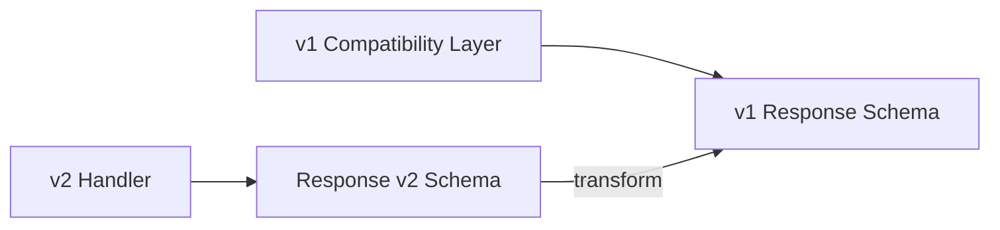
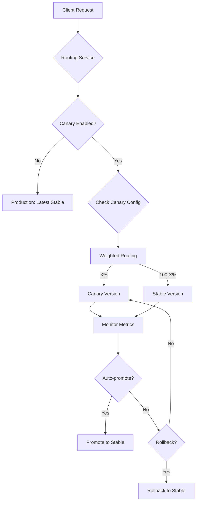

# Registry API Versioning & Compatibility Implementation Plan

## Executive Summary

This plan outlines the implementation of API versioning with backward compatibility, deprecation warnings, migration guides, and canary deployments for the FunctionFly Registry API.

## Current State Analysis

### Existing Architecture
- **API Prefix**: `/v1` already implemented (see [`internal/api/routes.go:199`](internal/api/routes.go:199))
- **Registry Handlers**: Located in [`internal/api/handlers/registry/`](internal/api/handlers/registry/)
- **Function Versions**: Stored in [`RegistryFunctionVersion`](internal/storage/registry/types.go:34) table
- **Deployment Orchestrator**: Handles deployments across multiple providers ([`internal/deployment/orchestrator.go`](internal/deployment/orchestrator.go))

### Key Components Identified
1. Registry handlers (`publish.go`, `query.go`, `execution.go`, `stats.go`)
2. Function version storage model
3. Deployment system with rollback capability
4. Routing service for backend selection

---

## Implementation Components

### 1. API Versioning Middleware

#### Version Negotiation Strategy
```
┌─────────────────────────────────────────────────────────────┐
│                    Request Flow                               │
├─────────────────────────────────────────────────────────────┤
│  Client Request                                              │
│       │                                                      │
│       ▼                                                      │
│  ┌─────────────────┐                                        │
│  │ Check URL path  │──/v2/registry/...──► Use v2 handlers    │
│  │ (preferred)     │                                        │
│  └────────┬────────┘                                        │
│           │ /v1/ or no version                              │
│           ▼                                                  │
│  ┌─────────────────┐                                        │
│  │ Accept-Version  │──"v2"──► Use v2 handlers               │
│  │ Header fallback │                                        │
│  └────────┬────────┘                                        │
│           │ no header                                       │
│           ▼                                                  │
│  ┌─────────────────┐                                        │
│  │ Default to v1   │──► Use v1 with compatibility layer     │
│  └─────────────────┘                                        │
└─────────────────────────────────────────────────────────────┘
```

#### Implementation Files
- **New File**: [`internal/api/middleware/versioning.go`](internal/api/middleware/versioning.go)
- **New File**: [`internal/api/versions/manager.go`](internal/api/versions/manager.go)

#### Version Compatibility Matrix
| Client Version | Server Supports | Behavior |
|---------------|-----------------|----------|
| v1            | v1, v2          | v1 with backward compatibility |
| v2            | v1, v2          | v2 native |
| no version    | v1, v2          | v1 with deprecation warning |

---

### 2. Backward Compatibility Layer

#### Response Transformation


#### Compatibility Features
1. **Field Aliasing**: Map new field names to legacy names
2. **Default Values**: Provide defaults for new optional fields
3. **Field Deprecation**: Mark deprecated fields with warnings

#### Implementation Files
- **New File**: [`internal/api/versions/compatibility.go`](internal/api/versions/compatibility.go)
- **New File**: [`internal/api/versions/transforms.go`](internal/api/versions/transforms.go)

---

### 3. Deprecation Warning System

#### Response Headers
```http
Deprecation: true
Sunset: Sat, 01 Jan 2027 00:00:00 GMT
Link: <https://api.functionfly.dev/v2/registry/functions>; rel="successor-version"
X-API-Warning: This endpoint will be removed in v2
```

#### Deprecation Tracking
- **Database**: Add deprecation metadata to function versions
- **Endpoint**: `/v1/registry/deprecations` - list all deprecations

#### Implementation Files
- **New File**: [`internal/api/middleware/deprecation.go`](internal/api/middleware/deprecation.go)
- **New File**: [`internal/api/handlers/registry/deprecations.go`](internal/api/handlers/registry/deprecations.go)

---

### 4. Migration Guide System

#### Endpoints
| Endpoint | Description |
|----------|-------------|
| `GET /v1/registry/migration-guide` | Get migration guide for transitioning to v2 |
| `GET /v1/registry/migration-guide/{endpoint}` | Get specific endpoint migration |

#### Migration Guide Content
```json
{
  "current_version": "v1",
  "successor_version": "v2",
  "deprecation_date": "2026-01-01",
  "sunset_date": "2027-01-01",
  "changes": [
    {
      "endpoint": "/registry/functions",
      "method": "GET",
      "breaking_changes": [
        {
          "field": "popularity_score",
          "old_type": "int",
          "new_type": "float",
          "migration": "Cast to float client-side"
        }
      ],
      "additions": [
        {
          "field": "trust_score",
          "type": "float",
          "description": "New trust metric"
        }
      ]
    }
  ]
}
```

#### Implementation Files
- **New File**: [`internal/api/handlers/registry/migration.go`](internal/api/handlers/registry/migration.go)
- **Static**: [`docs/MIGRATION_GUIDE.md`](docs/MIGRATION_GUIDE.md)

---

### 5. Canary Deployment System

#### Architecture


#### Canary Configuration Model
```go
type CanaryConfig struct {
    FunctionID    uuid.UUID  `json:"function_id"`
    Version       string     `json:"version"`       // Canary version
    TrafficPercent int       `json:"traffic_percent"` // 0-100
    AutoPromote   bool       `json:"auto_promote"`   // Auto-promote if healthy
    PromoteThreshold float64 `json:"promote_threshold"` // Error rate threshold
    PromoteWindow time.Duration `json:"promote_window"` // Monitoring window
    Status        string     `json:"status"` // "active", "promoted", "rolled_back"
}
```

#### Canary Endpoints
| Endpoint | Method | Description |
|----------|--------|-------------|
| `/v1/registry/functions/{author}/{name}/canary` | POST | Create canary deployment |
| `/v1/registry/functions/{author}/{name}/canary` | GET | Get canary status |
| `/v1/registry/functions/{author}/{name}/canary` | PATCH | Update canary config |
| `/v1/registry/functions/{author}/{name}/canary` | DELETE | Cancel canary |
| `/v1/registry/functions/{author}/{name}/canary/promote` | POST | Promote canary to stable |
| `/v1/registry/functions/{author}/{name}/canary/rollback` | POST | Rollback canary |

#### Implementation Files
- **New File**: [`internal/api/handlers/registry/canary.go`](internal/api/handlers/registry/canary.go)
- **New File**: [`internal/storage/registry/canary.go`](internal/storage/registry/canary.go)
- **New File**: [`internal/routing/canary.go`](internal/routing/canary.go)

---

## Implementation Steps

### Phase 1: Versioning Infrastructure
1. [ ] Create version negotiation middleware
2. [ ] Add version manager service
3. [ ] Update routes to support `/v2` prefix
4. [ ] Add version header handling

### Phase 2: Backward Compatibility
1. [ ] Create compatibility layer
2. [ ] Implement response transforms
3. [ ] Add field aliasing support
4. [ ] Write transformation tests

### Phase 3: Deprecation System
1. [ ] Create deprecation middleware
2. [ ] Add deprecation headers to responses
3. [ ] Create deprecations endpoint
4. [ ] Document deprecated fields

### Phase 4: Migration Guides
1. [ ] Create migration endpoint
2. [ ] Generate migration documentation
3. [ ] Add version discovery endpoint

### Phase 5: Canary Deployments
1. [ ] Add canary config storage
2. [ ] Create canary routing logic
3. [ ] Implement weighted traffic splitting
4. [ ] Add auto-promote/rollback logic
5. [ ] Create canary API endpoints

---

## Data Model Changes

### New Database Tables

#### api_versions
```sql
CREATE TABLE api_versions (
    id UUID PRIMARY KEY DEFAULT gen_random_uuid(),
    version VARCHAR(10) NOT NULL UNIQUE,
    is_active BOOLEAN DEFAULT true,
    is_default BOOLEAN DEFAULT false,
    deprecation_date TIMESTAMP,
    sunset_date TIMESTAMP,
    created_at TIMESTAMP DEFAULT NOW()
);
```

#### function_canary_configs
```sql
CREATE TABLE function_canary_configs (
    id UUID PRIMARY KEY DEFAULT gen_random_uuid(),
    function_id UUID NOT NULL REFERENCES registry_functions(id),
    version VARCHAR(50) NOT NULL,
    traffic_percent INTEGER DEFAULT 10,
    auto_promote BOOLEAN DEFAULT false,
    promote_threshold FLOAT DEFAULT 0.01,
    promote_window INTEGER DEFAULT 300,
    status VARCHAR(20) DEFAULT 'active',
    created_at TIMESTAMP DEFAULT NOW(),
    updated_at TIMESTAMP DEFAULT NOW()
);
```

#### endpoint_deprecations
```sql
CREATE TABLE endpoint_deprecations (
    id UUID PRIMARY KEY DEFAULT gen_random_uuid(),
    endpoint_pattern VARCHAR(255) NOT NULL,
    method VARCHAR(10) NOT NULL,
    deprecated_in_version VARCHAR(10) NOT NULL,
    removed_in_version VARCHAR(10),
    deprecation_date TIMESTAMP,
    sunset_date TIMESTAMP,
    migration_guide TEXT,
    created_at TIMESTAMP DEFAULT NOW()
);
```

---

## Risk Mitigation

### Backward Compatibility Risks
1. **Data Loss**: Use response transformation to ensure no data loss
2. **Breaking Changes**: Maintain strict change control for v1

### Canary Deployment Risks
1. **Traffic Leaking**: Ensure routing is deterministic
2. **State Inconsistency**: Use version-specific execution contexts

---

## Testing Strategy

### Versioning Tests
- Version negotiation with various headers
- Fallback behavior verification
- Cross-version compatibility

### Canary Tests
- Traffic splitting accuracy
- Auto-promote threshold triggers
- Rollback functionality

---

## Configuration

### Environment Variables
```env
# API Versioning
API_VERSIONS=v1,v2
API_DEFAULT_VERSION=v1
API_DEPRECATION_WARNING_DAYS=90

# Canary Deployments
CANARY_DEFAULT_TRAFFIC_PERCENT=10
CANARY_AUTO_PROMOTE=true
CANARY_PROMOTE_THRESHOLD=0.01
CANARY_PROMOTE_WINDOW_SECONDS=300
```

---

## Files to Create/Modify

### New Files
1. `internal/api/middleware/versioning.go`
2. `internal/api/middleware/deprecation.go`
3. `internal/api/versions/manager.go`
4. `internal/api/versions/compatibility.go`
5. `internal/api/versions/transforms.go`
6. `internal/api/handlers/registry/deprecations.go`
7. `internal/api/handlers/registry/migration.go`
8. `internal/api/handlers/registry/canary.go`
9. `internal/storage/registry/canary.go`
10. `internal/routing/canary.go`
11. `docs/MIGRATION_GUIDE.md`

### Modified Files
1. `internal/api/routes.go` - Add v2 routes, canary endpoints
2. `internal/api/server.go` - Initialize versioning services
3. `internal/storage/registry/types.go` - Add canary config type

---

## Success Criteria

1. **Version Negotiation**: Clients can specify API version via URL or header
2. **Backward Compatibility**: v1 clients continue working with v2 server
3. **Deprecation Warnings**: All deprecated endpoints return appropriate headers
4. **Migration Guide**: Developers can find migration instructions programmatically
5. **Canary Deployments**: Traffic can be gradually shifted to new versions with rollback capability

---

## Implementation Priority

1. **P0 (Critical)**: Version negotiation, backward compatibility
2. **P1 (High)**: Deprecation headers, canary routing
3. **P2 (Medium)**: Migration guide endpoint, canary API
4. **P3 (Low)**: Documentation, advanced canary features
