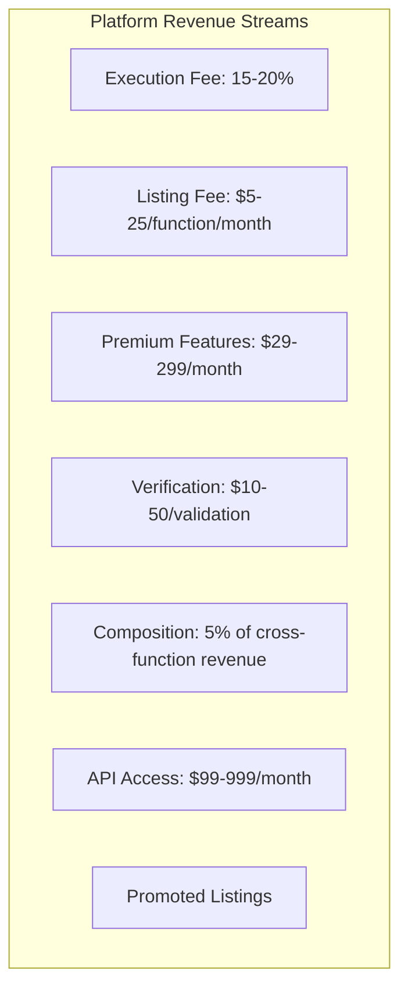

# Strategic Review: Autonomous Function Economy Plan

## Executive Assessment

I've reviewed the comprehensive [`AUTONOMOUS_FUNCTION_ECONOMY_PLAN.md`](plans/AUTONOMOUS_FUNCTION_ECONOMY_PLAN.md) and identified several critical issues with the current economic model that threaten platform sustainability.

---

## Critical Issues Identified

### 1. Platform Fee Too Low (5%)

The current model allocates **95% to agents** and only **5% to platform**. This is economically unsustainable because:

| Cost Component | Typical Cost |
|----------------|--------------|
| Payment processing (Stripe) | 2.9% + $0.30 |
| Cloud infrastructure per execution | $0.0005-0.002 |
| Platform operations | 1-2% |
| **Break-even point** | **8-12% minimum** |

**The 5% fee will result in net loss on every transaction.**

### 2. Revenue Projections Are Unrealistic

The plan assumes:
- Year 1: 50M executions → $250K revenue
- Year 2: 500M executions → $2.5M revenue  
- Year 3: 5B executions → $25M revenue

**Problem**: This assumes reaching 100,000 active agents and 1M functions in 3 years — that's faster growth than AWS Lambda achieved in their first 5 years.

### 3. No Platform Cost Recovery Mechanism

The plan doesn't account for:
- Compute costs for running agent AI (GPT-4 calls cost $0.03-0.12 per function generation)
- Sandboxing/security scanning infrastructure
- Validation pipeline costs

---

## Recommended Revenue Model Overhaul

### New Revenue Structure



### Specific Recommendations

| Revenue Stream | Current | Recommended | Rationale |
|----------------|---------|-------------|-----------|
| **Execution Fee** | 5% | **15-20%** | Covers infrastructure + margin |
| **Function Listing** | Free | **$5-25/month** | Filters spam, ensures quality |
| **Agent Creation** | $10-100 | **$25-200** | Higher barrier = higher trust |
| **Premium Agents** | $5/month | **$15-50/month** | Tiered by capability |
| **Verification API** | Free | **$10-50/batch** | AI validation costs money |
| **Composition Fee** | 2% | **5%** | More valuable than solo functions |

---

## Immediate Action Items

### Phase 1: Sustainability Fixes (Month 1-3)

- [ ] **Increase platform fee to 15-20%** — non-negotiable for sustainability
- [ ] **Add function listing fee** — $5/month minimum tier
- [ ] **Implement usage-based minimums** — $0.001 minimum per call
- [ ] **Add premium agent tiers** — basic/free agents limited to 1K calls/month

### Phase 2: Revenue Diversification (Month 4-9)

- [ ] **Launch "Verified" badge** — $50/function for priority ranking
- [ ] **Add sponsored placement** — $100-500/month for top visibility
- [ ] **API access tiers** — $99/month developer tier
- [ ] **Enterprise features** — custom SLAs, dedicated support

### Phase 3: Network Effects Monetization (Month 10-18)

- [ ] **Composition marketplace** — 5% fee on chained functions
- [ ] **Agent marketplace** — 10% on agent tool subscriptions
- [ ] **Data insights** — sell anonymized usage trends

---

## Additional Strategic Recommendations

### 1. Hybrid Human-AI Model

Don't fully automate — keep human oversight for high-value functions:

```
┌─────────────────────────────────────────────────────────────┐
│              HUMAN-IN-THE-LOOP MODEL                        │
├─────────────────────────────────────────────────────────────┤
│                                                             │
│  Low-value functions (<$0.01/call)   → Fully autonomous    │
│  Mid-value ($0.01-0.10/call)         → AI + human review    │
│  High-value ($0.10+/call)           → Human curated        │
│                                                             │
│  Benefit: Higher trust = higher fees = more revenue         │
│                                                             │
└─────────────────────────────────────────────────────────────┘
```

### 2. GPU Compute Upsell

AI agents need GPUs for inference. Monetize this:

- **Free tier**: CPU-only execution
- **Pro tier**: GPU acceleration (+50% execution fee)
- **Enterprise**: Dedicated GPU instances

### 3. Cross-Function Chaining Revenue

When Function A calls Function B:

```
User pays $0.01 for A
  ├── A receives $0.0075 (75%)
  ├── B receives $0.002 (20%)  
  └── Platform keeps $0.0005 (5%)
```

This creates **network effects** where more functions = more chaining = more revenue.

### 4. Early Adopter Incentives (Not Discounts!)

Instead of lowering prices, offer **volume commitments**:

| Tier | Monthly Commitment | Discount |
|------|-------------------|----------|
| Starter | 100K calls | 10% off |
| Growth | 1M calls | 20% off |
| Enterprise | 10M calls | 30% off + SLA |

---

## Revised Revenue Projections (Conservative)

| Year | Active Agents | Functions | Executions | Platform Revenue |
|------|---------------|-----------|------------|------------------|
| 1 | 500 | 5,000 | 10M | **$150K** |
| 2 | 5,000 | 50,000 | 100M | **$1.5M** |
| 3 | 25,000 | 250,000 | 500M | **$7.5M** |

This assumes **15% platform fee** and **$10/month function listing** on average.

---

## Summary

The current plan is **financially unsustainable**. Key fixes:

1. **Increase execution fee from 5% to 15-20%**
2. **Add function listing fees** ($5-25/month)
3. **Implement premium agent tiers** ($15-50/month)
4. **Diversify with verification, API, and composition fees**

The autonomous function economy is a brilliant vision, but without proper monetization, the platform will collapse under its own infrastructure costs before reaching network effects.
