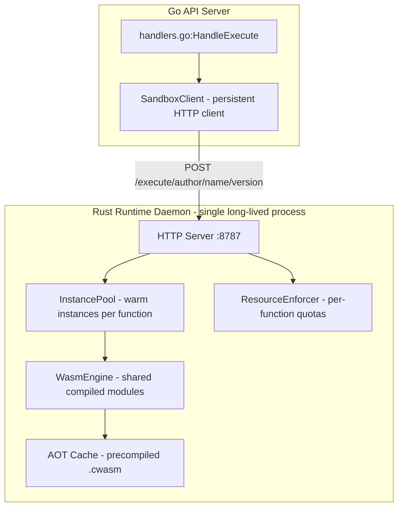

# FunctionFly Runtime Execution Sandbox — 2026–27 Design

> **Scope:** This document designs the next-generation execution sandbox for FunctionFly, targeting $5–$10/month node budgets with high security, fast cold starts, and multi-tenant isolation. It builds directly on the existing Wasmtime-based runtime in `runtimes/local/` and the Go orchestration layer in `internal/api/handlers/registry/execution/`.

---

## 1. Current State Analysis

### What Already Exists

| Component | File | Status |
|-----------|------|--------|
| Wasm engine (Wasmtime 41) | [`runtimes/local/src/engine.rs`](runtimes/local/src/engine.rs:1) | ✅ Production-ready |
| WASI context + linker | [`runtimes/local/src/wasi.rs`](runtimes/local/src/wasi.rs:1) | ✅ Capability-gated |
| Instance pool (LRU + memory pressure) | [`runtimes/local/src/pool.rs`](runtimes/local/src/pool.rs:1) | ✅ Functional |
| Resource enforcer (quotas, throttle) | [`runtimes/local/src/resource_enforcer.rs`](runtimes/local/src/resource_enforcer.rs:1) | ✅ Enterprise-ready |
| Budget tier system | [`runtimes/local/src/budget.rs`](runtimes/local/src/budget.rs:1) | ✅ UltraLow→High |
| Sandbox executor (Go → Rust HTTP) | [`internal/api/handlers/registry/execution/sandbox.go`](internal/api/handlers/registry/execution/sandbox.go:1) | ✅ Functional |
| Execution handler + caching | [`internal/api/handlers/registry/execution/handlers.go`](internal/api/handlers/registry/execution/handlers.go:1) | ✅ Cache-aware |
| Firecracker MicroVM orchestrator | [`runtimes/microvm/src/`](runtimes/microvm/src/) | 🔶 Stub/partial |
| Python (RustPython) | [`runtimes/local/src/python/`](runtimes/local/src/python/) | ✅ Pure Python only |
| MicroPython WASM shim | [`runtimes/local/src/micropython/`](runtimes/local/src/micropython/) | 🔶 Stub imports |

### Current Execution Flow

```
HTTP Request
    │
    ▼
handlers.go:HandleExecute
    │
    ├─ Cache hit? → return cached result
    │
    ├─ WasmBinary present? → sandbox.go:executeLocallyWithLimits
    │       │
    │       └─ SandboxExecutor → spawn functionfly-local binary (Rust)
    │               │
    │               └─ engine.rs:execute → detect_runtime_type
    │                       ├─ Wasm → execute_wasi_sync (Wasmtime)
    │                       ├─ Python → RustPython
    │                       └─ PythonMicroVM → OrchestratorClient → Firecracker
    │
    ├─ SourceCode present? → lazy bundling → same path
    │
    └─ BackendID/DeploymentID → forward to external backend
```

### Key Gaps to Address

1. **JS/TS runtime**: No native JS execution in Wasm — only Rust/Go compile to Wasm today
2. **Per-request process spawn**: `SandboxExecutor` spawns a new OS process per function version change — expensive
3. **Fuel calibration**: `cpu_fuel_limit` is a fixed 1M — not calibrated to real CPU time
4. **Instance pool not wired to Go layer**: The Rust pool exists but Go spawns fresh processes
5. **No pre-compilation cache**: Wasm modules are compiled on every cold start
6. **MicroPython stubs**: `mp_js_init` / `mp_js_do_exec` are no-ops
7. **Firecracker**: Orchestrator client exists but MicroVM module is partial

---

## 2. Architecture Decision: Primary Runtime Stack

### Recommendation: Wasmtime (Primary) + Javy for JS/TS

```
Phase 1 (Now → 6 months):   Wasmtime + Javy JS engine + RustPython
Phase 2 (6–12 months):      Wasmtime + Javy + CPython-WASM (Pyodide-style)
Phase 3 (12–18 months):     Firecracker MicroVM for Enterprise tier
```

**Why Wasmtime over alternatives:**

| Engine | Cold Start | Memory/Instance | Multi-tenant | Status |
|--------|-----------|-----------------|--------------|--------|
| **Wasmtime** (current) | ~1–5ms | ~5–15MB | ✅ Fuel + WASI caps | Production |
| Wasmer | ~2–8ms | ~8–20MB | ✅ | Mature |
| Spin (Fermyon) | ~1–3ms | ~5–10MB | ✅ | HTTP-first |
| V8 Isolates | ~1ms | ~3–5MB | ✅ | JS-only |
| Firecracker | ~100–500ms | ~128MB+ | ✅ | VM-level |

**Wasmtime is already embedded** — switching would require rewriting `engine.rs`, `wasi.rs`, and all host functions. The correct path is to **extend** the existing Wasmtime stack.

---

## 3. JS/TS Runtime Strategy: Javy

### Problem

JavaScript is the most common FaaS language. Currently there is no JS execution path in the Wasm runtime — only Rust/Go functions compile to Wasm natively.

### Solution: Javy (Shopify's QuickJS-to-Wasm compiler)

**Javy** compiles JS source → Wasm binary using QuickJS embedded in Wasm. The resulting `.wasm` file runs inside Wasmtime with full WASI support.

```
user writes: index.js
    │
    ▼
flypy bundler (Go) → javy compile index.js -o function.wasm
    │
    ▼
function.wasm stored in registry (WasmBinary field)
    │
    ▼
Wasmtime executes function.wasm (existing path, zero changes)
```

**Why Javy over alternatives:**

| Option | Pros | Cons |
|--------|------|------|
| **Javy** | Tiny output (~1MB), QuickJS proven, WASI-native | No Node.js APIs |
| QuickJS-ng standalone | Smaller, faster | Requires custom WASM wrapper |
| Deno compiled to WASM | Full Node compat | 50MB+ binary |
| SpiderMonkey WASM | Firefox-grade JS | 30MB+ binary |
| V8 Isolates | Fastest JS | Not WASM, separate infra |

**Javy output characteristics on $5 node:**
- Binary size: ~1–2MB per function
- Cold start: ~2–5ms (QuickJS JIT)
- Memory: ~8–16MB per instance
- Density: ~200–400 concurrent JS functions on 4GB RAM

### TypeScript Support

```
index.ts → esbuild (Go bundler) → index.js → javy → function.wasm
```

TypeScript is transpiled to JS first (esbuild is already used in the bundler), then Javy compiles to Wasm. No additional tooling needed.

---

## 4. Pre-Compilation Pipeline

### Current Problem

Every cold start re-compiles the Wasm binary from bytes:

```rust
// engine.rs:369 — compiled on every cold start
let module = Module::new(engine, wasm_bytes)
    .context("Failed to compile Wasm module")?;
```

### Solution: AOT Compilation Cache

Wasmtime supports **Ahead-of-Time (AOT) compilation** — compile once, serialize to disk, deserialize in microseconds.

```
Publish time:
    wasm_bytes → Module::new() → module.serialize() → store as .cwasm in registry

Execution time:
    .cwasm bytes → unsafe Module::deserialize() → instantiate (~0.1ms)
```

**Implementation in `engine.rs`:**

```rust
pub struct WasmEngine {
    engine: Engine,
    // NEW: AOT cache
    aot_cache: Arc<RwLock<HashMap<String, Vec<u8>>>>,  // hash → compiled bytes
}

impl WasmEngine {
    pub fn compile_and_cache(&self, wasm_bytes: &[u8], hash: &str) -> anyhow::Result<Vec<u8>> {
        let module = Module::new(&self.engine, wasm_bytes)?;
        let compiled = module.serialize()?;
        // Store in cache and optionally persist to disk
        Ok(compiled)
    }

    pub fn load_precompiled(&self, compiled_bytes: &[u8]) -> anyhow::Result<Module> {
        // Safety: only load bytes we compiled ourselves
        unsafe { Module::deserialize(&self.engine, compiled_bytes) }
            .context("Failed to deserialize precompiled module")
    }
}
```

**Storage strategy:**
- Compiled `.cwasm` stored alongside `WasmBinary` in the registry database
- New column: `wasm_compiled BYTEA` in `registry_function_versions`
- Cache invalidated when `WasmBinary` hash changes

**Cold start improvement:**

| Stage | Before | After |
|-------|--------|-------|
| Module compile | ~50–200ms | ~0.1ms (deserialize) |
| WASI context setup | ~1ms | ~1ms |
| Instance creation | ~2ms | ~2ms |
| **Total cold start** | **~55–205ms** | **~3–5ms** |

---

## 5. Instance Pool v2: Persistent Runtime Process

### Current Problem

[`sandbox.go`](internal/api/handlers/registry/execution/sandbox.go:48) creates a new `SandboxExecutor` (and spawns a new OS process) for every execution request. The Rust-side `InstancePool` in [`pool.rs`](runtimes/local/src/pool.rs:13) is never utilized from the Go layer.

### Solution: Long-Lived Runtime Daemon

Replace the per-request process spawn with a **persistent runtime daemon** that handles multiple functions concurrently.

```
Current:
  Request → Go → spawn new Rust process → execute → kill process

Proposed:
  Startup → Go → spawn ONE Rust daemon (persistent)
  Request → Go → HTTP to daemon → daemon uses internal pool → return result
```

**Architecture:**



**Changes to `sandbox.go`:**

```go
// NEW: SandboxClient replaces SandboxExecutor
// Single persistent connection to the runtime daemon
type SandboxClient struct {
    httpClient  *http.Client
    daemonURL   string
    daemonCmd   *exec.Cmd
    mu          sync.Mutex
    isRunning   bool
}

// Start daemon once at server startup, not per-request
func NewSandboxClient(runtimePath string) (*SandboxClient, error) {
    // Start daemon with --multi-function flag
    // Daemon loads functions on-demand, keeps pool warm
}

// Execute sends function ID + input, daemon handles pooling
func (sc *SandboxClient) Execute(fnVersion *storage.RegistryFunctionVersion, input []byte, timeoutMs int) ([]byte, error) {
    // POST /execute/{functionID}/{version}
    // Daemon looks up pool, executes, returns result
}
```

**Changes to Rust daemon (`server.rs`):**

```rust
// NEW route: per-function execution with pool lookup
async fn execute_function(
    State(state): State<Arc<SharedState>>,
    Path((function_id, version)): Path<(String, String)>,
    Json(req): Json<ExecuteRequest>,
) -> Json<ExecuteResponse> {
    let function_key = format!("{}@{}", function_id, version);

    // Check pool for warm instance
    let mut pool = state.pool.write().await;
    if let Some(_warm) = pool.get(&function_key).await? {
        // Reuse warm instance (module already compiled)
    } else {
        // Load Wasm from request body or registry cache
        // Use AOT cache if available
    }
}
```

**Density improvement on $5 node (2 vCPU, 4GB RAM):**

| Metric | Current (per-process) | Proposed (daemon) |
|--------|----------------------|-------------------|
| OS processes | 1 per active function | 1 total |
| Memory overhead | ~50MB per process | ~50MB total |
| Concurrent functions | ~20 (memory limited) | ~200+ |
| Cold start (warm pool) | ~200ms | ~3ms |

---

## 6. Resource Enforcement v2

### Current State

The existing [`resource_enforcer.rs`](runtimes/local/src/resource_enforcer.rs:41) provides quota tracking. The [`engine.rs`](runtimes/local/src/engine.rs:356) sets fuel limits. However:

- Fuel limit is a fixed `1_000_000` — not calibrated to real CPU time
- Memory limit is set via `FUNCTIONFLY_MEMORY_LIMIT_MB` env var but not enforced at Wasm level
- Wall-clock timeout is enforced by Go HTTP client timeout, not the Rust engine

### Solution: Three-Layer Resource Enforcement

```
Layer 1: Wasm fuel metering (CPU instructions)
Layer 2: Wasm linear memory cap (memory)
Layer 3: Epoch interruption (wall-clock timeout)
```

#### Layer 1: Calibrated Fuel Metering

Fuel represents Wasm instructions. We need to calibrate fuel to real CPU time:

```rust
// config.rs — new calibration constants
pub struct FuelCalibration {
    /// Fuel units per millisecond of CPU time (empirically measured)
    /// Typical: ~10M fuel/ms on modern hardware
    pub fuel_per_ms: u64,
}

impl Config {
    pub fn fuel_for_timeout(&self) -> u64 {
        // Convert timeout_ms to fuel units
        // Default: 5000ms * 10M fuel/ms = 50B fuel
        self.timeout_ms * self.fuel_per_ms
    }
}
```

**Calibration process:**
1. Run benchmark Wasm module (known instruction count)
2. Measure wall-clock time
3. Derive `fuel_per_ms` ratio
4. Store in config, adjustable per node

#### Layer 2: Wasm Memory Limiter

```rust
// engine.rs — enforce memory at Wasm level
use wasmtime::ResourceLimiter;

struct FunctionMemoryLimiter {
    max_bytes: usize,
    current_bytes: usize,
}

impl ResourceLimiter for FunctionMemoryLimiter {
    fn memory_growing(&mut self, current: usize, desired: usize, _max: Option<usize>) -> anyhow::Result<bool> {
        if desired > self.max_bytes {
            return Ok(false); // Deny growth
        }
        self.current_bytes = desired;
        Ok(true)
    }

    fn table_growing(&mut self, _current: u32, _desired: u32, _max: Option<u32>) -> anyhow::Result<bool> {
        Ok(true)
    }
}

// In execute_wasi_sync:
store.limiter(|ctx| &mut ctx.memory_limiter);
```

#### Layer 3: Epoch-Based Timeout

```rust
// engine.rs — epoch interruption for wall-clock timeout
impl WasmEngine {
    pub fn with_config(...) -> anyhow::Result<Self> {
        let mut wasm_config = wasmtime::Config::new();
        wasm_config
            .consume_fuel(true)
            .epoch_interruption(true);  // Already set

        let engine = Engine::new(&wasm_config)?;

        // Start epoch ticker thread
        let engine_clone = engine.clone();
        std::thread::spawn(move || {
            loop {
                std::thread::sleep(Duration::from_millis(1));
                engine_clone.increment_epoch();
            }
        });
    }
}

// In execute_wasi_sync:
// Set deadline = current_epoch + timeout_ms
store.set_epoch_deadline(config.timeout_ms);
store.epoch_deadline_trap();  // Trap (not async yield) on deadline
```

### Resource Limits Per Budget Tier

| Tier | Memory | CPU Fuel | Timeout | Concurrent |
|------|--------|----------|---------|------------|
| UltraLow ($5–10) | 64MB | 5B | 5s | 50 |
| Low ($10–20) | 128MB | 10B | 10s | 100 |
| Medium ($20–50) | 256MB | 20B | 30s | 200 |
| High ($50+) | 512MB | 50B | 60s | 500 |

---

## 7. Capability System Enhancements

### Current State

[`wasi.rs`](runtimes/local/src/wasi.rs:259) implements capability-gated WASI access. [`capability.rs`](runtimes/local/src/capability.rs) defines the capability enum. The system correctly denies network by default.

### Enhancements Needed

#### 7.1 Network Egress Proxy

Currently, `allow_tcp(true)` gives unrestricted network access. We need a **controlled egress proxy**:

```rust
// NEW: host_functions/fetch.rs enhancement
// Instead of raw TCP, route all HTTP through a proxy that:
// 1. Checks domain against whitelist
// 2. Enforces rate limits
// 3. Logs all outbound requests

pub fn register_fetch_host_function(
    linker: &mut Linker<WasiP1Ctx>,
    config: &Config,
) -> anyhow::Result<()> {
    let whitelist = config.network_whitelist.clone();
    let rate_limiter = Arc::new(RateLimiter::new(config.external_api_rate_limit));

    linker.func_wrap_async("functionfly", "http_fetch", move |caller, (url_ptr, url_len, method_ptr, method_len, body_ptr, body_len): (i32, i32, i32, i32, i32, i32)| {
        // 1. Read URL from Wasm memory
        // 2. Check against whitelist
        // 3. Apply rate limit
        // 4. Execute HTTP request
        // 5. Write response to Wasm memory
    })?;
}
```

#### 7.2 Capability Manifest Validation at Publish Time

Add validation in the Go publish handler to reject functions that use capabilities not declared in `functionfly.jsonc`:

```go
// internal/api/handlers/registry/publish.go
func validateCapabilities(manifest *Manifest, wasmBinary []byte) error {
    // Static analysis of Wasm imports
    // If wasm imports "functionfly::http_fetch" but manifest doesn't declare "fetch:read"
    // → reject publish with clear error message
}
```

#### 7.3 New Capabilities for 2026

| Capability | Description | WASI Binding |
|------------|-------------|--------------|
| `fetch:read` | HTTP GET to whitelisted domains | `http_fetch` |
| `fetch:write` | HTTP POST/PUT to whitelisted domains | `http_fetch` |
| `kv:read` | Read from KV store | `kv_get` |
| `kv:write` | Write to KV store | `kv_set` |
| `crypto` | Cryptographic operations | `crypto_*` |
| `cache:read` | Read from result cache | `cache_get` |
| `cache:write` | Write to result cache | `cache_set` |
| `email` | Send email via SMTP | `email_send` |
| `storage:read` | Read from object storage | `storage_get` |
| `storage:write` | Write to object storage | `storage_put` |
| `time` | Access system time | WASI clock |
| `ai:inference` | Run ONNX model inference | `ai_infer` |

---

## 8. Edge Cache Integration

### Current State

[`handlers.go`](internal/api/handlers/registry/execution/handlers.go:148) checks cache eligibility and sets CDN headers. The [`EdgeCacheService`](internal/api/handlers/registry/execution/handlers.go:32) sets edge cache headers for popular functions.

### Enhancement: Deterministic Function CDN Amplification

For functions marked `deterministic: true`, the execution result can be cached at the CDN edge indefinitely (until the function version changes):

```
Request for deterministic function
    │
    ├─ CDN edge hit? → return cached (0ms, free compute)
    │
    ├─ Local cache hit? → return cached (~1ms)
    │
    └─ Execute → cache at local + CDN edge
```

**Cache-Control headers for deterministic functions:**

```go
// cache/cdn.go — enhanced headers
func SetDeterministicCacheHeaders(w http.ResponseWriter, version string, ttl int) {
    // Immutable: this version's output never changes
    w.Header().Set("Cache-Control", fmt.Sprintf(
        "public, max-age=%d, s-maxage=%d, immutable",
        ttl, ttl,
    ))
    // Surrogate key for targeted purge when version is deprecated
    w.Header().Set("Surrogate-Key", fmt.Sprintf("fn-version-%s", version))
    // CDN-specific: Cloudflare cache everything
    w.Header().Set("CDN-Cache-Control", fmt.Sprintf("max-age=%d", ttl))
}
```

**Cache key design:**

```
{function_author}/{function_name}/{version}/{sha256(input)}
```

This allows:
- Purge all versions of a function: `fn-author-name-*`
- Purge specific version: `fn-version-{versionID}`
- Purge specific input: exact key lookup

### Cache Tiers

```
Tier 1: Cloudflare/Fastly CDN edge (global, free for public functions)
    TTL: up to 1 year for deterministic functions
    
Tier 2: Local in-memory cache (per node)
    TTL: configurable, default 1 hour
    Implementation: existing CacheService
    
Tier 3: Redis/Valkey distributed cache (multi-node)
    TTL: configurable
    Use case: Phase 2 multi-node clustering
```

---

## 9. JS/TS Execution: Detailed Implementation

### Javy Integration in the Bundler

The Go bundler (`internal/bundler/`) needs a new compilation path for JS/TS:

```go
// internal/bundler/js.go (new file)
package bundler

import (
    "os/exec"
    "path/filepath"
)

// CompileJSToWasm compiles JavaScript source to Wasm using Javy
func CompileJSToWasm(jsSource []byte, opts JSCompileOptions) ([]byte, error) {
    // 1. Write JS to temp file
    // 2. Run: javy compile input.js -o output.wasm
    // 3. Read output.wasm
    // 4. Return bytes
}

// CompileTSToWasm compiles TypeScript → JS (esbuild) → Wasm (javy)
func CompileTSToWasm(tsSource []byte, opts TSCompileOptions) ([]byte, error) {
    // 1. esbuild: ts → js (already in bundler)
    // 2. javy: js → wasm
}
```

**Javy binary distribution:**
- Embed `javy` binary in the FunctionFly server binary using `go:embed`
- Or: download at startup from GitHub releases (pinned version)
- Or: Docker image includes `javy` pre-installed

### JS Function Interface

Functions compiled with Javy use stdin/stdout for I/O (WASI standard):

```javascript
// user's index.js
export function handler(input) {
    const data = JSON.parse(input);
    return JSON.stringify({ result: data.text.toLowerCase() });
}

// Javy wrapper (generated by bundler)
import { handler } from './index.js';
const input = readStdin();
const output = handler(input);
writeStdout(output);
```

This maps directly to the existing `_start` execution path in [`engine.rs`](runtimes/local/src/engine.rs:393).

### Supported JS APIs

Javy provides a subset of Web APIs via WASI:

| API | Available | Notes |
|-----|-----------|-------|
| `JSON.parse/stringify` | ✅ | Full support |
| `TextEncoder/Decoder` | ✅ | Full support |
| `crypto.subtle` | ✅ | Via Javy plugin |
| `fetch()` | ✅ | Via FunctionFly host function |
| `console.log` | ✅ | Mapped to stderr |
| `setTimeout` | ❌ | No async in Javy |
| `Promise` | ✅ | Sync resolution only |
| Node.js `require()` | ❌ | Use ESM imports |
| `process.env` | ✅ | Via WASI env vars |

---

## 10. Python Runtime Strategy

### Current State

- **RustPython**: Pure Python, no C extensions, ~50ms cold start
- **MicroPython WASM**: Stub imports, not functional
- **CPython MicroVM**: Partial Firecracker implementation

### Recommended Path

```
Phase 1 (Now):     RustPython for pure Python (existing)
Phase 2 (3 months): CPython compiled to WASM (wasi-sdk + CPython)
Phase 3 (6 months): Firecracker MicroVM for C extensions (Enterprise)
```

#### Phase 2: CPython-WASM

The CPython project now officially supports WASM/WASI compilation:

```bash
# Build CPython for WASI
./configure --host=wasm32-wasi --build=x86_64-linux-gnu \
    --with-build-python=/usr/bin/python3 \
    --disable-ipv6 --without-pymalloc
make
```

This produces `python.wasm` (~8MB) that runs inside Wasmtime with full stdlib support (minus C extensions).

**Integration in `engine.rs`:**

```rust
pub enum RuntimeType {
    Wasm,
    Python,           // RustPython (existing, fast)
    PythonWasm,       // NEW: CPython-WASM (stdlib support)
    PythonMicroVM,    // Enterprise: CPython in Firecracker
}
```

**Detection logic:**

```rust
pub fn detect_runtime_type(&self, wasm_bytes: &[u8]) -> RuntimeType {
    if PythonRuntime::is_python_code(wasm_bytes) {
        if self.config.supports_microvm() {
            RuntimeType::PythonMicroVM
        } else if self.config.use_cpython_wasm {
            RuntimeType::PythonWasm  // NEW
        } else {
            RuntimeType::Python  // RustPython fallback
        }
    } else {
        RuntimeType::Wasm
    }
}
```

---

## 11. Firecracker MicroVM — Phase 3 Upgrade Path

The existing [`runtimes/microvm/`](runtimes/microvm/) module provides the foundation. This is the **Enterprise tier** path for:
- CPython with C extensions (NumPy, Pandas, PyTorch)
- Arbitrary language runtimes
- Customer-hosted execution

### When to Activate

Firecracker is appropriate when:
- Node budget ≥ $20/month (Medium tier)
- Function requires C extensions
- Customer requires VM-level isolation
- Execution time > 30 seconds

### Hardware Requirements for Firecracker

| Resource | Minimum | Recommended |
|----------|---------|-------------|
| CPU | 4 vCPU (KVM required) | 8 vCPU |
| RAM | 8 GB | 16 GB |
| SSD | 100 GB | 200 GB |
| Kernel | Linux 5.10+ with KVM | Linux 6.x |

**This is NOT suitable for $5–$10 nodes.** Firecracker requires KVM hardware virtualization, which is typically not available on shared VPS nodes.

### Firecracker on $5 Nodes: Alternative

For $5 nodes that need stronger isolation than Wasm but can't run Firecracker:

**gVisor (runsc)** — user-space kernel that intercepts syscalls:
- No KVM required
- ~10–20ms cold start (vs ~500ms Firecracker)
- ~50MB overhead per sandbox
- Runs on any Linux kernel 4.14+

```
Wasm sandbox (primary, $5 node)
    └─ gVisor container (fallback for non-Wasm workloads, $5 node)
        └─ Firecracker MicroVM (Enterprise, $20+ node)
```

---

## 12. Multi-Tenant Isolation Model

### Isolation Boundaries

```
Tenant A                    Tenant B
    │                           │
    ▼                           ▼
Wasm Instance A            Wasm Instance B
    │                           │
    ├─ Separate linear memory   ├─ Separate linear memory
    ├─ Separate fuel counter    ├─ Separate fuel counter
    ├─ Separate WASI context    ├─ Separate WASI context
    └─ No shared state          └─ No shared state
         │                           │
         └─────────────┬─────────────┘
                       │
                  Shared Engine
                  (compiled modules only)
```

**What is shared (safe):**
- Compiled Wasm module bytes (read-only, immutable)
- Wasmtime engine configuration
- Host function implementations (stateless)

**What is isolated (per-tenant):**
- Wasm linear memory (each instance has its own)
- Fuel counter (CPU budget)
- WASI context (env vars, filesystem, network)
- KV store namespace (prefixed by tenant ID)
- Result cache namespace (prefixed by tenant ID)

### Noisy Neighbor Prevention

```rust
// resource_enforcer.rs — enhanced global limits
pub struct GlobalResourceLimits {
    pub max_total_memory_mb: usize,
    pub max_total_cpu_percent: f64,
    pub max_concurrent_functions: usize,
    // NEW: per-tenant limits
    pub max_memory_per_tenant_mb: usize,
    pub max_concurrent_per_tenant: usize,
    pub max_executions_per_tenant_per_minute: usize,
}
```

---

## 13. Security Hardening

### Threat Model

| Threat | Mitigation |
|--------|-----------|
| Malicious Wasm (infinite loop) | Fuel metering + epoch timeout |
| Memory exhaustion | Wasm linear memory cap + ResourceLimiter |
| Syscall escape | WASI structural denial (no raw syscalls) |
| Network exfiltration | Capability-gated fetch + domain whitelist |
| Cross-tenant data access | Separate WASI contexts + KV namespacing |
| Supply chain (malicious Wasm binary) | YARA scanning at publish time (existing) |
| Timing attacks | DisabledMonotonicClock for deterministic functions |
| Resource amplification | Per-tenant quotas in ResourceEnforcer |

### YARA Integration

The existing [`deploy/yara/`](deploy/yara/) service scans Wasm binaries at publish time. Enhance with Wasm-specific rules:

```python
# deploy/yara/yara_service.py — new Wasm rules
WASM_RULES = """
rule suspicious_wasm_imports {
    strings:
        $s1 = "wasi_snapshot_preview1" ascii
        $s2 = "proc_exit" ascii
        $s3 = "fd_write" ascii
    condition:
        // Flag Wasm that imports dangerous syscalls not in declared capabilities
        $s1 and ($s2 or $s3)
}
"""
```

### Wasm Binary Validation at Publish

```go
// internal/api/handlers/registry/publish.go
func validateWasmBinary(binary []byte) error {
    // 1. Check magic bytes: 0x00 0x61 0x73 0x6D
    // 2. Parse import section — check against declared capabilities
    // 3. Check for suspicious patterns (YARA)
    // 4. Verify binary size limits
    // 5. Attempt dry-run compilation (catch malformed Wasm)
}
```

---

## 14. Implementation Roadmap

### Phase 1: Foundation Improvements (Weeks 1–4)

**Goal:** Fix the per-request process spawn, add AOT cache, wire up the instance pool.

- [ ] **P1.1** — Refactor `SandboxExecutor` → `SandboxClient` (persistent daemon connection)
- [ ] **P1.2** — Add AOT compilation cache in `engine.rs` (serialize/deserialize modules)
- [ ] **P1.3** — Add `wasm_compiled` column to `registry_function_versions` table
- [ ] **P1.4** — Compile Wasm at publish time, store compiled bytes
- [ ] **P1.5** — Calibrate fuel-to-CPU-time ratio, update `config.rs`
- [ ] **P1.6** — Implement `FunctionMemoryLimiter` in `engine.rs`
- [ ] **P1.7** — Fix epoch interruption for wall-clock timeout

**Expected outcome:** Cold starts drop from ~200ms to ~5ms. Memory density doubles.

### Phase 2: JS/TS Runtime (Weeks 5–8)

**Goal:** Enable JavaScript and TypeScript functions.

- [ ] **P2.1** — Integrate Javy binary into build pipeline
- [ ] **P2.2** — Add `CompileJSToWasm()` to Go bundler
- [ ] **P2.3** — Add `CompileTSToWasm()` (esbuild → javy)
- [ ] **P2.4** — Add JS function template to `functionfly.jsonc` examples
- [ ] **P2.5** — Test JS execution through existing Wasm path
- [ ] **P2.6** — Document supported JS APIs

**Expected outcome:** JS/TS functions work end-to-end.

### Phase 3: Python Improvements (Weeks 9–12)

**Goal:** Better Python support without Firecracker.

- [ ] **P3.1** — Build CPython-WASM binary (wasi-sdk)
- [ ] **P3.2** — Add `PythonWasm` runtime type to `engine.rs`
- [ ] **P3.3** — Test CPython-WASM with stdlib functions
- [ ] **P3.4** — Add Python function template
- [ ] **P3.5** — Document Python stdlib availability

**Expected outcome:** Python functions with full stdlib (no C extensions).

### Phase 4: Enterprise MicroVM (Weeks 13–20)

**Goal:** Complete Firecracker integration for Enterprise tier.

- [ ] **P4.1** — Complete `runtimes/microvm/src/firecracker.rs` implementation
- [ ] **P4.2** — Build CPython VM images (Dockerfile.python311, Dockerfile.python312)
- [ ] **P4.3** — Implement vsock communication in `runtimes/microvm/src/vsock.rs`
- [ ] **P4.4** — Add VM pool management in `runtimes/microvm/src/orchestrator.rs`
- [ ] **P4.5** — Wire Enterprise tier check in `handlers.go`
- [ ] **P4.6** — Add Firecracker to docker-compose for development

**Expected outcome:** Enterprise customers can run NumPy/Pandas functions.

---

## 15. Configuration Changes

### New `Config` Fields (config.rs)

```rust
pub struct Config {
    // ... existing fields ...

    /// Enable AOT module compilation cache
    #[arg(long, default_value = "true")]
    pub aot_cache_enabled: bool,

    /// AOT cache directory (empty = in-memory only)
    #[arg(long, default_value = "")]
    pub aot_cache_dir: String,

    /// Fuel units per millisecond (calibration constant)
    #[arg(long, default_value = "10000000")]
    pub fuel_per_ms: u64,

    /// Use CPython-WASM instead of RustPython for Python functions
    #[arg(long, default_value = "false")]
    pub use_cpython_wasm: bool,

    /// CPython WASM binary path
    #[arg(long, default_value = "./runtimes/cpython.wasm")]
    pub cpython_wasm_path: String,

    /// Enable persistent daemon mode (multi-function)
    #[arg(long, default_value = "false")]
    pub daemon_mode: bool,

    /// Maximum AOT cache size in MB
    #[arg(long, default_value = "512")]
    pub aot_cache_size_mb: usize,
}
```

### Updated Budget Tier Limits (budget.rs)

```rust
impl NodeSpecs {
    pub fn for_tier(tier: &BudgetTier) -> Self {
        match tier {
            BudgetTier::UltraLow => NodeSpecs {
                monthly_cost: 7.5,
                vcpu: 2,
                ram_gb: 4,
                storage_gb: 75,
                bandwidth_gbps: 0.2,
                // NEW
                max_concurrent_wasm: 200,
                max_memory_per_fn_mb: 64,
                aot_cache_mb: 256,
                supports_firecracker: false,
            },
            // ...
        }
    }
}
```

---

## 16. Monitoring & Observability

### New Metrics to Track

```
# Wasm execution metrics
functionfly_wasm_cold_start_ms{runtime, tier}
functionfly_wasm_warm_start_ms{runtime, tier}
functionfly_wasm_fuel_used{function_id, version}
functionfly_wasm_memory_used_mb{function_id, version}
functionfly_wasm_timeout_total{function_id, version}

# Pool metrics
functionfly_pool_size{function_id}
functionfly_pool_hit_rate{function_id}
functionfly_pool_evictions_total{reason}

# AOT cache metrics
functionfly_aot_cache_hit_rate
functionfly_aot_cache_size_mb
functionfly_aot_compile_ms{function_id}

# JS runtime metrics
functionfly_js_compile_ms{function_id}
functionfly_js_execution_ms{function_id}
```

These integrate with the existing Prometheus setup in [`deploy/monitoring/prometheus.yml`](deploy/monitoring/prometheus.yml).

---

## 17. Summary: Technology Choices

| Component | Technology | Rationale |
|-----------|-----------|-----------|
| **Primary sandbox** | Wasmtime 41+ | Already embedded, mature, fuel metering |
| **JS/TS runtime** | Javy (QuickJS-WASM) | Tiny output, WASI-native, proven |
| **Python (Phase 1)** | RustPython | Already working, fast cold start |
| **Python (Phase 2)** | CPython-WASM | Full stdlib, no C extensions |
| **Python (Enterprise)** | Firecracker + CPython | C extensions, VM isolation |
| **AOT cache** | Wasmtime serialize/deserialize | Built-in, zero dependencies |
| **Instance pool** | Existing pool.rs | Already implemented, needs wiring |
| **Resource limits** | Fuel + ResourceLimiter + Epoch | Three-layer defense |
| **Network isolation** | WASI capability gates | Structural denial |
| **CDN cache** | Cloudflare + Cache-Control | Free for public deterministic fns |
| **Stronger isolation ($5 node)** | gVisor (runsc) | No KVM needed |
| **VM isolation (Enterprise)** | Firecracker | KVM required, $20+ nodes |

### Cost Profile on $5–$10 Node

| Metric | Value |
|--------|-------|
| Node: 2 vCPU, 4GB RAM | $5–$10/month |
| Concurrent Wasm functions | ~200 |
| Cold start (AOT cache) | ~3–5ms |
| Warm start (pool hit) | ~1ms |
| Memory per JS function | ~8–16MB |
| Memory per Rust/Go function | ~5–10MB |
| Memory per Python function | ~20–40MB |
| Max functions in pool | ~100–200 |
| CDN cache amplification | 10–1000x for deterministic fns |

This architecture allows FunctionFly to run a **massive function catalog on a $5 node** while maintaining strong security guarantees through Wasm's structural isolation model.

---

*Document Version: 1.0*
*Created: 2026-02-28*
*Mode: Architect Planning*
*Builds on: ENTERPRISE_CPYTHON_MICROVM.md, LOCAL_RUNTIME_IMPLEMENTATION.md*
