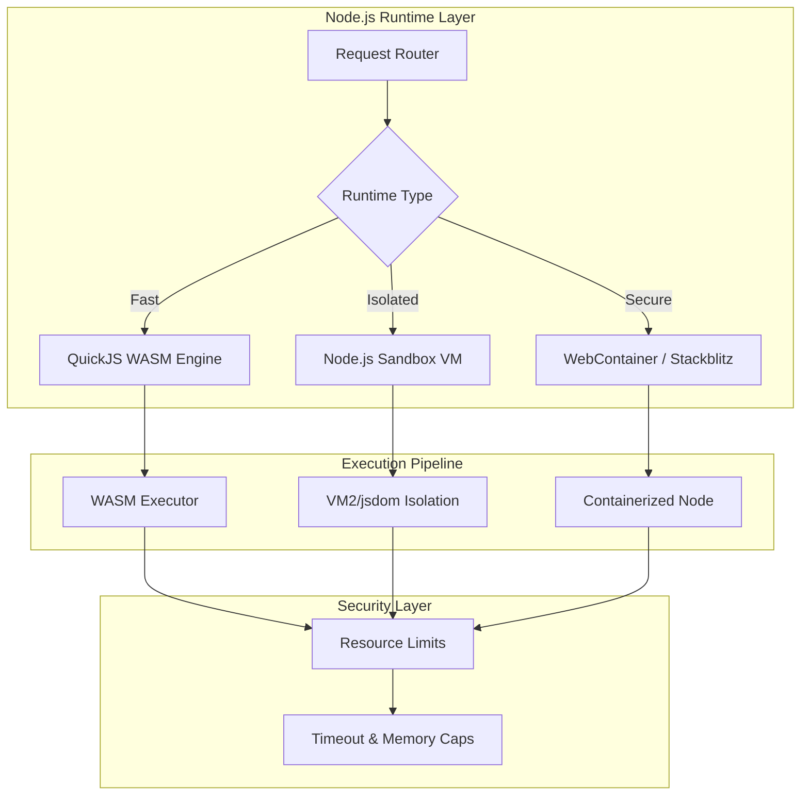
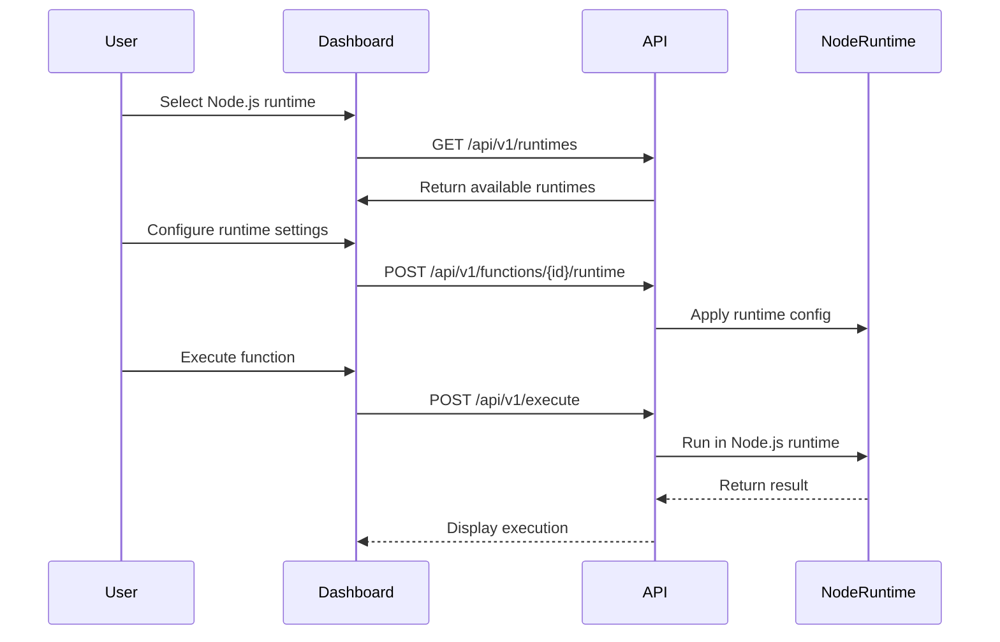

# Runtime & UI Enhancement Plan

## Executive Summary

This document outlines recommendations for enhancing the Node.js runtime infrastructure and identifying missing React UI components for the FunctionFly platform.

---

## Part 1: Node.js Runtime Enhancements

### 1.1 Current State Analysis

The current implementation has these gaps:

| Component | Current State | Issue |
|-----------|---------------|-------|
| [`internal/localruntime/runtime.go`](internal/localruntime/runtime.go:147) | JavaScript handler just passes input through | No actual JS execution |
| [`runtimes/local/`](runtimes/local/) | Rust WASM runtime | No dedicated Node.js runtime |
| [`runtimes/microvm/`](runtimes/microvm/) | Firecracker microVM | No Node.js VM support |
| [`internal/bundler/js_bundler.go`](internal/bundler/js_bundler.go:1) | Uses esbuild | No runtime isolation |

### 1.2 Recommended Node.js Runtime Architecture



### 1.3 Detailed Runtime Improvements

#### 1.3.1 Dedicated Node.js Runtime (Recommended)

Create `runtimes/nodejs/` with:

| Feature | Implementation |
|---------|---------------|
| **QuickJS WASM Engine** | Embed QuickJS compiled to WebAssembly for lightweight JS execution |
| **Isolated VM** | Use Node.js `vm` module with restricted context |
| **Native Module Restriction** | Block `child_process`, `fs`, `net`, `eval` |
| **Timeout Management** | Configurable execution timeouts (100ms - 30s) |
| **Memory Limits** | Heap limit enforcement per execution |
| **Async Support** | Full Promise/async-await support |

**Files to create:**
```
runtimes/nodejs/
├── Cargo.toml
├── src/
│   ├── main.rs              # Entry point
│   ├── executor.rs          # QuickJS executor
│   ├── sandbox.rs           # Isolation primitives
│   ├── runtime.rs           # Runtime management
│   ├── timeout.rs           # Timeout handling
│   ├── memory.rs            # Memory limits
│   ├── native_modules/      # Blocked modules
│   └── host_functions/      # FF SDK integration
└── README.md
```

#### 1.3.2 Runtime Capabilities Matrix

| Capability | Current | Proposed |
|------------|---------|----------|
| Async/Await | ❌ | ✅ Full support |
| Node.js built-ins | ❌ | ✅ Select APIs |
| npm packages | ❌ | ✅ Bundled deps only |
| Streams | ❌ | ✅ Readable/Writable |
| Web APIs | ❌ | ✅ fetch, URL, timing |
| Environment vars | ⚠️ Limited | ✅ Controlled access |
| Memory limit | ❌ | ✅ Configurable |
| CPU timeout | ⚠️ Basic | ✅ Granular |
| Multi-threading | ❌ | ✅ Worker threads |

### 1.4 Implementation Priority

1. **Phase 1** - QuickJS WASM integration (lowest overhead)
2. **Phase 2** - Isolated VM with security boundaries
3. **Phase 3** - npm package support via bundling
4. **Phase 4** - Advanced features (streams, workers)

---

## Part 2: Missing React Components & UI Wiring

### 2.1 Current Component Analysis

Based on exploration of [`web/dashboard/src/`](web/dashboard/src/):

| Category | Status | Notes |
|----------|--------|-------|
| **Core Layout** | ✅ Complete | Sidebar, TopBar, PageLayout |
| **Function Editor** | ✅ Complete | Monaco editor, settings |
| **Dashboard** | ✅ Complete | Charts, metrics |
| **Playground** | ✅ Complete | Code snippets, execution |
| **Auth** | ✅ Complete | Login, MFA, OAuth |

### 2.2 Missing Components

#### 2.2.1 Runtime-Specific Components

| Component | Purpose | Location |
|-----------|---------|----------|
| [`RuntimeSelector`](web/dashboard/src/components/functions/RuntimeSelector.tsx) | Dropdown for runtime selection (node18, node20, python3.12, deno) | FunctionsPage |
| [`RuntimeBadge`](web/dashboard/src/components/common/RuntimeBadge.tsx) | Visual indicator of runtime type | Common |
| [`RuntimeSettingsPanel`](web/dashboard/src/components/functions/RuntimeSettingsPanel.tsx) | Configure memory, timeout, environment | FunctionSettings |
| [`RuntimeVersionSelector`](web/dashboard/src/components/functions/RuntimeVersionSelector.tsx) | Select Node.js version | FunctionEditor |

#### 2.2.2 Execution Components

| Component | Purpose |
|-----------|---------|
| [`ExecutionDetailsDrawer`](web/dashboard/src/components/execution/ExecutionDetailsDrawer.tsx) | Slide-out panel for execution details |
| [`ExecutionTimeline`](web/dashboard/src/components/execution/ExecutionTimeline.tsx) | Visual timeline of function execution |
| [`ColdStartAnalyzer`](web/dashboard/src/components/execution/ColdStartAnalyzer.tsx) | Analyze cold start times |
| [`MemoryUsageChart`](web/dashboard/src/components/execution/MemoryUsageChart.tsx) | Per-execution memory breakdown |

#### 2.2.3 Missing Pages

| Page | Purpose | Priority |
|------|---------|----------|
| [`RuntimeDiagnosticsPage`](web/dashboard/src/pages/RuntimeDiagnosticsPage/) | Debug runtime issues | High |
| [`PackageManagerPage`](web/dashboard/src/pages/PackageManagerPage/) | Manage npm dependencies | Medium |
| [**FunctionComparisonPage**](web/dashboard/src/pages/FunctionComparisonPage/) | Compare function versions | Medium |
| [**CronJobManagerPage**](web/dashboard/src/pages/CronJobManagerPage/) | Manage scheduled functions | Medium |

#### 2.2.4 Missing Wiring/API Connections

Based on [`web/dashboard/src/lib/api-urls.ts`](web/dashboard/src/lib/api-urls.ts) and API handlers:

| API Endpoint | Frontend Connection | Status |
|--------------|---------------------|--------|
| `/api/v1/runtimes` | Runtime list fetch | ❌ Missing |
| `/api/v1/functions/{id}/diagnostics` | Runtime diagnostics | ❌ Missing |
| `/api/v1/functions/{id}/versions/{v}/rollback` | Version rollback | ⚠️ Partial |
| `/api/v1/executions/{id}/logs` | Real-time logs stream | ⚠️ Partial |
| `/api/v1/secrets/validate` | Secret validation | ❌ Missing |

### 2.3 UI/UX Improvements

#### 2.3.1 Function Editor Enhancements

| Feature | Component |
|---------|-----------|
| Runtime-specific code templates | [`RuntimeCodeTemplates`](web/dashboard/src/components/editor/RuntimeCodeTemplates.tsx) |
| Import autocomplete for npm packages | [`PackageAutocomplete`](web/dashboard/src/components/editor/PackageAutocomplete.tsx) |
| Built-in function reference | [`FunctionReferencePanel`](web/dashboard/src/components/editor/FunctionReferencePanel.tsx) |

#### 2.3.2 Real-time Features

| Component | Purpose |
|-----------|---------|
| [`LiveExecutionIndicator`](web/dashboard/src/components/realtime/LiveExecutionIndicator.tsx) | Show active executions |
| [`ExecutionProgressBar`](web/dashboard/src/components/realtime/ExecutionProgressBar.tsx) | Progress for long-running functions |

---

## Part 3: Integration Recommendations

### 3.1 Node.js Runtime → Dashboard Wiring



### 3.2 Required API Additions

| Endpoint | Method | Description |
|----------|--------|-------------|
| `/api/v1/runtimes` | GET | List available runtimes |
| `/api/v1/runtimes/{id}/info` | GET | Runtime capabilities |
| `/api/v1/functions/{id}/diagnostics` | GET | Runtime diagnostics |
| `/api/v1/functions/{id}/冷启动分析` | GET | Cold start analysis |

---

## Part 4: Summary of Recommendations

### High Priority

1. **Create dedicated Node.js runtime** in `runtimes/nodejs/`
2. **Add RuntimeSelector and RuntimeBadge** components
3. **Implement API endpoints** for runtime management

### Medium Priority

4. **Add PackageManagerPage** for npm dependencies
5. **Create RuntimeDiagnosticsPage** for debugging
6. **Implement ExecutionTimeline** component

### Lower Priority

7. **Add FunctionComparisonPage**
8. **Implement ColdStartAnalyzer**
9. **Add PackageAutocomplete** for editor

---

## Appendix: File Paths Reference

### Existing Runtime Files
- [`runtimes/local/src/main.rs`](runtimes/local/src/main.rs) - Local WASM runtime
- [`runtimes/microvm/src/executor.rs`](runtimes/microvm/src/executor.rs) - Firecracker executor
- [`internal/localruntime/runtime.go`](internal/localruntime/runtime.go) - Local runtime server
- [`internal/bundler/js_bundler.go`](internal/bundler/js_bundler.go) - JavaScript bundler

### Relevant Dashboard Files
- [`web/dashboard/src/pages/FunctionsPage/FunctionEditorPage.tsx`](web/dashboard/src/pages/FunctionsPage/FunctionEditorPage.tsx)
- [`web/dashboard/src/pages/FunctionsPage/FunctionSettingsPage.tsx`](web/dashboard/src/pages/FunctionsPage/FunctionSettingsPage.tsx)
- [`web/dashboard/src/lib/api-urls.ts`](web/dashboard/src/lib/api-urls.ts)
- [`web/dashboard/src/components/common/index.ts`](web/dashboard/src/components/common/index.ts)
