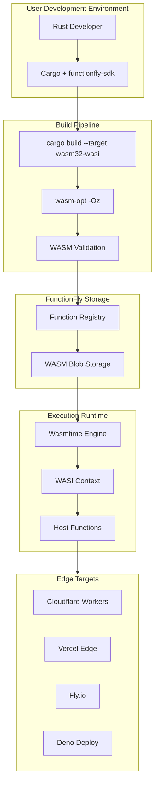
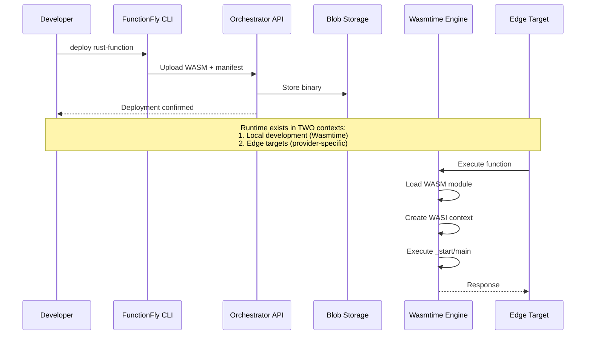
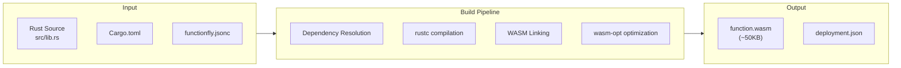
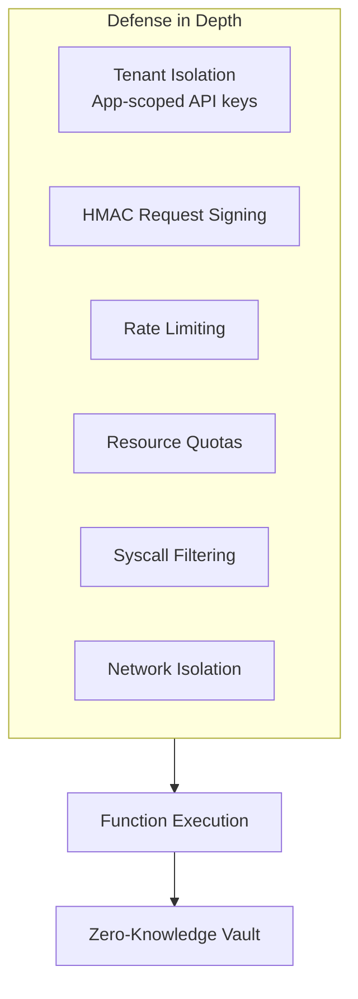
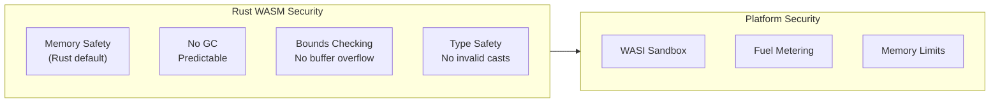
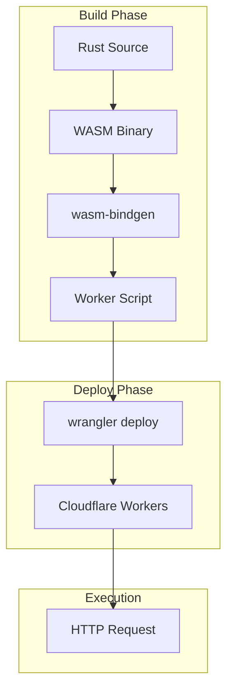
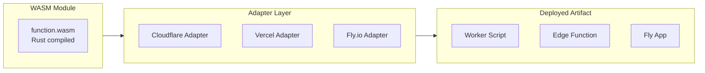
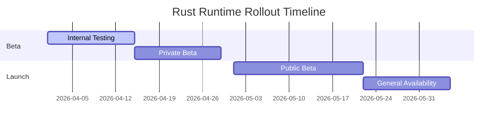

# Rust Runtime Implementation Plan

**Document Version:** 1.0  
**Date:** 2026-03-19  
**Status:** Draft  
**Author:** Architect Mode

---

## 1. Executive Summary

This document outlines the implementation plan for adding first-class Rust runtime support to the FunctionFly serverless platform. While FunctionFly already supports WebAssembly execution via Wasmtime and can technically run Rust-compiled WASM modules, this plan establishes Rust as a formally supported, documented, and optimized runtime option.

### 1.1 What We're Building

- **Rust → WASM compilation pipeline** with optimized build toolchain
- **First-class Rust runtime** designation in the platform (alongside Node.js, Python, Bun, Deno)
- **FunctionFly Rust SDK** (`functionfly-sdk`) for simplified function authoring
- **Pre-compiled WASM binaries** ready for edge deployment

### 1.2 Why Rust Matters

| Benefit | Description |
|---------|-------------|
| **Performance** | Near-native execution speed, minimal cold start overhead |
| **Security** | Memory-safe by default, no runtime interpreter vulnerabilities |
| **Small Footprint** | Minimal WASM binary sizes (10-100KB typical) |
| **Predictability** | No garbage collection pauses, deterministic execution |
| **Developer Experience** | Strong type system, excellent tooling, modern crate ecosystem |

### 1.3 Key Architectural Insights

Based on codebase analysis:

1. **Existing Wasmtime Foundation**: The platform already has robust WASM execution at [`runtimes/local/src/engine.rs`](runtimes/local/src/engine.rs) with WASI support
2. **RuntimeType Enum**: Already supports `RuntimeType::Wasm` which accepts Rust, Go, and other WASM-compiled languages
3. **Host Functions**: Comprehensive host function system already provides logging, fetch, KV, storage, email, AI, and webhook capabilities
4. **Security Model**: Enterprise-grade security with resource quotas, syscall filtering, and network isolation

---

## 2. Architecture Overview

### 2.1 High-Level Design



### 2.2 Component Interactions



---

## 3. Rust → WASM Compilation Pipeline

### 3.1 Build Process Overview



### 3.2 Recommended Toolchain

| Component | Version | Purpose |
|-----------|---------|---------|
| Rust | 1.75+ | Stable WASI support |
| wasm32-wasi | target | WASM compilation target |
| wasm-opt | latest | Binary size optimization |
| wasm-bindgen | 0.2* | JS/WASM interop (if needed) |

### 3.3 Cargo.toml Configuration

Users will add the FunctionFly SDK as a dependency:

```toml
[package]
name = "my-function"
version = "0.1.0"
edition = "2021"

[lib]
crate-type = ["cdylib", "rlib"]

[dependencies]
functionfly-sdk = "0.1"
serde = { version = "1.0", features = ["derive"] }
serde_json = "1.0"

[profile.release]
opt-level = "z"  # Optimize for size
lto = true
codegen-units = 1
```

### 3.4 Build Commands

```bash
# Standard build
cargo build --target wasm32-wasi --release

# With optimization
wasm-opt -Oz target/wasm32-wasi/release/my_function.wasm -o function.wasm

# Validate WASM
wasm-validate function.wasm
```

### 3.5 functionfly.jsonc Configuration

```jsonc
{
  "runtime": "rust",
  "runtimeVersion": "1.75",
  "entryPoint": "handle",
  "memory": "128MB",
  "timeout": "30s",
  "capabilities": {
    "fetch": true,
    "kv": ["cache"],
    "logging": true
  },
  "env": {
    "DATABASE_URL": "@secret/database-url"
  }
}
```

---

## 4. Runtime Integration

### 4.1 Integration with Existing Wasmtime

The Rust runtime integrates with the **existing Wasmtime engine** at [`runtimes/local/src/engine.rs`](runtimes/local/src/engine.rs). Key integration points:

| Component | File | Integration |
|-----------|------|-------------|
| RuntimeType | [`engine.rs:44`](runtimes/local/src/engine.rs:44) | Add `Rust` variant |
| WASI Context | [`wasi.rs`](runtimes/local/src/wasi.rs) | Reuse existing WASI |
| Host Functions | [`host_functions/mod.rs`](runtimes/local/src/host_functions/mod.rs) | Already available |
| Resource Limits | [`resource_enforcer.rs`](runtimes/local/src/resource_enforcer.rs) | Reuse quotas |
| Security | [`security.rs`](runtimes/local/src/security.rs) | Reuse profiles |

### 4.2 RuntimeType Enum Enhancement

```rust
// In runtimes/local/src/engine.rs

#[derive(Debug, Clone, PartialEq)]
pub enum RuntimeType {
    /// Standard WebAssembly module (Rust, Go, etc.)
    Wasm,
    /// Rust-specific runtime with SDK support
    Rust,  // NEW: First-class Rust
    /// Python WASM module using RustPython
    Python,
    /// CPython compiled to WASM
    PythonWasm,
    /// CPython in Firecracker MicroVM (Enterprise)
    PythonMicroVM,
}

impl RuntimeType {
    pub fn from_str(s: &str) -> Option<Self> {
        match s {
            "wasm" => Some(RuntimeType::Wasm),
            "rust" => Some(RuntimeType::Rust),  // NEW
            "python" => Some(RuntimeType::Python),
            "python-wasm" => Some(RuntimeType::PythonWasm),
            "python-microvm" => Some(RuntimeType::PythonMicroVM),
            _ => None,
        }
    }

    pub fn display_name(&self) -> &'static str {
        match self {
            RuntimeType::Wasm => "WebAssembly",
            RuntimeType::Rust => "Rust",  // NEW
            RuntimeType::Python => "RustPython",
            RuntimeType::PythonWasm => "CPython-WASM",
            RuntimeType::PythonMicroVM => "CPython (MicroVM)",
        }
    }
}
```

### 4.3 FunctionFly Rust SDK

Create a new crate: `sdks/functionfly-sdk/`

```rust
// sdks/functionfly-sdk/src/lib.rs

use serde::{Deserialize, Serialize};

/// Request context passed to function handler
#[derive(Debug, Deserialize)]
pub struct Request {
    pub method: String,
    pub path: String,
    pub headers: std::collections::HashMap<String, String>,
    pub body: Vec<u8>,
    pub query: std::collections::HashMap<String, String>,
}

/// Response returned by function handler
#[derive(Debug, Serialize)]
pub struct Response {
    pub status: u16,
    pub headers: std::collections::HashMap<String, String>,
    pub body: Vec<u8>,
}

impl Response {
    pub fn ok(body: impl Serialize) -> Self {
        let mut headers = std::collections::HashMap::new();
        headers.insert("content-type".to_string(), "application/json");
        Self {
            status: 200,
            headers,
            body: serde_json::to_vec(&body).unwrap_or_default(),
        }
    }

    pub fn error(status: u16, message: &str) -> Self {
        Self {
            status,
            headers: std::collections::HashMap::new(),
            body: message.as_bytes().to_vec(),
        }
    }
}

/// Main handler function signature
pub type Handler = fn(Request) -> Response;

/// Initialize function - called once at cold start
pub trait Initialize {
    fn init() -> Handler;
}

/// SDK version
pub const VERSION: &str = env!("CARGO_PKG_VERSION");
```

---

## 5. Security Model

### 5.1 Security Layers Overview



### 5.2 Reusing Existing Security Infrastructure

The Rust runtime reuses all existing security mechanisms:

| Security Feature | Implementation | Reused By Rust |
|-----------------|----------------|----------------|
| Tenant Isolation | App-scoped API keys | ✅ Yes |
| Request Signing | HMAC SHA256 | ✅ Yes |
| Rate Limiting | Per-token + per-IP | ✅ Yes |
| Resource Quotas | [`resource_enforcer.rs`](runtimes/local/src/resource_enforcer.rs) | ✅ Yes |
| Memory Limits | Wasmtime configured | ✅ Yes |
| Execution Timeout | Configurable | ✅ Yes |
| Network Whitelist | Host function level | ✅ Yes |
| Syscall Filtering | [`security.rs`](runtimes/local/src/security.rs) | ✅ Yes |

### 5.3 Rust-Specific Security Considerations



### 5.4 Fuel Metering for Execution Limits

Implement fuel metering to prevent infinite loops:

```rust
// In engine.rs - configure fuel metering

let mut config = wasmtime::Config::new();
config.consume_fuel(true);

// Set fuel limit (instructions before trap)
store.set_fuel(1_000_000).expect("Failed to set fuel");
```

### 5.5 Memory Limits

| Tier | Memory Limit | Use Case |
|------|--------------|----------|
| Starter | 64 MB | Simple functions |
| Pro | 256 MB | Data processing |
| Enterprise | 512 MB | Complex workloads |

---

## 6. Adapter Integration

### 6.1 Edge Provider Support Matrix

| Provider | Support Status | WASM Runtime | Notes |
|----------|---------------|--------------|-------|
| Cloudflare Workers | ✅ Supported | Wasmtime (via workers-sdk) | Primary target |
| Vercel Edge | ✅ Supported | Edge Runtime | Secondary target |
| Fly.io | ✅ Supported | Docker + Wasmtime | Full control |
| Deno Deploy | ✅ Supported | Deno runtime | Native WASM |
| Local Development | ✅ Supported | Wasmtime | Development |

### 6.2 Deployment Patterns

#### Cloudflare Workers Pattern



### 6.3 WASM-to-Edge Adapter Architecture



---

## 7. API Changes

### 7.1 New Endpoints

| Endpoint | Method | Description |
|----------|--------|-------------|
| `/v1/functions/rust/templates` | GET | List Rust function templates |
| `/v1/functions/rust/validate` | POST | Validate Rust WASM before deploy |
| `/v1/functions/rust/build-logs` | GET | Get build output logs |

### 7.2 Modified Endpoints

Update existing function deployment endpoints to support Rust:

```jsonc
// POST /v1/apps/{appId}/functions
{
  "name": "my-rust-function",
  "runtime": "rust",  // Changed from "wasm"
  "runtimeVersion": "1.75",
  "entryPoint": "handle",
  "wasmBlobId": "blob_xxx",
  "config": {
    "memory": "128MB",
    "timeout": "30s"
  }
}
```

### 7.3 Runtime Registry Update

Add Rust to the runtime registry response:

```jsonc
// GET /v1/runtimes
{
  "runtimes": [
    { "name": "rust", "version": "1.75", "status": "stable" },
    { "name": "rust", "version": "1.76", "status": "stable" },
    { "name": "bun", "version": "1.x", "status": "stable" },
    { "name": "python", "version": "3.12", "status": "stable" }
  ]
}
```

---

## 8. Database Schema

### 8.1 New Tables

No new tables required. The existing schema supports WASM functions via the `runtime` field.

### 8.2 Schema Extensions

```sql
-- Add Rust-specific configuration to existing functions table
ALTER TABLE functions 
ADD COLUMN IF NOT EXISTS rust_config JSONB,
ADD COLUMN IF NOT EXISTS rust_version VARCHAR(10);

-- Index for Rust function queries
CREATE INDEX IF NOT EXISTS idx_functions_runtime_rust 
ON functions((runtime = 'rust'));
```

### 8.3 Function Configuration Schema

```jsonc
// Stored in functions.config JSONB column
{
  "runtime": "rust",
  "rust": {
    "version": "1.75",
    "target": "wasm32-wasi",
    "optimization": "z",
    "entryPoint": "handle",
    "sdkVersion": "0.1.0"
  },
  "capabilities": {
    "fetch": true,
    "kv": ["cache"],
    "logging": "structured"
  },
  "resources": {
    "memory": "128MB",
    "timeout": 30,
    "cpuShares": 1024
  }
}
```

---

## 9. Implementation Phases

### Phase 1: Foundation (Weeks 1-2)

| Task | Description | Files |
|------|-------------|-------|
| P1.1 | Add `Rust` to RuntimeType enum | [`engine.rs`](runtimes/local/src/engine.rs) |
| P1.2 | Create functionfly-sdk crate | [`sdks/functionfly-sdk/`](sdks/functionfly-sdk/) |
| P1.3 | Update documentation | [`docs/RUST_GETTING_STARTED.md`](docs/RUST_GETTING_STARTED.md) |
| P1.4 | Add Rust to API runtime list | [`internal/api/handlers/`](internal/api/handlers/) |

**Deliverable:** Rust functions can be deployed and executed via existing WASM pipeline

### Phase 2: SDK Development (Weeks 3-4)

| Task | Description | Files |
|------|-------------|-------|
| P2.1 | Implement Request/Response types | [`sdks/functionfly-sdk/src/lib.rs`](sdks/functionfly-sdk/src/lib.rs) |
| P2.2 | Add host function bindings | [`sdks/functionfly-sdk/src/host.rs`](sdks/functionfly-sdk/src/host.rs) |
| P2.3 | Create example functions | [`examples/rust/`](examples/rust/) |
| P2.4 | Add CLI support for Rust builds | [`cli/`](cli/) |

**Deliverable:** Developers can write and deploy Rust functions using the SDK

### Phase 3: Build Pipeline (Weeks 5-6)

| Task | Description | Files |
|------|-------------|-------|
| P3.1 | Create build Docker image | [`deploy/rust-build/Dockerfile`](deploy/rust-build/Dockerfile) |
| P3.2 | Implement build API endpoint | [`internal/api/handlers/build/`](internal/api/handlers/build/) |
| P3.3 | Add wasm-opt integration | Build service |
| P3.4 | Implement build caching | Cache service |

**Deliverable:** Platform can compile Rust source to WASM

### Phase 4: Edge Integration (Weeks 7-8)

| Task | Description | Files |
|------|-------------|-------|
| P4.1 | Create Cloudflare Workers adapter | [`edge-targets/cloudflare-workers-wasm/`](edge-targets/cloudflare-workers-wasm/) |
| P4.2 | Create Vercel Edge adapter | [`edge-targets/vercel-edge-wasm/`](edge-targets/vercel-edge-wasm/) |
| P4.3 | Update Fly.io adapter | [`edge-targets/fly/`](edge-targets/fly/) |
| P4.4 | Test edge deployments | Integration tests |

**Deliverable:** Rust functions deploy to all edge providers

### Phase 5: Production Readiness (Weeks 9-10)

| Task | Description | Files |
|------|-------------|-------|
| P5.1 | Performance benchmarking | Benchmarks |
| P5.2 | Security audit | Security review |
| P5.3 | Monitoring dashboards | [`deploy/monitoring/`](deploy/monitoring/) |
| P5.4 | Load testing | Performance tests |

**Deliverable:** Production-ready Rust runtime

---

## 10. Testing Strategy

### 10.1 Test Pyramid

```mermaid
flowchart pyramid
    A["Unit Tests<br/>(70%)"] --- B["Integration Tests<br/>(20%)"] --- C["E2E Tests<br/>(10%)"]

    A -.- A1["Function compilation"]
    A -.- A1["Host function calls"]
    A -.- A1["SDK unit tests"]
    A -.- A1["Security boundary tests"]

    B -.- B1["API endpoint tests"]
    B -.- B1["Edge deployment tests"]
    B -.- B1["Multi-function isolation"]

    C -.- C1["Full deployment flow"]
    C -.- C1["Real-world scenarios"]
```

### 10.2 Unit Tests

| Test Category | Coverage Target |
|--------------|-----------------|
| SDK Functions | 90%+ |
| Host Function Bindings | 85%+ |
| Configuration Parsing | 90%+ |
| Error Handling | 80%+ |

### 10.3 Integration Tests

| Test | Description |
|------|-------------|
| `test_rust_function_execution` | Deploy and invoke Rust function |
| `test_rust_cold_start` | Measure cold start time |
| `test_rust_host_functions` | Test fetch, KV, logging |
| `test_rust_memory_limits` | Verify memory enforcement |
| `test_rust_timeout` | Verify timeout enforcement |
| `test_rust_isolation` | Tenant isolation verification |

### 10.4 Security Tests

| Test | Description |
|------|-------------|
| `test_fuel_exhaustion` | Verify infinite loop termination |
| `test_memory_exhaustion` | Verify memory limit enforcement |
| `test_network_isolation` | Verify network whitelist |
| `test_syscall_filtering` | Verify disallowed syscalls blocked |
| `test_tenant_isolation` | Cross-tenant data leakage prevention |

---

## 11. Rollout Plan

### 11.1 Phased Rollout



### 11.2 Rollout Checklist

- [ ] Phase 1: Foundation complete
- [ ] Phase 2: SDK complete  
- [ ] Phase 3: Build pipeline complete
- [ ] Phase 4: Edge adapters complete
- [ ] Security review passed
- [ ] Performance benchmarks meet targets
- [ ] Documentation complete
- [ ] Monitoring dashboards deployed
- [ ] Runbook created
- [ ] Support team trained

### 11.3 Feature Flags

```jsonc
{
  "features": {
    "rust_runtime": {
      "enabled": false,  // Default off
      "beta": true,      // Beta users only
      "whitelist": ["org_xxx", "org_yyy"]
    },
    "rust_build_pipeline": {
      "enabled": true,
      "allowed_tiers": ["enterprise"]
    }
  }
}
```

---

## 12. Monitoring & Observability

### 12.1 Key Metrics

| Metric | Description | Target |
|--------|-------------|--------|
| `rust.function.cold_start` | Cold start latency | < 100ms |
| `rust.function.execution` | Function execution time | P99 < 50ms |
| `rust.function.errors` | Error rate | < 0.1% |
| `rust.build.duration` | Build time | < 30s |
| `rust.wasm.size` | Binary size | < 100KB |

### 12.2 Grafana Dashboard Panels

```yaml
# Dashboard panels to create
panels:
  - title: "Rust Function Cold Start"
    metric: "rust_function_cold_start_ms"
    type: "histogram"
    
  - title: "Rust Function Execution Time"
    metric: "rust_function_execution_ms"
    type: "heatmap"
    
  - title: "Rust Functions by Status"
    metric: "rust_functions_total"
    type: "stat"
    
  - title: "Rust Build Queue"
    metric: "rust_build_queue_length"
    type: "graph"
```

### 12.3 Alerting Rules

```yaml
groups:
  - name: rust_runtime
    rules:
      - alert: RustFunctionErrorRateHigh
        expr: rate(rust_function_errors_total[5m]) > 0.01
        for: 2m
        labels:
          severity: critical
          
      - alert: RustBuildQueueBacklog
        expr: rust_build_queue_length > 100
        for: 5m
        labels:
          severity: warning
```

### 12.4 Logging

Structured log fields for Rust functions:

```json
{
  "timestamp": "2026-03-19T04:00:00Z",
  "level": "info",
  "function_id": "fn_xxx",
  "runtime": "rust",
  "cold_start_ms": 45,
  "execution_ms": 12,
  "memory_used_mb": 32,
  "wasm_size_bytes": 52480
}
```

---

## 13. Risks and Mitigations

### 13.1 Risk Register

| ID | Risk | Likelihood | Impact | Mitigation |
|----|------|------------|--------|------------|
| R1 | Build times too slow | Medium | High | Caching, pre-built base images |
| R2 | WASM binary too large | Low | Medium | wasm-opt, size optimization |
| R3 | Cold starts still slow | Medium | Medium | Pre-warming, instance pool |
| R4 | Host function compatibility | Low | High | Comprehensive SDK testing |
| R5 | Edge provider WASM limits | Medium | High | Multi-provider fallback |
| R6 | Security vulnerabilities | Low | Critical | Security audit, sandboxes |

### 13.2 Technical Risks

#### R1: Build Pipeline Performance

**Risk:** Compilation takes too long, impacting developer experience

**Mitigation:**

- Pre-built Docker images with cached dependencies
- Parallel compilation of dependencies
- Incremental build support
- Build queuing with priority levels

#### R2: WASM Binary Size

**Risk:** Large binaries increase deployment time and memory usage

**Mitigation:**

- Aggressive optimization (`-Oz`)
- Strip debug info
- Use `wasm-snip` to remove unused code
- Profile-guided optimization

#### R3: Cold Start Performance

**Risk:** Even with WASM, cold starts may be slow

**Mitigation:**

- Pre-warm WASM engines
- Instance pooling
- Lazy module compilation
- Keep-alive connections

### 13.3 Security Risks

| Risk | Description | Mitigation |
|------|-------------|-------------|
| WASM Vulnerabilities | Known WASM security issues | Regular updates, sandboxing |
| Resource Exhaustion | Infinite loops, memory abuse | Fuel metering, limits |
| Side Channels | Timing attacks | Disable time access |
| Supply Chain | Compromised dependencies | Dependency scanning |

---

## 14. Appendix

### A. Example Rust Function

```rust
use functionfly_sdk::{Request, Response};

#[no_mangle]
pub extern "C" fn handle(req: Request) -> Response {
    // Parse request body
    let payload: serde_json::Value = serde_json::from_slice(&req.body)
        .unwrap_or(serde_json::json!({}));

    // Process request
    let result = serde_json::json!({
        "status": "success",
        "data": payload,
        "runtime": "rust"
    });

    Response::ok(result)
}
```

### B. WASI API Surface

The Rust runtime exposes these WASI APIs:

| API | Status | Description |
|-----|--------|-------------|
| wasi_snapshot_preview1 | ✅ | Stable WASI API |
| wasi_http | 🔄 | HTTP proxying (future) |
| wasi_async | 🔄 | Async runtime (future) |

### C. Comparison with Other Runtimes

| Metric | Rust | Node.js | Python | Bun |
|--------|------|---------|--------|-----|
| Cold Start | ~10ms | ~50ms | ~100ms | ~5ms |
| Memory Usage | ~32MB | ~64MB | ~128MB | ~48MB |
| Binary Size | ~50KB | N/A | N/A | N/A |
| Max CPU | 1 core | 1 core | 1 core | 1 core |
| GC | None | Yes | Yes | Yes |

### D. References

- [WASI Specification](https://github.com/WebAssembly/WASI)
- [wasmtime Documentation](https://docs.rs/wasmtime/)
- [Rust WASI Book](https://rustwasm.github.io/docs/wasm-intro/)
- [Cloudflare Workers WASM](https://developers.cloudflare.com/workers/runtime-apis/webassembly/)

---

## 15. Approval

| Role | Name | Date | Signature |
|------|------|------|-----------|
| Architect | | | |
| Engineering Lead | | | |
| Security Lead | | | |
| Product Manager | | | |

---

*End of Document*
