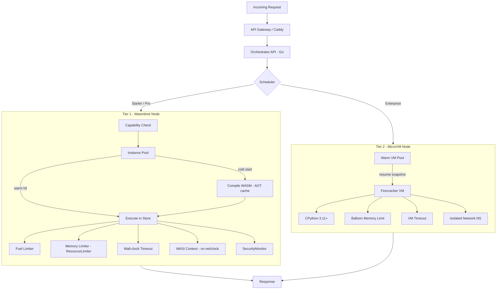

# Sandbox Execution Layer: Requirements Analysis & Architecture

## What the Execution Layer Must Provide

The four pillars of a production-grade sandbox are:

| Pillar | Requirement |
|--------|-------------|
| 🔐 Security | Strong isolation between untrusted function code; no access to host resources or other tenants |
| 🚀 Performance | Fast startup time; low overhead; good CPU utilization |
| 📏 Resource Controls | Per-function CPU/memory limits; per-function timeout; no noisy neighbors |
| 🪶 Cheap Deployments | Minimal cost per instance; pack many sandboxes per host |

---

## Current Architecture Snapshot

FunctionFly already has **two sandbox tiers** implemented in `runtimes/`:

```
runtimes/
├── local/          ← Wasmtime + WASI + RustPython  (Starter / Pro)
└── microvm/        ← Firecracker + CPython          (Enterprise)
```

### Tier 1 — Wasmtime / WASI Sandbox (`runtimes/local/`)

| Component | File | Role |
|-----------|------|------|
| [`WasmEngine`](runtimes/local/src/engine.rs:115) | `engine.rs` | Wasmtime engine; fuel-limited execution |
| [`WasiContext`](runtimes/local/src/wasi.rs:70) | `wasi.rs` | WASI P1 context; disabled clocks; preopened dirs |
| [`InstancePool`](runtimes/local/src/pool.rs:13) | `pool.rs` | Warm-instance pool; idle eviction; memory pressure |
| [`SecurityMonitor`](runtimes/local/src/security.rs:34) | `security.rs` | Syscall auditing; violation tracking; attack patterns |
| [`ResourceEnforcer`](runtimes/local/src/resource_enforcer.rs:41) | `resource_enforcer.rs` | Dynamic quotas; predictive throttling |
| [`ResourceMonitor`](runtimes/local/src/monitoring.rs:55) | `monitoring.rs` | Per-execution metrics; per-function limits |
| [`Capabilities`](runtimes/local/src/capability.rs:11) | `capability.rs` | Deny-by-default capability model |
| [`EnterpriseSecurityEnforcer`](runtimes/local/src/enterprise_security.rs:64) | `enterprise_security.rs` | Input validation; rate limiting; audit log |

### Tier 2 — Firecracker MicroVM Sandbox (`runtimes/microvm/`)

| Component | File | Role |
|-----------|------|------|
| [`MicroVMOrchestrator`](runtimes/microvm/src/orchestrator.rs:56) | `orchestrator.rs` | VM lifecycle; warm pool; tenant isolation |
| [`FirecrackerClient`](runtimes/microvm/src/firecracker.rs:1) | `firecracker.rs` | Firecracker API; balloon memory; vsock |
| [`VsockClient`](runtimes/microvm/src/vsock.rs:1) | `vsock.rs` | Guest-host communication channel |

---

## Pillar-by-Pillar Analysis

### 🔐 Security

#### What is already implemented

- **WebAssembly memory isolation** — Wasmtime enforces a linear memory model; guest code cannot address host memory.
- **WASI capability gating** — [`WasiContext`](runtimes/local/src/wasi.rs:70) only exposes preopened directories and env vars that are explicitly configured. Network access is `false` by default ([`wasi_allow_network`](runtimes/local/src/config.rs:93)).
- **Deny-by-default capabilities** — [`Capabilities`](runtimes/local/src/capability.rs:11) requires functions to declare `fetch:read`, `kv`, `email`, etc. in their manifest before the host binding is linked.
- **Disabled clocks** — [`DisabledMonotonicClock`](runtimes/local/src/wasi.rs:30) and [`DisabledWallClock`](runtimes/local/src/wasi.rs:46) return epoch 0, preventing timing side-channels.
- **Security profiles** — [`SecurityProfile`](runtimes/local/src/security.rs:12) tracks allowed syscalls, max file descriptors, network whitelist, and strict enforcement mode.
- **Attack pattern detection** — [`SecurityMonitor`](runtimes/local/src/security.rs:34) records `SyscallViolation`, `MemoryViolation`, `NetworkViolation`, `CapabilityViolation`, etc.
- **Input validation** — [`EnterpriseSecurityEnforcer`](runtimes/local/src/enterprise_security.rs:64) detects SQL injection, XSS, and command injection patterns.
- **MicroVM hardware isolation** — Firecracker provides KVM-level isolation for Enterprise tier; each tenant VM has its own kernel, network namespace, and block device.

#### Gaps & Recommendations

| Gap | Severity | Recommendation |
|-----|----------|----------------|
| No seccomp/landlock filter on the Wasmtime host process itself | Medium | Apply a seccomp-BPF profile to the `functionfly-local` process to restrict host syscalls even if Wasmtime is compromised |
| Network whitelist is advisory, not enforced at the kernel level | Medium | Use `iptables`/`nftables` rules or a network namespace per-worker to enforce egress at the OS layer |
| WASM module is not verified before loading (no YARA/signature check) | Low | Integrate the existing [`deploy/yara/`](deploy/yara/yara_service.py) service to scan WASM bytes before instantiation |
| MicroVM warm pool shares a single Firecracker socket path | Medium | Each VM should have its own socket path; the current default `/var/run/firecracker.sock` is a single point of contention |
| No tenant-to-tenant network isolation in Tier 1 | High | Wasmtime WASI does not prevent two concurrent functions from racing on shared KV or cache state; add per-execution namespacing to the KV key space |

---

### 🚀 Performance

#### What is already implemented

- **Warm instance pool** — [`InstancePool`](runtimes/local/src/pool.rs:13) caches compiled WASM modules per function key, eliminating repeated compilation. Idle eviction and memory-pressure eviction are implemented.
- **Fuel-based CPU metering** — [`consume_fuel(true)`](runtimes/local/src/engine.rs:137) in Wasmtime config; [`cpu_fuel_limit`](runtimes/local/src/config.rs:58) is configurable.
- **Epoch interruption** — [`epoch_interruption(true)`](runtimes/local/src/engine.rs:138) allows async preemption without polling.
- **Result caching** — [`ResultCache`](runtimes/local/src/cache.rs:1) caches deterministic function outputs by input hash.
- **Blocking task offload** — WASM and Python execution are dispatched via [`tokio::task::spawn_blocking`](runtimes/local/src/engine.rs:179) to avoid blocking the async runtime.
- **MicroVM warm pool** — [`warm_pool`](runtimes/microvm/src/orchestrator.rs:70) pre-boots Firecracker VMs to reduce cold-start latency for Enterprise tier.

#### Gaps & Recommendations

| Gap | Severity | Recommendation |
|-----|----------|----------------|
| Module compilation is not AOT-cached to disk | High | Use Wasmtime's `Module::serialize()` / `Module::deserialize_file()` to persist compiled modules to disk; eliminates JIT cost on restart |
| `spawn_blocking` pool is unbounded | Medium | Set `tokio::runtime::Builder::max_blocking_threads()` to cap the thread pool; prevents thread explosion under load |
| Python execution via RustPython has no warm instance reuse | Medium | The pool only tracks WASM instances; Python `PythonRuntime` objects are created fresh per request — add a Python runtime pool |
| MicroVM cold start is ~125ms (Firecracker baseline) | Low | Pre-snapshot VMs using Firecracker's snapshot/restore API to achieve sub-10ms resume times |
| No HTTP/2 or connection pooling to the MicroVM orchestrator | Low | The [`OrchestratorClient`](runtimes/local/src/orchestrator_client.rs:1) uses `reqwest`; enable `http2` feature and connection pooling |

---

### 📏 Resource Controls

#### What is already implemented

- **Per-function memory limit** — [`memory_mb`](runtimes/local/src/config.rs:34) config; [`FunctionLimits.max_memory_mb`](runtimes/local/src/monitoring.rs:46) tracked per function.
- **Per-function CPU fuel** — [`cpu_fuel_limit`](runtimes/local/src/config.rs:58) and [`max_cpu_time_ms`](runtimes/local/src/config.rs:62) are enforced via Wasmtime fuel.
- **Per-function timeout** — [`timeout_ms`](runtimes/local/src/config.rs:38) is passed to MicroVM execution requests.
- **Concurrency limit** — [`max_concurrent_per_function`](runtimes/local/src/config.rs:74) and [`FunctionLimits.max_concurrent`](runtimes/local/src/monitoring.rs:48).
- **Dynamic quotas** — [`ResourceEnforcer`](runtimes/local/src/resource_enforcer.rs:41) supports `CpuTimePerMinute`, `MemoryUsage`, `ConcurrentExecutions`, `ExecutionsPerHour`, `BandwidthPerMinute`.
- **Enforcement decisions** — [`EnforcementDecision`](runtimes/local/src/resource_enforcer.rs:73): `Allow`, `Throttle(Duration)`, `Block(String)`.
- **MicroVM hard limits** — Firecracker [`MachineConfig`](runtimes/microvm/src/firecracker.rs:48) sets `vcpu_count` and `mem_size_mib`; balloon device can reclaim memory dynamically.
- **Budget tiers** — [`BudgetTier`](runtimes/local/src/budget.rs:11) maps `UltraLow` → `High` to hardware specs; [`BudgetOptimizer`](runtimes/local/src/budget.rs:1) calculates optimal packing.

#### Gaps & Recommendations

| Gap | Severity | Recommendation |
|-----|----------|----------------|
| Wasmtime fuel does not map 1:1 to wall-clock CPU time | Medium | Calibrate fuel-per-ms on the target hardware class and expose a `cpu_ms_limit` abstraction that converts to fuel internally |
| Memory limit is declared but not enforced at the OS level for Tier 1 | High | Use Wasmtime's `Store::limiter()` API with a `ResourceLimiter` implementation that hard-caps linear memory growth |
| No per-tenant bandwidth accounting | Medium | Track bytes read/written through host functions (`fetch`, `storage`, `kv`) and enforce `BandwidthPerMinute` quota |
| Timeout is only enforced in MicroVM path; WASM path relies on fuel | Medium | Add a `tokio::time::timeout()` wrapper around `spawn_blocking` calls to enforce wall-clock timeouts in Tier 1 |
| `max_output_bytes` truncates silently | Low | Return an explicit error when output is truncated rather than silently dropping bytes |

---

### 🪶 Cheap Deployments

#### What is already implemented

- **Budget tier system** — [`BudgetTier::UltraLow`](runtimes/local/src/budget.rs:36) targets $5–10/month nodes (2 vCPU, 4 GB RAM).
- **Memory pressure eviction** — [`InstancePool`](runtimes/local/src/pool.rs:13) evicts warm instances when memory pressure exceeds threshold (default 80%).
- **Instance reuse limit** — [`max_reuse_count`](runtimes/local/src/pool.rs:29) forces recycling after 100 reuses to prevent memory leaks.
- **Minimal WASM binary size** — Functions compile to small WASM modules; the Python runtime embeds MicroPython (~425 KB) rather than CPython.
- **Shared KV store** — In-memory [`KVStore`](runtimes/local/src/kv.rs:1) with 10k entry cap avoids external Redis dependency for Tier 1.

#### Gaps & Recommendations

| Gap | Severity | Recommendation |
|-----|----------|----------------|
| Each function instance holds a full Wasmtime `Store` in memory | High | Use Wasmtime's `component` model or share a single `Engine` with per-call `Store` creation (already done) but ensure `Store` is dropped immediately after execution |
| No bin-packing / scheduling across multiple nodes | Medium | Add a lightweight scheduler that tracks per-node capacity and routes new invocations to the least-loaded node |
| MicroVM images are not shared across tenants | Medium | Use copy-on-write (overlay) root filesystems so all VMs share a single read-only base image; only the diff is per-tenant |
| No function hibernation / suspend | Low | Implement Firecracker snapshot-restore to hibernate idle VMs to disk, freeing RAM while preserving state |
| Package cache is per-node, not shared | Low | Mount a shared NFS/S3-backed package cache so packages installed by one node are available to all |

---

## Architecture Diagram



---

## Recommended Implementation Roadmap

### Phase 1 — Harden Tier 1 (Wasmtime) Resource Controls

1. **Implement `ResourceLimiter`** in [`engine.rs`](runtimes/local/src/engine.rs:133) using Wasmtime's `Store::limiter()` API to hard-cap linear memory growth per function.
2. **Add wall-clock timeout** — wrap `spawn_blocking` calls with `tokio::time::timeout(Duration::from_millis(config.timeout_ms), ...)`.
3. **AOT module cache** — serialize compiled `Module` to `{cache_dir}/{function_key}.cwasm` on first compile; deserialize on subsequent loads.
4. **Calibrate fuel-to-ms** — run a micro-benchmark on each `BudgetTier` node to establish a `fuel_per_ms` constant; expose `cpu_ms_limit` in config.

### Phase 2 — Strengthen Isolation

5. **seccomp-BPF profile** — apply a minimal syscall allowlist to the `functionfly-local` process using `seccomp` crate or a pre-built profile.
6. **Per-execution KV namespace** — prefix all KV keys with `{tenant_id}:{function_name}:` to prevent cross-tenant data leakage.
7. **Kernel-level egress control** — create a network namespace per Wasmtime worker process; only allow outbound connections to whitelisted IPs.
8. **YARA scan on upload** — call [`deploy/yara/yara_service.py`](deploy/yara/yara_service.py) before storing a new WASM artifact.

### Phase 3 — Performance Optimizations

9. **Python runtime pool** — add a `PythonRuntimePool` analogous to `InstancePool` to reuse `PythonRuntime` objects across requests.
10. **Firecracker snapshot/restore** — implement VM snapshotting after boot so warm VMs resume in <10ms instead of cold-booting.
11. **COW root filesystem** — use `overlayfs` to share a single read-only base image across all MicroVMs; only the per-tenant diff is allocated.

### Phase 4 — Cost Optimization

12. **Bin-packing scheduler** — track per-node `(cpu_used, memory_used)` in the orchestrator; route new invocations to the node with the most headroom.
13. **VM hibernation** — snapshot idle VMs to disk after a configurable idle timeout; restore on next invocation.
14. **Shared package cache** — mount a shared volume (NFS or S3-backed) for the Python package cache so packages are installed once per cluster.

---

## Summary Table

| Requirement | Current Status | Priority Gap |
|-------------|---------------|--------------|
| WASM memory isolation | ✅ Wasmtime linear memory | — |
| Capability deny-by-default | ✅ Implemented | — |
| Clock/timing side-channel prevention | ✅ Disabled clocks | — |
| Hard memory cap (OS-level) | ⚠️ Declared, not enforced | **High** |
| Wall-clock timeout (Tier 1) | ⚠️ Fuel only | **High** |
| Per-tenant KV namespace | ❌ Missing | **High** |
| seccomp on host process | ❌ Missing | Medium |
| Kernel-level egress control | ❌ Missing | Medium |
| AOT module cache | ❌ Missing | High (perf) |
| Python runtime pool | ❌ Missing | Medium (perf) |
| Firecracker snapshot/restore | ❌ Missing | Medium (perf) |
| COW VM root filesystem | ❌ Missing | Medium (cost) |
| Bin-packing scheduler | ❌ Missing | Medium (cost) |
| VM hibernation | ❌ Missing | Low (cost) |
