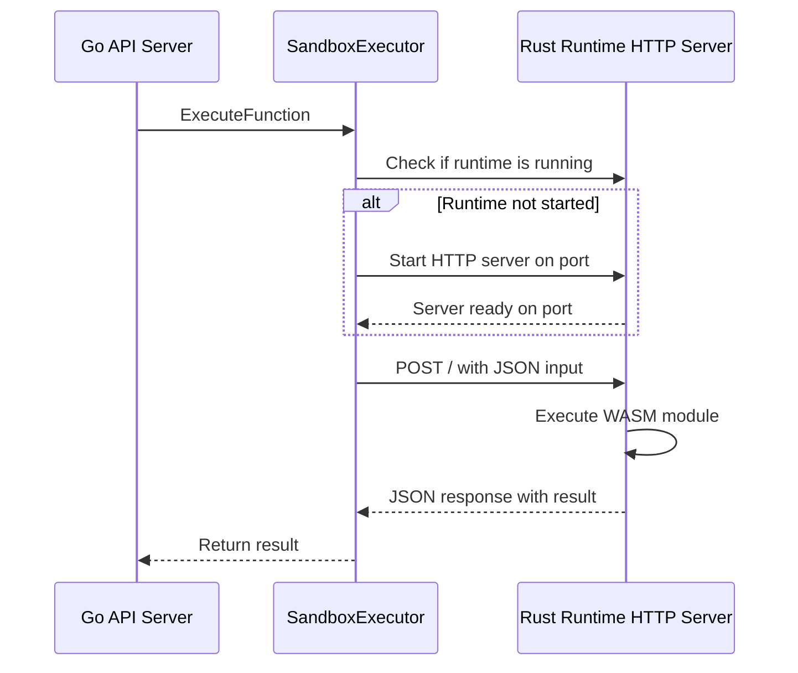

# Fix Sandbox Executor HTTP Communication

## Problem Summary

The WASM compilation succeeds (156KB), but execution times out because the sandbox executor uses stdin/stdout while the local runtime is an HTTP server.

### Root Cause

**File**: [`internal/api/handlers/registry/execution/sandbox.go`](internal/api/handlers/registry/execution/sandbox.go:88-145)

The `executeWithRuntimeLimits` function:
1. Creates a subprocess with the runtime binary
2. Writes input to stdin
3. Waits for output on stdout

**But the local runtime** ([`runtimes/local/src/main.rs`](runtimes/local/src/main.rs:42-84)):
1. Starts an HTTP server on port 8787
2. Expects POST requests to `/` with JSON body
3. Returns JSON responses

This mismatch causes the timeout - the Go code waits for stdout that never comes.

## Solution

Modify the sandbox executor to use HTTP communication with the local runtime server.

### Architecture



## Required Changes

### 1. Modify `internal/api/handlers/registry/execution/sandbox.go`

#### A. Add HTTP client and runtime management

```go
type SandboxExecutor struct {
    runtimePath string
    tempDir     string
    runtimePort int
    runtimeCmd  *exec.Cmd
    httpClient  *http.Client
    runtimeMu   sync.Mutex
    isRunning   bool
}
```

#### B. Add method to start runtime server

```go
func (se *SandboxExecutor) ensureRuntimeRunning(ctx context.Context, wasmPath string, fnVersion *storage.RegistryFunctionVersion) error {
    se.runtimeMu.Lock()
    defer se.runtimeMu.Unlock()
    
    if se.isRunning {
        return nil
    }
    
    // Find available port
    port, err := getAvailablePort()
    if err != nil {
        return err
    }
    se.runtimePort = port
    
    // Start runtime as HTTP server
    args := []string{
        "--port", fmt.Sprintf("%d", port),
        "--wasm", wasmPath,
        "--runtime", fnVersion.Runtime,
        "--timeout-ms", fmt.Sprintf("%d", fnVersion.TimeoutMs),
        "--memory-mb", fmt.Sprintf("%d", fnVersion.MemoryMB),
    }
    
    se.runtimeCmd = exec.CommandContext(ctx, se.runtimePath, args...)
    err = se.runtimeCmd.Start()
    if err != nil {
        return err
    }
    
    // Wait for server to be ready
    return se.waitForServerReady(ctx)
}
```

#### C. Add method to execute via HTTP

```go
func (se *SandboxExecutor) executeViaHTTP(input []byte, timeoutMs int) ([]byte, error) {
    // Create request body
    reqBody := map[string]interface{}{
        "input": string(input),
    }
    jsonBody, _ := json.Marshal(reqBody)
    
    // Create HTTP request
    url := fmt.Sprintf("http://127.0.0.1:%d/", se.runtimePort)
    ctx, cancel := context.WithTimeout(context.Background(), time.Duration(timeoutMs)*time.Millisecond)
    defer cancel()
    
    req, err := http.NewRequestWithContext(ctx, "POST", url, bytes.NewBuffer(jsonBody))
    if err != nil {
        return nil, err
    }
    req.Header.Set("Content-Type", "application/json")
    
    // Execute request
    resp, err := se.httpClient.Do(req)
    if err != nil {
        return nil, err
    }
    defer resp.Body.Close()
    
    // Parse response
    var result struct {
        Result string `json:"result"`
        Error  string `json:"error,omitempty"`
    }
    if err := json.NewDecoder(resp.Body).Decode(&result); err != nil {
        return nil, err
    }
    
    if result.Error != "" {
        return nil, fmt.Errorf("runtime error: %s", result.Error)
    }
    
    return []byte(result.Result), nil
}
```

#### D. Update `executeWithRuntimeLimits`

Replace the stdin/stdout approach with HTTP calls:

```go
func (se *SandboxExecutor) executeWithRuntimeLimits(wasmPath string, fnVersion *storage.RegistryFunctionVersion, input []byte, timeoutMs, maxMemoryMB, maxCPUTimeMs int) ([]byte, error) {
    // Ensure runtime is running
    ctx := context.Background()
    if err := se.ensureRuntimeRunning(ctx, wasmPath, fnVersion); err != nil {
        return nil, fmt.Errorf("failed to start runtime: %w", err)
    }
    
    // Execute via HTTP
    return se.executeViaHTTP(input, timeoutMs)
}
```

### 2. Add helper function for available port

```go
func getAvailablePort() (int, error) {
    listener, err := net.Listen("tcp", "127.0.0.1:0")
    if err != nil {
        return 0, err
    }
    defer listener.Close()
    
    addr := listener.Addr().(*net.TCPAddr)
    return addr.Port, nil
}
```

### 3. Add health check for runtime readiness

```go
func (se *SandboxExecutor) waitForServerReady(ctx context.Context) error {
    url := fmt.Sprintf("http://127.0.0.1:%d/health", se.runtimePort)
    
    for i := 0; i < 50; i++ { // 5 seconds max
        req, _ := http.NewRequestWithContext(ctx, "GET", url, nil)
        resp, err := se.httpClient.Do(req)
        if err == nil {
            resp.Body.Close()
            if resp.StatusCode == 200 {
                se.isRunning = true
                return nil
            }
        }
        time.Sleep(100 * time.Millisecond)
    }
    
    return fmt.Errorf("runtime server did not become ready")
}
```

### 4. Update `Close()` method

```go
func (se *SandboxExecutor) Close() {
    se.runtimeMu.Lock()
    defer se.runtimeMu.Unlock()
    
    if se.runtimeCmd != nil && se.runtimeCmd.Process != nil {
        se.runtimeCmd.Process.Kill()
        se.runtimeCmd.Wait()
    }
    
    if se.tempDir != "" {
        os.RemoveAll(se.tempDir)
    }
}
```

## Alternative: Single-Execution Mode

If we want to avoid managing a persistent runtime server, we could add a CLI mode to the Rust runtime that accepts stdin and outputs to stdout:

### Modify Rust Runtime

Add a `--single-exec` flag to [`runtimes/local/src/config.rs`](runtimes/local/src/config.rs):

```rust
/// Run single execution from stdin and exit
#[arg(long, default_value = "false")]
pub single_exec: bool,
```

Then in [`runtimes/local/src/main.rs`](runtimes/local/src/main.rs), add logic to handle single execution mode:

```rust
if config.single_exec {
    // Read input from stdin
    let mut input = String::new();
    std::io::stdin().read_to_string(&mut input)?;
    
    // Execute function
    let result = engine.execute(&input).await?;
    
    // Write result to stdout
    println!("{}", result);
    return Ok(());
}
```

This approach would allow the Go sandbox executor to continue using stdin/stdout.

## Recommendation

**Use the HTTP-based approach** because:
1. The Rust runtime is already designed as an HTTP server
2. Better resource management - can reuse the same runtime instance
3. Cleaner separation of concerns
4. Easier debugging - can test runtime independently

## Implementation Order

1. Modify `SandboxExecutor` struct to add HTTP client and runtime management
2. Add `ensureRuntimeRunning()` method
3. Add `executeViaHTTP()` method
4. Add `waitForServerReady()` method
5. Update `executeWithRuntimeLimits()` to use HTTP
6. Update `Close()` to properly shut down runtime
7. Add tests for the new HTTP-based execution
