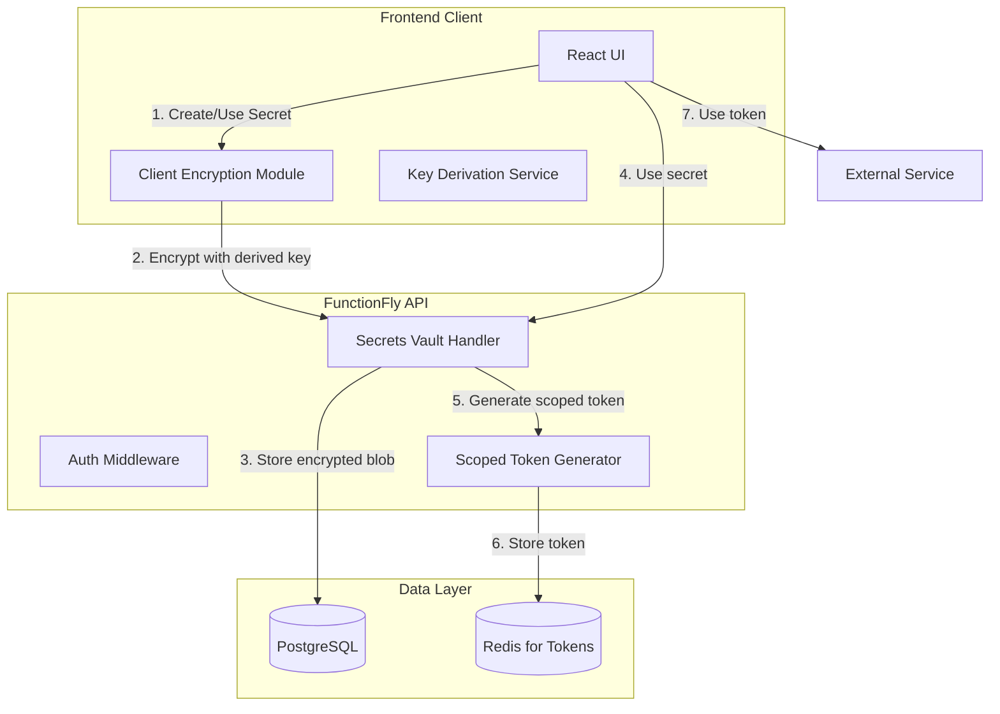

# Secure Secrets Vault MVP Implementation Plan

## Overview

This document outlines the implementation plan for a Secure Secrets Vault system for FunctionFly.com. The vault allows users to securely store sensitive credentials (API keys, tokens, passwords) with zero-knowledge encryption and controlled access through scoped tokens.

## Core Design Principles

1. **Zero-Knowledge Encryption**: The server never stores raw secrets; all encryption/decryption happens client-side
2. **Scoped Access Tokens**: Secrets are never exposed to the frontend; instead, short-lived tokens are issued for authorized operations
3. **Tenant Isolation**: Each tenant (organization) has isolated secret storage with row-level security
4. **Audit Trail**: All secret access is logged for security compliance

---

## Architecture



---

## Database Schema

### Core Tables

```sql
-- Secrets vault table
CREATE TABLE IF NOT EXISTS secrets_vault (
    id UUID PRIMARY KEY DEFAULT gen_random_uuid(),
    tenant_id UUID NOT NULL REFERENCES tenants(id),
    user_id UUID NOT NULL REFERENCES users(id),
    name VARCHAR(255) NOT NULL,
    description TEXT,
    secret_type VARCHAR(50) NOT NULL, -- 'api_key', 'oauth_token', 'password', 'certificate'
    encrypted_value BYTEA NOT NULL,
    encryption_iv BYTEA NOT NULL,
    encryption_salt BYTEA NOT NULL,
    encryption_auth_tag BYTEA NOT NULL,
    key_version INTEGER NOT NULL DEFAULT 1,
    metadata JSONB DEFAULT '{}',
    scopes JSONB DEFAULT '[]', -- allowed usage scopes
    is_active BOOLEAN DEFAULT true,
    expires_at TIMESTAMP WITH TIME ZONE,
    created_at TIMESTAMP WITH TIME ZONE DEFAULT NOW(),
    updated_at TIMESTAMP WITH TIME ZONE DEFAULT NOW(),
    last_accessed_at TIMESTAMP WITH TIME ZONE,
    CONSTRAINT tenant_secrets_unique UNIQUE (tenant_id, name)
);

-- Secret access tokens (short-lived)
CREATE TABLE IF NOT EXISTS secret_access_tokens (
    id UUID PRIMARY KEY DEFAULT gen_random_uuid(),
    secret_id UUID NOT NULL REFERENCES secrets_vault(id),
    tenant_id UUID NOT NULL REFERENCES tenants(id),
    token_hash VARCHAR(255) NOT NULL,
    scope VARCHAR(100) NOT NULL,
    expires_at TIMESTAMP WITH TIME ZONE NOT NULL,
    created_at TIMESTAMP WITH TIME ZONE DEFAULT NOW(),
    last_used_at TIMESTAMP WITH TIME ZONE,
    ip_address VARCHAR(45),
    user_agent TEXT,
    is_revoked BOOLEAN DEFAULT false
);

-- Audit log for secret access
CREATE TABLE IF NOT EXISTS secrets_audit_log (
    id UUID PRIMARY KEY DEFAULT gen_random_uuid(),
    tenant_id UUID NOT NULL REFERENCES tenants(id),
    secret_id UUID REFERENCES secrets_vault(id),
    user_id UUID NOT NULL REFERENCES users(id),
    action VARCHAR(50) NOT NULL, -- 'create', 'read', 'update', 'delete', 'use', 'revoke'
    scope VARCHAR(100),
    ip_address VARCHAR(45),
    user_agent TEXT,
    timestamp TIMESTAMP WITH TIME ZONE DEFAULT NOW(),
    metadata JSONB DEFAULT '{}'
);

-- Indexes
CREATE INDEX idx_secrets_vault_tenant ON secrets_vault(tenant_id);
CREATE INDEX idx_secrets_vault_tenant_name ON secrets_vault(tenant_id, name);
CREATE INDEX idx_secret_access_tokens_secret ON secret_access_tokens(secret_id);
CREATE INDEX idx_secret_access_tokens_expires ON secret_access_tokens(expires_at);
CREATE INDEX idx_secrets_audit_log_secret ON secrets_audit_log(secret_id);
CREATE INDEX idx_secrets_audit_log_timestamp ON secrets_audit_log(timestamp);
CREATE INDEX idx_secrets_audit_log_tenant ON secrets_audit_log(tenant_id);
```

---

## Encryption Design

### Key Derivation

The vault uses PBKDF2 (Password-Based Key Derivation Function 2) to derive encryption keys from a user-provided vault passphrase:

```typescript
// Client-side key derivation
const deriveKey = (passphrase: string, salt: Uint8Array): CryptoKey => {
  return crypto.subtle.importKey(
    'raw',
    crypto.getRandomValues(new Uint8Array(32)),
    'PBKDF2',
    false,
    ['deriveKey']
  );
};

// Key derivation using PBKDF2
const key = await crypto.subtle.deriveKey(
  {
    name: 'PBKDF2',
    salt: salt,
    iterations: 100000,
    hash: 'SHA-256'
  },
  baseKey,
  { name: 'AES-GCM', length: 256 },
  false,
  ['encrypt', 'decrypt']
);
```

### Encryption (AES-256-GCM)

```typescript
// Client-side encryption
const encryptSecret = async (
  secret: string,
  key: CryptoKey
): Promise<{ encrypted: Uint8Array; iv: Uint8Array; authTag: Uint8Array }> => {
  const iv = crypto.getRandomValues(new Uint8Array(12));
  const encodedSecret = new TextEncoder().encode(secret);
  
  const encrypted = await crypto.subtle.encrypt(
    { name: 'AES-GCM', iv },
    key,
    encodedSecret
  );
  
  // Extract auth tag from the last 16 bytes
  const encryptedArray = new Uint8Array(encrypted);
  const authTag = encryptedArray.slice(-16);
  const ciphertext = encryptedArray.slice(0, -16);
  
  return { encrypted: ciphertext, iv, authTag };
};
```

---

## API Endpoints

### Secrets Management

| Method | Endpoint | Description |
|--------|----------|-------------|
| `POST` | `/api/v1/secrets` | Create a new secret |
| `GET` | `/api/v1/secrets` | List all secrets (metadata only) |
| `GET` | `/api/v1/secrets/:id` | Get secret metadata |
| `PUT` | `/api/v1/secrets/:id` | Update secret metadata |
| `DELETE` | `/api/v1/secrets/:id` | Delete a secret |
| `POST` | `/api/v1/secrets/:id/access-token` | Generate scoped access token |

### Request/Response Examples

#### Create Secret

```typescript
// Request
POST /api/v1/secrets
Authorization: Bearer <jwt>
Content-Type: application/json

{
  "name": "OpenAI API Key",
  "description": "Production OpenAI key for AI functions",
  "secret_type": "api_key",
  "encrypted_value": "base64-encoded-encrypted-data",
  "encryption_iv": "base64-encoded-iv",
  "encryption_salt": "base64-encoded-salt",
  "encryption_auth_tag": "base64-encoded-auth-tag",
  "key_version": 1,
  "scopes": ["functions:execute", "ai:generate"],
  "metadata": {
    "provider": "openai",
    "environment": "production"
  }
}

// Response
{
  "id": "uuid",
  "name": "OpenAI API Key",
  "description": "Production OpenAI key for AI functions",
  "secret_type": "api_key",
  "scopes": ["functions:execute", "ai:generate"],
  "metadata": {
    "provider": "openai",
    "environment": "production"
  },
  "created_at": "2026-03-03T00:00:00Z",
  "updated_at": "2026-03-03T00:00:00Z"
}
```

#### Generate Access Token

```typescript
// Request
POST /api/v1/secrets/:id/access-token
Authorization: Bearer <jwt>
Content-Type: application/json

{
  "scope": "functions:execute",
  "expires_in": 3600, // seconds
  "ip_address": "client-ip"
}

// Response
{
  "token": "sat_xxxxxxxxxxxxx",
  "secret_id": "uuid",
  "scope": "functions:execute",
  "expires_at": "2026-03-03T01:00:00Z"
}
```

---

## Implementation Steps

### Phase 1: Database & Backend Infrastructure

1. **Create Database Migration**
   - Add `secrets_vault` table with encryption fields
   - Add `secret_access_tokens` table
   - Add `secrets_audit_log` table
   - Add row-level security policies

2. **Implement Encryption Service** (`internal/secrets/`)
   - Create `vault.go` for vault operations
   - Create `crypto.go` for encryption utilities
   - Implement key derivation functions
   - Implement AES-256-GCM encryption/decryption

3. **Create API Handlers** (`internal/api/handlers/secrets/`)
   - `handlers.go` - HTTP handlers
   - `service.go` - Business logic
   - `repository.go` - Database operations

4. **Implement Token Generator**
   - Create scoped token generation
   - Implement token storage in Redis with TTL
   - Add token revocation capability

### Phase 2: Client-Side Implementation

1. **Add Encryption Utilities** (`web/dashboard/src/lib/secrets/`)
   - Key derivation utilities
   - Encryption/decryption functions
   - Secure random generation

2. **Create API Client** (`web/dashboard/src/api/secrets.ts`)
   - Secrets CRUD operations
   - Token generation
   - Audit log retrieval

3. **Build UI Components** (`web/dashboard/src/components/secrets/`)
   - SecretList - Display all secrets
   - SecretForm - Create/edit secret modal
   - SecretAccess - Generate access tokens
   - SecretAuditLog - View access history

### Phase 3: Security & Audit

1. **Add Audit Logging**
   - Log all secret operations
   - Include IP address, user agent, timestamp

2. **Implement Rate Limiting**
   - Limit token generation requests
   - Limit secret creation

3. **Add Access Control**
   - Verify user permissions for secret operations
   - Ensure tenant isolation

---

## Security Considerations

### Zero-Knowledge Model

- **Client-Side Only**: Raw secrets are encrypted in the browser before transmission
- **Server Blind**: Backend only stores encrypted blobs; never sees plaintext
- **Key Management**: Users manage their own vault passphrase

### Threat Mitigation

| Threat | Mitigation |
|--------|------------|
| Database compromise | Secrets encrypted with AES-256-GCM |
| Man-in-middle | TLS 1.3 required |
| Brute force | PBKDF2 with 100,000 iterations |
| Token theft | Short-lived tokens (default 1 hour) |
| Privilege escalation | Scoped tokens limit permissions |
| Audit evasion | All operations logged |

### Token Security

- **Short-lived**: Default 1 hour, max 24 hours
- **Single-use option**: Can be configured for one-time use
- **IP binding**: Optional IP address validation
- **Revocation**: Immediate revocation capability

---

## Integration Points

### With Existing Auth System

- Reuse existing JWT tokens for authentication
- Use existing tenant_id for isolation
- Integrate with current user management

### With Function Execution

When a function needs to use a secret:

```typescript
// Function execution flow
1. User configures function to use secret "My AWS Key"
2. Frontend requests access token from backend
3. Backend validates user permissions
4. Backend decrypts secret internally (in secure memory)
5. Backend generates short-lived scoped token
6. Token is passed to function execution environment
7. Function uses token to authenticate with AWS
8. Token expires after configured TTL
```

---

## Acceptance Criteria

### MVP Requirements

- [ ] Users can create secrets with client-side encryption
- [ ] Users can list and manage their secrets
- [ ] Users can generate scoped access tokens
- [ ] Secrets are never exposed in plaintext after saving
- [ ] All operations are audit logged
- [ ] Tenant isolation is enforced
- [ ] Encryption uses AES-256-GCM with PBKDF2 key derivation

### Future Enhancements (Post-MVP)

- Secret rotation reminders
- Automatic secret rotation for supported providers
- Secret sharing between team members
- Secret expiration policies
- Two-factor authentication for vault access
- Hardware security key support (WebAuthn)

---

## File Structure

```
internal/
  secrets/
    vault.go           # Vault service
    crypto.go          # Encryption utilities
    token.go           # Token generation
    audit.go           # Audit logging
    
internal/api/handlers/secrets/
    handler.go         # HTTP handlers
    service.go         # Business logic
    repository.go      # Database operations
    routes.go          # Route registration

web/dashboard/src/
  lib/secrets/
    crypto.ts          # Client encryption
    keyDerivation.ts   # Key derivation
  api/
    secrets.ts          # API client
  components/secrets/
    SecretList.tsx
    SecretForm.tsx
    SecretAccess.tsx
    SecretAuditLog.tsx
  pages/
    Settings/
      Secrets.tsx      # Main secrets page
```

---

## Migration Strategy

1. **Add migration file**: `000077_secrets_vault.up.sql`
2. **Deploy to staging**: Test encryption flow
3. **Deploy to production**: With feature flag
4. **Monitor**: Watch for errors and performance

---

## Testing Strategy

1. **Unit Tests**: Encryption/decryption functions
2. **Integration Tests**: API endpoints
3. **E2E Tests**: Full user flow
4. **Security Tests**: Penetration testing for vault
