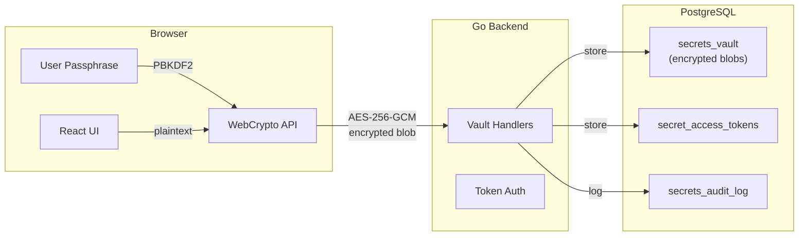
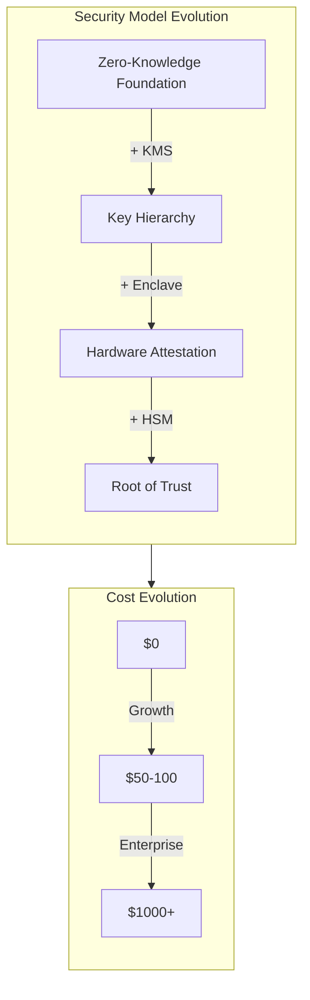

# Secrets Vault - Cost-Optimized Phased Implementation Plan

> **Goal:** Build a zero-knowledge secrets vault that starts free and scales elegantly with your revenue.

---

## Executive Summary

The Secrets Vault uses a **zero-knowledge architecture** that allows you to start with virtually **$0 cost** and add enterprise-grade security features only when you have paying customers to support them. Because encryption happens client-side, your servers never see plaintext secrets—enabling you to defer expensive infrastructure (HSM, enclaves, KMS) until Phase 2 or 3 without compromising the core security model.

---

## Phase 1: MVP (Current - $0-50/month)

**Goal:** Core zero-knowledge storage without expensive infrastructure

### What's ALREADY Done
✅ **Database schema (Migration 000077)** provides:
- `secrets_vault` table with AES-256-GCM encrypted blob storage
- `secret_access_tokens` for scoped, time-limited access
- `secrets_audit_log` for compliance tracking
- `key_version` column for future key rotation
- `scopes` JSONB for simple → complex permission evolution
- `metadata` field for extensibility (enclave attestation data later)

### What's INCLUDED (Free Infrastructure)

| Component | Technology | Cost | Why It Works |
|-----------|------------|------|--------------|
| **Client Encryption** | WebCrypto API (PBKDF2 + AES-256-GCM) | $0 | Browser-native, no library dependencies |
| **Database** | Existing PostgreSQL | $0 | You already pay for this |
| **Token Storage** | PostgreSQL with expiry cleanup | $0 | Use existing cron jobs for cleanup |
| **Audit Logs** | PostgreSQL table | $0 | Start simple, export later |
| **API Layer** | Existing Go backend | $0 | Add handlers to current API |
| **Key Derivation** | User passphrase → PBKDF2 | $0 | No KMS or HSM needed |

### Implementation Checklist (Phase 1)

#### 1. Frontend Encryption Utilities (WebCrypto)
```typescript
// web/dashboard/src/utils/vault-crypto.ts
export class VaultCrypto {
  // PBKDF2 key derivation from user passphrase
  static async deriveKey(passphrase: string, salt: Uint8Array): Promise<CryptoKey>;
  
  // AES-256-GCM encryption
  static async encrypt(plaintext: string, key: CryptoKey): Promise<EncryptedBlob>;
  
  // AES-256-GCM decryption
  static async decrypt(blob: EncryptedBlob, key: CryptoKey): Promise<string>;
  
  // Generate random salt/IV
  static generateSalt(): Uint8Array;
  static generateIV(): Uint8Array;
}
```

**Files to create:**
- [`web/dashboard/src/utils/vault-crypto.ts`](web/dashboard/src/utils/vault-crypto.ts) - Core crypto utilities
- [`web/dashboard/src/hooks/useVault.ts`](web/dashboard/src/hooks/useVault.ts) - React hook for vault operations
- [`web/dashboard/src/components/SecretsVault/`](web/dashboard/src/components/SecretsVault/) - UI components

#### 2. Go API Handlers
```go
// internal/api/handlers/vault/secrets.go
func CreateSecret(w http.ResponseWriter, r *http.Request)
func ListSecrets(w http.ResponseWriter, r *http.Request) 
func GetSecret(w http.ResponseWriter, r *http.Request)
func UpdateSecret(w http.ResponseWriter, r *http.Request)
func DeleteSecret(w http.ResponseWriter, r *http.Request)
func GenerateAccessToken(w http.ResponseWriter, r *http.Request)
```

**Files to create:**
- [`internal/api/handlers/vault/secrets.go`](internal/api/handlers/vault/secrets.go) - CRUD operations
- [`internal/api/handlers/vault/tokens.go`](internal/api/handlers/vault/tokens.go) - Token management
- [`internal/api/handlers/vault/audit.go`](internal/api/handlers/vault/audit.go) - Audit logging
- [`internal/api/middleware/vault_auth.go`](internal/api/middleware/vault_auth.go) - Vault-scoped auth

#### 3. Token Cleanup Job
Add to existing cron/background worker:
```sql
-- Runs every hour via existing cron
DELETE FROM secret_access_tokens 
WHERE expires_at < NOW() OR is_revoked = true;
```

#### 4. UI Components
- Secret list view (metadata only, no plaintext)
- Secret creation form (passphrase input, encrypt before sending)
- Token generation dialog (scope selection, expiration)
- Audit log viewer (read-only)

### Security Model (Phase 1)



**Key Point:** Server sees only encrypted data. If database is breached, attacker gets encrypted blobs with no keys.

### What's NOT Included (Intentionally Deferred)

| Feature | Why Deferred | When Added |
|---------|--------------|------------|
| **AWS KMS** | $1/key/month, not needed for zero-knowledge | Phase 2 |
| **Redis** | Postgres sufficient for <10k tokens | Phase 2 |
| **HSM** | $500+/month, overkill for MVP | Phase 3 |
| **Nitro Enclaves** | Complexity + cost, not needed yet | Phase 3 |
| **Rust Control Plane** | Go handlers sufficient | Phase 3 |
| **Audit Streaming** | Postgres queries work initially | Phase 2 |
| **Policy Engine** | JSON scopes sufficient | Phase 2 |

---

## Phase 2: Growth ($100-500/month revenue)

**Trigger:** When you have paying customers who need enterprise features

### Additions

#### 1. AWS KMS Integration (~$1-5/month)
Wrap the key derivation secret with KMS—not for encryption, but for key hierarchy:

```typescript
// Phase 2: KMS-wrapped key derivation
const deriveKeyPhase2 = async (passphrase: string, salt: Uint8Array) => {
  // 1. Derive key from passphrase (same as Phase 1)
  const baseKey = await deriveKeyPBKDF2(passphrase, salt);
  
  // 2. Get KMS-wrapped key material
  const wrappedKey = await kms.generateDataKey({
    KeyId: 'alias/vault-master',
    KeySpec: 'AES_256'
  });
  
  // 3. Combine keys (passphrase + KMS = defense in depth)
  return combineKeys(baseKey, wrappedKey);
};
```

**Benefits:**
- Revoke keys via KMS if breach suspected
- Audit key usage via CloudTrail
- Still zero-knowledge (KMS doesn't see plaintext)

#### 2. Redis for Token Storage (~$10-30/month)
Use Upstash or ElastiCache for faster token validation:

```go
// Token validation with Redis fallback
type TokenCache struct {
    redis *redis.Client
    db    *sql.DB
}

func (tc *TokenCache) ValidateToken(ctx context.Context, hash string) (*Token, error) {
    // Try Redis first
    if token, err := tc.redis.Get(ctx, "token:"+hash).Result(); err == nil {
        return parseToken(token), nil
    }
    
    // Fallback to PostgreSQL
    return tc.db.QueryRowContext(ctx, 
        "SELECT * FROM secret_access_tokens WHERE token_hash = $1", hash)
}
```

**Cost Options:**
- **Upstash (Serverless Redis):** $10/month for 10K requests/day
- **ElastiCache:** $30-50/month for cache.t4g.micro

#### 3. Audit Log Streaming (~$5-20/month)
Export audit logs to S3 for compliance/long-term storage:

```sql
-- Hourly export to S3
COPY (
    SELECT * FROM secrets_audit_log 
    WHERE timestamp > NOW() - INTERVAL '1 hour'
) TO PROGRAM 'aws s3 cp - s3://bucket/audit/YYYY/MM/DD/HH.jsonl';
```

#### 4. Basic Policy Engine (OPA or Go)
Replace simple scopes with policy-based access:

```go
// Simple Go-based policy (no OPA yet)
type Policy struct {
    CapsuleID   string   `json:"capsule_id"`
    Environment string   `json:"environment"`
    AllowedIPs  []string `json:"allowed_ips"`
    TimeWindow  *TimeWindow `json:"time_window"`
}
```

### Phase 2 Schema Evolution

Migration 000077 already supports this:
```sql
-- key_version tracks evolution: 1=passphrase, 2=KMS-wrapped, 3=HSM
ALTER TABLE secrets_vault ADD COLUMN IF NOT EXISTS kms_key_id VARCHAR(255);

-- scopes JSONB supports simple strings now, complex objects later
UPDATE secrets_vault SET scopes = '["read:api", "write:api"]' WHERE key_version = 1;
UPDATE secrets_vault SET scopes = '{"capsule": "abc", "env": "prod"}'::jsonb WHERE key_version = 2;
```

---

## Phase 3: Enterprise ($1000+/month revenue)

**Trigger:** When enterprise customers demand hardware-backed security

### The Full "Secrets Fabric" Vision

#### 1. Nitro Enclaves or HashiCorp Vault (~$500+/month)
Hardware-backed decryption with attestation:

```rust
// Phase 3: Enclave-based decryption
pub fn decrypt_in_enclave(
    encrypted_blob: &[u8],
    attestation_doc: &AttestationDocument,
) -> Result<String, EnclaveError> {
    // Verify enclave attestation with AWS
    verify_attestation(attestation_doc)?;
    
    // Decrypt within isolated memory
    let plaintext = aes_gcm_decrypt(encrypted_blob, ENCLAVE_SEAL_KEY)?;
    Ok(plaintext)
}
```

**Benefits:**
- Memory encryption (even AWS can't read)
- Cryptographic attestation (prove code hasn't been tampered)
- PCI-DSS Level 1 compliance

#### 2. Rust Control Plane (Separate Service)
High-performance vault operations via gRPC:

```rust
// services/vault-control-plane/src/main.rs
#[tokio::main]
async fn main() -> Result<(), Box<dyn std::error::Error>> {
    let vault = VaultService::new(
        enclave_client,
        hsm_cluster,
        policy_engine,
    ).await?;
    
    Server::builder()
        .add_service(VaultServer::new(vault))
        .serve("[::]:50051".parse()?)
        .await?;
    
    Ok(())
}
```

#### 3. Dynamic Secrets (~$100/month AWS IAM)
Auto-rotating credentials:

```go
// Generate short-lived AWS credentials
func (v *Vault) GenerateDynamicAWS Credentials(
    ctx context.Context,
    roleARN string,
    ttl time.Duration,
) (*Credentials, error) {
    // 1. Assume role via STS
    // 2. Return temp credentials
    // 3. Auto-revoke after TTL
}
```

**Supported Secret Types:**
- AWS IAM credentials (auto-rotate)
- PostgreSQL credentials (auto-revoke)
- HashiCorp Vault tokens (lease-based)

#### 4. HSM Cluster (~$500-2000/month)
YubiHSM or CloudHSM for key storage:

```yaml
# hsm-cluster.yaml
cluster:
  nodes:
    - yubihsm-01.internal:12345
    - yubihsm-02.internal:12345
    - yubihsm-03.internal:12345
  threshold: 2  # Require 2-of-3 for key operations
  key_types:
    - aes_256_gcm
    - rsa_4096
    - ecc_p384
```

#### 5. Blockchain Audit Anchoring (~$50-100/month)
Merkle root anchoring for tamper-proof audit trails:

```go
// Daily Merkle root anchoring to Ethereum/Polygon
func (a *Auditor) AnchorMerkleRoot(root []byte) (txHash string, err error) {
    // 1. Compute Merkle root of daily audit logs
    // 2. Submit to blockchain
    // 3. Return transaction hash for verification
}
```

---

## Migration Schema Evolution

The genius of Migration 000077 is it supports all phases without schema changes:

| Column | Phase 1 | Phase 2 | Phase 3 |
|--------|---------|---------|---------|
| `key_version` | `1` (passphrase) | `2` (KMS-wrapped) | `3` (HSM-backed) |
| `scopes` | `["read"]` | `{"capsule": "x", "env": "prod"}` | OPA policy reference |
| `metadata` | Empty | KMS key ID | Enclave attestation data |
| `encryption_salt` | PBKDF2 salt | PBKDF2 + KMS salt | HSM-derived salt |

**Migration Path:**
```typescript
// Gradual migration of existing secrets
async function migrateKeyVersion(secretId: string, targetVersion: number) {
  // 1. Decrypt with old key (client-side)
  const plaintext = await decryptWithVersion(secret, currentVersion);
  
  // 2. Re-encrypt with new key hierarchy
  const newBlob = await encryptWithVersion(plaintext, targetVersion);
  
  // 3. Update database atomically
  await db.updateSecret(secretId, {
    encrypted_value: newBlob,
    key_version: targetVersion
  });
}
```

---

## Cost Comparison Table

| Feature | Phase 1 | Phase 2 | Phase 3 |
|---------|---------|---------|---------|
| **Encryption** | Client-side (free) | KMS-wrapped ($1-5/mo) | HSM-backed ($500+/mo) |
| **Token Storage** | PostgreSQL (free) | Upstash ($10-30/mo) | Redis Cluster ($100+/mo) |
| **Control Plane** | Go handlers (free) | Go handlers (free) | Rust service ($200+/mo infra) |
| **Audit Storage** | PostgreSQL (free) | S3 export ($5-20/mo) | Blockchain ($50-100/mo) |
| **Hardware Security** | None | None | Nitro/CloudHSM ($500+/mo) |
| **Dynamic Secrets** | None | None | AWS IAM ($100+/mo) |
| **Policy Engine** | JSON scopes (free) | Simple Go rules (free) | OPA ($50+/mo) |
| **Compliance** | Self-audit | SOC2 templates | PCI-DSS Level 1 |
| **TOTAL** | **$0** | **~$50-100/mo** | **~$1000-2000/mo** |

---

## Implementation Priority

### Phase 1: Do Now (No New Infrastructure)

1. ✅ **Database schema** (000077) - DONE
2. 🔄 **WebCrypto utilities** - 2 days
3. 🔄 **Go API handlers** - 3 days
4. 🔄 **Token middleware** - 1 day
5. 🔄 **Basic UI** - 3 days

**Phase 1 Total:** ~9 days, $0 cost

### Phase 2: Add When You Have Paying Customers

- KMS integration layer
- Redis token caching  
- Audit streaming to S3
- Policy engine v1

### Phase 3: Add for Enterprise Contracts

- Nitro Enclaves / HashiCorp Vault
- Rust control plane
- Dynamic secrets
- HSM cluster
- Blockchain anchoring

---

## Key Insight: Why This Works



**The zero-knowledge architecture means:**
1. You can start TODAY with just the database schema
2. Add infrastructure later without changing the security model
3. Client-side encryption means servers never see plaintext, regardless of backend
4. Each phase builds on the previous—no rewrites needed

---

## Risk Mitigation

| Risk | Phase 1 Mitigation | Phase 2+ Mitigation |
|------|-------------------|---------------------|
| **Brute force attacks** | PBKDF2 100k iterations | Add Argon2id + rate limiting |
| **Lost passphrase** | Recovery codes (plaintext, encrypted separately) | Shamir's Secret Sharing |
| **Database breach** | Encrypted blobs only | KMS revocation capability |
| **Insider threat** | Audit logging, no plaintext | Enclave attestation |
| **Compliance audit** | Export JSON logs | SOC2/PCI-DSS controls |

---

## Success Metrics

| Phase | Metric | Target |
|-------|--------|--------|
| **Phase 1** | Secrets stored | 100+ test secrets |
| **Phase 1** | Token usage | Functional in playground |
| **Phase 2** | Paying customers | 10+ teams using vault |
| **Phase 2** | Token volume | >1000/day (justifies Redis) |
| **Phase 3** | Enterprise deals | 2+ contracts demanding HSM |
| **Phase 3** | Compliance needs | SOC2/PCI-DSS required |

---

## Next Steps

1. ✅ **Review this plan** - Confirm phased approach aligns with business goals
2. 🔄 **Implement Phase 1** - Start with WebCrypto + Go handlers
3. 🔄 **Test with playground functions** - Validate token-based access
4. 🔄 **Document for users** - Write "Getting Started with Secrets"
5. ⏳ **Monitor usage** - Track when to trigger Phase 2

---

**Remember:** The beauty of this architecture is you can ship Phase 1 this week and have a production-ready secrets vault that competes with $1000+/month enterprise solutions—just without the enterprise price tag yet.
