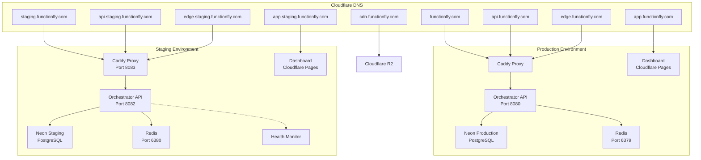
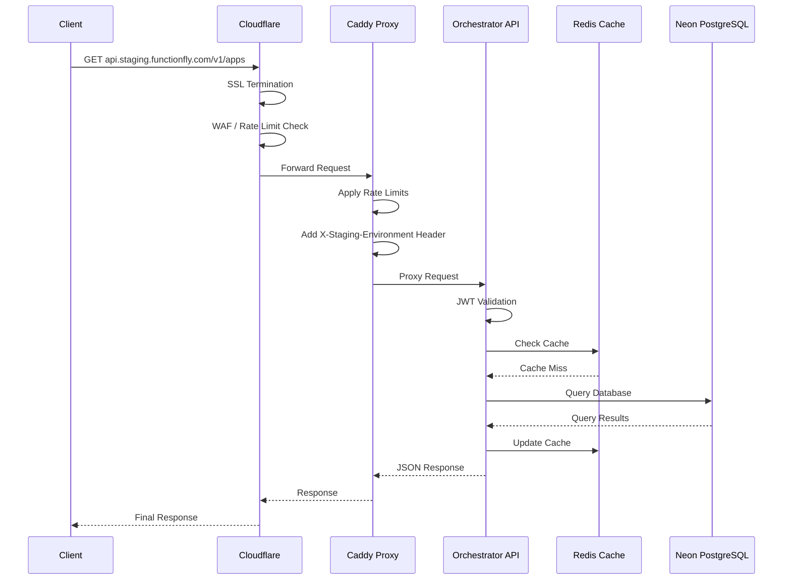
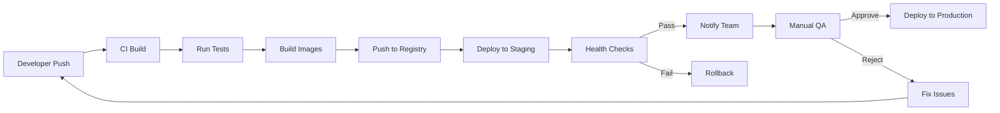

# FunctionFly Staging Deployment Architecture

## Executive Summary

This document outlines the comprehensive domain setup and staging deployment architecture for FunctionFly, a serverless function platform. It covers DNS configuration, Caddy reverse proxy routing, environment variable mapping, deployment sequences, and identifies gaps in the current infrastructure.

---

## Table of Contents

1. [Domain Strategy Overview](#1-domain-strategy-overview)
2. [DNS Configuration Requirements](#2-dns-configuration-requirements)
3. [Staging Subdomain Architecture](#3-staging-subdomain-architecture)
4. [Caddy Configuration for Staging](#4-caddy-configuration-for-staging)
5. [Environment Variable Mapping](#5-environment-variable-mapping)
6. [Deployment Sequence](#6-deployment-sequence)
7. [Infrastructure Gaps and Recommendations](#7-infrastructure-gaps-and-recommendations)
8. [Security Considerations](#8-security-considerations)
9. [Appendix: Mermaid Diagrams](#9-appendix-mermaid-diagrams)

---

## 1. Domain Strategy Overview

### Primary Domain Structure

| Domain | Purpose | Environment |
|--------|---------|-------------|
| `functionfly.com` | Main marketing website / landing page | Production |
| `app.functionfly.com` | Dashboard application (React SPA) | Production |
| `api.functionfly.com` | Main API endpoint for all services | Production |
| `edge.functionfly.com` | Edge function execution endpoints | Production |
| `cdn.functionfly.com` | Static asset delivery (R2/CloudFront) | Production |
| `staging.functionfly.com` | Staging environment entry point | Staging |

### Staging Domain Mapping

| Production Domain | Staging Equivalent | Notes |
|-------------------|-------------------|-------|
| `functionfly.com` | `staging.functionfly.com` | Staging landing page |
| `app.functionfly.com` | `app.staging.functionfly.com` | Staging dashboard |
| `api.functionfly.com` | `api.staging.functionfly.com` | Staging API |
| `edge.functionfly.com` | `edge.staging.functionfly.com` | Staging edge functions |
| `cdn.functionfly.com` | `cdn.staging.functionfly.com` | Staging static assets |

---

## 2. DNS Configuration Requirements

### 2.1 Cloudflare DNS Records Configuration

```json
{
  "zone": "functionfly.com",
  "description": "Complete DNS configuration for FunctionFly staging and production",
  "records": [
    {
      "type": "A",
      "name": "@",
      "content": "functionfly-control.iad.fly.dev",
      "proxied": true,
      "ttl": 300,
      "comment": "Root domain - Production main entry"
    },
    {
      "type": "CNAME",
      "name": "www",
      "content": "functionfly.com",
      "proxied": true,
      "ttl": 300,
      "comment": "WWW redirect to root"
    },
    {
      "type": "CNAME",
      "name": "app",
      "content": "functionfly-dashboard.pages.dev",
      "proxied": true,
      "ttl": 300,
      "comment": "Production Dashboard - Cloudflare Pages"
    },
    {
      "type": "CNAME",
      "name": "api",
      "content": "functionfly-control.iad.fly.dev",
      "proxied": true,
      "ttl": 60,
      "comment": "Production API - GeoDNS enabled"
    },
    {
      "type": "CNAME",
      "name": "edge",
      "content": "functionfly-edge.iad.fly.dev",
      "proxied": true,
      "ttl": 60,
      "comment": "Production Edge Functions"
    },
    {
      "type": "CNAME",
      "name": "cdn",
      "content": "functionfly-cdn.r2.cloudflarestorage.com",
      "proxied": true,
      "ttl": 300,
      "comment": "Production CDN - Cloudflare R2"
    },
    {
      "type": "CNAME",
      "name": "staging",
      "content": "functionfly-staging.iad.fly.dev",
      "proxied": true,
      "ttl": 300,
      "comment": "Staging Environment - Main Entry"
    },
    {
      "type": "CNAME",
      "name": "app.staging",
      "content": "functionfly-staging-dashboard.pages.dev",
      "proxied": true,
      "ttl": 300,
      "comment": "Staging Dashboard - Cloudflare Pages"
    },
    {
      "type": "CNAME",
      "name": "api.staging",
      "content": "functionfly-staging.iad.fly.dev",
      "proxied": true,
      "ttl": 60,
      "comment": "Staging API - No GeoDNS, single region"
    },
    {
      "type": "CNAME",
      "name": "edge.staging",
      "content": "functionfly-staging-edge.iad.fly.dev",
      "proxied": true,
      "ttl": 300,
      "comment": "Staging Edge Functions"
    },
    {
      "type": "CNAME",
      "name": "cdn.staging",
      "content": "functionfly-staging-cdn.r2.cloudflarestorage.com",
      "proxied": true,
      "ttl": 300,
      "comment": "Staging CDN - Separate R2 bucket"
    },
    {
      "type": "TXT",
      "name": "_dmarc",
      "content": "v=DMARC1; p=quarantine; rua=mailto:dmarc@functionfly.com",
      "ttl": 3600,
      "comment": "DMARC policy for email security"
    },
    {
      "type": "MX",
      "name": "@",
      "content": "10 mail.functionfly.com",
      "ttl": 3600,
      "comment": "Mail server"
    }
  ]
}
```

### 2.2 Required DNS Records Summary Table

| Record Type | Name | Target/Content | Priority | TTL | Environment |
|-------------|------|----------------|----------|-----|-------------|
| A | @ | Fly.io Production IP | - | 300 | Production |
| CNAME | www | functionfly.com | - | 300 | Production |
| CNAME | app | functionfly-dashboard.pages.dev | - | 300 | Production |
| CNAME | api | functionfly-control.iad.fly.dev | - | 60 | Production |
| CNAME | edge | functionfly-edge.iad.fly.dev | - | 60 | Production |
| CNAME | cdn | functionfly-cdn.r2.cloudflarestorage.com | - | 300 | Production |
| CNAME | staging | functionfly-staging.iad.fly.dev | - | 300 | Staging |
| CNAME | app.staging | functionfly-staging-dashboard.pages.dev | - | 300 | Staging |
| CNAME | api.staging | functionfly-staging.iad.fly.dev | - | 60 | Staging |
| CNAME | edge.staging | functionfly-staging-edge.iad.fly.dev | - | 300 | Staging |
| CNAME | cdn.staging | functionfly-staging-cdn.r2.cloudflarestorage.com | - | 300 | Staging |

### 2.3 SSL/TLS Configuration

All domains should use Cloudflare's **Full (strict)** SSL/TLS encryption mode with:

- **Always Use HTTPS**: Enabled
- **Automatic HTTPS Rewrites**: Enabled
- **HTTP Strict Transport Security (HSTS)**:
  - Max Age: 12 months
  - Include subdomains: Yes
  - Preload: Yes

---

## 3. Staging Subdomain Architecture

### 3.1 Service Mapping

```
┌─────────────────────────────────────────────────────────────────────────────┐
│                        Staging Environment Architecture                       │
└─────────────────────────────────────────────────────────────────────────────┘

    ┌──────────────────┐
    │  Cloudflare DNS  │
    │  (Proxy Enabled) │
    └────────┬─────────┘
             │
    ┌────────┴────────────────────────────────────────────────────────────┐
    │                                                                     │
    ▼                                                                     ▼
┌───────────────┐     ┌───────────────┐     ┌───────────────┐     ┌───────────────┐
│   staging.    │     │  app.staging. │     │  api.staging. │     │ edge.staging. │
│ functionfly.  │     │ functionfly.  │     │ functionfly.  │     │ functionfly.  │
│     com       │     │     com       │     │     com       │     │     com       │
└───────┬───────┘     └───────┬───────┘     └───────┬───────┘     └───────┬───────┘
        │                     │                     │                     │
        ▼                     ▼                     ▼                     ▼
┌───────────────┐     ┌───────────────┐     ┌───────────────┐     ┌───────────────┐
│  Caddy Proxy  │     │ Cloudflare    │     │   Caddy API   │     │ Edge Target   │
│   (Static)    │     │    Pages      │     │    Router     │     │   Proxy       │
└───────────────┘     └───────────────┘     └───────┬───────┘     └───────┬───────┘
                                                    │                     │
                                                    ▼                     ▼
                                            ┌───────────────┐     ┌───────────────┐
                                            │  Orchestrator │     │ Edge Function │
                                            │   API (Go)    │     │   Targets     │
                                            │   Port 8082   │     │               │
                                            └───────┬───────┘     └───────────────┘
                                                    │
                            ┌───────────────────────┼───────────────────────┐
                            ▼                       ▼                       ▼
                    ┌───────────────┐      ┌───────────────┐      ┌───────────────┐
                    │  Neon Postgres│      │ Redis (Local) │      │ Health Monitor│
                    │  Staging DB   │      │   Port 6380   │      │   Service     │
                    └───────────────┘      └───────────────┘      └───────────────┘
```

### 3.2 Port Allocation

| Service | Production Port | Staging Port | Notes |
|---------|-----------------|--------------|-------|
| Orchestrator API | 8080 | 8082 | Different port to avoid conflicts |
| Caddy HTTP | 80 | 8083 | Local staging proxy |
| Caddy HTTPS | 443 | 8444 | SSL staging port |
| Redis | 6379 | 6380 | Separate DB instance |
| Dashboard Dev | 3000 | 3001 | Vite dev server |

---

## 4. Caddy Configuration for Staging

### 4.1 Updated Staging Caddyfile

```caddy
# FunctionFly Staging Caddy Configuration
# Complete subdomain routing for staging environment

# Global settings
{
    # Enable automatic HTTPS for staging subdomain
    auto_https off
    
    # Log to stdout for Docker
    log {
        output stdout
        format json
    }
    
    # Email for Let's Encrypt (if enabling HTTPS)
    email ops@functionfly.com
}

# ============================================
# Staging Main Domain - staging.functionfly.com
# ============================================
staging.functionfly.com {
    # Rate limiting for the entire domain
    rate_limit {
        zone staging_static {
            key {remote_host}
            window 1m
            events 200
        }
    }
    
    # Security headers
    header {
        X-Frame-Options "DENY"
        X-Content-Type-Options "nosniff"
        X-XSS-Protection "1; mode=block"
        Referrer-Policy "strict-origin-when-cross-origin"
    }
    
    # Health check endpoint (public)
    /health {
        respond "Staging OK" 200
    }
    
    # API routes - proxy to staging orchestrator
    /v1/* {
        # Rate limiting for API calls
        rate_limit {
            zone staging_api {
                key {remote_host}
                window 1m
                events 300
            }
        }
        
        reverse_proxy orchestrator-api:8080 {
            header_up X-Forwarded-Host {host}
            header_up X-Forwarded-Proto {scheme}
            header_up X-Real-IP {remote_host}
            header_up X-Staging-Environment "true"
            
            # Health check settings
            health_uri /health
            health_interval 30s
            health_timeout 10s
        }
    }
    
    # Public routing endpoint: /{appSlug}/*
    handle /{appSlug}/* {
        # Rate limiting per app
        rate_limit {
            zone staging_per_app {
                key {path.0}
                window 1m
                events 2000
            }
        }
        
        reverse_proxy orchestrator-api:8080 {
            header_up X-Forwarded-Host {host}
            header_up X-Forwarded-Proto {scheme}
            header_up X-Real-IP {remote_host}
            header_up X-Staging-Environment "true"
            header_up X-App-Slug {path.0}
        }
    }
    
    # @username profile routes - /@/{username}
    /@/* {
        reverse_proxy orchestrator-api:8080 {
            header_up X-Forwarded-Host {host}
            header_up X-Forwarded-Proto {scheme}
            header_up X-Real-IP {remote_host}
            header_up X-Staging-Environment "true"
        }
    }
    
    # @username function routes - /@/{username}/v1/fx/{functionName}
    /@/*/v1/fx/* {
        reverse_proxy orchestrator-api:8080 {
            header_up X-Forwarded-Host {host}
            header_up X-Forwarded-Proto {scheme}
            header_up X-Real-IP {remote_host}
            header_up X-Staging-Environment "true"
        }
    }
    
    # Playground routes (public) - /run/{appSlug}/{functionName}
    /run/* {
        rate_limit {
            zone staging_playground {
                key {remote_host}
                window 1m
                events 100
            }
        }
        
        reverse_proxy orchestrator-api:8080 {
            header_up X-Forwarded-Host {host}
            header_up X-Forwarded-Proto {scheme}
            header_up X-Real-IP {remote_host}
            header_up X-Staging-Environment "true"
        }
    }
    
    # Function page routes (public) - /fx/{author}/{name}
    /fx/* {
        rate_limit {
            zone staging_function_page {
                key {remote_host}
                window 1m
                events 200
            }
        }
        
        reverse_proxy orchestrator-api:8080 {
            header_up X-Forwarded-Host {host}
            header_up X-Forwarded-Proto {scheme}
            header_up X-Real-IP {remote_host}
            header_up X-Staging-Environment "true"
        }
    }
    
    # Replay routes (public) - /replay/{executionId}
    /replay/* {
        rate_limit {
            zone staging_replay {
                key {remote_host}
                window 1m
                events 200
            }
        }
        
        reverse_proxy orchestrator-api:8080 {
            header_up X-Forwarded-Host {host}
            header_up X-Forwarded-Proto {scheme}
            header_up X-Real-IP {remote_host}
            header_up X-Staging-Environment "true"
        }
    }
    
    # Default response for unmatched routes
    respond "FunctionFly Staging - Not Found" 404
}

# ============================================
# Staging API Subdomain - api.staging.functionfly.com
# ============================================
api.staging.functionfly.com {
    # Stricter rate limiting for API subdomain
    rate_limit {
        zone staging_api_subdomain {
            key {remote_host}
            window 1m
            events 500
        }
    }
    
    # CORS headers for API
    header {
        Access-Control-Allow-Origin "*"
        Access-Control-Allow-Methods "GET, POST, PUT, PATCH, DELETE, OPTIONS"
        Access-Control-Allow-Headers "Accept, Content-Type, Content-Length, Accept-Encoding, X-CSRF-Token, Authorization, X-FFLY-Timestamp, X-FFLY-Signature, x-neon-client-info"
        Access-Control-Allow-Credentials "true"
    }
    
    # Health check endpoint
    /healthz {
        respond "OK" 200
    }
    
    # Metrics endpoint (internal access only)
    /metrics {
        reverse_proxy orchestrator-api:8080 {
            header_up X-Forwarded-Host {host}
            header_up X-Forwarded-Proto {scheme}
            header_up X-Real-IP {remote_host}
        }
    }
    
    # All API routes
    reverse_proxy orchestrator-api:8080 {
        header_up X-Forwarded-Host {host}
        header_up X-Forwarded-Proto {scheme}
        header_up X-Real-IP {remote_host}
        header_up X-Staging-Environment "true"
    }
}

# ============================================
# Staging Edge Subdomain - edge.staging.functionfly.com
# ============================================
edge.staging.functionfly.com {
    # Cache responses for edge functions
    @cacheable {
        path /@*/*
    }
    
    cache @cacheable {
        header_regexp Cache-Control "public"
        default_max_age 60
    }
    
    # High rate limits for edge execution
    rate_limit {
        zone staging_edge {
            key {remote_host}
            window 1m
            events 10000
        }
    }
    
    reverse_proxy orchestrator-api:8080 {
        header_up X-Forwarded-Host {host}
        header_up X-Forwarded-Proto {scheme}
        header_up X-Real-IP {remote_host}
        header_up X-Staging-Environment "true"
        header_up X-Edge-Request "true"
    }
}

# ============================================
# Local Development Binding (Docker)
# ============================================
:8083 {
    # Rate limiting (less restrictive for local dev)
    rate_limit {
        zone local_staging {
            key {remote_host}
            window 1m
            events 1000
        }
    }
    
    # Health check endpoint
    /health {
        respond "Local Staging OK" 200
    }
    
    # API routes
    /v1/* {
        reverse_proxy orchestrator-api:8080 {
            header_up X-Forwarded-Host {host}
            header_up X-Forwarded-Proto {scheme}
            header_up X-Real-IP {remote_host}
            header_up X-Staging-Environment "true"
        }
    }
    
    # Public routing
    handle /{appSlug}/* {
        reverse_proxy orchestrator-api:8080 {
            header_up X-Forwarded-Host {host}
            header_up X-Forwarded-Proto {scheme}
            header_up X-Real-IP {remote_host}
            header_up X-Staging-Environment "true"
            header_up X-App-Slug {path.0}
        }
    }
    
    respond "FunctionFly Local Staging - Not Found" 404
}
```

### 4.2 Caddy Configuration Differences: Production vs Staging

| Feature | Production | Staging |
|---------|------------|---------|
| Rate Limits | 100 req/min | 200 req/min |
| SSL | Full HTTPS | Off (local) / Full HTTPS (deployed) |
| GeoDNS | Enabled | Disabled (single region) |
| Cache TTL | 5 min | 1 min |
| Debug Logging | Error only | Full JSON |
| Bot Detection | Active | Testing mode |

---

## 5. Environment Variable Mapping

### 5.1 Required Environment Variables for Staging

```bash
# ============================================================================
# CORE ENVIRONMENT CONFIGURATION
# ============================================================================
NODE_ENV=staging
ENVIRONMENT=staging
PORT=8082

# ============================================================================
# DATABASE CONFIGURATION (Neon Staging Branch)
# ============================================================================
DB_HOST=ep-lucky-bird-aie8580h.c-4.us-east-1.aws.neon.tech
DB_PORT=5432
DB_USER=functionfly_owner
DB_PASSWORD=<secure-password>
DB_NAME=functionfly
DB_SSLMODE=require

# Database Encryption
DB_ENCRYPTION_ENABLED=true
DB_MASTER_KEY_PASSWORD=<staging-master-key>

# ============================================================================
# REDIS CONFIGURATION
# ============================================================================
REDIS_ADDR=localhost:6380
REDIS_PASSWORD=
REDIS_DB=1  # Different DB than production
ARTIFACT_TTL=24h

# ============================================================================
# SECURITY CONFIGURATION
# ============================================================================
# JWT and API Secrets (staging-specific, different from production)
JWT_SECRET=<staging-jwt-secret-min-32-chars>
API_SHARED_SECRET=<staging-shared-secret-min-32-chars>

# Rate Limiting (more permissive for staging)
RATE_LIMIT_REQUESTS=200
RATE_LIMIT_WINDOW_SECONDS=60

# CORS Configuration
CORS_ALLOWED_ORIGINS=https://staging.functionfly.com,https://app.staging.functionfly.com,https://admin.staging.functionfly.com,http://localhost:3000
CORS_ALLOWED_METHODS=GET,POST,PUT,PATCH,DELETE,OPTIONS
CORS_ALLOWED_HEADERS=Accept,Content-Type,Content-Length,Accept-Encoding,X-CSRF-Token,Authorization,X-FFLY-Timestamp,X-FFLY-Signature,x-neon-client-info

# Content Security Policy
CONTENT_SECURITY_POLICY=default-src 'self'; script-src 'self' 'unsafe-inline'; style-src 'self' 'unsafe-inline'; img-src 'self' data: https:; font-src 'self' https:;
HSTS_MAX_AGE=31536000

# ============================================================================
# ADVANCED SECURITY MIDDLEWARE
# ============================================================================
ADVANCED_SECURITY_SLIDING_WINDOW_LIMIT=200
ADVANCED_SECURITY_SLIDING_WINDOW_MINUTES=1
ADVANCED_SECURITY_TOKEN_BUCKET_RATE=20.0
ADVANCED_SECURITY_TOKEN_BUCKET_BURST=40
ADVANCED_SECURITY_ENABLE_BOT_DETECTION=true
ADVANCED_SECURITY_ENABLE_TRAFFIC_ANALYSIS=true
ADVANCED_SECURITY_SUSPICIOUS_THRESHOLD=15
ADVANCED_SECURITY_BLOCK_MINUTES=30
ADVANCED_SECURITY_CIRCUIT_BREAKER_THRESHOLD=0.7
ADVANCED_SECURITY_CIRCUIT_BREAKER_MINUTES=2
ADVANCED_SECURITY_QUEUE_SIZE=2000
ADVANCED_SECURITY_QUEUE_SECONDS=60
ADVANCED_SECURITY_BLOCKED_COUNTRIES=
ADVANCED_SECURITY_BLOCKED_IPS=
ADVANCED_SECURITY_ALLOWED_IPS=
ADVANCED_SECURITY_ENABLE_SQL_INJECTION_FILTER=true
ADVANCED_SECURITY_ENABLE_XSS_FILTER=true
ADVANCED_SECURITY_ENABLE_PATH_TRAVERSAL_FILTER=true
ADVANCED_SECURITY_METRICS_ENABLED=true

# ============================================================================
# URL CONFIGURATION
# ============================================================================
BASE_URL=https://api.staging.functionfly.com
FRONTEND_URL=https://app.staging.functionfly.com

# ============================================================================
# EMAIL CONFIGURATION (External SMTP for staging)
# ============================================================================
SMTP_HOST=smtp.gmail.com
SMTP_PORT=587
SMTP_USERNAME=<staging-email@functionfly.com>
SMTP_PASSWORD=<app-specific-password>
FROM_EMAIL=noreply@staging.functionfly.com
FROM_NAME=FunctionFly Staging

# ============================================================================
# OAUTH PROVIDER CONFIGURATION (Test/Sandbox Accounts)
# ============================================================================
GOOGLE_CLIENT_ID=<staging-google-client-id>
GOOGLE_CLIENT_SECRET=<staging-google-client-secret>
GITHUB_CLIENT_ID=<staging-github-client-id>
GITHUB_CLIENT_SECRET=<staging-github-client-secret>

# ============================================================================
# ARCHIVE STORAGE (Disabled in staging to reduce costs)
# ============================================================================
ARCHIVE_ENABLED=false
ARCHIVE_RETENTION_DAYS=30
ARCHIVE_CLEANUP_INTERVAL_HOURS=24

# ============================================================================
# LOGGING
# ============================================================================
LOG_LEVEL=debug

# ============================================================================
# DASHBOARD BUILD CONFIGURATION
# ============================================================================
VITE_API_URL=https://api.staging.functionfly.com
VITE_SUPABASE_URL=<staging-supabase-url>
VITE_SUPABASE_ANON_KEY=<staging-supabase-anon-key>

# ============================================================================
# FUNCTION VERIFICATION
# ============================================================================
CLAMAV_URL=http://clamav:3310
YARA_URL=http://yara:8080
VERIFICATION_ENABLED=true
VERIFICATION_TIMEOUT_SECONDS=30
VERIFICATION_MAX_FILE_SIZE_MB=10
VERIFICATION_CACHE_TTL_MINUTES=60

# ============================================================================
# TRUST LEVELS
# ============================================================================
MINIMUM_TRUST_LEVEL=standard
TRUST_LEVEL_STANDARD_ENABLED=true
TRUST_LEVEL_HIGH_ENABLED=true
TRUST_LEVEL_ENTERPRISE_ENABLED=true
```

### 5.2 Environment Variable Comparison Matrix

| Variable | Development | Staging | Production |
|----------|-------------|---------|------------|
| `NODE_ENV` | development | staging | production |
| `PORT` | 8080 | 8082 | 8080 |
| `REDIS_DB` | 0 | 1 | 0 |
| `RATE_LIMIT_REQUESTS` | 100 | 200 | 100 |
| `ARTIFACT_TTL` | 168h | 24h | 168h |
| `ARCHIVE_ENABLED` | false | false | true |
| `LOG_LEVEL` | debug | debug | info |
| `DB_SSLMODE` | disable | require | require |

---

## 6. Deployment Sequence

### 6.1 Pre-Deployment Checklist

- [ ] Verify Neon staging branch is active and accessible
- [ ] Ensure all staging secrets are configured in Infisical or .env.staging
- [ ] Confirm Redis staging instance is running (port 6380)
- [ ] Validate DNS records are propagated (`dig api.staging.functionfly.com`)
- [ ] Check Cloudflare SSL/TLS settings for staging subdomain
- [ ] Verify OAuth app credentials for staging environment

### 6.2 Deployment Order

```
┌─────────────────────────────────────────────────────────────────────────────┐
│                        Staging Deployment Sequence                            │
└─────────────────────────────────────────────────────────────────────────────┘

Phase 1: Infrastructure (5 minutes)
├── Step 1: Deploy Database Migrations
│   └── Command: make staging-migrate
│   └── Verify: SELECT version FROM schema_migrations;
│
├── Step 2: Deploy Redis Container
│   └── Command: docker-compose -f docker-compose.staging.yml up -d redis
│   └── Verify: redis-cli -p 6380 ping
│
└── Step 3: Deploy Caddy Reverse Proxy
    └── Command: docker-compose -f docker-compose.staging.yml up -d caddy
    └── Verify: curl http://localhost:8083/health

Phase 2: Application Services (10 minutes)
├── Step 4: Deploy Orchestrator API
│   └── Command: docker-compose -f docker-compose.staging.yml up -d orchestrator-api
│   └── Verify: curl http://localhost:8082/health
│   └── Verify: curl http://localhost:8082/v1/status
│
└── Step 5: Deploy Health Monitor
    └── Command: docker-compose -f docker-compose.staging.yml up -d health-monitor
    └── Verify: docker logs functionfly-health-monitor-staging

Phase 3: Validation (15 minutes)
├── Step 6: API Health Checks
│   ├── curl https://api.staging.functionfly.com/healthz
│   ├── curl https://api.staging.functionfly.com/v1/apps
│   └── Verify response codes and latency
│
├── Step 7: Dashboard Connectivity
│   ├── Access https://app.staging.functionfly.com
│   ├── Test login flow
│   └── Verify API calls succeed
│
└── Step 8: Edge Function Testing
    ├── Deploy test function to staging
    ├── Invoke via https://edge.staging.functionfly.com
    └── Verify execution and logging

Phase 4: Monitoring Setup (10 minutes)
├── Step 9: Configure Log Aggregation
├── Step 10: Verify Metrics Collection
└── Step 11: Test Alert Channels

Total Estimated Time: 40 minutes
```

### 6.3 Rollback Procedure

```bash
#!/bin/bash
# rollback-staging.sh - Emergency rollback script

# Step 1: Stop all staging services
docker-compose -f docker-compose.staging.yml down

# Step 2: Restore database from last known good backup
# (Requires Neon branch restore or pg_dump restore)

# Step 3: Revert to previous container image
# (Requires image tagging strategy)

# Step 4: Restart services
docker-compose -f docker-compose.staging.yml up -d

# Step 5: Verify rollback
curl -f https://api.staging.functionfly.com/healthz || exit 1
echo "Rollback completed successfully"
```

### 6.4 Deployment Automation Script

```bash
#!/bin/bash
# deploy-staging.sh - Automated staging deployment

set -e

STAGING_COMPOSE="docker-compose.staging.yml"
HEALTH_CHECK_URL="http://localhost:8082/health"
MAX_RETRIES=30
RETRY_DELAY=5

echo "=== FunctionFly Staging Deployment ==="

# Load environment
if [ -f .env.staging ]; then
    export $(grep -v '^#' .env.staging | xargs)
fi

# Pre-deployment checks
echo "[1/5] Running pre-deployment checks..."
docker-compose -f $STAGING_COMPOSE config > /dev/null
redis-cli -p 6380 ping > /dev/null 2>&1 || echo "Warning: Redis not responding"

# Deploy services
echo "[2/5] Deploying infrastructure services..."
docker-compose -f $STAGING_COMPOSE up -d redis caddy

echo "[3/5] Deploying application services..."
docker-compose -f $STAGING_COMPOSE up -d orchestrator-api health-monitor

# Health checks
echo "[4/5] Waiting for services to be healthy..."
for i in $(seq 1 $MAX_RETRIES); do
    if curl -sf $HEALTH_CHECK_URL > /dev/null; then
        echo "Services are healthy!"
        break
    fi
    if [ $i -eq $MAX_RETRIES ]; then
        echo "Health check failed after $MAX_RETRIES attempts"
        exit 1
    fi
    sleep $RETRY_DELAY
done

# Post-deployment validation
echo "[5/5] Running post-deployment validation..."
curl -sf http://localhost:8083/health || exit 1
curl -sf http://localhost:8082/v1/status || exit 1

echo "=== Deployment Complete ==="
echo "Staging URL: https://staging.functionfly.com"
echo "API URL: https://api.staging.functionfly.com"
```

---

## 7. Infrastructure Gaps and Recommendations

### 7.1 Current Gaps

| Gap | Impact | Priority | Recommendation |
|-----|--------|----------|----------------|
| No staging dashboard deployment | Cannot test UI changes | High | Deploy dashboard to `app.staging.functionfly.com` |
| Missing staging CDN bucket | No asset testing | Medium | Create R2 bucket for staging assets |
| No automated staging deployment | Manual deployment errors | High | Implement CI/CD pipeline |
| No staging data seeding | Empty database on fresh deploy | Medium | Create seed scripts for test data |
| Missing staging SSL certificates | HTTPS not available in local | Medium | Use mkcert or Let's Encrypt staging |
| No staging-specific monitoring | Cannot track staging health | High | Deploy Prometheus/Grafana for staging |
| Edge targets not configured for staging | Cannot test edge deployments | Medium | Configure staging edge target URLs |
| No database migration rollback | Risk of bad migrations | Medium | Implement migration down scripts |

### 7.2 Required Infrastructure Additions

#### 7.2.1 Staging Dashboard Deployment

```yaml
# docker-compose.staging.yml additions
  dashboard:
    build:
      context: ./web/dashboard
      dockerfile: Dockerfile
    container_name: functionfly-dashboard-staging
    environment:
      - VITE_API_URL=https://api.staging.functionfly.com
      - VITE_SUPABASE_URL=${VITE_SUPABASE_URL}
      - VITE_SUPABASE_ANON_KEY=${VITE_SUPABASE_ANON_KEY}
    ports:
      - "3001:3000"
    networks:
      - functionfly-staging
    restart: unless-stopped
```

#### 7.2.2 Staging Monitoring Stack

```yaml
# docker-compose.staging.monitoring.yml
version: '3.8'

services:
  prometheus-staging:
    image: prom/prometheus:latest
    container_name: functionfly-prometheus-staging
    volumes:
      - ./deploy/monitoring/prometheus-staging.yml:/etc/prometheus/prometheus.yml
      - prometheus_staging_data:/prometheus
    ports:
      - "9091:9090"
    networks:
      - functionfly-staging

  grafana-staging:
    image: grafana/grafana:latest
    container_name: functionfly-grafana-staging
    environment:
      - GF_SECURITY_ADMIN_PASSWORD=staging-admin
    volumes:
      - grafana_staging_data:/var/lib/grafana
    ports:
      - "3002:3000"
    networks:
      - functionfly-staging

volumes:
  prometheus_staging_data:
  grafana_staging_data:

networks:
  functionfly-staging:
    external: true
```

#### 7.2.3 Staging Data Seeding Script

```bash
#!/bin/bash
# scripts/seed-staging.sh

psql $STAGING_DATABASE_URL << 'EOF'
-- Create test tenant
INSERT INTO tenants (id, name, slug, status, created_at)
VALUES ('test-tenant-001', 'Test Tenant', 'test-tenant', 'active', NOW())
ON CONFLICT DO NOTHING;

-- Create test user
INSERT INTO users (id, tenant_id, email, role, status, created_at)
VALUES ('test-user-001', 'test-tenant-001', 'test@staging.functionfly.com', 'admin', 'active', NOW())
ON CONFLICT DO NOTHING;

-- Create sample functions
INSERT INTO functions (id, tenant_id, name, slug, runtime, status, created_at)
VALUES 
  ('func-001', 'test-tenant-001', 'Hello World', 'hello-world', 'python', 'active', NOW()),
  ('func-002', 'test-tenant-001', 'Echo', 'echo', 'javascript', 'active', NOW())
ON CONFLICT DO NOTHING;
EOF
```

### 7.3 Cost Optimization Recommendations

| Service | Current Cost | Optimized Cost | Strategy |
|---------|--------------|----------------|----------|
| Neon Database | $19/month (dedicated) | $0 (branch) | Use Neon branching (already implemented) |
| Redis | Self-hosted | Self-hosted | Continue with Docker Redis |
| Edge Targets | 4 providers | 1-2 providers | Limit staging to Cloudflare + Fly.io |
| Monitoring | None | $0 | Deploy open-source stack |
| Storage | R2 Production | Separate staging bucket | Use separate bucket with lifecycle rules |

---

## 8. Security Considerations

### 8.1 Staging Security Checklist

- [ ] **Network Isolation**: Staging runs on separate Docker network
- [ ] **Different Secrets**: JWT, API keys, OAuth credentials unique to staging
- [ ] **No Production Data**: Database contains only test/synthetic data
- [ ] **Access Control**: Staging behind VPN or IP whitelist (recommended)
- [ ] **CORS Restrictions**: Allow only staging domains and localhost
- [ ] **Rate Limiting**: Configured but more permissive for testing
- [ ] **Bot Detection**: Enabled for testing effectiveness
- [ ] **Audit Logging**: All actions logged for security review
- [ ] **SSL/TLS**: Full encryption in deployed staging
- [ ] **Secret Rotation**: Regular rotation of staging credentials

### 8.2 Staging vs Production Security Differences

| Security Feature | Production | Staging |
|------------------|------------|---------|
| Database Encryption | Enabled | Enabled (same keys) |
| Bot Detection | Active | Testing mode |
| Rate Limits | Strict | Relaxed |
| Archive Storage | Enabled | Disabled |
| Email Provider | Production SMTP | Gmail/Sandbox |
| OAuth Apps | Production apps | Sandbox/test apps |
| API Shared Secret | High entropy | Medium entropy |
| CORS Origins | Strict | Includes localhost |

### 8.3 Recommended IP Whitelist for Staging

If implementing IP-based access control:

```nginx
# Caddy configuration snippet for IP whitelist
staging.functionfly.com {
    @not_whitelisted {
        not remote_ip 10.0.0.0/8 172.16.0.0/12 192.168.0.0/16
        not remote_ip 127.0.0.1
        # Add office IP ranges here
    }
    respond @not_whitelisted "Access Denied" 403
    
    # ... rest of configuration
}
```

---

## 9. Appendix: Mermaid Diagrams

### 9.1 Complete Infrastructure Architecture



### 9.2 Request Flow Through Staging



### 9.3 Deployment Flow



---

## Document Information

| Field | Value |
|-------|-------|
| Document Version | 1.0.0 |
| Last Updated | 2026-03-04 |
| Author | FunctionFly Architecture Team |
| Review Status | Draft |
| Related Documents | STAGING_README.md, docs/STAGING.md, docker-compose.staging.yml |

---

## Change Log

| Version | Date | Changes |
|---------|------|---------|
| 1.0.0 | 2026-03-04 | Initial comprehensive architecture document |
