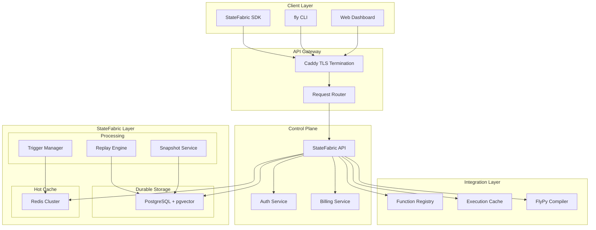
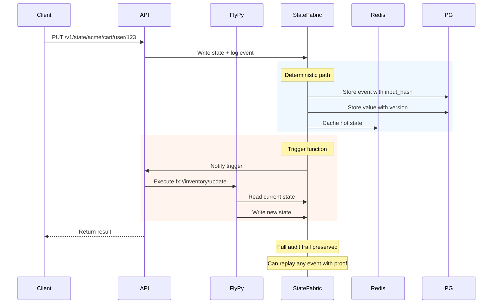

# StateFabric Architecture

> Composable Durable State for Stateless Functions

## Executive Summary

StateFabric transforms FunctionFly from a compute platform into a **compute + durable memory fabric**. By binding globally addressable, deterministic state to `fx://` function identities, we create sticky infrastructure that generates storage-based MRR while enabling entirely new categories of applications.

### Strategic Impact

| Current | With StateFabric |
|---------|------------------|
| Compute marketplace | Compute + State network |
| Usage-based revenue only | Usage + Storage MRR |
| Customer churn risk | State lock-in |
| Stateless functions | Composable memory |

---

## System Architecture

### High-Level Topology



### Technology Stack

| Layer | Technology | Purpose |
|-------|------------|---------|
| Core Storage | PostgreSQL | Source of truth, event log, snapshots, billing |
| Vector Storage | pgvector | Agent memory embeddings, semantic search |
| Hot Cache | Redis | Real-time state, pub/sub triggers, replay acceleration |
| Execution | FlyPy Wasm | Deterministic state transitions |

---

## URI Scheme & Addressing

### State Address Format

```
state://{tenant}/{state_name}[/{key}]
memory://{tenant}/{agent_id}[/memory_type]
```

| Component | Description | Example |
|-----------|-------------|---------|
| `tenant` | Organization/namespace | `acme`, `myapp` |
| `state_name` | Named state container | `cart`, `inventory`, `session` |
| `key` | Optional specific key | `user/123`, `product/456` |
| `agent_id` | AI agent identifier | `agent-001`, `workflow-xyz` |
| `memory_type` | Type of memory | `working`, `longterm`, `context` |

### Examples

```
# Cart state for acme org
state://acme/cart

# Specific user's cart
state://acme/cart/user/123

# AI agent working memory
memory://acme/agent-001/working

# AI agent long-term memory  
memory://acme/agent-001/longterm

# Cross-function shared state
state://acme/shared/session/abc
```

---

## Data Models

### Core State Entity

```go
// State represents a durable state container bound to a function identity
type State struct {
    ID            uuid.UUID       `json:"id" gorm:"type:uuid;primaryKey"`
    TenantID      uuid.UUID       `json:"tenant_id" gorm:"type:uuid;not null;index"`
    Name          string          `json:"name" gorm:"not null;index"`
    
    // Addressing
    FullPath      string          `json:"full_path" gorm:"uniqueIndex"` // "acme/cart"
    FunctionID    *uuid.UUID      `json:"function_id" gorm:"type:uuid"` // Optional bound function
    
    // State Configuration
    StorageType   string          `json:"storage_type" gorm:"default:'keyvalue'"`
                  // "keyvalue" | "document" | "timeseries" | "graph"
    
    // Retention
    TTLDays       int             `json:"ttl_days" gorm:"default:0"` // 0 = forever
    MaxSizeMB     int             `json:"max_size_mb" gorm:"default:100"`
    
    // Versioning
    CurrentVersion int            `json:"current_version" gorm:"default:1"`
    IsVersioned    bool           `json:"is_versioned" gorm:"default:true"`
    
    // Permissions
    IsPublic       bool           `json:"is_public" gorm:"default:false"`
    AllowCrossTenant bool         `json:"allow_cross_tenant" gorm:"default:false"`
    
    // Metadata
    Description    sql.NullString `json:"description"`
    Tags           json.RawMessage `json:"tags" gorm:"type:jsonb"`
    
    // Billing
    StorageUsedMB  int64           `json:"storage_used_mb" gorm:"default:0"`
    WriteOpsMonth int64           `json:"write_ops_month" gorm:"default:0"`
    ReadOpsMonth  int64           `json:"read_ops_month" gorm:"default:0"`
    
    // Timestamps
    CreatedAt      time.Time      `json:"created_at" gorm:"autoCreateTime"`
    UpdatedAt       time.Time      `json:"updated_at" gorm:"autoUpdateTime"`
    LastAccessedAt time.Time      `json:"last_accessed_at"`
}
```

### State Value (Key-Value Entry)

```go
// StateValue represents a single key-value entry in state
type StateValue struct {
    ID            uuid.UUID       `json:"id" gorm:"type:uuid;primaryKey"`
    StateID       uuid.UUID       `json:"state_id" gorm:"type:uuid;not null;index"`
    
    // Key (supports hierarchical keys like "user/123/profile")
    Key           string          `json:"key" gorm:"not null;index"`
    
    // Value (JSON for flexibility)
    Value         json.RawMessage `json:"value" gorm:"type:jsonb;not null"`
    
    // Versioning
    Version       int             `json:"version" gorm:"not null"`
    PreviousValue *json.RawMessage `json:"previous_value" gorm:"type:jsonb"`
    
    // Content Addressing (for deduplication)
    ContentHash   string          `json:"content_hash" gorm:"index"`
    
    // TTL
    ExpiresAt     *time.Time      `json:"expires_at" gorm:"index"`
    
    // Metadata
    CreatedBy     string          `json:"created_by"` // function_id or user_id
    CreatedAt     time.Time       `json:"created_at" gorm:"autoCreateTime"`
}
```

### Event Log (Immutable History)

```go
// StateEvent represents an immutable event in state history
type StateEvent struct {
    ID              uuid.UUID       `json:"id" gorm:"type:uuid;primaryKey"`
    StateID         uuid.UUID       `json:"state_id" gorm:"type:uuid;not null;index"`
    
    // Event Types: "set" | "delete" | "snapshot" | "restore" | "merge"
    EventType       string          `json:"event_type" gorm:"not null;index"`
    
    // Key affected (null for state-level events)
    Key             sql.NullString  `json:"key" gorm:"index"`
    
    // Event Data
    PreviousValue   json.RawMessage `json:"previous_value" gorm:"type:jsonb"`
    NewValue        json.RawMessage `json:"new_value" gorm:"type:jsonb"`
    
    // Causality
    CausationID     *uuid.UUID      `json:"causation_id"` // Link to triggering event
    CorrelationID   string          `json:"correlation_id"` // For distributed tracing
    
    // Source
    SourceType      string          `json:"source_type"` // "function" | "user" | "system" | "trigger"
    SourceID        string          `json:"source_id"`   // function_id or user_id
    
    // Determinism Proof (for replay verification)
    InputHash       string          `json:"input_hash"`
    OutputHash      string          `json:"output_hash"`
    Deterministic   bool            `json:"deterministic" gorm:"default:false"`
    
    // Sequence (for ordering)
    SequenceNum     int64           `json:"sequence_num"` // Monotonic per state
    
    Timestamp       time.Time       `json:"timestamp" gorm:"autoCreateTime;index"`
}
```

### State Snapshot (Versioned State)

```go
// StateSnapshot represents a point-in-time snapshot of state
type StateSnapshot struct {
    ID              uuid.UUID       `json:"id" gorm:"type:uuid;primaryKey"`
    StateID         uuid.UUID       `json:"state_id" gorm:"type:uuid;not null;index"`
    
    // Snapshot Identification
    SnapshotVersion int             `json:"snapshot_version" gorm:"not null"`
    Label           sql.NullString  `json:"label"` // Optional human-readable label
    
    // Content
    StateData       json.RawMessage `json:"state_data" gorm:"type:jsonb;not null"`
    StateSizeBytes  int64           `json:"state_size_bytes"`
    
    // Coverage
    KeyCount        int             `json:"key_count"`
    FirstSequence   int64           `json:"first_sequence"`
    LastSequence    int64           `json:"last_sequence"`
    
    // Determinism
    RootEventID     uuid.UUID       `json:"root_event_id"` // First event in snapshot
    
    // Compression
    IsCompressed    bool            `json:"is_compressed" gorm:"default:false"`
    CompressionAlgo string          `json:"compression_algo"` // "lz4", "zstd", ""
    
    CreatedAt       time.Time       `json:"created_at" gorm:"autoCreateTime"`
}
```

### Agent Memory (AI Memory Layer)

```go
// AgentMemory represents AI agent memory with embeddings
type AgentMemory struct {
    ID              uuid.UUID       `json:"id" gorm:"type:uuid;primaryKey"`
    TenantID        uuid.UUID       `json:"tenant_id" gorm:"type:uuid;not null;index"`
    AgentID         string          `json:"agent_id" gorm:"not null;index"`
    
    // Memory Type: "working" | "longterm" | "context" | "episodic"
    MemoryType      string          `json:"memory_type" gorm:"not null;index"`
    
    // Content
    Content         string          `json:"content" gorm:"type:text"` // Raw text
    StructuredData  json.RawMessage `json:"structured_data" gorm:"type:jsonb"`
    
    // Embedding (pgvector)
    Embedding       []float32       `json:"embedding" gorm:"type:vector(1536)"` // OpenAI ada-002 default
    
    // Metadata
    ImportanceScore float32         `json:"importance_score"` // 0.0-1.0 for retention
    AccessCount     int             `json:"access_count" gorm:"default:0"`
    LastAccessedAt  time.Time       `json:"last_accessed_at"`
    
    // Retention
    TTLDays         int             `json:"ttl_days"` // 0 = forever
    ExpiresAt       *time.Time      `json:"expires_at" gorm:"index"`
    
    // Causality
    SourceEventID   *uuid.UUID      `json:"source_event_id"`
    
    CreatedAt       time.Time       `json:"created_at" gorm:"autoCreateTime"`
    UpdatedAt       time.Time       `json:"updated_at" gorm:"autoUpdateTime"`
}

// AgentMemoryIndex for vector similarity search
type AgentMemoryIndex struct {
    ID              uuid.UUID       `json:"id" gorm:"type:uuid;primaryKey"`
    TenantID        uuid.UUID       `json:"tenant_id" gorm:"type:uuid;not null;index"`
    AgentID         string          `json:"agent_id" gorm:"not null;index"`
    
    // Index Configuration
    MemoryType      string          `json:"memory_type"`
    Dimension       int             `json:"dimension" gorm:"default:1536"`
    SimilarityMetric string         `json:"similarity_metric" gorm:"default:'cosine'"`
    
    // Index Stats
    MemoryCount     int             `json:"memory_count" gorm:"default:0"`
    LastIndexedAt   time.Time       `json:"last_indexed_at"`
    
    CreatedAt       time.Time       `json:"created_at" gorm:"autoCreateTime"`
}
```

### State Permissions

```go
// StatePermission defines access control for state
type StatePermission struct {
    ID              uuid.UUID       `json:"id" gorm:"type:uuid;primaryKey"`
    StateID         uuid.UUID       `json:"state_id" gorm:"type:uuid;not null;index"`
    
    // Principal
    PrincipalType   string          `json:"principal_type"` // "user" | "team" | "function" | "tenant"
    PrincipalID     uuid.UUID       `json:"principal_id" gorm:"type:uuid"`
    
    // Permissions
    CanRead         bool            `json:"can_read" gorm:"default:false"`
    CanWrite        bool            `json:"can_write" gorm:"default:false"`
    CanDelete       bool            `json:"can_delete" gorm:"default:false"`
    CanAdmin        bool            `json:"can_admin" gorm:"default:false"`
    CanTrigger      bool            `json:"can_trigger" gorm:"default:false"` // For function triggers
    
    // Constraints
    IPWhitelist     json.RawMessage `json:"ip_whitelist" gorm:"type:jsonb"`
    TimeRestrictions json.RawMessage `json:"time_restrictions" gorm:"type:jsonb"`
    RateLimit       int             `json:"rate_limit"` // Requests per minute
    
    CreatedAt       time.Time       `json:"created_at" gorm:"autoCreateTime"`
    UpdatedAt       time.Time       `json:"updated_at" gorm:"autoUpdateTime"`
}
```

### Function Triggers (Cross-Function Events)

```go
// StateTrigger defines automatic function invocation on state changes
type StateTrigger struct {
    ID              uuid.UUID       `json:"id" gorm:"type:uuid;primaryKey"`
    TenantID        uuid.UUID       `json:"tenant_id" gorm:"type:uuid;not null;index"`
    
    // Source
    SourceStateID   uuid.UUID       `json:"source_state_id" gorm:"type:uuid"`
    
    // Trigger Configuration
    TriggerType     string          `json:"trigger_type" gorm:"not null"`
                  // "on_write" | "on_read" | "on_delete" | "on_condition"
    KeyPattern      sql.NullString  `json:"key_pattern"` // Glob pattern for keys
    
    // Condition (for advanced triggers)
    Condition       json.RawMessage `json:"condition" gorm:"type:jsonb"`
    
    // Target Function
    TargetFunctionID uuid.UUID      `json:"target_function_id" gorm:"type:uuid"`
    TargetFunction  string          `json:"target_function"` // "org/function:version"
    
    // Payload
    IncludePrevious bool             `json:"include_previous"`
    IncludeNew      bool             `json:"include_new"`
    
    // Rate Limiting
    MaxInvocationsPerMinute int     `json:"max_invocations_per_minute" gorm:"default:60"`
    
    // Status
    IsActive        bool             `json:"is_active" gorm:"default:true"`
    LastTriggeredAt time.Time       `json:"last_triggered_at"`
    
    CreatedAt       time.Time       `json:"created_at" gorm:"autoCreateTime"`
    UpdatedAt       time.Time       `json:"updated_at" gorm:"autoUpdateTime"`
}
```

---

## API Endpoints

### State Management

| Method | Endpoint | Description |
|--------|----------|-------------|
| `GET` | `/v1/state/{path}` | Read state value |
| `PUT` | `/v1/state/{path}` | Set state value |
| `PATCH` | `/v1/state/{path}` | Patch state value (merge) |
| `DELETE` | `/v1/state/{path}` | Delete state value |
| `POST` | `/v1/state/{path}/transaction` | Atomic multi-key transaction |
| `GET` | `/v1/state/{path}/history` | Get event history |
| `POST` | `/v1/state/{path}/snapshot` | Create snapshot |
| `POST` | `/v1/state/{path}/restore` | Restore from snapshot |

### Agent Memory

| Method | Endpoint | Description |
|--------|----------|-------------|
| `POST` | `/v1/memory/{agent_id}` | Store memory |
| `GET` | `/v1/memory/{agent_id}` | Get all memory for agent |
| `GET` | `/v1/memory/{agent_id}/search` | Semantic search |
| `DELETE` | `/v1/memory/{agent_id}/{memory_id}` | Delete memory |
| `POST` | `/v1/memory/{agent_id}/consolidate` | Consolidate memories |

### Snapshots & Replay

| Method | Endpoint | Description |
|--------|----------|-------------|
| `GET` | `/v1/state/{path}/snapshots` | List snapshots |
| `GET` | `/v1/state/{path}/snapshots/{version}` | Get snapshot |
| `POST` | `/v1/state/{path}/replay` | Replay to specific point |
| `GET` | `/v1/state/{path}/time-travel` | Query state at timestamp |

### Triggers

| Method | Endpoint | Description |
|--------|----------|-------------|
| `POST` | `/v1/triggers` | Create trigger |
| `GET` | `/v1/triggers` | List triggers |
| `PUT` | `/v1/triggers/{id}` | Update trigger |
| `DELETE` | `/v1/triggers/{id}` | Delete trigger |

### Billing & Analytics

| Method | Endpoint | Description |
|--------|----------|-------------|
| `GET` | `/v1/state/{path}/usage` | Get storage/ops usage |
| `GET` | `/v1/usage/state` | Aggregate state usage |
| `GET` | `/v1/billing/breakdown` | State usage breakdown |

---

## SDK Integration

### Python SDK

```python
import flypy

# State access
@flypy.state("cart")
def get_cart(user_id: str) -> dict:
    """Access cart state"""
    cart = flypy.state.get(f"user/{user_id}")
    return cart

@flypy.state("cart", write=True)
def update_cart(user_id: str, item: dict):
    """Update cart state"""
    cart = flypy.state.get(f"user/{user_id}") or {"items": []}
    cart["items"].append(item)
    flypy.state.set(f"user/{user_id}", cart)
    
    # Event is automatically logged for replay
    return cart

# Event history & time-travel
@flypy.state("cart")
def replay_cart(user_id: str, timestamp: str):
    """Time-travel to previous state"""
    return flypy.state.history(f"user/{user_id}", at=timestamp)

# Agent memory
@flypy.memory("agent-001", memory_type="working")
def store_memory(content: str, embedding: list):
    """Store in agent's working memory"""
    flypy.memory.store(content, embedding=embedding)

@flypy.memory("agent-001", memory_type="longterm")
def search_memory(query: str, limit: int = 5):
    """Semantic search in agent memory"""
    return flypy.memory.semantic_search(query, limit=limit)

# Triggers
@flypy.trigger("inventory", on_write="product/*")
def on_product_update(event):
    """Triggered when product state changes"""
    return {"updated": event.key, "new_value": event.new_value}
```

### JavaScript/TypeScript SDK

```typescript
import { state, memory, trigger } from '@functionfly/sdk';

// State operations
const cart = await state.get('acme/cart/user/123');
await state.set('acme/cart/user/123', { items: [...] });
await state.delete('acme/cart/user/123');

// Transactions
await state.transaction('acme/cart', async (tx) => {
  const cart = await tx.get('user/123');
  cart.items.push(newItem);
  await tx.set('user/123', cart);
  await tx.set('user/123/lastModified', new Date().toISOString());
});

// Event history
const history = await state.history('acme/cart/user/123', {
  from: '2024-01-01',
  to: '2024-01-31'
});

// Time-travel debugging
const oldState = await state.at('acme/cart/user/123', '2024-01-15T10:00:00Z');

// Agent memory
await memory.store('agent-001', {
  content: 'User prefers dark mode',
  memoryType: 'longterm',
  embedding: [0.1, 0.2, ...]
});

const similar = await memory.search('agent-001', {
  query: 'user preferences',
  memoryType: 'longterm',
  limit: 5
});
```

---

## Billing Tiers

### Plan Comparison

| Feature | Free | Pro | Scale | Enterprise |
|---------|------|-----|-------|------------|
| **State Storage** | 0 MB | 5 GB | 100 GB | Unlimited |
| **Write Ops/Month** | 0 | 100K | 10M | Unlimited |
| **Read Ops/Month** | 0 | 1M | 100M | Unlimited |
| **Snapshots** | ❌ | 10/day | 1000/day | Unlimited |
| **Event History** | ❌ | 7 days | 90 days | Forever |
| **Time-Travel** | ❌ | ❌ | ✅ | ✅ |
| **Cross-Tenant** | ❌ | ❌ | ✅ | ✅ |
| **Triggers** | ❌ | 5 | 100 | Unlimited |
| **Agent Memory** | ❌ | 1M vectors | 100M vectors | Unlimited |
| **Encryption** | ❌ | ❌ | At-rest | At-rest + Customer Keys |
| **Multi-Region** | ❌ | ❌ | ❌ | ✅ |
| **Audit Logs** | ❌ | ❌ | ✅ | ✅ |
| **SLA** | ❌ | 99.5% | 99.9% | 99.99% |
| **Support** | Community | Email | Priority | Dedicated |
| **Price** | $0 | $49/mo | $499/mo | Custom |

### Metering

```go
// Usage is tracked per tenant and billed monthly
type StateUsage struct {
    TenantID        uuid.UUID   `json:"tenant_id"`
    Month          time.Time   `json:"month"` // First day of month
    
    // Storage
    StorageMB       float64     `json:"storage_mb"` // Average daily storage
    PeakStorageMB  float64     `json:"peak_storage_mb"`
    
    // Operations
    WriteOps        int64       `json:"write_ops"`
    ReadOps         int64       `json:"read_ops"`
    DeleteOps       int64       `json:"delete_ops"`
    
    // Features
    SnapshotCount   int64       `json:"snapshot_count"`
    TriggerInvocations int64   `json:"trigger_invocations"`
    
    // Agent Memory
    VectorCount     int64       `json:"vector_count"`
    VectorOperations int64     `json:"vector_operations"`
    
    // Calculated
    StorageCost     float64     `json:"storage_cost"`
    OpsCost         float64     `json:"ops_cost"`
    TotalCost       float64     `json:"total_cost"`
}
```

---

## Integration Points

### With FlyPy (Deterministic Execution)

StateFabric integrates with FlyPy to enable deterministic state transitions:



### With Function Registry

- State is bound to function identities (`fx://acme/function`)
- Permissions can reference function capabilities
- Triggers can invoke registered functions
- Usage billed to tenant

### With Execution Cache

- Hot state cached in Redis for fast reads
- Cache invalidation on state writes
- Deterministic functions can cache state transitions

---

## Security Model

### Authentication

| Component | Auth Method |
|-----------|-------------|
| User Access | JWT + API Keys |
| Function Access | Function Identity Token |
| Cross-Tenant | Scoped Access Tokens |

### Permission Hierarchy

```
Tenant Admin
    └── State Admin
        ├── Create/Delete State
        ├── Manage Permissions
        └── Configure Triggers
    └── State User
        ├── Read (if permitted)
        └── Write (if permitted)
    └── Function
        └── Access based on function permissions
```

### Encryption

| Tier | At-Rest | In-Transit | Customer Keys |
|------|---------|------------|---------------|
| Free | ❌ | TLS | ❌ |
| Pro | ✅ (AES-256) | TLS | ❌ |
| Scale | ✅ (AES-256) | TLS | ❌ |
| Enterprise | ✅ (AES-256) | TLS | ✅ (BYOK) |

---

## Implementation Phases

### Phase 1: Core State (MVP)

- [ ] Database schema for `State`, `StateValue`, `StateEvent`
- [ ] Basic CRUD API
- [ ] Redis caching layer
- [ ] Tenant isolation
- [ ] Basic metering

### Phase 2: Versioning & Snapshots

- [ ] Event log with sequence numbers
- [ ] Snapshot creation and storage
- [ ] History queries
- [ ] Time-travel queries (state at timestamp)

### Phase 3: Triggers & Functions

- [ ] Trigger CRUD API
- [ ] Function invocation on state change
- [ ] Pub/Sub via Redis
- [ ] Rate limiting on triggers

### Phase 4: Agent Memory

- [ ] pgvector integration
- [ ] Memory storage with embeddings
- [ ] Semantic search API
- [ ] Memory consolidation

### Phase 5: Enterprise Features

- [ ] Multi-region replication
- [ ] Customer-managed encryption keys
- [ ] Audit logs
- [ ] Advanced compliance

---

## Migration Path

### From Stateless to Stateful

1. **Enable StateFabric** on existing function
2. **Define state schema** in function manifest
3. **Migrate existing data** via SDK or import
4. **Update function code** to use state
5. **Deploy new version**

```yaml
# functionfly.jsonc
{
  "name": "my-function",
  "state": {
    "enabled": true,
    "storage": "keyvalue",
    "versioning": true,
    "triggers": ["on_write"]
  }
}
```

---

## Success Metrics

| Metric | Target |
|--------|--------|
| State API Latency (p50) | < 10ms |
| State API Latency (p99) | < 100ms |
| Snapshot Creation | < 500ms |
| Vector Search (p99) | < 200ms |
| Trigger Fire Latency | < 1s |
| Storage Per Dollar | > 10GB/month |

---

## Future Considerations

### Verified Functions (Trust Layer)

Add paid badge for:
- Security scanned functions
- Performance benchmarked
- Deterministic verified
- Supply-chain validated
- Signed by FunctionFly

### Edge-State

Deploy state nodes to edge locations for:
- Ultra-low latency reads
- Geo-distributed writes
- Conflict resolution

### Event Sourcing

Complete event-sourced architecture:
- Every change is an event
- Projections for different views
- CQRS for read/write optimization
