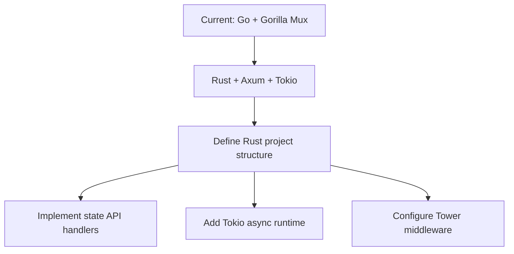
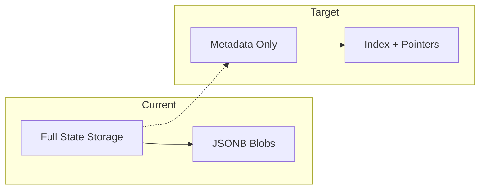
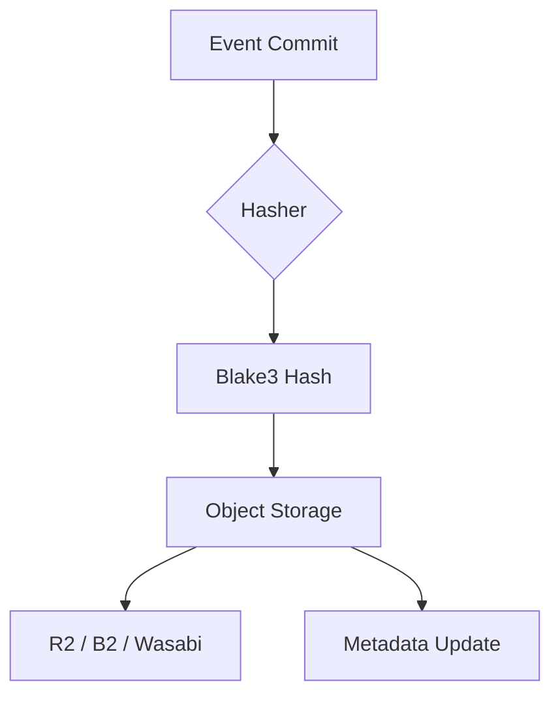
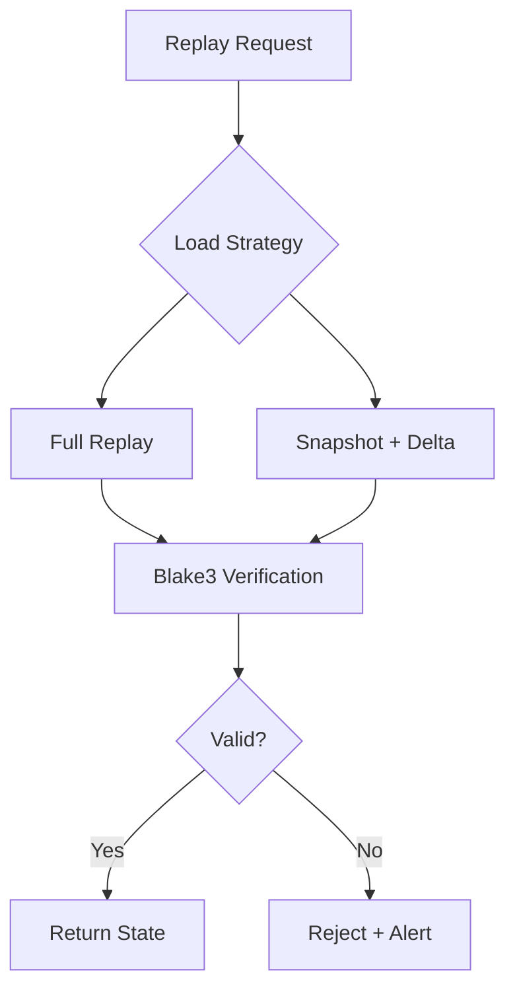
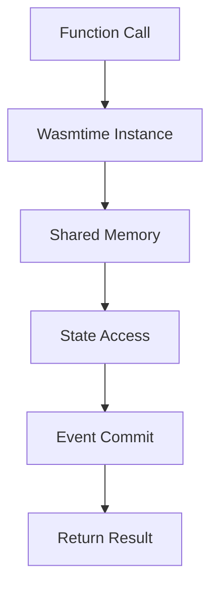

# StateFabric Migration Plan: Go → Rust Tech Stack

## Executive Summary

This document outlines a detailed implementation plan to migrate StateFabric from the current Go-based implementation to the proposed Rust-based tech stack. The migration targets:
- **Lower infrastructure costs**
- **Deterministic execution for AI agent workloads**
- **High-performance append-only event storage**
- **Simple scaling path with object storage dominance**

---

## 1. Current State Analysis

### 1.1 Current Implementation Overview

| Component | Current Technology | Location |
|-----------|-------------------|----------|
| Runtime | Go 1.24 | `cmd/flypy-go/`, `internal/` |
| Web Framework | Gorilla Mux | `internal/api/server.go` |
| Database | PostgreSQL (GORM) | `docker-compose.yml`, `internal/storage/` |
| Cache/Pub-Sub | Redis | `docker-compose.yml`, `internal/state/cache.go` |
| State Events | PostgreSQL JSONB | `internal/storage/models.go` (StateEvent) |
| Snapshots | PostgreSQL JSONB | `internal/storage/models.go` (StateSnapshot) |
| Hashing | Not standardized | `internal/api/handlers/registry/execution.go` |
| WASM Runtime | Wasmtime (indirect) | `go.mod` |
| TLS/Proxy | Caddy | `deploy/caddy/` |
| Monitoring | Prometheus + Grafana | `docker-compose.monitoring.yml` |
| SDKs | TypeScript, Python | `sdk/js/`, `sdk/python/` |

### 1.2 Existing State Management Features

The current implementation already includes:
- **StateEvent** model with sequence numbers, causality tracking, deterministic flags
- **StateSnapshot** model with compression support, key coverage tracking
- **Replay verification** in `internal/api/handlers/registry/execution.go`
- **State caching** via Redis with TTL and pub/sub notifications
- **History tracking** via `/state/{path}/history` endpoint

---

## 2. Gap Analysis

### 2.1 Critical Gaps

| Gap | Current State | Target State | Impact |
|-----|---------------|--------------|--------|
| **Language** | Go | Rust | Complete rewrite required |
| **Web Framework** | Gorilla Mux | Axum + Tokio | API layer rewrite |
| **Durable Storage** | PostgreSQL JSONB | Object Storage (R2/B2/Wasabi) | Storage layer redesign |
| **Hashing Algorithm** | Not standardized | Blake3 | Replay engine rebuild |
| **WASM Integration** | Indirect via go-wasmtime | Direct Wasmtime | Runtime integration |
| **Replay Engine** | Verification only | Full deterministic replay | Core engine build |

### 2.2 Features to Build

| Feature | Description | Priority |
|---------|-------------|----------|
| Object Storage Layer | R2/B2/Wasabi adapters for event/snapshot storage | Critical |
| Blake3 Hashing | Fast, deterministic hashing for state verification | Critical |
| Deterministic Replay Engine | Pure, idempotent replay with side-effect control | Critical |
| Wasmtime Integration | Execute Wasm tools with shared memory interface | High |
| LRU In-Memory Cache | Phase 1: Rust hash maps before Redis | High |
| Snapshot Checksum Verification | Hash validation for snapshot integrity | High |

### 2.3 Features to Migrate/Adapt

| Feature | Current | Target | Approach |
|---------|---------|--------|----------|
| State API Endpoints | Go handlers | Rust Axum handlers | Rewrite |
| Redis Cache/Pub-Sub | Current implementation | Keep Redis for Phase 2 | Adapt |
| PostgreSQL Metadata | Full storage | Index/pointers only | Refactor |
| Monitoring | Prometheus/Grafana | OpenTelemetry + Prometheus | Migrate |
| SDKs | TS/Python | Add Rust SDK, update TS/Python | Extend |

---

## 3. Component-by-Component Migration Plan

### 3.1 Core Runtime Layer



**Tasks:**
- [ ] Create new Rust project with Cargo.toml
- [ ] Add dependencies: `axum`, `tokio`, `tower`, `blake3`, `serde`, `uuid`
- [ ] Define project module structure
- [ ] Implement async API handlers
- [ ] Add middleware (logging, auth, tracing)

### 3.2 Metadata Layer (PostgreSQL)



**Tasks:**
- [ ] Refactor existing PostgreSQL schema to store only:
  - State object index (ID, path, metadata)
  - Event pointer index (state_id → object storage location)
  - Snapshot pointer index
  - Agent config
  - Billing counters
  - Execution hashes
- [ ] Create migration scripts for schema changes
- [ ] Update GORM models to pointer-based storage
- [ ] Add object storage location columns

### 3.3 Durable Storage Layer (Object Storage)



**Tasks:**
- [ ] Create object storage trait/interface
- [ ] Implement Cloudflare R2 adapter
- [ ] Implement Backblaze B2 adapter
- [ ] Implement Wasabi adapter
- [ ] Create event log storage format
- [ ] Create snapshot storage format
- [ ] Add storage location to event metadata

### 3.4 Deterministic Replay Engine



**Tasks:**
- [ ] Implement Blake3 hashing for state
- [ ] Create ordered event stream validator
- [ ] Build snapshot checksum verification
- [ ] Implement replay window batching
- [ ] Add side-effect control mechanisms
- [ ] Create replay API endpoints

### 3.5 Wasmtime Integration



**Tasks:**
- [ ] Add Wasmtime Rust bindings
- [ ] Implement shared memory interface
- [ ] Create `CommitEvent()` API
- [ ] Create `LoadSnapshot()` API
- [ ] Create `ReplayFrom()` API
- [ ] Add sandboxing controls

### 3.6 Caching Layer

**Phase 1 - In-Memory:**
- [ ] Implement LRU cache with Rust HashMap
- [ ] Add cache eviction policies
- [ ] Integrate with state fetching

**Phase 2 - Redis:**
- [ ] Add Redis client (maintain existing functionality)
- [ ] Migrate rate limiting to Redis
- [ ] Migrate active agent state
- [ ] Migrate hot snapshot cache

### 3.7 SDK Layer

| SDK | Current | Target | Tasks |
|-----|---------|--------|-------|
| TypeScript | ✅ Existing | Update | Add StateFabric client methods |
| Python | ✅ Existing | Update | Add StateFabric client methods |
| Rust | ❌ Missing | Create | New SDK with full API support |

**Tasks:**
- [ ] Update TypeScript SDK with `commit()`, `snapshot()`, `replay()` methods
- [ ] Update Python SDK with same methods
- [ ] Create new Rust SDK with idiomatic APIs

---

## 4. Infrastructure Changes

### 4.1 Docker Compose Updates

Current services to maintain:
- ✅ PostgreSQL (refactored for metadata only)
- ✅ Redis (for Phase 2)
- ✅ Caddy (TLS termination)

New services:
- [ ] Rust application container
- [ ] Object storage emulator (for development)

### 4.2 Object Storage Configuration

```yaml
# Environment variables required
R2_ACCOUNT_ID=
R2_ACCESS_KEY=
R2_SECRET_KEY=
R2_BUCKET_NAME=

# Or Backblaze B2
B2_APPLICATION_KEY_ID=
B2_APPLICATION_KEY=
B2_BUCKET_NAME=

# Or Wasabi
WASABI_ACCESS_KEY=
WASABI_SECRET_KEY=
WASABI_BUCKET_NAME=
```

### 4.3 VPS Configuration

**Early Stage:**
- Single VPS with Docker Compose
- PostgreSQL + Redis + StateFabric Rust app
- Object storage via external provider

**Growth Stage:**
- Multi-node Docker Swarm
- Read replicas for PostgreSQL
- CDN in front of object storage

---

## 5. Implementation Phases

### Phase 1: Foundation (Weeks 1-4)

| Week | Deliverables |
|------|--------------|
| 1 | Rust project setup, Axum server, basic health endpoints |
| 2 | PostgreSQL metadata layer, schema migration |
| 3 | Object storage abstraction layer, R2 adapter |
| 4 | Event commit API, basic state CRUD |

### Phase 2: Core Engine (Weeks 5-8)

| Week | Deliverables |
|------|--------------|
| 5 | Blake3 hashing implementation |
| 6 | Snapshot creation/storage, checksum verification |
| 7 | Deterministic replay engine |
| 8 | Replay API endpoints, verification UI |

### Phase 3: Integration (Weeks 9-12)

| Week | Deliverables |
|------|--------------|
| 9 | Wasmtime integration, shared memory interface |
| 10 | SDK updates (TypeScript, Python) |
| 11 | Rust SDK implementation |
| 12 | Integration testing, load testing |

### Phase 4: Optimization (Weeks 13-16)

| Week | Deliverables |
|------|--------------|
| 13 | LRU in-memory cache implementation |
| 14 | Redis integration (Phase 2 caching) |
| 15 | Performance tuning, benchmarking |
| 16 | Documentation, migration guides |

---

## 6. Backward Compatibility

### 6.1 Data Migration Strategy

1. **Parallel Write Phase**: Write to both PostgreSQL and object storage
2. **Migration Window**: Export existing events/snapshots to object storage
3. **Read Migration**: Switch reads to object storage
4. **Cleanup**: Remove PostgreSQL blob storage

### 6.2 API Compatibility

Maintain existing API endpoints with same response formats:
- `/v1/state/{path}` - State operations
- `/v1/state/{path}/history` - Event history
- `/v1/state/{path}/snapshot` - Snapshot operations
- `/v1/state/{path}/restore` - Restore operations

---

## 7. Risk Mitigation

| Risk | Mitigation |
|------|------------|
| Rust learning curve | Pair programming, code reviews |
| Object storage latency | Aggressive caching, CDN |
| Data migration integrity | Checksum validation, rollback plan |
| Breaking API changes | Versioned API, backward compatibility |
| Performance regression | Load testing before each phase |

---

## 8. Dependencies

### Rust Crates (Proposed)

```toml
[dependencies]
axum = "0.7"
tokio = { version = "1", features = ["full"] }
tower = "0.4"
blake3 = "1"
serde = { version = "1", features = ["derive"] }
serde_json = "1"
uuid = { version = "1", features = ["v4", "serde"] }
sqlx = "0.8"
rust-redis = "0.27"
aws-config = "1"
aws-sdk-s3 = "1"
tracing = "0.1"
tracing-subscriber = "0.3"
thiserror = "1"
anyhow = "1"
```

### Infrastructure

- PostgreSQL 17 (metadata only)
- Redis 8 (Phase 2)
- Cloudflare R2 / Backblaze B2 / Wasabi
- Caddy (existing)

---

## 9. Success Criteria

- [ ] Rust API handles 10k requests/second
- [ ] Object storage costs < $0.01/GB/month
- [ ] Replay verification < 100ms for 1MB state
- [ ] Zero data loss during migration
- [ ] All existing SDK methods functional

---

## 10. Next Steps

1. **Approval**: Review this plan with stakeholders
2. **Team Setup**: Assign Rust developers or train existing team
3. **Proof of Concept**: Implement minimal Rust API in Week 1
4. **Iterate**: Weekly retrospectives and plan adjustments

---

*Document Version: 1.0*
*Created: 2026-02-20*
*Mode: Architect*
