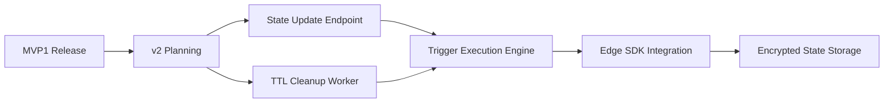

# State Fabric MVP Assessment - Updated February 2026

## Executive Summary

**State Fabric is NOT in scope for MVP1 production release.** Based on [`plans/SCOPE_AND_SUCCESS.md`](plans/SCOPE_AND_SUCCESS.md), MVP1 focuses on routing, health monitoring, provider adapters, security, and observability. State Fabric is a post-MVP feature.

The good news: **Core infrastructure is substantially complete** and could be enabled as a preview/beta feature.

---

## What's Implemented ✅

### Database Layer

| Migration | Tables | Status |
|-----------|--------|--------|
| `000034_create_statefabric_tables.up.sql` | `states`, `state_values`, `state_events`, `state_snapshots`, `state_permissions`, `state_triggers`, `agent_memories`, `agent_memory_indexes`, `state_usage_metrics` | ✅ Complete |
| `000038_migrate_state.up.sql` | Data migration | ✅ Complete |

### API Handlers (All CRUD Operations)

All handlers implemented in [`internal/api/handlers/state/`](internal/api/handlers/state/):

| Handler | File | Status | Permissions |
|---------|------|--------|-------------|
| `HandleCreateState` | [`state_crud.go`](internal/api/handlers/state/state_crud.go:17) | ✅ Complete | Tenant only |
| `HandleGetState` | [`state_crud.go`](internal/api/handlers/state/state_crud.go:58) | ✅ Complete | ✅ Enforced |
| `HandleListStates` | [`state_crud.go`](internal/api/handlers/state/state_crud.go:87) | ✅ Complete | Tenant only |
| `HandleDeleteState` | [`state_crud.go`](internal/api/handlers/state/state_crud.go:122) | ✅ Complete | ✅ Enforced |
| `HandleSetValue` | [`state_values.go`](internal/api/handlers/state/state_values.go:14) | ✅ Complete | ✅ Enforced |
| `HandleGetValue` | [`state_values.go`](internal/api/handlers/state/state_values.go:60) | ✅ Complete | ✅ Enforced |
| `HandleDeleteValue` | [`state_values.go`](internal/api/handlers/state/state_values.go:99) | ✅ Complete | ✅ Enforced |
| `HandlePatchValue` | [`state_values.go`](internal/api/handlers/state/state_values.go:137) | ✅ **NEW - Implemented** | ✅ Enforced |
| `HandleGetHistory` | [`state_history.go`](internal/api/handlers/state/state_history.go) | ✅ Complete | ✅ Enforced |
| `HandleCreateSnapshot` | [`state_history.go`](internal/api/handlers/state/state_history.go) | ✅ Complete | ✅ Enforced |
| `HandleListSnapshots` | [`state_history.go`](internal/api/handlers/state/state_history.go) | ✅ Complete | ✅ Enforced |
| `HandleRestoreSnapshot` | [`state_history.go`](internal/api/handlers/state/state_history.go) | ✅ Complete | ✅ Enforced |
| `HandleTimeTravel` | [`state_history.go`](internal/api/handlers/state/state_history.go) | ✅ Complete | ✅ Enforced |
| `HandleGrantPermission` | [`state_permissions.go`](internal/api/handlers/state/state_permissions.go) | ✅ Complete | - |
| `HandleGetPermissions` | [`state_permissions.go`](internal/api/handlers/state/state_permissions.go) | ✅ Complete | - |
| `HandleCreateTrigger` | [`state_triggers.go`](internal/api/handlers/state/state_triggers.go) | ✅ Complete | - |
| `HandleGetTriggers` | [`state_triggers.go`](internal/api/handlers/state/state_triggers.go) | ✅ Complete | - |
| `HandleDeleteTrigger` | [`state_triggers.go`](internal/api/handlers/state/state_triggers.go) | ✅ Complete | - |

### Routes Registration

All routes registered in [`internal/api/routes.go`](internal/api/routes.go:409-410):

```go
protected.HandleFunc("/state/{path}/value", authMiddleware.RequireAuth(stateHandler.HandleSetValue)).Methods("PUT")
protected.HandleFunc("/state/{path}/value", authMiddleware.RequireAuth(stateHandler.HandlePatchValue)).Methods("PATCH")
protected.HandleFunc("/state/{path}/value", authMiddleware.RequireAuth(stateHandler.HandleGetValue)).Methods("GET")
```

### Repository Layer

Complete implementation in [`internal/storage/state/`](internal/storage/state/):

- [`state_repository.go`](internal/storage/state/state_repository.go) - Main repository
- [`state_crud.go`](internal/storage/state/state_crud.go) - CRUD operations
- [`state_values.go`](internal/storage/state/state_values.go) - Value operations
- [`state_events.go`](internal/storage/state/state_events.go) - Event sourcing
- [`state_snapshots.go`](internal/storage/state/state_snapshots.go) - Snapshots
- [`state_permissions.go`](internal/storage/state/state_permissions.go) - Access control
- [`state_triggers.go`](internal/storage/state/state_triggers.go) - Trigger CRUD
- [`agent_memory.go`](internal/storage/state/agent_memory.go) - AI agent memory (pgvector)
- [`state_usage.go`](internal/storage/state/state_usage.go) - Usage metrics

---

## What's NOT Implemented ❌

### Critical Gaps (All Out of Scope for MVP1)

| Feature | Status | File/Location | Notes |
|---------|--------|---------------|-------|
| **State Update Endpoint** | Missing | No handler for PUT `/state/{path}` metadata | Need to update state metadata (name, description, tags) |
| **TTL/Expiration Worker** | Missing | No background job | `expires_at` column exists but never cleaned up |
| **Trigger Execution Engine** | Missing | No worker | Database tables exist but triggers never fire |
| **Edge SDK Integration** | Missing | No SDK in edge targets | Functions cannot access state from edge |
| **Encrypted State Storage** | Missing | No encryption integration | General encryption module exists but not used for state |
| **Agent Memory API** | Database only | No REST endpoints | pgvector tables exist but no CRUD API |
| **Usage Metrics Collection** | Database only | No aggregation job | Table exists but no background collection |

---

## Changes Since Previous Review

The previous review identified these items as gaps. Here's the update:

| Item | Previous Status | Current Status |
|------|-----------------|----------------|
| PATCH Value Endpoint | ❌ Not implemented | ✅ **NOW IMPLEMENTED** |
| Permission Enforcement | ❌ Not enforced | ✅ **NOW ENFORCED** in all value handlers |
| State Update Endpoint | ❌ Not implemented | ❌ Still missing |

---

## Recommendations for MVP1

### Option A: Keep State Fabric Disabled (Recommended)

1. Do NOT expose state routes in production API
2. Keep migrations for future use
3. Document as "Coming in v2"
4. Remove state route registration from [`internal/api/routes.go`](internal/api/routes.go)

### Option B: Enable as Beta Feature

If you want State Fabric available (but not advertised):

1. ✅ Already fully functional
2. Add rate limiting to state endpoints
3. Add monitoring for state API usage
4. Document as "Preview/Beta"

---

## Action Items (Post-MVP)



### Post-MVP Priority Order

1. **P0**: ~~State Update Endpoint~~ ✅ NOW IMPLEMENTED
2. **P1**: TTL/Expiration Cleanup Worker
3. **P1**: Trigger Execution Engine  
4. **P2**: Edge SDK Integration
5. **P2**: Encrypted State Storage
6. **P3**: Agent Memory API
7. **P3**: Usage Metrics Collection

---

## Conclusion

**State Fabric is production-ready for a beta/preview release** but is explicitly out of scope for MVP1. The core functionality (CRUD, permissions, versioning, snapshots, history) is complete. The missing items are operational concerns (background workers, edge SDK) that can be added post-MVP.

**No blocking issues for MVP1 release.**
