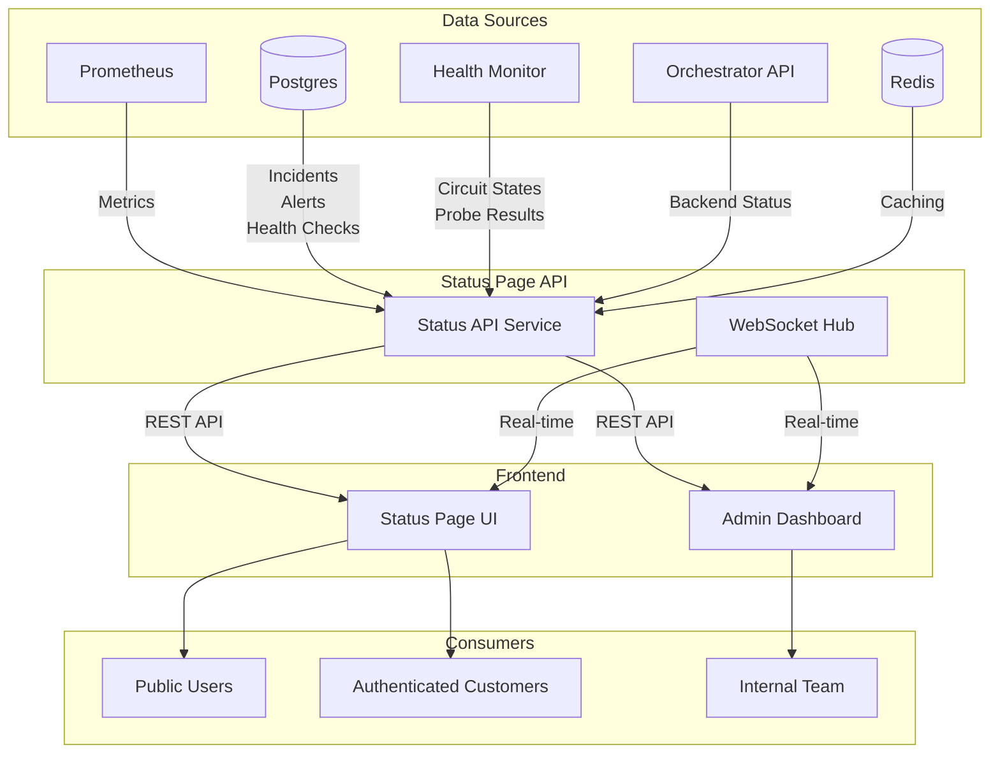
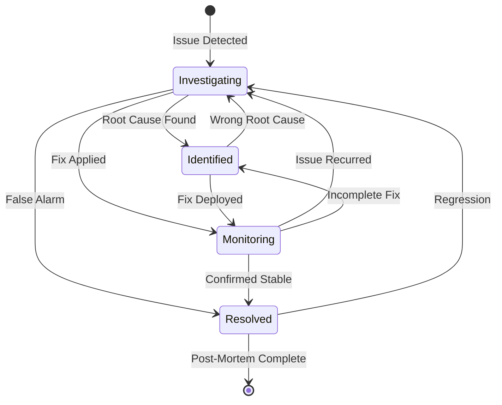
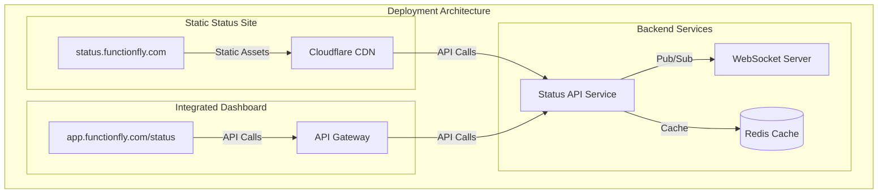

# FunctionFly System Status Page Architecture

## Table of Contents

1. [System Overview](#1-system-overview)
2. [Data Sources & Integration](#2-data-sources--integration)
3. [API Endpoints Design](#3-api-endpoints-design)
4. [Component Architecture](#4-component-architecture)
5. [State Management](#5-state-management)
6. [Security & Access Control](#6-security--access-control)
7. [Performance Requirements](#7-performance-requirements)
8. [Provider Status Breakdown](#8-provider-status-breakdown)
9. [Incident Management Workflow](#9-incident-management-workflow)
10. [Deployment Architecture](#10-deployment-architecture)
11. [Implementation Phases](#11-implementation-phases)

---

## 1. System Overview

### Purpose and Scope

The FunctionFly System Status Page provides real-time visibility into the health and performance of the multi-cloud edge function platform. It serves as the single source of truth for:

- **Platform operational status**: Current health of all FunctionFly services
- **Provider availability**: Per-region status of Cloudflare Workers, Vercel, Fly.io, Deno Deploy, and FunctionFly Edge
- **Incident communication**: Active incidents, scheduled maintenance, and historical reports
- **Performance metrics**: Uptime percentages, latency trends, and error rates

### Target Audiences

| Audience | Access Level | Primary Use Cases |
|----------|--------------|-------------------|
| **Public Visitors** | Read-only | Check overall platform status before relying on FunctionFly for critical workloads |
| **Customers** | Read-only + API access | Monitor their apps' backends, view incident history affecting their services |
| **Internal Team** | Full CRUD | Incident management, maintenance scheduling, post-incident analysis |
| **Stakeholders** | Read-only + Reports | SLA compliance, uptime reports, capacity planning |

### Integration Points



---

## 2. Data Sources & Integration

### 2.1 Prometheus Integration

#### Metrics Collection

| Metric Name | Type | Labels | Description |
|-------------|------|--------|-------------|
| `functionfly_probe_success_rate` | Gauge | `backend`, `provider`, `region` | Health probe success percentage |
| `functionfly_probe_latency_ms` | Histogram | `backend`, `provider`, `region` | Probe latency in milliseconds |
| `functionfly_request_latency_ms` | Histogram | `app`, `backend`, `provider` | Request latency distribution |
| `functionfly_request_error_rate` | Gauge | `app`, `backend`, `provider` | Error rate percentage |
| `functionfly_circuit_state` | Gauge | `backend` | Circuit breaker state (0=closed, 1=half-open, 2=open) |
| `functionfly_uptime_ratio` | Gauge | `component`, `provider` | Uptime ratio over time window |

#### Prometheus Query Examples

```promql
# Current overall platform health (percentage of healthy backends)
(
  sum(functionfly_probe_success_rate > 0.95) 
  / 
  count(functionfly_probe_success_rate)
) * 100

# 95th percentile latency by provider over last 5 minutes
histogram_quantile(0.95, 
  sum(rate(functionfly_probe_latency_ms_bucket[5m])) by (provider, le)
)

# Error rate by backend over last 10 minutes
sum(rate(functionfly_request_error_rate[10m])) by (backend, provider)

# Circuit breaker states (0=closed/healthy, 1=half-open, 2=open/open)
functionfly_circuit_state

# Uptime percentage per provider over last 30 days
avg_over_time(functionfly_uptime_ratio[30d]) * 100

# Request volume by provider
sum(rate(functionfly_requests_total[5m])) by (provider)

# Active alert count
sum(functionfly_active_alerts)
```

#### Prometheus API Client

```typescript
// TypeScript interface for Prometheus query response
interface PrometheusResponse {
  status: 'success' | 'error';
  data?: {
    resultType: 'vector' | 'matrix' | 'scalar' | 'string';
    result: PrometheusResult[];
  };
  error?: string;
}

interface PrometheusResult {
  metric: Record<string, string>;
  value?: [number, string]; // For vector results [timestamp, value]
  values?: [number, string][]; // For matrix results
}

// Client configuration
interface PrometheusClientConfig {
  baseUrl: string;
  timeout: number;
  cacheDuration: number; // seconds
}
```

### 2.2 Postgres Tables

#### Existing Tables

**`incidents`** - System incidents and outages
```sql
CREATE TABLE incidents (
    id UUID PRIMARY KEY,
    title VARCHAR(255) NOT NULL,
    severity VARCHAR(50) NOT NULL CHECK (severity IN ('critical', 'high', 'medium', 'low')),
    status VARCHAR(50) NOT NULL DEFAULT 'investigating' 
        CHECK (status IN ('resolved', 'investigating', 'monitoring')),
    description TEXT NOT NULL,
    created_at TIMESTAMP WITH TIME ZONE NOT NULL DEFAULT NOW(),
    resolved_at TIMESTAMP WITH TIME ZONE,
    updated_at TIMESTAMP WITH TIME ZONE NOT NULL DEFAULT NOW()
);

CREATE INDEX idx_incidents_status ON incidents(status);
CREATE INDEX idx_incidents_severity ON incidents(severity);
CREATE INDEX idx_incidents_created_at ON incidents(created_at DESC);
CREATE INDEX idx_incidents_resolved_at ON incidents(resolved_at) WHERE resolved_at IS NOT NULL;
```

**`alerts`** - System alerts with severity
```sql
CREATE TABLE alerts (
    id UUID PRIMARY KEY DEFAULT gen_random_uuid(),
    alert_type VARCHAR(50) NOT NULL, -- 'health_degraded', 'backend_down', 'high_error_rate', 'circuit_open'
    severity VARCHAR(20) NOT NULL DEFAULT 'info', -- 'info', 'warning', 'error', 'critical'
    tenant_id UUID REFERENCES tenants(id) ON DELETE CASCADE,
    app_id UUID REFERENCES apps(id) ON DELETE CASCADE,
    backend_id UUID REFERENCES backends(id) ON DELETE CASCADE,
    title VARCHAR(255) NOT NULL,
    message TEXT,
    status VARCHAR(20) NOT NULL DEFAULT 'active', -- 'active', 'acknowledged', 'resolved'
    resolved_at TIMESTAMP WITH TIME ZONE,
    resolved_by UUID REFERENCES users(id),
    metadata JSONB DEFAULT '{}',
    created_at TIMESTAMP WITH TIME ZONE DEFAULT NOW(),
    updated_at TIMESTAMP WITH TIME ZONE DEFAULT NOW()
);

CREATE INDEX idx_alerts_type_status ON alerts(alert_type, status);
CREATE INDEX idx_alerts_severity ON alerts(severity);
CREATE INDEX idx_alerts_created_at ON alerts(created_at DESC);
```

**`system_health_checks`** - Component health status
```sql
CREATE TABLE system_health_checks (
    id UUID PRIMARY KEY DEFAULT gen_random_uuid(),
    check_type VARCHAR(50) NOT NULL, -- 'database', 'api', 'external_service', 'disk_space', 'memory'
    component_name VARCHAR(100) NOT NULL,
    status VARCHAR(20) NOT NULL DEFAULT 'unknown', -- 'healthy', 'degraded', 'unhealthy', 'unknown'
    response_time_ms INTEGER,
    message TEXT,
    metadata JSONB DEFAULT '{}',
    checked_at TIMESTAMP WITH TIME ZONE DEFAULT NOW(),
    created_at TIMESTAMP WITH TIME ZONE DEFAULT NOW()
);

CREATE INDEX idx_health_checks_component ON system_health_checks(component_name);
CREATE INDEX idx_health_checks_status ON system_health_checks(status);
CREATE INDEX idx_health_checks_checked_at ON system_health_checks(checked_at DESC);
```

**`health_checks`** - Backend-specific health probe results
```sql
CREATE TABLE health_checks (
    id UUID PRIMARY KEY DEFAULT gen_random_uuid(),
    backend_id UUID NOT NULL REFERENCES backends(id),
    timestamp TIMESTAMP WITH TIME ZONE DEFAULT NOW(),
    ok BOOLEAN NOT NULL,
    status_code INTEGER,
    latency_ms INTEGER,
    error_message TEXT
);

CREATE INDEX idx_health_checks_backend_id ON health_checks(backend_id);
CREATE INDEX idx_health_checks_timestamp ON health_checks(timestamp DESC);
```

**`circuit_state`** - Circuit breaker states
```sql
CREATE TABLE circuit_state (
    backend_id UUID PRIMARY KEY REFERENCES backends(id),
    state VARCHAR(20) NOT NULL DEFAULT 'closed', -- 'closed', 'open', 'half-open'
    since_ts TIMESTAMP WITH TIME ZONE DEFAULT NOW(),
    fail_count INTEGER DEFAULT 0,
    success_count INTEGER DEFAULT 0,
    last_failure_ts TIMESTAMP WITH TIME ZONE,
    last_success_ts TIMESTAMP WITH TIME ZONE
);
```

**`backends`** - Edge backend configurations
```sql
CREATE TABLE backends (
    id UUID PRIMARY KEY DEFAULT gen_random_uuid(),
    app_id UUID NOT NULL REFERENCES apps(id),
    provider VARCHAR(50) NOT NULL, -- 'workers', 'vercel', 'fly', 'deno-deploy', 'functionfly-edge'
    region VARCHAR(10) NOT NULL,
    url VARCHAR(500) NOT NULL,
    shared_secret VARCHAR(255) NOT NULL,
    enabled BOOLEAN DEFAULT true,
    created_at TIMESTAMP WITH TIME ZONE DEFAULT NOW(),
    updated_at TIMESTAMP WITH TIME ZONE DEFAULT NOW()
);
```

#### New Table: `platform_maintenance`

```sql
-- Scheduled maintenance windows
CREATE TABLE platform_maintenance (
    id UUID PRIMARY KEY DEFAULT gen_random_uuid(),
    title VARCHAR(255) NOT NULL,
    description TEXT,
    scheduled_start TIMESTAMP WITH TIME ZONE NOT NULL,
    scheduled_end TIMESTAMP WITH TIME ZONE NOT NULL,
    actual_start TIMESTAMP WITH TIME ZONE,
    actual_end TIMESTAMP WITH TIME ZONE,
    status VARCHAR(50) NOT NULL DEFAULT 'scheduled', -- 'scheduled', 'in_progress', 'completed', 'cancelled'
    affected_components TEXT[], -- Array of component names affected
    affected_providers TEXT[], -- Array of provider names affected
    created_by UUID NOT NULL REFERENCES users(id),
    created_at TIMESTAMP WITH TIME ZONE DEFAULT NOW(),
    updated_at TIMESTAMP WITH TIME ZONE DEFAULT NOW()
);

CREATE INDEX idx_maintenance_status ON platform_maintenance(status);
CREATE INDEX idx_maintenance_schedule ON platform_maintenance(scheduled_start, scheduled_end);
CREATE INDEX idx_maintenance_affected ON platform_maintenance USING GIN(affected_providers);
```

#### SQL Query Patterns for Status Page

```sql
-- Get active incidents with latest updates
SELECT 
    i.*,
    json_agg(
        json_build_object(
            'timestamp', ic.created_at,
            'message', ic.message,
            'status', ic.status
        ) ORDER BY ic.created_at DESC
    ) FILTER (WHERE ic.id IS NOT NULL) as updates
FROM incidents i
LEFT JOIN incident_updates ic ON i.id = ic.incident_id
WHERE i.status != 'resolved'
GROUP BY i.id
ORDER BY i.created_at DESC;

-- Get current system health summary
SELECT 
    component_name,
    status,
    response_time_ms,
    checked_at,
    CASE 
        WHEN checked_at < NOW() - INTERVAL '5 minutes' THEN 'stale'
        ELSE 'fresh'
    END as data_freshness
FROM system_health_checks
WHERE checked_at = (
    SELECT MAX(checked_at) 
    FROM system_health_checks sh2 
    WHERE sh2.component_name = system_health_checks.component_name
);

-- Get provider health aggregation
SELECT 
    b.provider,
    COUNT(*) as total_backends,
    COUNT(*) FILTER (WHERE cs.state = 'closed') as healthy_backends,
    COUNT(*) FILTER (WHERE cs.state = 'half-open') as degraded_backends,
    COUNT(*) FILTER (WHERE cs.state = 'open') as unhealthy_backends,
    AVG(hc.latency_ms) FILTER (WHERE hc.ok = true) as avg_latency_ms,
    (
        COUNT(*) FILTER (WHERE hc.ok = true)::float / 
        NULLIF(COUNT(*), 0)
    ) * 100 as uptime_percent
FROM backends b
LEFT JOIN circuit_state cs ON b.id = cs.backend_id
LEFT JOIN LATERAL (
    SELECT * FROM health_checks 
    WHERE backend_id = b.id 
    ORDER BY timestamp DESC 
    LIMIT 1
) hc ON true
GROUP BY b.provider;

-- Get upcoming maintenance windows
SELECT *
FROM platform_maintenance
WHERE status IN ('scheduled', 'in_progress')
  AND scheduled_end > NOW()
ORDER BY scheduled_start ASC;

-- Get 30-day uptime per provider
SELECT 
    b.provider,
    b.region,
    COUNT(*) FILTER (WHERE hc.ok = true) as successful_checks,
    COUNT(*) as total_checks,
    (COUNT(*) FILTER (WHERE hc.ok = true)::float / COUNT(*)) * 100 as uptime_percent
FROM backends b
JOIN health_checks hc ON b.id = hc.backend_id
WHERE hc.timestamp > NOW() - INTERVAL '30 days'
GROUP BY b.provider, b.region;

-- Get active alerts with severity
SELECT 
    a.*,
    b.provider,
    b.region,
    app.name as app_name
FROM alerts a
LEFT JOIN backends b ON a.backend_id = b.id
LEFT JOIN apps app ON a.app_id = app.id
WHERE a.status = 'active'
ORDER BY 
    CASE a.severity 
        WHEN 'critical' THEN 1 
        WHEN 'error' THEN 2 
        WHEN 'warning' THEN 3 
        ELSE 4 
    END,
    a.created_at DESC;
```

### 2.3 Health Monitor Integration

The Health Monitor service provides real-time circuit breaker states and probe results.

```go
// Go struct for health monitor status
package status

type HealthMonitorStatus struct {
    LastProbeTime     time.Time              `json:"last_probe_time"`
    ProbeInterval     time.Duration          `json:"probe_interval"`
    Backends          []BackendHealthStatus  `json:"backends"`
    CircuitBreakers   []CircuitBreakerState  `json:"circuit_breakers"`
}

type BackendHealthStatus struct {
    BackendID    string    `json:"backend_id"`
    Provider     string    `json:"provider"`
    Region       string    `json:"region"`
    LastCheck    time.Time `json:"last_check"`
    Healthy      bool      `json:"healthy"`
    LatencyMs    int       `json:"latency_ms"`
    StatusCode   int       `json:"status_code,omitempty"`
    ErrorMessage string    `json:"error_message,omitempty"`
}

type CircuitBreakerState struct {
    BackendID        string    `json:"backend_id"`
    State            string    `json:"state"` // "closed", "open", "half-open"
    Since            time.Time `json:"since"`
    FailureCount     int       `json:"failure_count"`
    SuccessCount     int       `json:"success_count"`
    LastFailureTime  *time.Time `json:"last_failure_time,omitempty"`
    LastSuccessTime  *time.Time `json:"last_success_time,omitempty"`
}
```

### 2.4 Orchestrator API Integration

```go
// Go struct for orchestrator routing status
type RoutingStatus struct {
    TotalRequests     int64            `json:"total_requests"`
    RequestsPerSecond float64          `json:"requests_per_second"`
    ActiveBackends    int              `json:"active_backends"`
    TotalBackends     int              `json:"total_backends"`
    FailoverEvents    int64            `json:"failover_events_last_hour"`
    RoutingDecisions  []RoutingDecision `json:"recent_routing_decisions"`
}

type RoutingDecision struct {
    Timestamp    time.Time `json:"timestamp"`
    AppID        string    `json:"app_id"`
    BackendID    string    `json:"backend_id"`
    Provider     string    `json:"provider"`
    Region       string    `json:"region"`
    LatencyMs    int       `json:"latency_ms"`
    Outcome      string    `json:"outcome"` // "success", "failure", "timeout"
    FailoverUsed bool      `json:"failover_used"`
}
```

---

## 3. API Endpoints Design

### Base URL and Versioning

- **Base URL**: `/api/v1`
- **WebSocket**: `/ws/v1`
- **Content-Type**: `application/json`

### Authentication

| Endpoint Type | Authentication |
|---------------|----------------|
| Public status endpoints | None required |
| Customer endpoints | `Authorization: Bearer <customer-jwt>` |
| Admin endpoints | `Authorization: Bearer <admin-jwt>` |
| WebSocket | Token in query param: `?token=<jwt>` |

### 3.1 REST Endpoints

#### GET /api/v1/status

Returns overall platform status.

**Response (200 OK)**:
```typescript
interface PlatformStatusResponse {
  status: 'operational' | 'degraded' | 'major_outage' | 'maintenance';
  indicator: 'none' | 'minor' | 'major' | 'critical';
  description: string;
  updated_at: string; // ISO 8601
  components: ComponentStatus[];
  incidents: IncidentSummary[];
  maintenance: MaintenanceSummary[];
}

interface ComponentStatus {
  id: string;
  name: string;
  status: 'operational' | 'degraded_performance' | 'partial_outage' | 'major_outage' | 'maintenance';
  description: string;
  updated_at: string;
}

interface IncidentSummary {
  id: string;
  title: string;
  severity: 'critical' | 'high' | 'medium' | 'low';
  status: 'investigating' | 'identified' | 'monitoring' | 'resolved';
  created_at: string;
  updated_at: string;
}

interface MaintenanceSummary {
  id: string;
  title: string;
  status: 'scheduled' | 'in_progress' | 'completed';
  scheduled_start: string;
  scheduled_end: string;
}
```

---

#### GET /api/v1/status/components

Returns detailed status of all system components.

**Query Parameters**:
- `include_history` (boolean): Include 24h status history
- `component_type` (string): Filter by type (e.g., "api", "database", "provider")

**Response (200 OK)**:
```typescript
interface ComponentsStatusResponse {
  components: ComponentDetail[];
  generated_at: string;
}

interface ComponentDetail {
  id: string;
  name: string;
  type: 'api' | 'database' | 'cache' | 'provider' | 'monitoring';
  status: 'operational' | 'degraded_performance' | 'partial_outage' | 'major_outage' | 'maintenance';
  uptime_24h: number; // percentage
  uptime_7d: number; // percentage
  uptime_30d: number; // percentage
  response_time_ms: number;
  last_checked: string;
  description: string;
  history?: StatusHistoryPoint[]; // If include_history=true
}

interface StatusHistoryPoint {
  timestamp: string;
  status: string;
  response_time_ms: number;
}
```

---

#### GET /api/v1/status/providers

Returns per-provider status by region.

**Query Parameters**:
- `provider` (string): Filter by provider name
- `region` (string): Filter by region code
- `detailed` (boolean): Include per-backend details

**Response (200 OK)**:
```typescript
interface ProvidersStatusResponse {
  providers: ProviderStatus[];
  generated_at: string;
}

interface ProviderStatus {
  name: string;
  display_name: string;
  overall_status: 'operational' | 'degraded' | 'outage';
  regions: RegionStatus[];
  summary: {
    total_backends: number;
    healthy_backends: number;
    degraded_backends: number;
    unhealthy_backends: number;
    avg_latency_ms: number;
    error_rate: number;
  };
}

interface RegionStatus {
  code: string;
  name: string;
  status: 'operational' | 'degraded_performance' | 'partial_outage' | 'major_outage';
  latency_ms: number;
  error_rate: number;
  uptime_24h: number;
  backends?: BackendStatus[]; // If detailed=true
}

interface BackendStatus {
  id: string;
  url: string;
  status: 'healthy' | 'degraded' | 'unhealthy' | 'unknown';
  circuit_state: 'closed' | 'half-open' | 'open';
  latency_ms: number;
  last_check: string;
  consecutive_failures: number;
}
```

---

#### GET /api/v1/incidents

List incidents with filtering.

**Query Parameters**:
- `status` (string): Filter by status (e.g., "active", "resolved")
- `severity` (string): Filter by severity (e.g., "critical", "high")
- `start_date` (string): ISO date for date range start
- `end_date` (string): ISO date for date range end
- `limit` (number): Max results (default: 20, max: 100)
- `offset` (number): Pagination offset

**Response (200 OK)**:
```typescript
interface IncidentsListResponse {
  incidents: Incident[];
  pagination: {
    total: number;
    limit: number;
    offset: number;
    has_more: boolean;
  };
}

interface Incident {
  id: string;
  title: string;
  severity: 'critical' | 'high' | 'medium' | 'low';
  status: 'investigating' | 'identified' | 'monitoring' | 'resolved';
  description: string;
  affected_components: string[];
  created_at: string;
  resolved_at?: string;
  updated_at: string;
  duration_minutes?: number; // Calculated if resolved
  updates: IncidentUpdate[];
}

interface IncidentUpdate {
  id: string;
  status: 'investigating' | 'identified' | 'monitoring' | 'resolved';
  message: string;
  created_at: string;
  created_by?: {
    id: string;
    name: string;
  };
}
```

---

#### GET /api/v1/incidents/:id

Get single incident details.

**Response (200 OK)**: Same as `Incident` interface above

**Response (404 Not Found)**:
```typescript
{
  error: 'Incident not found';
  incident_id: string;
}
```

---

#### POST /api/v1/incidents (Admin Only)

Create a new incident.

**Request Body**:
```typescript
interface CreateIncidentRequest {
  title: string;
  severity: 'critical' | 'high' | 'medium' | 'low';
  description: string;
  affected_components?: string[];
  initial_update?: {
    message: string;
    status: 'investigating' | 'identified' | 'monitoring';
  };
}
```

**Response (201 Created)**: Created `Incident` object

**Response (400 Bad Request)**: Validation error with field details

---

#### PATCH /api/v1/incidents/:id (Admin Only)

Update an incident.

**Request Body**:
```typescript
interface UpdateIncidentRequest {
  title?: string;
  severity?: 'critical' | 'high' | 'medium' | 'low';
  status?: 'investigating' | 'identified' | 'monitoring' | 'resolved';
  description?: string;
  affected_components?: string[];
  new_update?: {
    message: string;
    status: 'investigating' | 'identified' | 'monitoring' | 'resolved';
  };
}
```

**Response (200 OK)**: Updated `Incident` object

---

#### GET /api/v1/metrics/uptime

Get historical uptime data.

**Query Parameters**:
- `component` (string): Component ID or 'all'
- `provider` (string): Provider name or 'all'
- `period` (string): '24h', '7d', '30d', '90d'
- `resolution` (string): 'hour', 'day'

**Response (200 OK)**:
```typescript
interface UptimeMetricsResponse {
  period: string;
  resolution: string;
  overall_uptime: number; // percentage
  data_points: UptimeDataPoint[];
}

interface UptimeDataPoint {
  timestamp: string;
  uptime_percent: number;
  total_checks: number;
  failed_checks: number;
  component_breakdown?: Record<string, number>;
}
```

---

#### GET /api/v1/metrics/latency

Get latency trends.

**Query Parameters**:
- `provider` (string): Provider name or 'all'
- `region` (string): Region code or 'all'
- `period` (string): '1h', '24h', '7d', '30d'
- `percentile` (string): 'p50', 'p95', 'p99' (default: 'p95')

**Response (200 OK)**:
```typescript
interface LatencyMetricsResponse {
  period: string;
  percentile: string;
  overall_avg_ms: number;
  data_points: LatencyDataPoint[];
  by_provider?: Record<string, LatencyStats>;
}

interface LatencyDataPoint {
  timestamp: string;
  value_ms: number;
  provider?: string;
}

interface LatencyStats {
  avg_ms: number;
  min_ms: number;
  max_ms: number;
  p50_ms: number;
  p95_ms: number;
  p99_ms: number;
}
```

---

#### GET /api/v1/maintenance

List scheduled and past maintenance windows.

**Query Parameters**:
- `status` (string): 'scheduled', 'in_progress', 'completed', 'cancelled'
- `upcoming` (boolean): Only show future maintenance
- `limit` (number): Max results

**Response (200 OK)**:
```typescript
interface MaintenanceListResponse {
  maintenance_windows: MaintenanceWindow[];
}

interface MaintenanceWindow {
  id: string;
  title: string;
  description: string;
  status: 'scheduled' | 'in_progress' | 'completed' | 'cancelled';
  scheduled_start: string;
  scheduled_end: string;
  actual_start?: string;
  actual_end?: string;
  affected_components: string[];
  affected_providers: string[];
  created_at: string;
  updated_at: string;
}
```

---

#### POST /api/v1/maintenance (Admin Only)

Schedule maintenance window.

**Request Body**:
```typescript
interface CreateMaintenanceRequest {
  title: string;
  description: string;
  scheduled_start: string; // ISO 8601
  scheduled_end: string; // ISO 8601
  affected_components: string[];
  affected_providers?: string[];
}
```

---

### 3.2 WebSocket Endpoints

#### WS /ws/v1/status

Real-time status updates.

**Connection**:
```
/ws/v1/status?token=<optional-jwt-for-customer-specific-data>
```

**Message Protocol**:
```typescript
// Client -> Server: Subscribe to specific data
interface SubscribeMessage {
  type: 'subscribe';
  channels: string[]; // ['platform', 'providers:all', 'incidents']
}

// Server -> Client: Status update
interface StatusUpdateMessage {
  type: 'status_update';
  channel: string;
  timestamp: string;
  data: PlatformStatusResponse | ProviderUpdate | IncidentUpdate;
}

// Server -> Client: Heartbeat
interface HeartbeatMessage {
  type: 'heartbeat';
  timestamp: string;
}

// Example provider update
interface ProviderUpdate {
  provider: string;
  region: string;
  status: string;
  latency_ms: number;
  circuit_state?: string;
}
```

**Update Frequency**:
- Platform status: Every 10 seconds
- Provider metrics: Every 5 seconds
- Incidents: Real-time (on change)

---

## 4. Component Architecture

### 4.1 Page Hierarchy

```
┌─────────────────────────────────────────────────────────────────────┐
│                         StatusPage Layout                            │
│  ┌───────────────────────────────────────────────────────────────┐  │
│  │  PublicHeader (Logo + Navigation)                             │  │
│  └───────────────────────────────────────────────────────────────┘  │
│  ┌───────────────────────────────────────────────────────────────┐  │
│  │  HeroStatus (Large status indicator + timestamp)              │  │
│  └───────────────────────────────────────────────────────────────┘  │
│  ┌───────────────────────────────────────────────────────────────┐  │
│  │  ActiveIncidentsBanner (If any active incidents)              │  │
│  └───────────────────────────────────────────────────────────────┘  │
│  ┌───────────────────────────────────────────────────────────────┐  │
│  │  ┌─────────────────────────────────────────────────────────┐  │  │
│  │  │ ComponentStatus (Core services grid)                    │  │  │
│  │  └─────────────────────────────────────────────────────────┘  │  │
│  │  ┌─────────────────────────────────────────────────────────┐  │  │
│  │  │ ProviderGrid (Cloudflare, Vercel, Fly.io, etc.)         │  │  │
│  │  └─────────────────────────────────────────────────────────┘  │  │
│  │  ┌─────────────────────────────────────────────────────────┐  │  │
│  │  │ MetricsDashboard (Charts and sparklines)                │  │  │
│  │  └─────────────────────────────────────────────────────────┘  │  │
│  │  ┌─────────────────────────────────────────────────────────┐  │  │
│  │  │ IncidentTimeline (Recent incident history)              │  │  │
│  │  └─────────────────────────────────────────────────────────┘  │  │
│  │  ┌─────────────────────────────────────────────────────────┐  │  │
│  │  │ ScheduledMaintenance (Upcoming maintenance windows)     │  │  │
│  │  └─────────────────────────────────────────────────────────┘  │  │
│  └───────────────────────────────────────────────────────────────┘  │
│  ┌───────────────────────────────────────────────────────────────┐  │
│  │  StatusFooter (Last updated, links, RSS)                      │  │
│  └───────────────────────────────────────────────────────────────┘  │
└─────────────────────────────────────────────────────────────────────┘
```

### 4.2 Component Specifications

#### Pages

**StatusPage** (`/status`)
- **Purpose**: Public-facing status dashboard
- **Features**: Real-time updates, historical metrics, incident display
- **Access**: Public (no auth required)

**IncidentDetailPage** (`/incidents/:id`)
- **Purpose**: Detailed view of a specific incident
- **Features**: Full timeline, all updates, affected components
- **Access**: Public

**HistoryPage** (`/history`)
- **Purpose**: Historical incidents and uptime reports
- **Features**: Filterable incident list, uptime graphs
- **Access**: Public

**AdminIncidentPage** (`/admin/incidents`)
- **Purpose**: Incident management interface
- **Features**: Create/update incidents, manage updates
- **Access**: Admin only

---

#### Sections

**HeroStatus**
```typescript
interface HeroStatusProps {
  status: PlatformStatus;
  lastUpdated: Date;
  activeIncidentCount: number;
}
```
- Large visual status indicator
- "All systems operational" or outage message
- Timestamp of last check
- Gradient background matching status color

**ComponentStatus**
```typescript
interface ComponentStatusProps {
  components: ComponentDetail[];
  showHistory?: boolean;
}
```
- Grid of core components (API, Database, Cache, etc.)
- Expandable for detailed status history
- Uptime badges (24h, 7d, 30d)

**ProviderGrid**
```typescript
interface ProviderGridProps {
  providers: ProviderStatus[];
  selectedProvider?: string;
  onProviderSelect?: (provider: string) => void;
}
```
- Card-based layout for each provider
- Regional breakdown per provider
- Provider logos and brand colors
- Click to expand regional details

**IncidentTimeline**
```typescript
interface IncidentTimelineProps {
  incidents: Incident[];
  maxItems?: number;
  showResolved?: boolean;
}
```
- Chronological list of incidents
- Severity indicators
- Status badges with transitions
- Expandable details

**MetricsDashboard**
```typescript
interface MetricsDashboardProps {
  period: '24h' | '7d' | '30d';
  providers: string[];
}
```
- Uptime percentage cards
- Latency trend charts
- Error rate sparklines
- Provider comparison graphs

---

#### Components

**StatusBadge**
```typescript
interface StatusBadgeProps {
  status: 'operational' | 'degraded' | 'outage' | 'maintenance' | 'unknown';
  size?: 'sm' | 'md' | 'lg';
  showPulse?: boolean;
  text?: string;
}
```
- Color-coded badge with status text
- Optional pulse animation for operational
- Size variants for different contexts

**UptimeChart**
```typescript
interface UptimeChartProps {
  data: UptimeDataPoint[];
  height?: number;
  showTooltips?: boolean;
}
```
- Area chart showing uptime over time
- Hover tooltips with details
- Threshold highlighting (< 99.9%)

**RegionMap** (Optional Enhancement)
```typescript
interface RegionMapProps {
  providers: ProviderStatus[];
  onRegionClick?: (provider: string, region: string) => void;
}
```
- Visual world map with provider regions
- Color-coded by status
- Interactive tooltips

**IncidentCard**
```typescript
interface IncidentCardProps {
  incident: Incident;
  expanded?: boolean;
  onToggleExpand?: () => void;
}
```
- Compact incident summary
- Expandable for full details
- Update timeline within card

**MetricCard**
```typescript
interface MetricCardProps {
  title: string;
  value: string | number;
  unit?: string;
  trend?: 'up' | 'down' | 'neutral';
  trendValue?: string;
  sparklineData?: number[];
}
```
- Metric display with optional sparkline
- Trend indicator (improving/declining)
- Glassmorphism styling

**Sparkline**
```typescript
interface SparklineProps {
  data: number[];
  color?: string;
  height?: number;
  width?: number;
}
```
- Mini line chart for trends
- SVG-based for performance
- No axes or labels (compact)

---

#### Real-time Components

**WebSocketStatusProvider**
```typescript
interface WebSocketStatusProviderProps {
  children: React.ReactNode;
  onStatusChange?: (status: ConnectionStatus) => void;
}

type ConnectionStatus = 'connecting' | 'connected' | 'disconnected' | 'reconnecting';
```
- Manages WebSocket connection
- Handles reconnection logic
- Provides status context to children

**PollingFallback**
```typescript
interface PollingFallbackProps {
  enabled: boolean;
  interval?: number; // seconds
  onPoll: () => Promise<void>;
}
```
- Fallback when WebSocket unavailable
- Configurable polling interval
- Backoff on errors

---

## 5. State Management

### 5.1 Real-time Status Updates

```typescript
// Zustand store for status page state
interface StatusState {
  // Platform status
  platformStatus: PlatformStatus | null;
  lastUpdated: Date | null;
  
  // Components
  components: ComponentDetail[];
  
  // Providers
  providers: ProviderStatus[];
  
  // Incidents
  activeIncidents: Incident[];
  recentIncidents: Incident[];
  
  // Maintenance
  upcomingMaintenance: MaintenanceWindow[];
  
  // Metrics
  uptimeData: UptimeDataPoint[];
  latencyData: LatencyDataPoint[];
  
  // Connection state
  connectionStatus: 'connected' | 'disconnected' | 'polling';
  
  // Actions
  setPlatformStatus: (status: PlatformStatus) => void;
  updateComponent: (component: ComponentDetail) => void;
  updateProvider: (provider: ProviderStatus) => void;
  addIncident: (incident: Incident) => void;
  updateIncident: (id: string, updates: Partial<Incident>) => void;
  setConnectionStatus: (status: StatusState['connectionStatus']) => void;
  refreshAll: () => Promise<void>;
}
```

### 5.2 Caching Strategy

| Data Type | Cache Duration | Source | Invalidation |
|-----------|---------------|--------|--------------|
| Platform status | 10s | WebSocket / Poll | Real-time update |
| Component status | 30s | API + WebSocket | On update |
| Provider status | 30s | API + WebSocket | On update |
| Incidents | 60s | API + WebSocket | On change |
| Uptime metrics | 5min | API | Time-based |
| Latency metrics | 5min | API | Time-based |
| Static data | 1h | API | Manual refresh |

### 5.3 Optimistic Updates for Incident Management

```typescript
// Admin incident management with optimistic updates
interface IncidentAdminActions {
  // Create incident - optimistic
  createIncident: (data: CreateIncidentRequest) => Promise<void>;
  
  // Update incident - optimistic
  updateIncident: (id: string, data: UpdateIncidentRequest) => Promise<void>;
  
  // Add update to incident - optimistic
  addIncidentUpdate: (incidentId: string, update: IncidentUpdateInput) => Promise<void>;
}

// Optimistic update pattern
const updateIncidentOptimistically = async (
  id: string, 
  updates: Partial<Incident>
) => {
  // 1. Store previous state
  const previousState = getIncidentById(id);
  
  // 2. Apply optimistic update
  updateIncidentInStore(id, updates);
  
  try {
    // 3. Make API call
    const result = await api.patch(`/incidents/${id}`, updates);
    
    // 4. Confirm with server response
    updateIncidentInStore(id, result);
  } catch (error) {
    // 5. Rollback on error
    updateIncidentInStore(id, previousState);
    throw error;
  }
};
```

### 5.4 WebSocket Event Handling

```typescript
// WebSocket message handlers
type WebSocketMessage = 
  | { type: 'status_update'; data: PlatformStatus }
  | { type: 'component_update'; data: ComponentDetail }
  | { type: 'provider_update'; data: ProviderUpdate }
  | { type: 'incident_created'; data: Incident }
  | { type: 'incident_updated'; data: Incident }
  | { type: 'heartbeat'; timestamp: string }
  | { type: 'error'; message: string };

const handleWebSocketMessage = (message: WebSocketMessage) => {
  switch (message.type) {
    case 'status_update':
      useStatusStore.getState().setPlatformStatus(message.data);
      break;
    case 'component_update':
      useStatusStore.getState().updateComponent(message.data);
      break;
    case 'provider_update':
      updateProviderInStore(message.data);
      break;
    case 'incident_created':
      useStatusStore.getState().addIncident(message.data);
      notifyNewIncident(message.data);
      break;
    case 'incident_updated':
      useStatusStore.getState().updateIncident(message.data.id, message.data);
      break;
    case 'heartbeat':
      updateLastHeartbeat(message.timestamp);
      break;
  }
};
```

---

## 6. Security & Access Control

### 6.1 Access Levels

| Endpoint Pattern | Public | Customer | Admin |
|-----------------|--------|----------|-------|
| `GET /api/v1/status*` | ✓ | ✓ | ✓ |
| `GET /api/v1/incidents` | ✓ | ✓ | ✓ |
| `GET /api/v1/incidents/:id` | ✓ | ✓ | ✓ |
| `GET /api/v1/metrics/*` | ✓ | ✓ | ✓ |
| `GET /api/v1/maintenance` | ✓ | ✓ | ✓ |
| `POST /api/v1/incidents` | ✗ | ✗ | ✓ |
| `PATCH /api/v1/incidents/:id` | ✗ | ✗ | ✓ |
| `POST /api/v1/maintenance` | ✗ | ✗ | ✓ |
| `WS /ws/v1/status` | ✓ | ✓ | ✓ |

### 6.2 Rate Limiting

```yaml
# Rate limiting configuration
public_endpoints:
  window: 60s
  max_requests: 100
  burst: 10

authenticated_endpoints:
  window: 60s
  max_requests: 300
  burst: 30

admin_endpoints:
  window: 60s
  max_requests: 600
  burst: 50

websocket:
  max_connections_per_ip: 5
  message_rate: 10/second
```

### 6.3 CORS Configuration

```typescript
// CORS middleware configuration
const corsConfig = {
  // Public status page - allow all origins
  public: {
    origin: '*',
    methods: ['GET', 'HEAD', 'OPTIONS'],
    allowedHeaders: ['Content-Type', 'Accept'],
    credentials: false,
    maxAge: 86400, // 24 hours
  },
  
  // Authenticated endpoints - specific origins
  authenticated: {
    origin: [
      'https://functionfly.com',
      'https://app.functionfly.com',
      'https://admin.functionfly.com',
      /^https:\/\/.*\.functionfly\.com$/,
    ],
    methods: ['GET', 'POST', 'PATCH', 'PUT', 'DELETE', 'OPTIONS'],
    allowedHeaders: [
      'Content-Type',
      'Accept',
      'Authorization',
      'X-Request-ID',
    ],
    credentials: true,
    maxAge: 86400,
  },
};
```

### 6.4 Authentication Flow

```typescript
// JWT validation middleware
interface JWTPayload {
  sub: string; // user ID
  email: string;
  role: 'customer' | 'admin';
  tenant_id?: string;
  iat: number;
  exp: number;
}

// Token validation
const validateToken = (token: string): JWTPayload => {
  try {
    const decoded = jwt.verify(token, JWT_SECRET) as JWTPayload;
    
    // Check expiration
    if (decoded.exp < Date.now() / 1000) {
      throw new Error('Token expired');
    }
    
    return decoded;
  } catch (error) {
    throw new AuthenticationError('Invalid token');
  }
};

// Admin role check
const requireAdmin = (req: Request, res: Response, next: NextFunction) => {
  const user = req.user;
  
  if (user?.role !== 'admin') {
    return res.status(403).json({
      error: 'Forbidden',
      message: 'Admin access required',
    });
  }
  
  next();
};
```

### 6.5 Data Sanitization

```typescript
// Input validation and sanitization
import { z } from 'zod';

const CreateIncidentSchema = z.object({
  title: z.string().min(5).max(255),
  severity: z.enum(['critical', 'high', 'medium', 'low']),
  description: z.string().min(10).max(5000),
  affected_components: z.array(z.string()).optional(),
});

const sanitizeHtmlContent = (content: string): string => {
  // Strip all HTML tags, only allow plain text
  return content.replace(/<[^>]*>/g, '');
};

const validateAndSanitize = (data: unknown) => {
  const validated = CreateIncidentSchema.parse(data);
  
  return {
    ...validated,
    description: sanitizeHtmlContent(validated.description),
  };
};
```

---

## 7. Performance Requirements

### 7.1 Page Load Performance

| Metric | Target | Maximum |
|--------|--------|---------|
| Time to First Byte (TTFB) | < 200ms | < 500ms |
| First Contentful Paint (FCP) | < 1.0s | < 1.5s |
| Largest Contentful Paint (LCP) | < 1.5s | < 2.0s |
| Time to Interactive (TTI) | < 2.0s | < 3.0s |
| Cumulative Layout Shift (CLS) | < 0.1 | < 0.25 |

### 7.2 Real-time Update Latency

| Data Type | Target Latency | Source |
|-----------|---------------|--------|
| Status changes | < 3s | WebSocket |
| New incidents | < 1s | WebSocket push |
| Metrics updates | < 5s | WebSocket / Poll |
| Component health | < 10s | WebSocket / Poll |

### 7.3 Scalability Requirements

| Metric | Target |
|--------|--------|
| Concurrent WebSocket connections | 1000+ |
| API requests per second | 500+ |
| Data retention (metrics) | 90 days |
| Data retention (incidents) | 2 years |
| CDN cache hit ratio | > 95% |

### 7.4 Prometheus Query Optimization

```promql
# Efficient queries with recording rules

# Pre-aggregated: Backend health ratio (recorded every 30s)
recorded: functionfly_backend_health_ratio:avg30s =
  avg_over_time(functionfly_probe_success_rate[30s])

# Pre-aggregated: Provider latency percentiles (recorded every 60s)
recorded: functionfly_provider_latency:p95_1m =
  histogram_quantile(0.95, 
    sum(rate(functionfly_probe_latency_ms_bucket[1m])) by (provider, le)
  )

# Use recorded rules instead of raw queries
backend_health_query: recorded: functionfly_backend_health_ratio:avg30s
provider_latency_query: recorded: functionfly_provider_latency:p95_1m
```

### 7.5 Database Query Optimization

```sql
-- Use materialized view for uptime calculations
CREATE MATERIALIZED VIEW backend_uptime_daily AS
SELECT 
    backend_id,
    DATE(timestamp) as date,
    COUNT(*) FILTER (WHERE ok = true) as successful_checks,
    COUNT(*) as total_checks,
    (COUNT(*) FILTER (WHERE ok = true)::float / COUNT(*)) * 100 as uptime_percent
FROM health_checks
WHERE timestamp > NOW() - INTERVAL '90 days'
GROUP BY backend_id, DATE(timestamp);

-- Index for efficient querying
CREATE INDEX idx_uptime_daily_backend_date ON backend_uptime_daily(backend_id, date);

-- Refresh schedule: Every hour
-- REFRESH MATERIALIZED VIEW CONCURRENTLY backend_uptime_daily;
```

---

## 8. Provider Status Breakdown

### 8.1 Provider Configuration

```typescript
const PROVIDER_CONFIG: Record<string, ProviderConfig> = {
  cloudflare: {
    displayName: 'Cloudflare Workers',
    color: '#f48120',
    regions: [
      { code: 'na-east', name: 'North America East', cities: ['Ashburn', 'New York'] },
      { code: 'na-west', name: 'North America West', cities: ['San Jose', 'Los Angeles'] },
      { code: 'eu-west', name: 'Europe West', cities: ['London', 'Amsterdam'] },
      { code: 'eu-east', name: 'Europe East', cities: ['Frankfurt', 'Warsaw'] },
      { code: 'apac', name: 'Asia Pacific', cities: ['Singapore', 'Tokyo', 'Sydney'] },
    ],
    websiteUrl: 'https://www.cloudflare.com/status/',
  },
  vercel: {
    displayName: 'Vercel',
    color: '#000000',
    regions: [
      { code: 'iad1', name: 'US East (Virginia)', cities: ['Washington DC'] },
      { code: 'sfo1', name: 'US West (San Francisco)', cities: ['San Francisco'] },
      { code: 'gru1', name: 'South America (São Paulo)', cities: ['São Paulo'] },
      { code: 'lhr1', name: 'Europe West (London)', cities: ['London'] },
      { code: 'hkg1', name: 'Asia (Hong Kong)', cities: ['Hong Kong'] },
    ],
    websiteUrl: 'https://www.vercel-status.com/',
  },
  fly: {
    displayName: 'Fly.io',
    color: '#7b68ee',
    regions: [
      { code: 'iad', name: 'Ashburn, Virginia', cities: ['Washington DC'] },
      { code: 'lax', name: 'Los Angeles, California', cities: ['Los Angeles'] },
      { code: 'ord', name: 'Chicago, Illinois', cities: ['Chicago'] },
      { code: 'lhr', name: 'London, UK', cities: ['London'] },
      { code: 'ams', name: 'Amsterdam, Netherlands', cities: ['Amsterdam'] },
      { code: 'sin', name: 'Singapore', cities: ['Singapore'] },
      { code: 'nrt', name: 'Tokyo, Japan', cities: ['Tokyo'] },
    ],
    websiteUrl: 'https://status.flyio.net/',
  },
  deno: {
    displayName: 'Deno Deploy',
    color: '#000000',
    regions: [
      { code: 'us-east', name: 'US East', cities: ['Virginia'] },
      { code: 'us-west', name: 'US West', cities: ['California'] },
      { code: 'eu-west', name: 'Europe West', cities: ['Ireland'] },
      { code: 'eu-central', name: 'Europe Central', cities: ['Germany'] },
      { code: 'asia-northeast', name: 'Asia Northeast', cities: ['Japan'] },
    ],
    websiteUrl: 'https://deno.com/deploy/docs/regions',
  },
  'functionfly-edge': {
    displayName: 'FunctionFly Edge',
    color: '#6366f1',
    regions: [
      { code: 'ff-us-east', name: 'US East', cities: ['Virginia'] },
      { code: 'ff-us-west', name: 'US West', cities: ['California'] },
      { code: 'ff-eu-west', name: 'Europe West', cities: ['Ireland'] },
      { code: 'ff-apac', name: 'Asia Pacific', cities: ['Singapore'] },
    ],
    websiteUrl: 'https://status.functionfly.com/',
  },
};
```

### 8.2 Status Aggregation Logic

```typescript
// Determine overall provider status from regional data
const calculateProviderStatus = (regions: RegionStatus[]): ProviderStatus => {
  const totalRegions = regions.length;
  const outageRegions = regions.filter(r => 
    r.status === 'major_outage'
  ).length;
  const degradedRegions = regions.filter(r => 
    r.status === 'degraded_performance' || r.status === 'partial_outage'
  ).length;
  const operationalRegions = regions.filter(r => 
    r.status === 'operational'
  ).length;
  
  // Logic for overall status
  if (outageRegions === totalRegions) {
    return 'outage';
  } else if (outageRegions > 0 || degradedRegions > totalRegions / 2) {
    return 'degraded';
  } else if (degradedRegions > 0) {
    return 'degraded'; // Minor degradation
  } else {
    return 'operational';
  }
};

// Regional status from backend metrics
const calculateRegionStatus = (backends: BackendStatus[]): RegionStatus['status'] => {
  const total = backends.length;
  const unhealthy = backends.filter(b => b.status === 'unhealthy').length;
  const degraded = backends.filter(b => b.status === 'degraded').length;
  
  if (unhealthy === total) return 'major_outage';
  if (unhealthy > 0) return 'partial_outage';
  if (degraded > total / 3) return 'degraded_performance';
  return 'operational';
};
```

### 8.3 Provider Status Display

```typescript
interface ProviderStatusCardProps {
  provider: ProviderStatus;
  expanded?: boolean;
  onToggle: () => void;
}

// Component renders:
// - Provider logo and name
// - Overall status badge
// - Summary stats (healthy/total backends)
// - Expandable regional breakdown
// - Link to external provider status page
```

---

## 9. Incident Management Workflow

### 9.1 Incident Lifecycle



### 9.2 Severity Levels

| Level | Criteria | Response Time | Communication |
|-------|----------|---------------|---------------|
| **Critical** | Platform-wide outage, all providers affected | 5 min | All channels, executive notification |
| **High** | Major provider outage, significant customer impact | 15 min | Status page, email, Slack |
| **Medium** | Single provider degradation, limited impact | 30 min | Status page, email |
| **Low** | Minor issues, no customer impact | 1 hour | Status page only |

### 9.3 Incident Creation Flow

```typescript
// Automated incident detection
interface IncidentDetectionRule {
  name: string;
  condition: () => boolean;
  severity: 'critical' | 'high' | 'medium' | 'low';
  autoCreate: boolean;
}

const detectionRules: IncidentDetectionRule[] = [
  {
    name: 'all_providers_down',
    condition: () => allProvidersUnhealthy(),
    severity: 'critical',
    autoCreate: true,
  },
  {
    name: 'single_provider_outage',
    condition: () => singleProviderOutage(),
    severity: 'high',
    autoCreate: true,
  },
  {
    name: 'high_error_rate',
    condition: () => errorRateExceeded(0.1), // 10%
    severity: 'medium',
    autoCreate: false, // Alert only
  },
];
```

### 9.4 Incident Update Protocol

```typescript
interface IncidentUpdateProtocol {
  // When to post updates
  updateFrequency: {
    critical: 'every 15 minutes or on significant change',
    high: 'every 30 minutes or on significant change',
    medium: 'every hour or on resolution',
    low: 'on resolution only',
  };
  
  // Required information
  requiredFields: {
    status: 'Current lifecycle state';
    message: 'What is happening and what we are doing';
    timestamp: 'When this update was posted';
  };
  
  // Communication channels
  channels: {
    status_page: 'Always';
    email: 'Critical and High only';
    slack: 'Internal team for all';
    sms: 'Critical only';
  };
}
```

### 9.5 Notification Integration

```typescript
// Notification channels
interface NotificationChannel {
  name: string;
  type: 'webhook' | 'email' | 'slack' | 'pagerduty';
  config: Record<string, unknown>;
}

// Webhook payload structure
interface IncidentWebhookPayload {
  event: 'incident.created' | 'incident.updated' | 'incident.resolved';
  timestamp: string;
  data: {
    incident: Incident;
    previousStatus?: string;
    update?: IncidentUpdate;
  };
}

// Example integrations
const NOTIFICATION_INTEGRATIONS = {
  slack: {
    webhookUrl: process.env.SLACK_WEBHOOK_URL,
    channel: '#incidents',
    username: 'FunctionFly Status',
  },
  pagerduty: {
    routingKey: process.env.PAGERDUTY_ROUTING_KEY,
    severityMapping: {
      critical: 'critical',
      high: 'error',
      medium: 'warning',
      low: 'info',
    },
  },
  email: {
    from: 'status@functionfly.com',
    criticalRecipients: ['oncall@functionfly.com', 'ops@functionfly.com'],
    highRecipients: ['ops@functionfly.com'],
  },
};
```

### 9.6 Post-Incident Reporting

```typescript
interface PostIncidentReport {
  incident_id: string;
  title: string;
  severity: string;
  timeline: {
    detected_at: string;
    acknowledged_at: string;
    resolved_at: string;
    total_duration_minutes: number;
  };
  summary: {
    description: string;
    root_cause: string;
    impact: string;
    affected_providers: string[];
    affected_customers: number;
  };
  resolution: {
    steps_taken: string[];
    lessons_learned: string[];
  };
  follow_up: {
    action_items: ActionItem[];
    preventive_measures: string[];
  };
}

interface ActionItem {
  description: string;
  assignee: string;
  due_date: string;
  status: 'pending' | 'in_progress' | 'completed';
}
```

---

## 10. Deployment Architecture

### 10.1 Static Site vs. Integrated Dashboard

**Recommendation**: Hybrid Approach



**Static Site Benefits**:
- Maximum availability (served from CDN)
- Fast global load times
- Independent of main API availability
- Lower infrastructure cost

**Integrated Dashboard Benefits**:
- Rich customer-specific data
- Authentication integration
- Consistent UX with main app
- Admin incident management

### 10.2 CDN Configuration

```yaml
# Cloudflare CDN configuration for status.functionfly.com
caching:
  static_assets:
    ttl: 1 year
    browser_ttl: 1 year
  
  api_responses:
    ttl: 10 seconds
    stale_while_revalidate: 60 seconds
  
  html_pages:
    ttl: 0  # Always revalidate for SPA
    browser_ttl: 0

security:
  ssl: full_strict
  min_tls_version: 1.2
  security_headers:
    X-Frame-Options: DENY
    X-Content-Type-Options: nosniff
    Referrer-Policy: strict-origin-when-cross-origin

page_rules:
  - pattern: "status.functionfly.com/api/*"
    settings:
      cache_level: bypass
  
  - pattern: "status.functionfly.com/static/*"
    settings:
      cache_level: cache_everything
      edge_cache_ttl: 1 month
```

### 10.3 Fallback Mechanisms

```typescript
// Fallback strategy when API is down
interface FallbackStrategy {
  // Level 1: Try primary API
  primary: {
    url: string;
    timeout: 5000; // 5s
  };
  
  // Level 2: Try cached data from CDN
  cached: {
    source: 'cdn';
    maxAge: 300; // 5 minutes
    staleMessage: 'Data may be outdated';
  };
  
  // Level 3: Static fallback page
  static: {
    page: '/static-fallback.html';
    message: 'We are experiencing technical difficulties';
  };
}

// Implementation
const fetchWithFallback = async (): Promise<StatusData> => {
  try {
    // Try primary API
    return await fetchWithTimeout(PRIMARY_API_URL, 5000);
  } catch (error) {
    // Try cached data
    const cached = await getCachedData();
    if (cached && cached.age < 300) {
      return { ...cached.data, stale: true };
    }
    
    // Show static fallback
    window.location.href = '/static-fallback.html';
    throw new Error('All fallback levels exhausted');
  }
};
```

### 10.4 Health Check Endpoint for Status Page Itself

```typescript
// /api/v1/health - Health check for the status page
interface StatusPageHealth {
  status: 'healthy' | 'degraded' | 'unhealthy';
  timestamp: string;
  version: string;
  dependencies: {
    database: { status: string; latency_ms: number };
    cache: { status: string; latency_ms: number };
    prometheus: { status: string; latency_ms: number };
    websocket: { status: string; connections: number };
  };
}

// Simple HTML fallback page
const STATIC_FALLBACK_HTML = `
<!DOCTYPE html>
<html>
<head>
  <title>FunctionFly Status - Service Unavailable</title>
  <meta http-equiv="refresh" content="60">
  <style>
    body { 
      background: #0a0a0f; 
      color: #fff; 
      font-family: system-ui, sans-serif;
      display: flex;
      align-items: center;
      justify-content: center;
      min-height: 100vh;
      margin: 0;
    }
    .container { text-align: center; max-width: 600px; padding: 40px; }
    .logo { font-size: 48px; margin-bottom: 20px; }
    h1 { font-size: 32px; margin-bottom: 16px; }
    p { color: #a0a0b0; line-height: 1.6; }
    .status-unknown {
      background: #f59e0b;
      color: #000;
      padding: 12px 24px;
      border-radius: 8px;
      display: inline-block;
      margin-top: 20px;
      font-weight: 600;
    }
  </style>
</head>
<body>
  <div class="container">
    <div class="logo">⚡</div>
    <h1>Status Page Unavailable</h1>
    <p>We are currently experiencing technical difficulties with our status page. Our team has been notified and is working to resolve the issue.</p>
    <div class="status-unknown">System Status Unknown</div>
    <p style="margin-top: 30px; font-size: 14px;">
      Last updated: ${new Date().toISOString()}<br>
      Page auto-refreshes every 60 seconds
    </p>
  </div>
</body>
</html>
`;
```

---

## 11. Implementation Phases

### Phase 1: Foundation (Week 1-2)

**Backend**:
- [ ] Create `platform_maintenance` table migration
- [ ] Implement core REST API endpoints (`/status`, `/incidents`)
- [ ] Set up Prometheus query client
- [ ] Implement caching layer (Redis)

**Frontend**:
- [ ] Set up Next.js/React project structure
- [ ] Implement design system components (StatusBadge, Card)
- [ ] Create static StatusPage layout
- [ ] Build HeroStatus and ComponentStatus sections

**Deliverable**: Basic status page showing current status

### Phase 2: Real-time & Providers (Week 3-4)

**Backend**:
- [ ] Implement WebSocket server
- [ ] Add provider aggregation logic
- [ ] Build metrics endpoints (`/metrics/uptime`, `/metrics/latency`)
- [ ] Add rate limiting and security middleware

**Frontend**:
- [ ] Implement ProviderGrid with all providers
- [ ] Add WebSocket client with fallback
- [ ] Build MetricsDashboard with charts
- [ ] Implement real-time updates

**Deliverable**: Real-time status page with provider breakdown

### Phase 3: Incident Management (Week 5-6)

**Backend**:
- [ ] Implement incident CRUD endpoints (admin)
- [ ] Add incident update functionality
- [ ] Build maintenance window endpoints
- [ ] Implement notification webhooks

**Frontend**:
- [ ] Build IncidentTimeline component
- [ ] Create IncidentDetailPage
- [ ] Implement admin incident management UI
- [ ] Add maintenance window display

**Deliverable**: Full incident management workflow

### Phase 4: Polish & Performance (Week 7-8)

**Backend**:
- [ ] Optimize Prometheus queries (recording rules)
- [ ] Implement database query optimization
- [ ] Add comprehensive logging
- [ ] Load testing and tuning

**Frontend**:
- [ ] Performance optimization (code splitting, lazy loading)
- [ ] Add error boundaries and fallback UI
- [ ] Implement static fallback page
- [ ] Accessibility improvements

**Deliverable**: Production-ready status page

### Phase 5: Advanced Features (Week 9-10)

**Backend**:
- [ ] Historical data archival
- [ ] Advanced analytics endpoints
- [ ] Customer-specific status views
- [ ] API rate limit increase for enterprise

**Frontend**:
- [ ] Region map visualization
- [ ] Advanced filtering and search
- [ ] RSS feed generation
- [ ] Mobile app optimization

**Deliverable**: Feature-complete status platform

---

## Appendix A: TypeScript Type Definitions

```typescript
// ==========================================
// Core Types
// ==========================================

export type PlatformStatus = 
  | 'operational' 
  | 'degraded' 
  | 'major_outage' 
  | 'maintenance';

export type ComponentStatusType = 
  | 'operational' 
  | 'degraded_performance' 
  | 'partial_outage' 
  | 'major_outage' 
  | 'maintenance';

export type IncidentStatus = 
  | 'investigating' 
  | 'identified' 
  | 'monitoring' 
  | 'resolved';

export type IncidentSeverity = 'critical' | 'high' | 'medium' | 'low';

export type ProviderName = 
  | 'cloudflare' 
  | 'vercel' 
  | 'fly' 
  | 'deno' 
  | 'functionfly-edge';

// ==========================================
// API Response Types
// ==========================================

export interface ApiResponse<T> {
  data: T;
  meta?: {
    timestamp: string;
    requestId: string;
  };
}

export interface ApiError {
  error: string;
  message: string;
  details?: Record<string, string[]>;
  requestId: string;
}

export interface PaginatedResponse<T> {
  data: T[];
  pagination: {
    total: number;
    limit: number;
    offset: number;
    hasMore: boolean;
  };
}

// ==========================================
// Status Types
// ==========================================

export interface ComponentDetail {
  id: string;
  name: string;
  type: 'api' | 'database' | 'cache' | 'provider' | 'monitoring';
  status: ComponentStatusType;
  uptime24h: number;
  uptime7d: number;
  uptime30d: number;
  responseTimeMs: number;
  lastChecked: string;
  description: string;
  history?: StatusHistoryPoint[];
}

export interface StatusHistoryPoint {
  timestamp: string;
  status: string;
  responseTimeMs: number;
}

export interface ProviderStatus {
  name: ProviderName;
  displayName: string;
  overallStatus: 'operational' | 'degraded' | 'outage';
  regions: RegionStatus[];
  summary: {
    totalBackends: number;
    healthyBackends: number;
    degradedBackends: number;
    unhealthyBackends: number;
    avgLatencyMs: number;
    errorRate: number;
  };
}

export interface RegionStatus {
  code: string;
  name: string;
  status: ComponentStatusType;
  latencyMs: number;
  errorRate: number;
  uptime24h: number;
  backends?: BackendStatus[];
}

export interface BackendStatus {
  id: string;
  url: string;
  status: 'healthy' | 'degraded' | 'unhealthy' | 'unknown';
  circuitState: 'closed' | 'half-open' | 'open';
  latencyMs: number;
  lastCheck: string;
  consecutiveFailures: number;
}

// ==========================================
// Incident Types
// ==========================================

export interface Incident {
  id: string;
  title: string;
  severity: IncidentSeverity;
  status: IncidentStatus;
  description: string;
  affectedComponents: string[];
  createdAt: string;
  resolvedAt?: string;
  updatedAt: string;
  durationMinutes?: number;
  updates: IncidentUpdate[];
}

export interface IncidentUpdate {
  id: string;
  status: IncidentStatus;
  message: string;
  createdAt: string;
  createdBy?: {
    id: string;
    name: string;
  };
}

export interface CreateIncidentRequest {
  title: string;
  severity: IncidentSeverity;
  description: string;
  affectedComponents?: string[];
  initialUpdate?: {
    message: string;
    status: 'investigating' | 'identified' | 'monitoring';
  };
}

export interface UpdateIncidentRequest {
  title?: string;
  severity?: IncidentSeverity;
  status?: IncidentStatus;
  description?: string;
  affectedComponents?: string[];
  newUpdate?: {
    message: string;
    status: IncidentStatus;
  };
}

// ==========================================
// Maintenance Types
// ==========================================

export interface MaintenanceWindow {
  id: string;
  title: string;
  description: string;
  status: 'scheduled' | 'in_progress' | 'completed' | 'cancelled';
  scheduledStart: string;
  scheduledEnd: string;
  actualStart?: string;
  actualEnd?: string;
  affectedComponents: string[];
  affectedProviders: ProviderName[];
  createdAt: string;
  updatedAt: string;
}

export interface CreateMaintenanceRequest {
  title: string;
  description: string;
  scheduledStart: string;
  scheduledEnd: string;
  affectedComponents: string[];
  affectedProviders?: ProviderName[];
}

// ==========================================
// Metrics Types
// ==========================================

export interface UptimeDataPoint {
  timestamp: string;
  uptimePercent: number;
  totalChecks: number;
  failedChecks: number;
  componentBreakdown?: Record<string, number>;
}

export interface LatencyDataPoint {
  timestamp: string;
  valueMs: number;
  provider?: ProviderName;
}

export interface LatencyStats {
  avgMs: number;
  minMs: number;
  maxMs: number;
  p50Ms: number;
  p95Ms: number;
  p99Ms: number;
}

// ==========================================
// WebSocket Types
// ==========================================

export type WebSocketMessageType = 
  | 'status_update' 
  | 'component_update' 
  | 'provider_update'
  | 'incident_created' 
  | 'incident_updated'
  | 'heartbeat'
  | 'error';

export interface WebSocketMessage {
  type: WebSocketMessageType;
  timestamp: string;
}

export interface StatusUpdateMessage extends WebSocketMessage {
  type: 'status_update';
  data: PlatformStatusResponse;
}

export interface ProviderUpdateMessage extends WebSocketMessage {
  type: 'provider_update';
  data: {
    provider: ProviderName;
    region: string;
    status: string;
    latencyMs: number;
    circuitState?: string;
  };
}

// ==========================================
// Component Props Types
// ==========================================

export interface StatusBadgeProps {
  status: 'operational' | 'degraded' | 'outage' | 'maintenance' | 'unknown';
  size?: 'sm' | 'md' | 'lg';
  showPulse?: boolean;
  text?: string;
}

export interface HeroStatusProps {
  status: PlatformStatusResponse;
  lastUpdated: Date;
  activeIncidentCount: number;
}

export interface ProviderGridProps {
  providers: ProviderStatus[];
  selectedProvider?: ProviderName;
  onProviderSelect?: (provider: ProviderName) => void;
}

export interface IncidentCardProps {
  incident: Incident;
  expanded?: boolean;
  onToggleExpand?: () => void;
}

export interface MetricCardProps {
  title: string;
  value: string | number;
  unit?: string;
  trend?: 'up' | 'down' | 'neutral';
  trendValue?: string;
  sparklineData?: number[];
}
```

---

## Appendix B: SQL Schema Reference

```sql
-- Complete schema for status page tables

-- Core incidents table
CREATE TABLE incidents (
    id UUID PRIMARY KEY DEFAULT gen_random_uuid(),
    title VARCHAR(255) NOT NULL,
    severity VARCHAR(50) NOT NULL CHECK (severity IN ('critical', 'high', 'medium', 'low')),
    status VARCHAR(50) NOT NULL DEFAULT 'investigating' 
        CHECK (status IN ('investigating', 'identified', 'monitoring', 'resolved')),
    description TEXT NOT NULL,
    affected_components TEXT[] DEFAULT '{}',
    created_at TIMESTAMP WITH TIME ZONE DEFAULT NOW(),
    resolved_at TIMESTAMP WITH TIME ZONE,
    updated_at TIMESTAMP WITH TIME ZONE DEFAULT NOW()
);

-- Incident updates (timeline)
CREATE TABLE incident_updates (
    id UUID PRIMARY KEY DEFAULT gen_random_uuid(),
    incident_id UUID NOT NULL REFERENCES incidents(id) ON DELETE CASCADE,
    status VARCHAR(50) NOT NULL,
    message TEXT NOT NULL,
    created_by UUID REFERENCES users(id),
    created_at TIMESTAMP WITH TIME ZONE DEFAULT NOW()
);

-- Maintenance windows
CREATE TABLE platform_maintenance (
    id UUID PRIMARY KEY DEFAULT gen_random_uuid(),
    title VARCHAR(255) NOT NULL,
    description TEXT,
    scheduled_start TIMESTAMP WITH TIME ZONE NOT NULL,
    scheduled_end TIMESTAMP WITH TIME ZONE NOT NULL,
    actual_start TIMESTAMP WITH TIME ZONE,
    actual_end TIMESTAMP WITH TIME ZONE,
    status VARCHAR(50) NOT NULL DEFAULT 'scheduled' 
        CHECK (status IN ('scheduled', 'in_progress', 'completed', 'cancelled')),
    affected_components TEXT[] DEFAULT '{}',
    affected_providers TEXT[] DEFAULT '{}',
    created_by UUID NOT NULL REFERENCES users(id),
    created_at TIMESTAMP WITH TIME ZONE DEFAULT NOW(),
    updated_at TIMESTAMP WITH TIME ZONE DEFAULT NOW()
);

-- Indexes
CREATE INDEX idx_incidents_status ON incidents(status);
CREATE INDEX idx_incidents_severity ON incidents(severity);
CREATE INDEX idx_incidents_created_at ON incidents(created_at DESC);
CREATE INDEX idx_incident_updates_incident_id ON incident_updates(incident_id);
CREATE INDEX idx_maintenance_status ON platform_maintenance(status);
CREATE INDEX idx_maintenance_schedule ON platform_maintenance(scheduled_start, scheduled_end);

-- Materialized view for uptime calculations
CREATE MATERIALIZED VIEW backend_uptime_daily AS
SELECT 
    backend_id,
    DATE(timestamp) as date,
    COUNT(*) FILTER (WHERE ok = true) as successful_checks,
    COUNT(*) as total_checks,
    (COUNT(*) FILTER (WHERE ok = true)::float / NULLIF(COUNT(*), 0)) * 100 as uptime_percent
FROM health_checks
WHERE timestamp > NOW() - INTERVAL '90 days'
GROUP BY backend_id, DATE(timestamp);

CREATE UNIQUE INDEX idx_uptime_daily_backend_date ON backend_uptime_daily(backend_id, date);
```

---

## Appendix C: Prometheus Recording Rules

```yaml
# Recording rules for status page metrics
# Save as: deploy/monitoring/status_page_rules.yml

groups:
  - name: status_page
    interval: 30s
    rules:
      # Backend health ratio (30s average)
      - record: status:backend_health_ratio:avg30s
        expr: |
          avg_over_time(functionfly_probe_success_rate[30s])
      
      # Provider latency percentiles (1m)
      - record: status:provider_latency:p95_1m
        expr: |
          histogram_quantile(0.95, 
            sum(rate(functionfly_probe_latency_ms_bucket[1m])) by (provider, le)
          )
      
      - record: status:provider_latency:p99_1m
        expr: |
          histogram_quantile(0.99, 
            sum(rate(functionfly_probe_latency_ms_bucket[1m])) by (provider, le)
          )
      
      # Error rate by provider (5m)
      - record: status:provider_error_rate:5m
        expr: |
          sum(rate(functionfly_request_error_rate[5m])) by (provider)
      
      # Active backend count per provider
      - record: status:provider_backends:total
        expr: |
          count by (provider) (functionfly_probe_success_rate)
      
      - record: status:provider_backends:healthy
        expr: |
          count by (provider) (functionfly_probe_success_rate > 0.95)
      
      # Circuit breaker states
      - record: status:circuit_breakers:open
        expr: |
          count by (provider) (functionfly_circuit_state == 2)
      
      # Platform-wide uptime (24h)
      - record: status:platform_uptime:24h
        expr: |
          avg_over_time(functionfly_probe_success_rate[24h])
```

---

*Document Version: 1.0*
*Last Updated: 2026-03-03*
*Author: FunctionFly Architecture Team*
