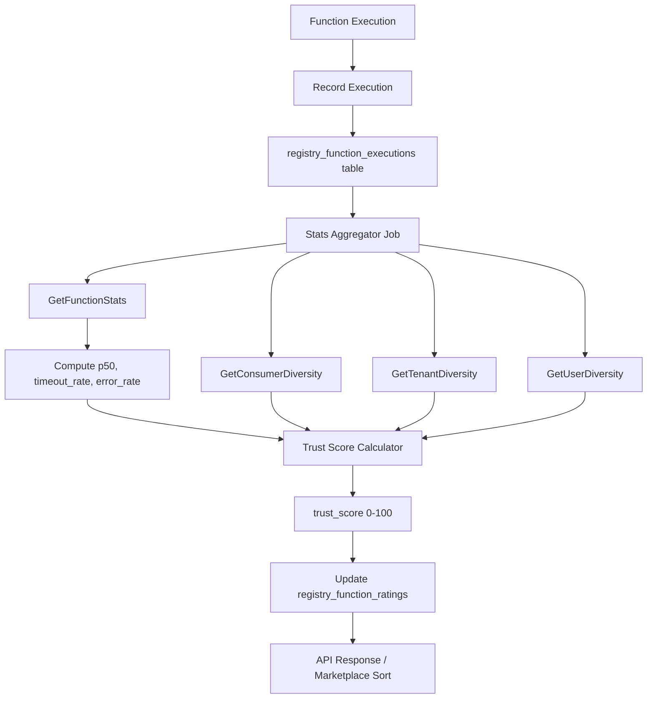

# Trust & Safety Scoring System - Implementation Plan

## Overview

This document outlines the implementation plan for a Trust & Safety Scoring System that generates a `trust_score` (0-100) for each function in the marketplace. The trust score becomes the primary sorting algorithm for the function marketplace.

## Metrics to Track

The system automatically accumulates the following metrics:

| Metric | Description | Source | Status |
|--------|-------------|--------|--------|
| `success_rate` | Percentage of successful executions | Execution outcomes | Existing |
| `p50_latency` | Median execution latency in ms | Execution duration | **New** |
| `p95_latency` | 95th percentile latency in ms | Execution duration | Existing |
| `timeout_rate` | Percentage of timeout executions | Execution outcomes | **New** |
| `error_rate` | Percentage of error executions | Execution outcomes | **New** |
| `determinism_score` | Whether function is marked deterministic | FunctionVersion.deterministic | Existing |
| `usage_volume` | Total number of calls | Execution count | Existing |
| `consumer_diversity` | Unique caller IP distribution | Execution CallerIP | **Enhanced** |
| `tenant_diversity` | Unique tenant ID count | Execution TenantID | **New** |
| `user_diversity` | Unique authenticated user count | Execution UserID | **New** |

## Trust Score Calculation Formula

### Recommended Weighted Model

```
trust_score = (success_rate * 0.20) + 
              (latency_score * 0.15) + 
              (reliability_score * 0.20) + 
              (determinism_score * 0.10) + 
              (volume_score * 0.10) + 
              (diversity_score * 0.25)
```

Where:

- **success_rate**: Raw percentage (0-100)
- **latency_score**: Composite of p50/p95 latency (lower is better)
- **reliability_score**: 100 - (error_rate + timeout_rate * 0.5)
- **determinism_score**: 100 if deterministic, 50 otherwise
- **volume_score**: Logarithmic scale based on total calls
- **diversity_score**: Weighted composite (tenant: 40%, user: 20%, IP: 10%, stability: 10%, age: 10%, error_rate: 10%)

### Anti-Gaming Rules

1. **Minimum threshold**: Function must have at least 10 executions to receive a trust score
2. **Sustained usage**: Only count tenants with 20+ calls over 7 days
3. **Freshness decay**: Trust scores decay if no activity in 30 days
4. **Velocity cap**: Burst traffic is weighted lower than steady usage

## Implementation Steps

### Phase 1: Database Schema Changes

1. **Add columns to `registry_function_ratings` table:**
   ```sql
   ALTER TABLE registry_function_ratings ADD COLUMN p50_latency_ms INT DEFAULT 0;
   ALTER TABLE registry_function_ratings ADD COLUMN timeout_rate FLOAT DEFAULT 0;
   ALTER TABLE registry_function_ratings ADD COLUMN error_rate FLOAT DEFAULT 0;
   ALTER TABLE registry_function_ratings ADD COLUMN consumer_diversity FLOAT DEFAULT 0;
   ALTER TABLE registry_function_ratings ADD COLUMN tenant_diversity INT DEFAULT 0;
   ALTER TABLE registry_function_ratings ADD COLUMN user_diversity INT DEFAULT 0;
   ALTER TABLE registry_function_ratings ADD COLUMN trust_score FLOAT DEFAULT 0;
   ALTER TABLE registry_function_ratings ADD COLUMN trust_updated_at TIMESTAMP;
   ```

2. **Add columns to `registry_function_executions` table:**
   ```sql
   ALTER TABLE registry_function_executions ADD COLUMN tenant_id UUID;
   ALTER TABLE registry_function_executions ADD COLUMN user_id UUID;
   ```

### Phase 2: Repository Layer

1. **Extend `GetFunctionStats` SQL query:**
   - Add p50_latency calculation using `PERCENTILE_CONT(0.50)`
   - Add timeout_rate: `SUM(CASE WHEN outcome = 'timeout' THEN 1 ELSE 0 END) * 100.0 / COUNT(*)`
   - Add error_rate: `SUM(CASE WHEN outcome = 'error' THEN 1 ELSE 0 END) * 100.0 / COUNT(*)`

2. **Add new repository methods:**
   - `GetConsumerDiversity(functionID, since)` - Count unique IPs with geo grouping
   - `GetTenantDiversity(functionID, since)` - Count unique tenant IDs
   - `GetUserDiversity(functionID, since)` - Count unique user IDs
   - `UpdateTrustScore(functionID, score)` - Store computed trust score

### Phase 3: Trust Score Service

Create `internal/functionregistry/trust_score.go`:

```go
type TrustScoreCalculator struct{}

func (t *TrustScoreCalculator) Calculate(rating *RegistryFunctionRating) float64 {
    // Implement weighted formula
    // Apply anti-gaming rules
    // Handle edge cases (new functions, stale data)
}
```

### Phase 4: Aggregator Integration

Update `StatsAggregator.aggregateFunction()` to:
1. Call new repository methods for diversity metrics
2. Calculate trust score using TrustScoreCalculator
3. Update rating record with all new metrics and trust_score

### Phase 5: API Exposure

1. **Update `FunctionInfo` response:**
   ```go
   type FunctionInfo struct {
       // ... existing fields
       TrustScore       float64 `json:"trust_score"`
       SuccessRate      float64 `json:"success_rate"`
       P50LatencyMs     int     `json:"p50_latency_ms"`
       P95LatencyMs     int     `json:"p95_latency_ms"`
       TimeoutRate      float64 `json:"timeout_rate"`
       ErrorRate        float64 `json:"error_rate"`
       ConsumerDiversity float64 `json:"consumer_diversity"`
       TenantDiversity  int     `json:"tenant_diversity"`
       UserDiversity    int     `json:"user_diversity"`
   }
   ```

2. **Update `SearchFunctions` to sort by trust_score:**
   ```go
   dbQuery.Order("trust_score DESC, popularity_score DESC")
   ```

3. **Add new endpoint for detailed trust breakdown:**
   ```
   GET /registry/{author}/{name}/trust
   ```

### Phase 6: Marketplace Integration

Update function listing pages to display trust score prominently with:
- Visual indicator (badge/level like A, B, C)
- Component metric tooltips
- Sort by trust as default

## File Changes Summary

| File | Changes |
|------|---------|
| `internal/storage/registry_models.go` | Add new columns to RegistryFunctionRating |
| `internal/storage/registry_repository.go` | Extend GetFunctionStats, add diversity methods |
| `internal/functionregistry/trust_score.go` | **NEW** - Trust calculation logic |
| `internal/functionregistry/aggregator.go` | Integrate trust score calculation |
| `internal/api/handlers/registry/query.go` | Update FunctionInfo with trust fields |
| `internal/api/handlers/registry/stats.go` | Add trust detail endpoint |
| `migrations/` | Add new migration file |

## Testing Strategy

1. **Unit tests for TrustScoreCalculator:**
   - Test all weight combinations
   - Test edge cases (0 calls, 100% failure, etc.)
   - Test anti-gaming rule enforcement

2. **Integration tests:**
   - Verify stats aggregation produces correct trust scores
   - Verify API returns trust scores correctly

3. **Performance tests:**
   - Verify diversity queries don't slow down aggregation
   - Consider caching strategies for expensive diversity calculations

## Mermaid Diagram: Trust Score Flow



## Future Enhancements (Phase 2+)

- Stake-based trust (developers stake tokens)
- Verified organization boost
- Enterprise endorsements
- SLA compliance weighting
- Community rating multiplier
- Real-time trust score updates (vs. daily aggregation)
