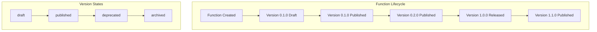
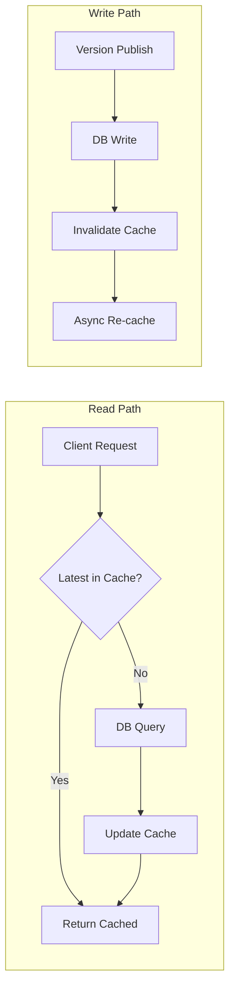
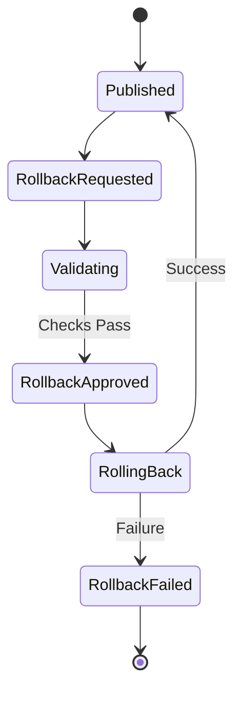
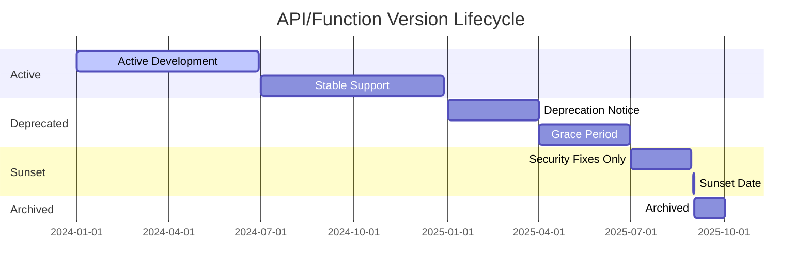
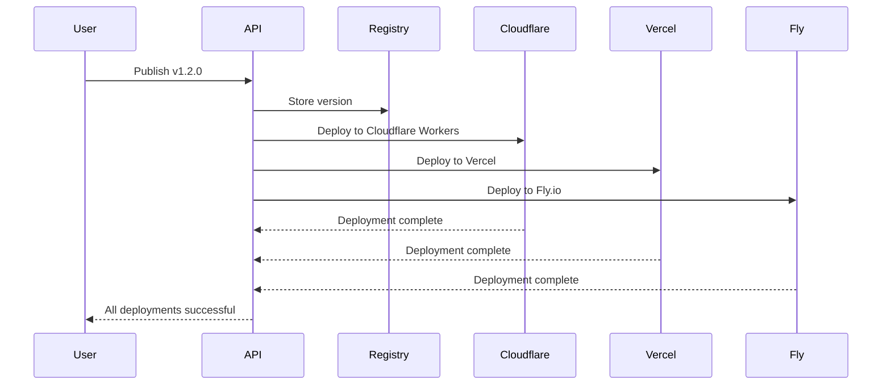

# FunctionFly Versioning System Architecture

> **Document Status:** Architecture Specification  
> **Target:** Code Implementation Handoff  
> **Last Updated:** 2026-03-09

---

## Table of Contents

1. [Executive Summary](#executive-summary)
2. [Version Types and Scope](#version-types-and-scope)
3. [Numbering Conventions](#numbering-conventions)
4. [Storage Model](#storage-model)
5. [API Design for Version Management](#api-design-for-version-management)
6. [Rollback and Migration Strategies](#rollback-and-migration-strategies)
7. [Deprecation Lifecycle](#deprecation-lifecycle)
8. [Implementation Priorities](#implementation-priorities)
9. [Multi-Tenant Considerations](#multi-tenant-considerations)
10. [Edge Provider Compatibility](#edge-provider-compatibility)

---

## Executive Summary

This document defines a comprehensive versioning system for the FunctionFly serverless edge platform. The system addresses five distinct versioning domains:

1. **API Versioning** - Platform REST/GraphQL API lifecycle management
2. **Function/Edge Code Versioning** - User-deployed serverless function versions
3. **Deployment Versioning** - Tracking deployments and their states across providers
4. **Schema/Configuration Versioning** - Database schemas and environment configurations
5. **Contract Versioning** - Internal service communication protocols

The design prioritizes backward compatibility, clear migration paths, and operational simplicity while supporting multiple deployment targets (Cloudflare Workers, Vercel, Fly.io, Deno Deploy).

---

## Version Types and Scope

### 2.1 API Versioning

**Scope:** All public and internal HTTP APIs exposed by the platform.

| Version Type | Description | Lifetime |
|--------------|-------------|----------|
| `v1` | Initial stable API | Active until sunset |
| `v2` | Feature expansion API | Active development |
| `v3` | Future major version | Planned |

**Version Boundaries:**
- Major version (`vX`) - Breaking changes
- Minor version (`vX.Y`) - Backward-compatible additions
- Patch version (`vX.Y.Z`) - Bug fixes only (never affects API)

### 2.2 Function/Edge Code Versioning

**Scope:** User-deployed serverless functions stored in the registry.



**Version Identifiers:**
- Unique UUID for each version entry
- Semantic version string for user reference
- Content hash for immutability verification

### 2.3 Deployment Versioning

**Scope:** Each deployment attempt across all edge providers.

| State | Description |
|-------|-------------|
| `pending` | Deployment queued |
| `building` | Artifact being prepared |
| `deploying` | Push to edge provider |
| `success` | Active and serving traffic |
| `failed` | Deployment failed |
| `rolled_back` | Reverted to previous version |

### 2.4 Schema/Configuration Versioning

**Scope:** Database migrations and environment configurations.

**Migration Version Format:** `YYYYMMDDHHMMSS_description`

```sql
-- Example migration filename
-- 20260309120000_add_versioning_tables.up.sql
-- 20260309120000_add_versioning_tables.down.sql
```

### 2.5 Contract Versioning

**Scope:** gRPC and internal HTTP communication between services.

| Contract Type | Versioning Strategy |
|---------------|---------------------|
| Internal gRPC | Major version in proto package |
| Service-to-Service HTTP | Header-based version negotiation |
| Event/Message formats | Schema registry with version IDs |

---

## Numbering Conventions

### 3.1 Semantic Versioning (SemVer) Foundation

All user-facing versions follow [Semantic Versioning 2.0.0](https://semver.org/):

```
MAJOR.MINOR.PATCH[-prerelease][+buildmetadata]
```

| Component | Rule | Example |
|-----------|------|---------|
| MAJOR | Breaking changes | `1.0.0` → `2.0.0` |
| MINOR | New features (backward compatible) | `1.0.0` → `1.1.0` |
| PATCH | Bug fixes (backward compatible) | `1.0.0` → `1.0.1` |
| Prerelease | Alpha/Beta/RC releases | `1.0.0-alpha.1` |
| Build | CI/CD build identifiers | `1.0.0+build.123` |

### 3.2 Platform-Specific Version Schemes

#### API Versions
```
v{major}[.minor[.patch]]
Examples: v1, v2.0, v2.1.0
```

#### Function Versions
```
{major}.{minor}.{minor}[-{prerelease}]
Examples: 1.0.0, 0.9.0-beta, 2.0.0-rc.1
```

#### Deployment Versions
```
{function-version}-{deployment-count}-{provider}-{timestamp}
Examples: 1.0.0-42-cloudflare-20260309T120000Z
```

#### Migration Versions
```
YYYYMMDDHHMMSS_{description}
Examples: 20260309120000_add_versioning_system
```

### 3.3 Version Aliases

The platform supports symbolic version references:

| Alias | Resolves To |
|-------|-------------|
| `latest` | Highest published version |
| `stable` | Highest non-prerelease version |
| `draft` | Unpublished work version |

---

## Storage Model

### 4.1 Database Schema Extensions

#### Core Version Tables

```sql
-- API Versions table
CREATE TABLE api_versions (
    id UUID PRIMARY KEY DEFAULT gen_random_uuid(),
    version VARCHAR(20) NOT NULL UNIQUE,
    status VARCHAR(20) NOT NULL DEFAULT 'active',
    released_at TIMESTAMPTZ NOT NULL,
    deprecated_at TIMESTAMPTZ,
    sunset_at TIMESTAMPTZ,
    sunset_message TEXT,
    created_at TIMESTAMPTZ DEFAULT NOW(),
    updated_at TIMESTAMPTZ DEFAULT NOW()
);

-- Function versions (extends existing registry)
ALTER TABLE registry_function_versions ADD COLUMN IF NOT EXISTS version_state VARCHAR(20) DEFAULT 'published';
ALTER TABLE registry_function_versions ADD COLUMN IF NOT EXISTS deprecation_reason TEXT;
ALTER TABLE registry_function_versions ADD COLUMN IF NOT EXISTS replaced_by_version VARCHAR(50);
ALTER TABLE registry_function_versions ADD COLUMN IF NOT EXISTS migration_guide TEXT;

-- Function version changelog
CREATE TABLE function_version_changelog (
    id UUID PRIMARY KEY DEFAULT gen_random_uuid(),
    function_id UUID NOT NULL REFERENCES registry_functions(id),
    from_version VARCHAR(50) NOT NULL,
    to_version VARCHAR(50) NOT NULL,
    change_type VARCHAR(20) NOT NULL,
    change_category VARCHAR(50) NOT NULL,
    description TEXT NOT NULL,
    breaking_changes JSONB,
    migration_steps JSONB,
    created_by UUID REFERENCES users(id),
    created_at TIMESTAMPTZ DEFAULT NOW()
);

-- Deployment versions
CREATE TABLE deployment_versions (
    id UUID PRIMARY KEY DEFAULT gen_random_uuid(),
    function_id UUID NOT NULL REFERENCES functions(id),
    function_version VARCHAR(50) NOT NULL,
    deployment_id UUID NOT NULL REFERENCES deployments(id),
    provider VARCHAR(50) NOT NULL,
    region VARCHAR(50),
    status VARCHAR(20) NOT NULL DEFAULT 'pending',
    artifact_uri TEXT,
    checksum VARCHAR(64),
    rollback_id UUID REFERENCES deployment_versions(id),
    metadata JSONB,
    created_at TIMESTAMPTZ DEFAULT NOW(),
    completed_at TIMESTAMPTZ
);

-- Schema migrations version tracking (extends existing)
ALTER TABLE schema_migrations ADD COLUMN IF NOT EXISTS checksum VARCHAR(64);
ALTER TABLE schema_migrations ADD COLUMN IF NOT EXISTS rollback_available BOOLEAN DEFAULT true;

-- Contract versions for internal services
CREATE TABLE service_contracts (
    id UUID PRIMARY KEY DEFAULT gen_random_uuid(),
    service_name VARCHAR(100) NOT NULL,
    contract_version VARCHAR(50) NOT NULL,
    contract_type VARCHAR(20) NOT NULL,
    schema JSONB NOT NULL,
    status VARCHAR(20) DEFAULT 'active',
    introduced_in_release VARCHAR(50),
    deprecated_in_release VARCHAR(50),
    removed_in_release VARCHAR(50),
    created_at TIMESTAMPTZ DEFAULT NOW()
);
```

### 4.2 Storage Backends

| Version Type | Storage Location | Retention |
|--------------|------------------|-----------|
| Function source code | Object storage (S3/MinIO) | Forever (with archival) |
| Deployment artifacts | Object storage | 90 days default |
| API response cache | Redis | Configurable TTL |
| Changelog entries | PostgreSQL | Forever |
| Contract schemas | PostgreSQL + etcd | Until removal + 1 year |

### 4.3 Caching Strategy



---

## API Design for Version Management

### 5.1 API Version Endpoints

#### List Available API Versions
```
GET /v1/api/versions

Response:
{
    "versions": [
        {
            "version": "v2",
            "status": "active",
            "releasedAt": "2025-01-15T00:00:00Z",
            "features": ["graphql", "webhooks"],
            "deprecation": null
        },
        {
            "version": "v1",
            "status": "deprecated",
            "releasedAt": "2024-01-01T00:00:00Z",
            "deprecation": {
                "deprecatedAt": "2025-06-01T00:00:00Z",
                "sunsetAt": "2025-12-31T00:00:00Z",
                "migrationGuide": "/docs/v1-to-v2-migration"
            }
        }
    ]
}
```

#### Get API Version Details
```
GET /v1/api/versions/{version}

Response:
{
    "version": "v2",
    "status": "active",
    "openapiSpec": "/v1/api/versions/v2/openapi.json",
    "changelog": "/v1/api/versions/v2/changelog",
    "supportedUntil": "2026-12-31T23:59:59Z"
}
```

### 5.2 Function Version Endpoints

#### Publish Function Version
```
POST /v1/functions/{functionId}/versions

Request:
{
    "version": "1.2.0",
    "code": "base64-encoded-source",
    "runtime": "python311",
    "manifest": {
        "name": "sentiment-analyzer",
        "entrypoint": "handler",
        "timeout": 30000,
        "memory": 256
    },
    "changelog": {
        "changes": [
            {
                "type": "feature",
                "category": "performance",
                "description": "Added caching layer"
            }
        ]
    },
    "conflictStrategy": "error" // error | overwrite | create_new
}

Response:
{
    "id": "fnv_abc123",
    "functionId": "fn_xyz789",
    "version": "1.2.0",
    "status": "published",
    "contentHash": "sha256:abc123...",
    "publishedAt": "2026-03-09T12:00:00Z"
}
```

#### List Function Versions
```
GET /v1/functions/{functionId}/versions

Query Parameters:
- status: filter by version state (draft | published | deprecated | archived)
- limit: max results (default: 20)
- cursor: pagination cursor

Response:
{
    "versions": [
        {
            "version": "1.2.0",
            "status": "published",
            "publishedAt": "2026-03-09T12:00:00Z",
            "runtime": "python311",
            "isLatest": true,
            "isStable": true
        },
        {
            "version": "1.1.0",
            "status": "published",
            "publishedAt": "2026-02-15T10:00:00Z",
            "runtime": "python311",
            "isLatest": false,
            "isStable": true
        }
    ],
    "pagination": {
        "nextCursor": "abc123",
        "hasMore": false
    }
}
```

#### Get Specific Version
```
GET /v1/functions/{functionId}/versions/{version}

Response:
{
    "id": "fnv_abc123",
    "functionId": "fn_xyz789",
    "version": "1.2.0",
    "status": "published",
    "runtime": "python311",
    "manifest": {...},
    "contentHash": "sha256:abc123...",
    "bundleSize": 45678,
    "publishedAt": "2026-03-09T12:00:00Z",
    "changelog": {...},
    "deprecation": null,
    "canRollback": true,
    "rollbackToVersion": "1.1.0"
}
```

#### Deprecate Function Version
```
POST /v1/functions/{functionId}/versions/{version}/deprecate

Request:
{
    "reason": "Security vulnerability in runtime",
    "replacedByVersion": "1.2.0",
    "migrationGuide": "https://docs.functionfly.com/migrations/v1.1-to-v1.2",
    "effectiveAt": "2026-04-01T00:00:00Z",
    "gracePeriodDays": 30
}

Response:
{
    "version": "1.1.0",
    "status": "deprecated",
    "deprecatedAt": "2026-03-09T12:00:00Z",
    "sunsetAt": "2026-04-08T00:00:00Z",
    "migrationGuide": "..."
}
```

### 5.3 Deployment Version Endpoints

#### Create Deployment
```
POST /v1/functions/{functionId}/deployments

Request:
{
    "version": "1.2.0",
    "providers": ["cloudflare", "vercel"],
    "regions": ["iad", "sfo"],
    "strategy": "rolling", // rolling | blue-green | canary
    "trafficShift": 100
}

Response:
{
    "id": "dpl_abc123",
    "functionId": "fn_xyz789",
    "functionVersion": "1.2.0",
    "status": "pending",
    "provider": "cloudflare",
    "region": "iad",
    "createdAt": "2026-03-09T12:00:00Z"
}
```

#### List Deployments
```
GET /v1/functions/{functionId}/deployments

Response:
{
    "deployments": [
        {
            "id": "dpl_abc123",
            "version": "1.2.0",
            "status": "success",
            "provider": "cloudflare",
            "region": "iad",
            "url": "https://fn-xyz789.edge.functionfly.dev",
            "deployedAt": "2026-03-09T12:05:00Z"
        },
        {
            "id": "dpl_def456",
            "version": "1.1.0",
            "status": "rolled_back",
            "provider": "vercel",
            "region": "iad1",
            "deployedAt": "2026-02-15T10:00:00Z"
        }
    ]
}
```

#### Rollback Deployment
```
POST /v1/functions/{functionId}/deployments/{deploymentId}/rollback

Request:
{
    "toVersion": "1.1.0", // optional, defaults to previous
    "strategy": "immediate"
}

Response:
{
    "rollbackId": "dpl_rbk789",
    "previousDeploymentId": "dpl_abc123",
    "rollbackToVersion": "1.1.0",
    "status": "success",
    "completedAt": "2026-03-09T12:10:00Z"
}
```

### 5.4 Schema Migration Endpoints

#### Get Migration Status
```
GET /v1/admin/migrations/status

Response:
{
    "currentVersion": "20260309120000",
    "pendingMigrations": [
        {
            "version": "20260310000000",
            "description": "add_versioning_system",
            "appliedAt": null,
            "canRollback": true
        }
    ],
    "migrationHistory": [...]
}
```

#### Apply Migration
```
POST /v1/admin/migrations

Request:
{
    "direction": "up",
    "version": "20260310000000"
}
```

---

## Rollback and Migration Strategies

### 6.1 Function Version Rollback



**Rollback Types:**

| Type | Behavior | Use Case |
|------|----------|----------|
| `immediate` | Instant switch to previous version | Critical bugs |
| `gradual` | Percentage-based traffic shift | Non-critical issues |
| `canary` | Route subset of traffic first | Testing rollback |

### 6.2 Deployment Rollback

**Automated Rollback Triggers:**
- Health check failure rate > 10% for 2 minutes
- Error rate > 5% for 1 minute
- Latency p99 > 5000ms for 3 minutes

**Manual Rollback Flow:**
```
1. User initiates rollback via API/Dashboard
2. System validates target version exists
3. Create new deployment with target version
4. Update routing to point to new deployment
5. Mark previous deployment as "rolled_back"
6. Emit audit event
```

### 6.3 Database Migration Rollback

```sql
-- Migration structure (extends existing system)
-- File: 20260309120000_add_versioning_system.up.sql
BEGIN;

-- Create new tables
CREATE TABLE api_versions (...);
CREATE TABLE function_version_changelog (...);

-- Record migration
INSERT INTO schema_migrations (version, checksum, rollback_available)
VALUES ('20260309120000', 'sha256:abc123', true);

COMMIT;
```

```sql
-- File: 20260309120000_add_versioning_system.down.sql
BEGIN;

-- Rollback changes
DROP TABLE IF EXISTS function_version_changelog;
DELETE FROM schema_migrations WHERE version = '20260309120000';

COMMIT;
```

### 6.4 Contract Version Migration

**Internal Service Communication:**
- Services declare supported contract versions on startup
- Gateway negotiates compatible version
- Version mismatch returns error with supported versions

```go
// Service registration example
serviceRegistry.Register("orchestrator", []string{"v1.0", "v1.1", "v2.0"})

// Request version negotiation
Header: X-Contract-Version: v1.1
Response: X-Accepted-Version: v1.1
```

---

## Deprecation Lifecycle

### 7.1 Lifecycle States



### 7.2 State Definitions

| State | Description | API Access | Features |
|-------|-------------|------------|----------|
| `active` | Fully supported | Full | All |
| `deprecated` | Under maintenance | Full with warning | Bug fixes only |
| `sunset` | End of life | Read-only | None |
| `archived` | Removed from active | Limited | Metadata only |

### 7.3 Deprecation Policy

**Timeline Requirements:**

| API Change Type | Minimum Notice | Maximum Lifetime |
|-----------------|----------------|-----------------|
| Major (breaking) | 6 months | 18 months |
| Minor (new feature) | 3 months | 12 months |
| Patch (bug fix) | 1 month | 6 months |

**Required Deprecation Communication:**
1. Deprecation announcement in API response headers
2. Dashboard notification 30 days before sunset
3. Email notification for affected tenants
4. Migration guide documentation
5. Sunset date clearly visible in API explorer

### 7.4 Deprecation Response Headers

```
Deprecation: true
Sunset: Sat, 01 Jan 2026 00:00:00 GMT
Link: <https://api.functionfly.com/docs/v2-migration>; rel="migration-guide"
X-API-Warning: This endpoint will be removed in v3.0
```

---

## Implementation Priorities

### 8.1 Phase 1: Foundation (Weeks 1-2)

**Priority: Critical**

| Task | Description | Dependencies |
|------|-------------|--------------|
| Database migrations | Add version tracking tables | None |
| API version middleware | Version detection and routing | None |
| Function version model | Extend existing registry | DB migrations |
| Basic versioning API | CRUD for versions | None |

**Deliverables:**
- New database tables created and migrated
- API version detection (URL path + header)
- Function version listing and retrieval

### 8.2 Phase 2: Core Features (Weeks 3-4)

**Priority: High**

| Task | Description | Dependencies |
|------|-------------|--------------|
| Version publishing | Publish new function versions | Phase 1 |
| Deprecation system | Mark versions as deprecated | Phase 1 |
| Changelog tracking | Auto-generate changelogs | Phase 1 |
| Rollback API | Deploy previous versions | Phase 1 |

**Deliverables:**
- Full version lifecycle management
- Deprecation notices and sunset dates
- Changelog generation and display
- One-click rollback functionality

### 8.3 Phase 3: Advanced Features (Weeks 5-6)

**Priority: Medium**

| Task | Description | Dependencies |
|------|-------------|--------------|
| Deployment versioning | Full deployment tracking | Phase 2 |
| Contract versioning | Internal service contracts | None |
| Schema versioning | Migration tracking | None |
| Analytics | Version usage dashboards | Phase 2 |

**Deliverables:**
- Complete deployment history
- Service contract registry
- Migration rollback capabilities
- Usage analytics

### 8.4 Phase 4: Polish (Weeks 7-8)

**Priority: Low**

| Task | Description | Dependencies |
|------|-------------|--------------|
| Documentation | Versioning user guide | Phase 3 |
| Dashboard integration | Version UI in dashboard | Phase 2 |
| Monitoring | Version health alerts | Phase 3 |
| Testing | Comprehensive test suite | All |

**Deliverables:**
- User documentation
- Dashboard version management
- Alerting rules
- Test coverage > 80%

---

## Multi-Tenant Considerations

### 9.1 Tenant Isolation

**Version Access Control:**
- Tenants can only access their own function versions
- Admin can view all tenant versions
- Cross-tenant version sharing requires explicit grant

```sql
-- Tenant-scoped version queries
CREATE INDEX idx_function_versions_tenant 
ON function_versions(tenant_id, created_at DESC);
```

### 9.2 Tenant-Specific Version Policies

| Feature | Per-Tenant Setting |
|---------|-------------------|
| Max versions per function | Configurable (default: 100) |
| Version retention | Configurable (default: forever) |
| Deprecation timeline | Can extend grace period |
| Rollback permissions | Role-based |

### 9.3 Multi-Tenant Versioning API

```
GET /v1/tenants/{tenantId}/functions/{functionId}/versions

-- Requires tenant admin or platform admin role
-- Audit logged for compliance
```

---

## Edge Provider Compatibility

### 10.1 Provider-Specific Considerations

| Provider | Version Manifest | Deployment ID | Rollback Support |
|----------|------------------|---------------|------------------|
| Cloudflare Workers | Wrangler.toml version | Deployment ID | Yes (via Workers API) |
| Vercel | vercel.json | Deployment ID | Yes (via Vercel API) |
| Fly.io | fly.toml | Release ID | Yes (flyctl rollback) |
| Deno Deploy | deno.json | Deployment ID | Yes (Deno Deploy API) |

### 10.2 Version Metadata per Provider

```json
{
    "version": "1.2.0",
    "providerVersions": {
        "cloudflare": {
            "workerName": "fn-xyz789-v1-2-0",
            "etag": "abc123",
            "deployedAt": "2026-03-09T12:00:00Z"
        },
        "vercel": {
            "deploymentId": "dpl_abc123",
            "url": "fn-xyz789-v1-2-0.vercel.app"
        },
        "fly": {
            "releaseId": "v45",
            "region": "iad"
        },
        "deno": {
            "deploymentId": "fn-xyz789",
            "url": "fn-xyz789.deno.dev"
        }
    }
}
```

### 10.3 Cross-Provider Version Sync



---

## Appendix A: Error Codes

| Code | Description |
|------|-------------|
| `VERSION_NOT_FOUND` | Requested version does not exist |
| `VERSION_CONFLICT` | Version already exists (with conflict strategy) |
| `VERSION_DEPRECATED` | Version is deprecated |
| `VERSION_SUNSET` | Version has been sunset |
| `ROLLBACK_FAILED` | Rollback operation failed |
| `MIGRATION_FAILED` | Database migration failed |
| `CONTRACT_INCOMPATIBLE` | Service contract version mismatch |

---

## Appendix B: Rate Limits

| Endpoint | Limit |
|----------|-------|
| Publish version | 10/minute/tenant |
| List versions | 100/minute/tenant |
| Rollback | 5/minute/tenant |
| Migration operations | 1/minute/tenant |

---

## Appendix C: Audit Events

All version operations are logged for compliance:

```json
{
    "eventId": "evt_abc123",
    "eventType": "VERSION_PUBLISHED",
    "tenantId": "tenant_xyz",
    "functionId": "fn_abc",
    "version": "1.2.0",
    "actor": "user_123",
    "timestamp": "2026-03-09T12:00:00Z",
    "metadata": {
        "runtime": "python311",
        "contentHash": "sha256:...",
        "source": "api"
    }
}
```

---

**Document Version:** 1.0  
**Next Review:** 2026-04-01  
**Owner:** Platform Architecture Team
