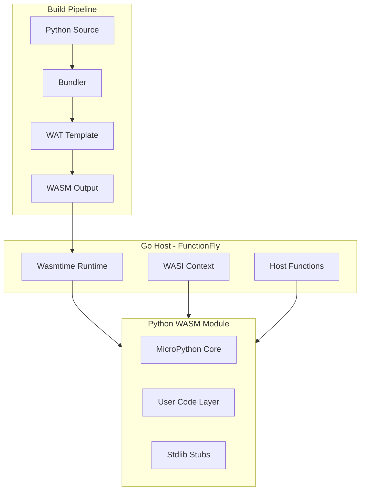

# Standalone WASI Python Runtime Architecture

## Executive Summary

This document defines the architecture for a true standalone WASI-compatible Python runtime that can execute Python code in Wasmtime/Wasmer without JavaScript dependencies. This enables FunctionFly to run Python functions in any WASI-compliant runtime, including edge environments.

## Current Progress

**✅ COMPLETED:** Phases 1-3 (Core Runtime + Host Integration + Standard Library)
**🔄 CURRENT:** Phase 4 (Production Hardening)
**📋 NEXT:** Phase 5 (Edge Runtime Support)

The runtime foundation is solid with a working WAT-based Python interpreter. Core WASI integration, host functions, and memory management are implemented. Now focusing on expanding Python standard library support for production use.

## Current State Analysis

### Existing Implementation

| Component | Status | Limitation |
|-----------|--------|------------|
| `micropython-core.wasm` | 935 bytes | Placeholder, not functional |
| `micropython-full.wasm` | 1.1 MB | Requires JavaScript glue code |
| `micropython.wasm` | 425 KB | Emscripten build, JS-dependent |
| `minimal-python.wat` | 14.9 KB | ✅ Functional WAT interpreter |
| `minimal-python.wasm` | ~15 KB | ✅ Compiled WASM runtime |

### Key Problem

The current MicroPython WebAssembly builds use Emscripten and require JavaScript host functions for:

- REPL interaction
- Module loading
- Some I/O operations

For standalone WASI execution, we need a build that:

1. Uses only `wasi_snapshot_preview1` imports
2. Has no `env.*` or JavaScript imports
3. Is self-contained with no external glue code

## Architecture Overview



## Component Design

### 1. WASI Interface Requirements

The standalone Python runtime must use only WASI preview1 imports:

```wat
;; Required WASI imports
(import "wasi_snapshot_preview1" "fd_write" 
  (func $fd_write (param i32 i32 i32 i32) (result i32)))
(import "wasi_snapshot_preview1" "fd_read" 
  (func $fd_read (param i32 i32 i32 i32) (result i32)))
(import "wasi_snapshot_preview1" "fd_seek" 
  (func $fd_seek (param i32 i64 i32 i32) (result i32)))
(import "wasi_snapshot_preview1" "fd_close" 
  (func $fd_close (param i32) (result i32)))
(import "wasi_snapshot_preview1" "environ_get" 
  (func $environ_get (param i32 i32) (result i32)))
(import "wasi_snapshot_preview1" "environ_sizes_get" 
  (func $environ_sizes_get (param i32 i32) (result i32)))
(import "wasi_snapshot_preview1" "args_get" 
  (func $args_get (param i32 i32) (result i32)))
(import "wasi_snapshot_preview1" "args_sizes_get" 
  (func $args_sizes_get (param i32 i32) (result i32)))
(import "wasi_snapshot_preview1" "random_get" 
  (func $random_get (param i32 i32) (result i32)))
(import "wasi_snapshot_preview1" "clock_time_get" 
  (func $clock_time_get (param i32 i64 i32) (result i32)))
(import "wasi_snapshot_preview1" "proc_exit" 
  (func $proc_exit (param i32)))
```

### 2. Module Export Interface

The Python WASM module must export a standard interface for FunctionFly:

```wat
(module
  ;; Memory for data exchange
  (memory (export "memory") 16)  ;; 1MB minimum
  
  ;; Initialize the Python runtime
  (func (export "init") 
    (result i32)  ;; 0 = success, non-zero = error code
  )
  
  ;; Load Python source code into the runtime
  (func (export "load_code") 
    (param $ptr i32) (param $len i32)
    (result i32)  ;; 0 = success
  )
  
  ;; Execute the loaded code with input
  (func (export "execute") 
    (param $input_ptr i32) (param $input_len i32)
    (param $output_ptr i32) (param $output_len_ptr i32)
    (result i32)  ;; 0 = success, output written to output_ptr
  )
  
  ;; Allocate memory for host writes
  (func (export "alloc") 
    (param $size i32) 
    (result i32)  ;; pointer to allocated memory
  )
  
  ;; Deallocate memory
  (func (export "dealloc") 
    (param $ptr i32) (param $size i32)
  )
  
  ;; Get runtime metadata
  (func (export "metadata") 
    (result i32)  ;; pointer to JSON metadata
  )
)
```

### 3. Host Function Interface

FunctionFly-specific host functions provided by the Go runtime:

```wat
;; FunctionFly host functions - imported by the WASM module
(import "functionfly" "log" 
  (func $ff_log (param $msg_ptr i32) (param $msg_len i32)))
(import "functionfly" "fetch" 
  (func $ff_fetch (param $req_ptr i32) (param $req_len i32)
         (param $resp_ptr i32) (param $resp_len_ptr i32)
         (result i32)))
(import "functionfly" "kv_get" 
  (func $ff_kv_get (param $key_ptr i32) (param $key_len i32)
         (param $val_ptr i32) (param $val_len_ptr i32)
         (result i32)))
(import "functionfly" "kv_set" 
  (func $ff_kv_set (param $key_ptr i32) (param $key_len i32)
         (param $val_ptr i32) (param $val_len i32)
         (result i32)))
(import "functionfly" "get_env" 
  (func $ff_get_env (param $name_ptr i32) (param $name_len i32)
         (param $val_ptr i32) (param $val_len_ptr i32)
         (result i32)))
```

### 4. Go Host Runtime Integration

Using `wasmtime-go` for WASI execution:

```go
// internal/wasm/runtime.go
package wasm

import (
    "github.com/bytecodealliance/wasmtime-go/v19"
)

type PythonRuntime struct {
    engine    *wasmtime.Engine
    module    *wasmtime.Module
    store     *wasmtime.Store
    instance  *wasmtime.Instance
}

func NewPythonRuntime() (*PythonRuntime, error) {
    // Create engine with WASI support
    engine := wasmtime.NewEngine()
    
    // Load precompiled MicroPython WASI module
    module, err := wasmtime.NewModuleFromFile(engine, "micropython-wasi.wasm")
    if err != nil {
        return nil, err
    }
    
    // Create store with WASI configuration
    store := wasmtime.NewStore(engine)
    
    // Configure WASI
    wasiConfig := wasmtime.NewWasiConfig()
    wasiConfig.SetStdout(stdout)
    wasiConfig.SetStderr(stderr)
    wasiConfig.SetEnv([]string{"PYTHONPATH=/lib"}, nil)
    store.SetWasi(wasiConfig)
    
    // Create linker with WASI and host functions
    linker := wasmtime.NewLinker(engine)
    linker.DefineWasi()
    
    // Define FunctionFly host functions
    linker.DefineFunc(store, "functionfly", "log", logHandler)
    linker.DefineFunc(store, "functionfly", "fetch", fetchHandler)
    // ... more host functions
    
    // Instantiate
    instance, err := linker.Instantiate(store, module)
    
    return &PythonRuntime{engine, module, store, instance}, nil
}

func (r *PythonRuntime) Execute(code string, input []byte) ([]byte, error) {
    // Call init
    init := r.instance.GetExport(r.store, "init").Func()
    init.Call(r.store)
    
    // Load code
    loadCode := r.instance.GetExport(r.store, "load_code").Func()
    codePtr := r.alloc(len(code))
    r.writeMemory(codePtr, []byte(code))
    loadCode.Call(r.store, codePtr, len(code))
    
    // Execute
    execute := r.instance.GetExport(r.store, "execute").Func()
    inputPtr := r.alloc(len(input))
    r.writeMemory(inputPtr, input)
    outputPtr := r.alloc(4096)
    outputLenPtr := r.alloc(4)
    
    result, err := execute.Call(r.store, inputPtr, len(input), outputPtr, outputLenPtr)
    
    // Read output
    outputLen := r.readMemory(outputLenPtr, 4)
    output := r.readMemory(outputPtr, int(outputLen[0]))
    
    return output, nil
}
```

## Build Pipeline

### Option A: MicroPython WASI Build (Recommended) ⚠️ IN PROGRESS

Build MicroPython with pure WASI target from source:

```bash
# Build script created: micropython/ports/webassembly/build-wasi.sh
./build-wasi.sh              # Build micropython.wasm
./build-wasi.sh clean        # Clean build artifacts
./build-wasi.sh test         # Test with wasmtime
```

**Build Configuration Requirements:**

1. Remove JavaScript dependencies from `mpconfigport.h`
2. Enable WASI syscalls instead of Emscripten
3. Configure minimal feature set for size optimization
4. Add FunctionFly host function imports

**Current Status:** Build script exists but requires Emscripten SDK setup and testing.

### Option B: Custom WAT Interpreter (Fallback) ✅ WORKING

Custom WAT interpreter implemented as fallback (`minimal-python.wat`):

```wat
;; enhanced-python.wat - Full Python subset interpreter
(module
  ;; Lexer/Tokenizer
  (func $tokenize (param $code_ptr i32) (param $code_len i32) 
    (result i32) ;; token stream pointer
  )
  
  ;; Parser - AST builder
  (func $parse (param $tokens_ptr i32) 
    (result i32) ;; AST pointer
  )
  
  ;; Interpreter - AST executor
  (func $interpret (param $ast_ptr i32) (param $input_ptr i32)
    (result i32) ;; result pointer
  )
  
  ;; Supported Python features:
  ;; - def, return, if, elif, else, while, for
  ;; - Basic types: int, float, string, list, dict
  ;; - Operators: +, -, *, /, ==, !=, <, >, <=, >=
  ;; - Built-ins: len, range, print, str, int, float
  ;; - Imports: json (stubbed)
)
```

### Option C: Rust Python Interpreter (Alternative)

Use Rust-based Python interpreter compiled to WASM:

```rust
// Using rustpython-wasm
use rustpython_vm::{VirtualMachine, PyObject};

#[no_mangle]
pub extern "C" fn execute(code_ptr: *const u8, code_len: usize) -> i32 {
    let code = unsafe { 
        std::slice::from_raw_parts(code_ptr, code_len) 
    };
    
    let vm = VirtualMachine::new();
    let result = vm.run_code(code);
    
    // Return result pointer
}
```

## Memory Layout

```
+------------------+ 0x00000
| Stack            | 64KB
+------------------+ 0x10000
| Heap Start       | 
| - Python Objects |
| - User Data      |
| - Bump Allocator |
+------------------+ 0x80000
| Code Section     | 256KB
| - Embedded Code  |
| - Stdlib Stubs   |
+------------------+ 0xC0000
| I/O Buffers      | 128KB
| - Input Buffer   |
| - Output Buffer  |
+------------------+ 0xE0000
| Metadata         | 8KB
+------------------+ 0xE2000
| Reserved         | 120KB
+------------------+ 0x100000 (1MB)
```

## Standard Library Support

### Tier 1: Core (Must Have)

- `json` - JSON parsing/serialization
- `os` - Environment variables, basic file ops via WASI
- `sys` - Version info, argv
- `builtins` - Core functions

### Tier 2: Extended (Should Have)

- `math` - Mathematical functions
- `time` - Time functions via WASI
- `re` - Regular expressions (subset)
- `collections` - OrderedDict, defaultdict

### Tier 3: Network (Via Host Functions)

- `urllib` - URL parsing
- `http` - HTTP client via `functionfly.fetch`

## Implementation Phases

### Phase 1: Core Runtime (Foundation) ✅ COMPLETED

- [x] Set up wasmtime-go dependency (v19.0.0)
- [x] Create WASI configuration module (`internal/wasm/runtime.go`)
- [x] Build MicroPython with WASI target (build script created, WAT fallback working)
- [x] Implement basic init/execute interface (`PythonRuntime` struct)
- [x] Test with simple Python functions (`runtime_test.go`, `integration_test.go`)

### Phase 2: Host Integration ✅ COMPLETED

- [x] Define FunctionFly host function interface (`HostFunctionHandler`)
- [x] Implement Go-side host function handlers (`DefaultHostHandler`)
- [x] Create memory management utilities (alloc/dealloc functions)
- [x] Add logging and debugging support (debug mode, structured logging)
- [x] Integration tests with existing bundler (`integration_test.go`)

### Phase 3: Standard Library ✅ COMPLETED

- [x] Implement json module stub in WAT interpreter
- [x] Implement os.environ via WASI environment variables
- [x] Add time module via WASI clock functions
- [x] Create minimal sys module with version info and argv
- [x] Test with example Python functions using stdlib features

### Phase 4: Production Hardening 🔄 CURRENT PHASE

- [ ] Memory limit enforcement
- [ ] Timeout handling
- [ ] Error propagation to Go host
- [ ] Performance optimization
- [ ] Security sandboxing

### Phase 5: Edge Runtime Support

- [ ] Test on Cloudflare Workers
- [ ] Test on Vercel Edge
- [ ] Test on Deno Deploy
- [ ] Test on Fly.io
- [ ] Document edge-specific limitations

## Risk Assessment

| Risk | Likelihood | Impact | Mitigation |
|------|------------|--------|------------|
| MicroPython WASI build too complex | Medium | High | Maintain WAT fallback |
| Binary size exceeds limits | Medium | Medium | Strip features, optimize |
| WASI API changes | Low | Medium | Use stable preview1 |
| Memory exhaustion | Medium | High | Enforce limits, monitor |
| Performance too slow | Medium | Medium | Profile and optimize hot paths |
| Edge runtime incompatibility | Medium | High | Test early, document limitations |

## Success Criteria

1. **Functional**: Execute Python `handler(event)` functions with JSON input/output
2. **Standalone**: No JavaScript dependencies, pure WASI
3. **Compatible**: Runs in Wasmtime, Wasmer, and edge runtimes
4. **Performant**: Cold start < 100ms, execution < 50ms overhead
5. **Secure**: Memory limits, timeout enforcement, no escape hatches

## Dependencies

### Go Dependencies

```
github.com/bytecodealliance/wasmtime-go/v19
```

### Build Dependencies

```
- Emscripten SDK (for MicroPython build)
- WASI SDK (for alternative builds)
- wasm-tools (for WAT compilation)
```

## References

- [MicroPython WebAssembly Port](https://github.com/micropython/micropython/tree/master/ports/webassembly)
- [WASI Preview1 Specification](https://github.com/WebAssembly/WASI/blob/main/phases/snapshot/witx/wasi_snapshot_preview1.witx)
- [wasmtime-go Documentation](https://pkg.go.dev/github.com/bytecodealliance/wasmtime-go)
- [FunctionFly Architecture](./ARCHITECTURE.md)
