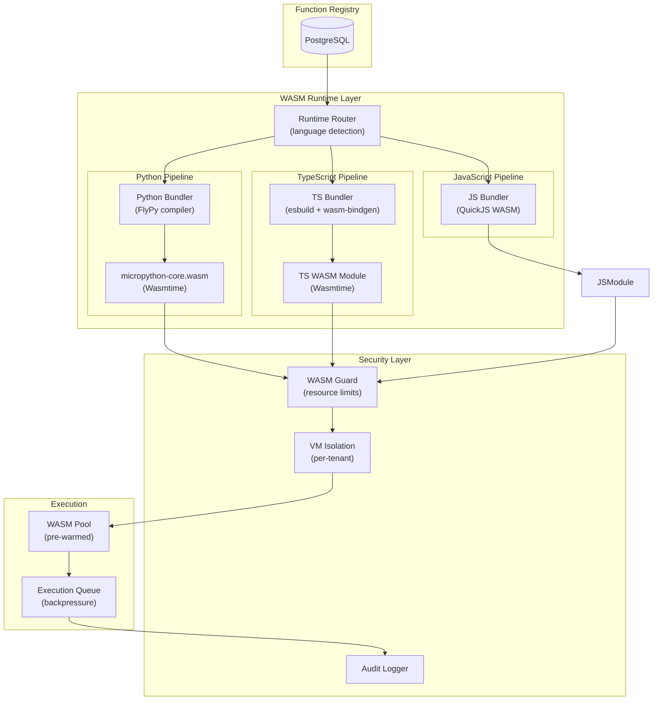
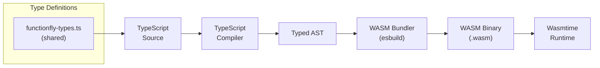

# Production-Ready WASM Runtime Plan

## Executive Summary

This plan outlines the architecture, security hardening, and TypeScript support needed to make the existing WASM runtime production-ready with state-of-the-art features.

**Current State:**

- ✅ WASM runtime using Wasmtime (wasmtime-go v19) with WASI support
- ✅ Python micropython-core.wasm (935 bytes, standalone)
- ✅ JS bundler for Node.js functions  
- ✅ TypeScript via Bun runtime
- ✅ Edge targets: Cloudflare Workers, Vercel, Fly, Deno Deploy
- ✅ WASM storage migrations in place (`registry_function_versions.wasm_binary`)

**Target State:**

- Secure, multi-language WASM sandbox with resource isolation
- Native TypeScript → WASM compilation support
- Comprehensive runtime security, observability, and failover

---

## 1. Architecture Overview



---

## 2. Security Hardening Requirements

### 2.1 Resource Isolation

| Requirement | Implementation | Priority |
|-------------|----------------|----------|
| **Per-tenant VM isolation** | Spin up separate Wasmtime instances per tenant | P0 |
| **Memory limits** | Enforce hard memory caps (default: 64MB per function) | P0 |
| **CPU timeouts** | Max execution time: 30s (configurable per function) | P0 |
| **Disk I/O limits** | Block filesystem access; use virtual FS only | P0 |
| **Network isolation** | Allowlist outbound connections; proxy through controlled endpoint | P1 |

### 2.2 WASM-Specific Security

```go
// internal/wasm/config.go
type WASMSecurityConfig struct {
    // Memory limits (bytes)
    MaxMemory uint32 `default:"67108864"` // 64MB
    
    // Execution limits
    MaxExecutionTime time.Duration `default:"30s"`
    MaxInstructions uint64 `default:"100000000"` // 100M instructions
    
    // Feature flags
    EnableWASI bool `default:"true"`
    AllowRawPointers bool `default:"false"`
    EnableThreads bool `default:"false"`
    
    // Network
    AllowedDomains []string // Allowlist for fetch()
    
    // Tenant isolation
    InstancePoolPerTenant bool `default:"true"`
}
```

### 2.3 Input Validation & Sandboxing

| Layer | Security Measure |
|-------|------------------|
| **API Gateway** | Schema validation, size limits (1MB input), injection detection |
| **WASM Runtime** | Pointer validation, buffer overflow prevention |
| **Host Functions** | Allowlist only; no `eval()`, `exec()`, direct OS access |

### 2.4 Audit & Compliance

- **Execution logging**: Log all WASM executions with tenant ID, duration, outcome
- **Tamper detection**: Verify `source_hash` before execution matches stored hash
- **Audit retention**: 1 year for compliance (configurable)

---

## 3. TypeScript Support (Native WASM)

### 3.1 Compilation Pipeline



### 3.2 Supported TypeScript Runtimes

| Runtime | Status | Use Case |
|---------|--------|----------|
| `bun` | ✅ Current | Full Bun runtime (not WASM) |
| `deno` | 🟡 Beta | Deno Deploy functions |
| `typescript-wasm` | 🔲 Plan | Native TS → WASM compilation |

### 3.3 TypeScript Handler Interface

```typescript
// functionfly-types/src/index.ts

export interface Env {
  // Secrets (decrypted client-side)
  getSecret(key: string): Promise<string>;
  
  // Key-Value store
  get(key: string): Promise<string | null>;
  set(key: string, value: string, ttl?: number): Promise<void>;
  delete(key: string): Promise<void>;
  
  // HTTP client
  fetch(url: string, init?: RequestInit): Promise<Response>;
}

export interface Context {
  requestId: string;
  startTime: number;
  executionTimeout: number;
  region: string;
  tenantId: string;
}

export type Handler = (
  request: Request,
  env: Env,
  context: Context
) => Promise<Response>;

export interface WasmExports {
  init(): void;
  execute(inputPtr: number, inputLen: number): number;
  alloc(size: number): number;
  dealloc(ptr: number): number;
  memory: WebAssembly.Memory;
}
```

### 3.4 Implementation Tasks

| Task | Description | Priority |
|------|-------------|----------|
| Create TS → WASM bundler | Use esbuild + wasm-bindgen for compilation | P0 |
| Implement WASI shim for TS | File I/O, network via host functions | P0 |
| Add `typescript-wasm` runtime | New runtime type in `functionregistry` | P1 |
| TypeScript type definitions | Publish `functionfly-types` npm package | P1 |

---

## 4. State-of-the-Art Features

### 4.1 Hot WASM Pool (Prewarming)

```go
// internal/wasm/pool.go
type InstancePool struct {
    mu sync.RWMutex
    pools map[string]*TenantPool // keyed by tenant_id + runtime
}

type TenantPool struct {
    instances chan *WASMInstance
    maxSize   int
    factory   func() (*WASMInstance, error)
}

func (p *InstancePool) Get(ctx context.Context, tenantID, runtime string) (*WASMInstance, error) {
    select {
    case inst := <-p.pools[tenantID+runtime].instances:
        // Reuse warm instance
        return inst, nil
    default:
        // Create new instance
        return p.pools[tenantID+runtime].factory()
    }
}
```

**Benefits:**

- <10ms cold start → <1ms warm execution
- Reduce memory pressure via LRU eviction

### 4.2 Deterministic Execution

| Feature | Description |
|---------|-------------|
| **Reproducible results** | Same input → same output, every time |
| **Timing attack mitigation** | Fixed execution windows |
| **Use cases** | Financial calculations, ML inference, testing |

**Implementation:** Use `wasmtime::Strategy::Realtime` with instruction counting.

### 4.3 Streaming Execution

- Process large inputs without loading entirely into memory
- Use WASM streaming instructions (`memory.grow` with care)

### 4.4 Multi-threading (Future)

| Current | Future (Phase 2) |
|---------|------------------|
| Single-threaded | SharedArrayBuffer support |
| Blocking I/O | Cooperative multitasking via async host calls |

---

## 5. Implementation Phases

### Phase 1: Security Hardening (Weeks 1-4)

| Week | Tasks |
|------|-------|
| 1 | Implement WASM security config struct; add memory/execution limits |
| 2 | Add per-tenant instance isolation; implement instance pooling |
| 3 | Implement audit logging for all WASM executions |
| 4 | Security review; penetration testing |

### Phase 2: TypeScript WASM Support (Weeks 5-8)

| Week | Tasks |
|------|-------|
| 5 | Design TS → WASM bundler architecture; set up esbuild pipeline |
| 6 | Implement WASI shim for TypeScript |
| 7 | Add `typescript-wasm` runtime to registry; create migrations |
| 8 | Integration tests; publish type definitions |

### Phase 3: Production Readiness (Weeks 9-12)

| Week | Tasks |
|------|-------|
| 9 | Implement WASM instance pool with prewarming |
| 10 | Add deterministic execution mode; performance tuning |
| 11 | Load testing; capacity planning |
| 12 | Documentation; runbooks; go-live checklist |

---

## 6. Required Code Changes

### 6.1 New Files

| File | Purpose |
|------|---------|
| `internal/wasm/config.go` | Security configuration |
| `internal/wasm/pool.go` | Instance pooling |
| `internal/wasm/audit.go` | Execution audit logging |
| `internal/wasm/deterministic.go` | Deterministic execution |
| `internal/bundler/typescript_wasm_compiler.go` | TS → WASM bundler |
| `internal/bundler/typescript_wasi_shim.go` | WASI polyfill for TS |

### 6.2 Modifications

| File | Change |
|------|--------|
| `internal/wasm/runtime.go` | Add security config; implement limits |
| `internal/functionregistry/types.go` | Add `RuntimeTypeScriptWASM` |
| `internal/api/handlers/registry/execution/execution.go` | Add WASM-specific execution path |
| `migrations/` | Add runtime type migrations |

### 6.3 Database Schema

```sql
-- Add TypeScript WASM runtime type
ALTER TYPE runtime_type ADD VALUE 'typescript-wasm';

-- Add execution audit table
CREATE TABLE wasm_execution_audit (
    id UUID PRIMARY KEY DEFAULT gen_random_uuid(),
    tenant_id UUID NOT NULL,
    function_id UUID NOT NULL,
    execution_id UUID NOT NULL,
    runtime VARCHAR(50) NOT NULL,
    input_size INTEGER,
    output_size INTEGER,
    execution_time_ms INTEGER,
    status VARCHAR(20) NOT NULL,
    error_message TEXT,
    created_at TIMESTAMPTZ DEFAULT NOW()
);

CREATE INDEX idx_wasm_audit_tenant ON wasm_execution_audit(tenant_id, created_at);
```

---

## 7. Testing Strategy

### 7.1 Unit Tests

- WASM memory limit enforcement
- Execution timeout handling
- Input validation (pointer attacks, buffer overflow)

### 7.2 Integration Tests

| Scenario | Expected Outcome |
|----------|------------------|
| Python function executes | Returns correct output |
| TypeScript function executes | Returns correct output |
| Memory limit exceeded | Terminated with OOM error |
| Execution timeout | Terminated after N seconds |
| Invalid WASM binary | Rejected at load time |
| Tenant isolation | Function A cannot access Function B's memory |

### 7.3 Load Tests

- 1000 concurrent executions
- Cold start latency p95 < 100ms
- Memory usage stable under load

---

## 8. Monitoring & Observability

### 8.1 Metrics

| Metric | Description | Alert Threshold |
|--------|-------------|-----------------|
| `wasm_execution_duration` | Function execution time | > 30s |
| `wasm_memory_usage` | Memory per instance | > 64MB |
| `wasm_instance_pool_size` | Active instances | > 1000 |
| `wasm_cold_starts` | New instance creations | > 100/min |

### 8.2 Logging

- Structured JSON logs
- Correlation IDs (requestId)
- PII-free (no function output in logs)

---

## 9. Rollback Plan

| Failure Mode | Rollback Action |
|--------------|-----------------|
| WASM runtime crash | Disable WASM functions; fall back to container runtime |
| Memory leak | Auto-restart instances; scale down pool |
| Security vulnerability | Disable affected runtime; notify users |

---

## 10. Success Criteria

| Criteria | Target |
|----------|--------|
| **Security** | Zero sandbox escapes in production |
| **Performance** | p50 execution < 50ms, p99 < 500ms |
| **Availability** | 99.99% execution success rate |
| **TypeScript** | Full TS support with type safety |
| **Isolation** | Complete tenant isolation verified |

---

## Appendix: Reference Implementation

### A.1 WASM Runtime Interface

```go
// internal/wasm/runtime.go
type WASMRuntime interface {
    // Initialize with compiled WASM binary
    Initialize(ctx context.Context, binary []byte, config *SecurityConfig) error
    
    // Execute function with input; returns output or error
    Execute(ctx context.Context, input []byte) ([]byte, error)
    
    // Get memory usage stats
    Stats() (*RuntimeStats, error)
    
    // Close and release resources
    Close() error
}
```

### A.2 Environment Variables

| Variable | Description | Default |
|----------|-------------|---------|
| `WASM_MAX_MEMORY` | Max memory per instance | 64MB |
| `WASM_MAX_TIMEOUT` | Max execution time | 30s |
| `WASM_POOL_SIZE` | Instances per tenant | 10 |
| `WASM_ENABLE_DETERMINISTIC` | Deterministic mode | false |

---

*Document Version: 1.0*  
*Last Updated: 2026-03-15*  
*Owner: Platform Team*
