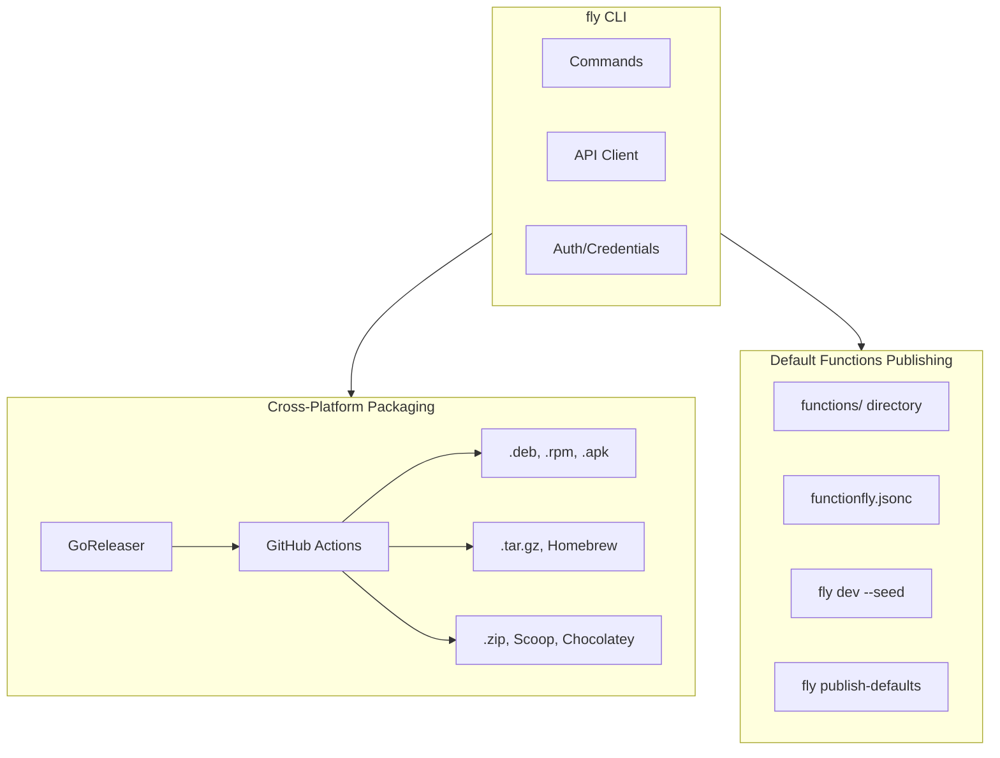

# FunctionFly CLI Cross-Platform Packaging & Dev Mode Publishing Plan

## Executive Summary

This plan addresses two key requirements:
1. **Cross-platform CLI packaging** - Make the `fly` CLI easily installable on all platforms (Linux, macOS, Windows)
2. **Dev mode publishing** - Allow developers to quickly publish default utility functions during development

---

## Architecture Overview



---

## Detailed Implementation Plan

### 1. Cross-Platform CLI Packaging (GoReleaser)

#### 1.1 Create `.goreleaser.yml` configuration

**File**: `.goreleaser.yml`

```yaml
# GoReleaser configuration for FunctionFly CLI
project_name: fly
archives:
  - id: fly-default
    builds:
      - fly
    formats:
      - tar.gz
      - zip
    files:
      - README.md
      - LICENSE
builds:
  - id: fly
    main: ./cmd/fly
    binary: fly
    goos:
      - linux
      - darwin
      - windows
    goarch:
      - amd64
      - arm64
    darwin:
      - CGO_ENABLED: 0
    linux:
      - CGO_ENABLED: 0
    windows:
      - CGO_ENABLED: 0
    env:
      - CGO_ENABLED=0
checksum:
  name_template: 'checksums.txt'
signs:
  - artifacts: checksums
    args:
      - "--batch"
      - "--key"
      - "{{ .Env.GPG_KEY }}"
      - "--passphrase"
      - "{{ .Env.GPG_PASSPHRASE }}"
snapshot:
  name_template: "{{ .Tag }}-next"
changelog:
  filters:
    exclude:
      - '^docs:'
      - '^test:'
      - '^chore:'
release:
  github:
    owner: functionfly
    name: functionfly
  draft: true
nfpms:
  - id: fly-linux
    package_name: fly
    vendor: FunctionFly
    maintainer: FunctionFly Team
    homepage: https://functionfly.com
    description: FunctionFly CLI - Publish functions to the global edge
    formats:
      - deb
      - rpm
      - apk
    arch:
      - amd64
      - arm64
```

#### 1.2 Create release Makefile targets

**Add to Makefile**:

```makefile
# CLI Release targets
release-dry-run: ## Run GoReleaser in dry-run mode
	goreleaser release --clean --dry-run

release: ## Create and publish a release
	goreleaser release --clean

release-snapshot: ## Create a snapshot release
	goreleaser release --clean --snapshot

install-locally: ## Install CLI locally for testing
	go install ./cmd/fly

dist: ## Build distribution packages
	goreleaser build --clean --single-target

.PHONY: release-dry-run release release-snapshot install-locally dist
```

#### 1.3 GitHub Actions release workflow

**New file**: `.github/workflows/release.yml`

```yaml
name: Release CLI

on:
  push:
    tags:
      - 'v*'
  workflow_dispatch:

jobs:
  release:
    runs-on: ubuntu-latest
    permissions:
      contents: write
    steps:
      - uses: actions/checkout@v4
        with:
          fetch-depth: 0

      - uses: actions/setup-go@v5
        with:
          go-version: '1.24'

      - uses: goreleaser/goreleaser-action@v5
        with:
          version: latest
          args: release --clean
        env:
          GITHUB_TOKEN: ${{ secrets.GITHUB_TOKEN }}
          GPG_KEY: ${{ secrets.GPG_KEY }}
          GPG_PASSPHRASE: ${{ secrets.GPG_PASSPHRASE }}
```

---

### 2. Dev Mode Publishing - Publish Default Functions

#### 2.1 Discover Default Functions

The default functions are located in:
- `functions/` directory (9 functions)
- `publish_*.json` files (additional functions)

**Function List**:
1. base64-decode
2. base64-encode
3. csv-to-json
4. hash-sha256
5. html-escape
6. json-minify
7. json-prettify
8. json-to-csv
9. number-format
10. slugify
11. text-truncate
12. url-decode
13. url-encode
14. uuid-generate

#### 2.2 Create `fly publish-defaults` command

**New file**: `cmd/fly/commands/publish_defaults.go`

```go
package commands

import (
	"encoding/json"
	"fmt"
	"os"
	"path/filepath"
	"sync"

	"github.com/spf13/cobra"
)

func NewPublishDefaultsCmd() *cobra.Command {
	var dryRun bool
	var asJSON bool
	var concurrency int
	var author string

	cmd := &cobra.Command{
		Use:   "publish-defaults",
		Short: "Publish all default utility functions",
		Long: `Publish all default utility functions to the registry.

This command publishes all functions in the 'functions/' directory as
default functions available to all users.

Examples:
  fly publish-defaults
  fly publish-defaults --dry-run
  fly publish-defaults --author functionfly`,
		RunE: func(cmd *cobra.Command, args []string) error {
			return runPublishDefaults(dryRun, asJSON, concurrency, author)
		},
	}

	cmd.Flags().BoolVar(&dryRun, "dry-run", false, "Validate without publishing")
	cmd.Flags().BoolVar(&asJSON, "json", false, "Output as JSON")
	cmd.Flags().IntVar(&concurrency, "concurrency", 3, "Number of parallel uploads")
	cmd.Flags().StringVar(&author, "author", "functionfly", "Author namespace for functions")
	return cmd
}

func runPublishDefaults(dryRun, asJSON bool, concurrency int, author string) error {
	// Discover functions in functions/ directory
	funcDirs, err := findFunctionDirs("functions", "*/functionfly.jsonc")
	if err != nil {
		return fmt.Errorf("failed to find functions: %w", err)
	}

	if !asJSON {
		fmt.Printf("Found %d default functions to publish\n\n", len(funcDirs))
		if dryRun {
			fmt.Println("🔍 Dry run mode - no functions will be published\n")
		}
	}

	// Publish concurrently
	results := publishDefaultsConcurrently(funcDirs, dryRun, concurrency, author, asJSON)

	// Print summary
	printPublishDefaultsSummary(results, asJSON)

	return nil
}

type DefaultPublishResult struct {
	Name    string `json:"name"`
	Status  string `json:"status"` // success, failed, skipped
	Error   string `json:"error,omitempty"`
	Version string `json:"version,omitempty"`
}

// Implementation details in code mode...
```

#### 2.3 Add `fly dev --seed` flag

**Modify**: `cmd/fly/commands/dev.go`

Add new flag to auto-seed default functions:

```go
func NewDevCmd() *cobra.Command {
	var port int
	var watch bool
	var noWatch bool
	var seedDefaults bool  // NEW FLAG

	cmd := &cobra.Command{
		Use:   "dev",
		Short: "Run your function locally",
		Example: `  fly dev
  fly dev --port 8080
  fly dev --watch
  fly dev --seed  # Start dev server and publish default functions`,
		RunE: func(cmd *cobra.Command, args []string) error {
			// ... existing code ...
			
			// If --seed flag provided, publish defaults first
			if seedDefaults {
				fmt.Println("📦 Publishing default functions...")
				if err := runPublishDefaults(false, false, 3, "functionfly"); err != nil {
					fmt.Fprintf(os.Stderr, "Warning: failed to publish defaults: %v\n", err)
				} else {
					fmt.Println("✅ Default functions published\n")
				}
			}
			
			return runDev(port, enableWatch)
		},
	}
	cmd.Flags().BoolVar(&seedDefaults, "seed", false, "Publish default functions before starting dev server")
	// ... rest unchanged
}
```

---

### 3. Security Improvements

#### 3.1 Token Refresh Mechanism

**Modify**: `cmd/fly/commands/credentials.go`

```go
// RefreshTokenIfNeeded refreshes the token if it's close to expiring
func (c *Credentials) RefreshTokenIfNeeded(client *APIClient) error {
	if c.RefreshToken == "" {
		return nil // No refresh token available
	}
	
	// Refresh if token expires within 5 minutes
	if time.Now().Add(5 * time.Minute).After(c.ExpiresAt) {
		return c.doRefresh(client)
	}
	return nil
}

func (c *Credentials) doRefresh(client *APIClient) error {
	req := map[string]interface{}{
		"refresh_token": c.RefreshToken,
	}
	
	var resp struct {
		Token        string    `json:"token"`
		RefreshToken string    `json:"refresh_token"`
		ExpiresAt    time.Time `json:"expires_at"`
	}
	
	if err := client.Post("/v1/auth/refresh", req, &resp); err != nil {
		return fmt.Errorf("token refresh failed: %w", err)
	}
	
	c.Token = resp.Token
	c.RefreshToken = resp.RefreshToken
	c.ExpiresAt = resp.ExpiresAt
	
	return SaveCredentials(c)
}
```

#### 3.2 Checksum Verification

**Modify**: `cmd/fly/commands/publish.go`

```go
// VerifyBundleChecksum ensures the bundle hasn't been tampered with
func VerifyBundleChecksum(bundle []byte, expectedHash string) error {
	hash := sha256.Sum256(bundle)
	actualHash := fmt.Sprintf("%x", hash)
	
	if actualHash != expectedHash {
		return fmt.Errorf("checksum verification failed: expected %s, got %s", 
			expectedHash, actualHash)
	}
	return nil
}
```

#### 3.3 Secure API Headers

**Modify**: `cmd/fly/commands/api.go`

```go
func (c *APIClient) do(req *http.Request, out interface{}) error {
	if c.Token != "" {
		req.Header.Set("Authorization", "Bearer "+c.Token)
	}
	
	// Add security headers
	req.Header.Set("User-Agent", "fly-cli/"+version)
	req.Header.Set("Accept", "application/json")
	req.Header.Set("X-Request-ID", uuid.New().String())
	req.Header.Set("X-Client-OS", runtime.GOOS+"/"+runtime.GOARCH)
	
	// Existing code...
}
```

---

### 4. Distribution Configurations

#### 4.1 Homebrew Tap

**File**: `homebrew/fly-cli.rb`

```ruby
class FlyCli < Formula
  desc "FunctionFly CLI - Publish functions to the global edge"
  homepage "https://functionfly.com"
  version "1.0.0"
  
  on_macos do
    if Hardware::CPU.arm64?
      url "https://github.com/functionfly/functionfly/releases/download/v1.0.0/fly_1.0.0_darwin_arm64.tar.gz"
      sha256 "..."
    else
      url "https://github.com/functionfly/functionfly/releases/download/v1.0.0/fly_1.0.0_darwin_amd64.tar.gz"
      sha256 "..."
    end
  end
  
  on_linux do
    if Hardware::CPU.arm64?
      url "https://github.com/functionfly/functionfly/releases/download/v1.0.0/fly_1.0.0_linux_arm64.tar.gz"
      sha256 "..."
    else
      url "https://github.com/functionfly/functionfly/releases/download/v1.0.0/fly_1.0.0_linux_amd64.tar.gz"
      sha256 "..."
    end
  end
  
  def install
    bin.install "fly"
  end
  
  test do
    system "#{bin}/fly", "--version"
  end
end
```

#### 4.2 Scoop Bucket

**File**: `scoop/fly.json`

```json
{
  "version": "1.0.0",
  "description": "FunctionFly CLI - Publish functions to the global edge",
  "homepage": "https://functionfly.com",
  "license": "MIT",
  "architecture": {
    "64bit": {
      "url": "https://github.com/functionfly/functionfly/releases/download/v1.0.0/fly_1.0.0_windows_amd64.zip",
      "hash": "..."
    }
  },
  "bin": "fly.exe",
  "checkver": {
    "github": "https://github.com/functionfly/functionfly"
  },
  "autoupdate": {
    "architecture": {
      "64bit": {
        "url": "https://github.com/functionfly/functionfly/releases/download/v$version/fly_$version_windows_amd64.zip"
      }
    }
  }
}
```

---

### 5. Installation Documentation

**File**: `INSTALL.md` (or update existing README)

```markdown
# Installing FunctionFly CLI

## Quick Install

### macOS / Linux

```bash
# Using Homebrew
brew install functionfly/tap/fly

# Or download directly
curl -sSL https://get.functionfly.com | sh
```

### Windows

```powershell
# Using Scoop
scoop bucket add functionfly https://github.com/functionfly/scoop
scoop install fly

# Or using Chocolatey
choco install fly-cli
```

### Manual Installation

Download the latest release for your platform:

| OS | Architecture | Download |
|-----|-------------|----------|
| macOS | ARM64 | [fly_1.0.0_darwin_arm64.tar.gz](https://github.com/functionfly/functionfly/releases/latest) |
| macOS | AMD64 | [fly_1.0.0_darwin_amd64.tar.gz](https://github.com/functionfly/functionfly/releases/latest) |
| Linux | ARM64 | [fly_1.0.0_linux_arm64.tar.gz](https://github.com/functionfly/functionfly/releases/latest) |
| Linux | AMD64 | [fly_1.0.0_linux_amd64.tar.gz](https://github.com/functionfly/functionfly/releases/latest) |
| Windows | AMD64 | [fly_1.0.0_windows_amd64.zip](https://github.com/functionfly/functionfly/releases/latest) |

Extract and add to your PATH:

```bash
tar -xzf fly_*.tar.gz
sudo mv fly /usr/local/bin/
fly --version
```

---

## Verification

Verify the installation:

```bash
fly --version
fly login
```

---

## Updating

```bash
# Using fly CLI
fly update

# Or reinstall via package manager
brew upgrade fly       # macOS
scoop update fly       # Windows
```

---

## Development Install

For contributors:

```bash
go install ./cmd/fly
```

Or build from source:

```bash
make build
./bin/fly --version
```
```

---

## Implementation Priority

| Priority | Task | Description |
|----------|------|-------------|
| 1 | GoReleaser config | Core packaging infrastructure |
| 2 | `fly publish-defaults` | Batch publish default functions |
| 3 | `fly dev --seed` | Auto-seed on dev server start |
| 4 | Security improvements | Token refresh, checksums |
| 5 | GitHub Actions release | Automated releases |
| 6 | Homebrew/Scoop configs | Package manager support |
| 7 | Documentation | Installation guides |

---

## Files to Create/Modify

### New Files
- `.goreleaser.yml`
- `.github/workflows/release.yml`
- `cmd/fly/commands/publish_defaults.go`
- `homebrew/fly-cli.rb`
- `scoop/fly.json`
- `INSTALL.md`

### Modified Files
- `Makefile` - Add release targets
- `cmd/fly/commands/dev.go` - Add `--seed` flag
- `cmd/fly/commands/credentials.go` - Token refresh
- `cmd/fly/commands/api.go` - Security headers
- `cmd/fly/commands/publish.go` - Checksum verification
- `cmd/fly/commands/root.go` - Register new commands
