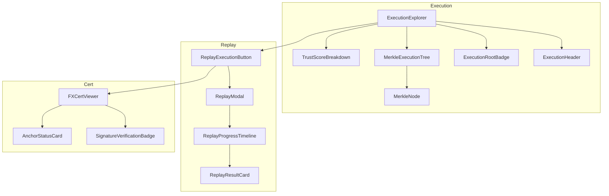

# DRE Component Architecture Plan

## Overview
This document outlines the component architecture for the Verifiable Execution OS UI, implementing the Deterministic Replay Engine (DRE), Deterministic Capsule, FXCERT, Trust + Drift, and Enterprise audit mode surfaces.

## Project Context
- **Framework**: React with TypeScript
- **UI Library**: shadcn/ui components
- **Styling**: Tailwind CSS
- **State Management**: React Query for data, local state for UI
- **Routing**: React Router

## Component Organization

```
src/
├── components/
│   ├── dre/                      # DRE Core Components
│   │   ├── execution/            # Execution Explorer
│   │   ├── replay/               # Replay System
│   │   ├── capsule/              # Capsule Inspection
│   │   ├── fxcert/               # FXCERT UI
│   │   ├── drift/                # Drift & Trust
│   │   ├── debug/                # Debug Mode
│   │   ├── marketplace/          # Marketplace Surface
│   │   ├── enterprise/           # Enterprise Audit
│   │   ├── admin/                # Admin/Node UI
│   │   └── primitives/           # Core Utilities
│   └── ui/                       # Existing shadcn/ui (don't modify)
```

## MVP Components (Phase 1)

### 1. ExecutionExplorer Components

#### `<ExecutionExplorer />`
- Top-level container component
- Contains: Header summary, Hash tree, Capsule info, Replay controls, Trust metrics
- Props: `executionId`, `functionId`, `onReplay`, `onDrillDown`

#### `<ExecutionHeader />`
- Displays execution metadata
- Props: `{ executionId, functionId, determinismTier, trustScore, region, node, status }`

#### `<ExecutionRootBadge />`
- Visualizes execution root hash
- Props: `{ hash, verified, anchored, chain?, blockNumber? }`

### 2. MerkleExecutionTree Components

#### `<MerkleExecutionTree />`
- Interactive expandable tree visualization
- Nodes: Input, Environment, Dependencies, Trace, Resources, Output, Metadata
- Props: `{ hashes, onNodeClick, expandedNodes }`

#### `<MerkleNode />`
- Individual tree node
- Props: `{ type, hash, verified, expanded, children? }`

#### `<HashDiffViewer />`
- Side-by-side comparison
- Props: `{ hash1, hash2, onDriftSelect }`

### 3. Replay System Components

#### `<ReplayExecutionButton />`
- Primary CTA for replay
- Props: `{ capsuleVersion, onModeSelect, disabled }`
- States: default, loading, disabled

#### `<ReplayModal />`
- Replay configuration modal
- Props: `{ open, onClose, onStart, capsule, costEstimate }`

#### `<ReplayProgressTimeline />`
- Visual timeline of replay stages
- Props: `{ stages, currentStage, progress }`

#### `<ReplayResultCard />`
- Replay outcome display
- Props: `{ rootHash, match, driftCategory?, driftReportUrl }`

### 4. FXCERT Components

#### `<FXCertViewer />`
- Full certificate rendering
- Props: `{ certificate, showDetails }`

#### `<SignatureVerificationBadge />`
- Signature status indicator
- Props: `{ nodeVerified, platformVerified, expired }`

#### `<AnchorStatusCard />`
- Blockchain anchor display
- Props: `{ anchored, chain, blockNumber, txHash }`

### 5. Trust Components

#### `<TrustScoreBreakdown />`
- Pie/stacked breakdown of trust
- Props: `{ determinismScore, replayConsistency, resourceStability, driftIncidents }`

#### `<DeterministicReliabilityBadge />`
- Reliability percentage badge
- Props: `{ percentage, historyUrl }`

## Type Definitions

### New API Types to Add

```typescript
// drift.ts
export interface DriftReport {
  drift_type: 'instruction' | 'memory' | 'resource' | 'output';
  component: string;
  mismatch_index?: number;
  resource_variance?: Record<string, number>;
}

export interface TrustMetrics {
  determinism_score: number;
  replay_consistency: number;
  resource_stability: number;
  drift_incidents: number;
  overall_score: number;
}

export interface CapsuleDescriptor {
  runtime_version: string;
  memory_limit: number;
  instruction_limit: number;
  rng_seed: string;
  float_mode: 'ieee754' | 'deterministic';
  determinism_flags: string[];
}

export interface FXCert {
  certificate_id: string;
  level: 'standard' | 'extended' | 'enterprise';
  issued_at: string;
  expires_at: string;
  signatures: {
    node: { verified: boolean; key_id: string };
    platform: { verified: boolean; key_id: string };
  };
  anchor?: {
    chain: string;
    block_number: number;
    tx_hash: string;
  };
}
```

## Component Wiring Strategy

### ExecutionExplorerPage Integration
1. Replace inline `ExecutionCard` and `ExecutionDetailView` with new components
2. Import from `@/components/dre/execution`
3. Wire up Replay button to open ReplayModal
4. Wire up Trust metrics display

### ReplayPage Integration
1. Add ReplayProgressTimeline during replay
2. Add ReplayResultCard for results
3. Integrate FXCertViewer for certificate display

## Mermaid: Component Flow



## Styling Guidelines

1. Use existing design tokens from `src/styles/themes.css`
2. Follow component patterns from `src/components/ui/`
3. Use `lucide-react` for icons (already installed)
4. Use `framer-motion` for animations (already installed)
5. Use `sonner` for toasts (already installed)

## Acceptance Criteria

1. All MVP components render without errors
2. Components are properly typed with TypeScript
3. Components integrate with existing API (dre.ts)
4. Responsive design works on mobile/tablet/desktop
5. Dark/light mode support via existing theme system
6. All icons use lucide-react
7. Proper loading and error states
