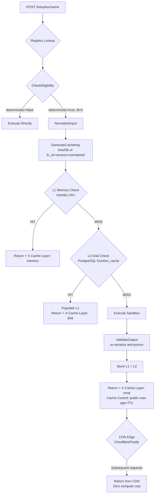

# FunctionFly Execution Caching System — Implementation Plan

## Overview

The execution caching system turns every deterministic function into a **behavior lookup table**:

```
(function_id + version + normalized_input) → output
```

The infrastructure already has a strong skeleton. This plan identifies the **10 gaps** that must be closed to make the system production-correct and high-performance.

---

## Current State Assessment

### What Already Works ✅

| Component | File | Status |
|-----------|------|--------|
| Cache eligibility check | `internal/cache/eligibility.go` | Complete |
| Input normalization + SHA-256 key | `internal/cache/normalizer.go` | Complete |
| L1 Memory cache (ristretto LRU) | `internal/cache/memory.go` | Complete |
| L2 Disk cache (PostgreSQL/GORM) | `internal/cache/disk.go` | Complete |
| Multi-layer orchestration | `internal/cache/service.go` | Complete |
| Output re-serialization (anti-poisoning) | `internal/cache/validator.go` | Complete |
| Event-driven invalidation hooks | `internal/cache/invalidator.go` | Partial |
| CDN Cache-Control headers | `internal/cache/cdn.go` | Complete |
| Prometheus metrics | `internal/cache/metrics.go` | Complete |
| Execution handler wiring | `internal/api/handlers/registry/execution/handlers.go` | Complete |

### What Is Broken or Missing ❌

1. **`ExecutionCache.computeInputHash`** uses raw `json.Marshal` without calling `NormalizeInput()` — cache hit rate collapses for semantically identical inputs with different key ordering
2. **No `X-Cache-Layer` / `X-Cache-Status` headers** in HTTP responses — impossible to debug or verify CDN behavior
3. **No SQL migration file** for `function_cache` table — `AutoMigrate` is fragile in production with golang-migrate
4. **`GetOrExecute` drops non-JSON inputs** — plain string inputs like `"Hello World"` fail normalization and bypass cache entirely
5. **`uuid.MustParse` panic** in `disk.go:SetWithExpiry` — invalid function IDs crash the process
6. **`OnFunctionUpdated` broken comparison** — `currentVersion` is always a zero-value struct, so cache is never invalidated on metadata changes
7. **Orphaned `ExecutionCache`** — Redis-based execution cache in `execution.go` is never used in the main execution path
8. **No admin purge endpoints** — `PurgeAll`/`PurgeFunction`/`PurgeVersion` exist but aren't exposed via HTTP
9. **`/cache/stats` is incomplete** — doesn't include layer breakdown or hit ratio
10. **No unit tests** for normalization determinism or key generation

---

## Architecture



---

## Implementation Steps

### Step 1 — Fix `ExecutionCache.computeInputHash` (Critical)

**File:** [`internal/cache/execution.go`](internal/cache/execution.go:31)

**Problem:** `computeInputHash` marshals input directly without normalization. Two calls with `{"b":2,"a":1}` and `{"a":1,"b":2}` produce different hashes → cache miss.

**Fix:** Replace raw `json.Marshal` with `NormalizeInput()` then hash:

```go
func (c *ExecutionCache) computeInputHash(input interface{}) (string, error) {
    inputBytes, err := json.Marshal(input)
    if err != nil {
        return "", fmt.Errorf("failed to marshal input: %w", err)
    }
    // Normalize before hashing for consistent cache keys
    normalized, err := NormalizeInput(inputBytes)
    if err != nil {
        // Fall back to raw bytes if normalization fails (non-JSON input)
        normalized = inputBytes
    }
    hash := sha256.Sum256(normalized)
    return hex.EncodeToString(hash[:]), nil
}
```

---

### Step 2 — Add Cache Response Headers

**File:** [`internal/api/handlers/registry/execution/handlers.go`](internal/api/handlers/registry/execution/handlers.go:394)

**Problem:** No `X-Cache-Layer` or `X-Cache-Status` headers. CDN operators and developers can't verify cache behavior.

**Fix:** After `GetOrExecute`, set headers based on `cacheResult.Layer`:

```go
// In HandleExecute, after GetOrExecute succeeds:
w.Header().Set("X-Cache-Status", func() string {
    if cacheResult.Hit { return "HIT" }
    return "MISS"
}())
if cacheResult.Layer != "" && cacheResult.Layer != "none" {
    w.Header().Set("X-Cache-Layer", cacheResult.Layer)
}
```

Also update `CacheResult` in `service.go` to expose `Hit bool` correctly (currently `Hit` is set but `Layer` is `"none"` even on misses — fix the miss path to set `Layer: "miss"` for clarity).

---

### Step 3 — SQL Migration for `function_cache` Table

**File:** New file `migrations/NNNN_create_function_cache.up.sql`

**Problem:** `DiskCache.NewDiskCache` calls `db.AutoMigrate(&FunctionCache{})` which conflicts with the golang-migrate system used in production.

**Fix:** Create a proper migration file:

```sql
-- migrations/NNNN_create_function_cache.up.sql
CREATE TABLE IF NOT EXISTS function_cache (
    id          UUID PRIMARY KEY DEFAULT gen_random_uuid(),
    cache_key   VARCHAR(255) NOT NULL,
    function_id UUID NOT NULL,
    version     VARCHAR(50) NOT NULL,
    input_hash  VARCHAR(64) NOT NULL,
    output_json JSONB NOT NULL,
    output_size INTEGER NOT NULL DEFAULT 0,
    created_at  TIMESTAMPTZ NOT NULL DEFAULT NOW(),
    expires_at  TIMESTAMPTZ NOT NULL,
    hit_count   INTEGER NOT NULL DEFAULT 0,
    last_hit_at TIMESTAMPTZ,
    CONSTRAINT uq_function_cache_key UNIQUE (cache_key)
);

CREATE INDEX idx_function_cache_function_version ON function_cache (function_id, version);
CREATE INDEX idx_function_cache_expires_at ON function_cache (expires_at);
CREATE INDEX idx_function_cache_last_hit_at ON function_cache (last_hit_at);
```

Remove `AutoMigrate` call from `NewDiskCache` — the table will exist from the migration.

---

### Step 4 — Handle Non-JSON Inputs in `GetOrExecute`

**File:** [`internal/cache/service.go`](internal/cache/service.go:105)

**Problem:** When `NormalizeInput` fails (e.g., plain string `"Hello World"` is valid JSON but a bare string), the function falls through to execute without caching. This is actually correct for bare strings, but the current code silently drops caching for any normalization error.

**Fix:** Distinguish between "input is a valid JSON string" (cacheable) and "input is malformed JSON" (not cacheable):

```go
normalizedInput, err := NormalizeInput(input)
if err != nil {
    // Try wrapping as a JSON string value
    quoted, _ := json.Marshal(string(input))
    normalizedInput, err = NormalizeInput(quoted)
    if err != nil {
        // Truly malformed — execute without caching, log warning
        logrus.WithError(err).Warn("cache: input normalization failed, bypassing cache")
        output, err := executeFn()
        // ... return without caching
    }
}
```

---

### Step 5 — Fix `uuid.MustParse` Panic in `disk.go`

**File:** [`internal/cache/disk.go`](internal/cache/disk.go:95)

**Problem:** `uuid.MustParse(functionID)` panics if `functionID` is not a valid UUID string.

**Fix:**

```go
func (d *DiskCache) SetWithExpiry(cacheKey, functionID, version, inputHash string, output json.RawMessage, ttlSeconds int) error {
    fnUUID, err := uuid.Parse(functionID)
    if err != nil {
        return fmt.Errorf("invalid function ID %q: %w", functionID, err)
    }
    record := &FunctionCache{
        CacheKey:   cacheKey,
        FunctionID: fnUUID,
        // ...
    }
    return d.Set(record)
}
```

---

### Step 6 — Fix `OnFunctionUpdated` Broken Comparison

**File:** [`internal/cache/invalidator.go`](internal/cache/invalidator.go:86)

**Problem:** `currentVersion` is always `FunctionVersionInfo{}` (zero value) because the repository cast is a placeholder. The comparison `currentVersion.Deterministic != oldVersion.Deterministic` is always `false` → cache is never invalidated on metadata changes.

**Fix:** The `RegistryRepository` interface needs to return typed data. Update the interface and implementation:

```go
// RegistryRepository interface — add typed return
type RegistryRepository interface {
    GetLatestFunctionVersionInfo(functionID uuid.UUID) (*FunctionVersionInfo, error)
}

// In OnFunctionUpdated:
currentVersion, err := i.getCurrentVersionInfo(fn.ID.String())
if err != nil {
    // Safe fallback: invalidate all
    return i.invalidateAllLayers(fn.ID.String(), "")
}
if currentVersion.Deterministic != oldVersion.Deterministic ||
    currentVersion.CacheTTL != oldVersion.CacheTTL ||
    currentVersion.SideEffects != oldVersion.SideEffects {
    return i.invalidateAllLayers(fn.ID.String(), "")
}
```

---

### Step 7 — Remove or Wire Orphaned `ExecutionCache`

**File:** [`internal/cache/execution.go`](internal/cache/execution.go)

**Problem:** `ExecutionCache` is a Redis-based execution result cache that duplicates `CacheService` logic but is never instantiated or used in the main execution path. It creates confusion about which cache is authoritative.

**Decision:** Remove `ExecutionCache` entirely. The `CacheService` (L1 memory + L2 disk) is the correct implementation. The Redis layer in `CacheService` is for registry metadata (function info, versions), not execution results.

**Action:** Delete `internal/cache/execution.go` and remove the `ExecutionResult` type from `internal/types/types.go` (or keep it if used elsewhere).

---

### Step 8 — Add Admin Cache Purge Endpoints

**File:** New handler methods in `internal/api/handlers/registry/handlers.go` or `internal/api/handlers/admin/registry.go`

**Problem:** `CacheInvalidator.PurgeAll()`, `PurgeFunction()`, `PurgeVersion()` exist but are not exposed via HTTP.

**Fix:** Add protected admin endpoints:

```
DELETE /v1/admin/cache                          → PurgeAll
DELETE /v1/admin/cache/{functionId}             → PurgeFunction
DELETE /v1/admin/cache/{functionId}/{version}   → PurgeVersion
```

Wire `CacheInvalidator` into the admin handler. Require admin auth.

---

### Step 9 — Enhance `/cache/stats` Endpoint

**File:** [`internal/api/handlers/registry/stats.go`](internal/api/handlers/registry/stats.go) (or wherever `HandleGetCacheStats` is implemented)

**Problem:** The stats endpoint exists but likely returns minimal data. It should expose:
- L1 memory: hits, misses, hit ratio, evictions, estimated size
- L2 disk: total entries, total size bytes, total hits, expired entries
- Overall hit ratio across layers
- Cache eligibility rate (% of executions that were cache-eligible)

**Fix:** Use `CacheMonitor.GetComprehensiveStats()` which already aggregates all layers, and expose it fully.

---

### Step 10 — Unit Tests for Normalization and Key Generation

**File:** New file `internal/cache/normalizer_test.go`

**Tests to write:**

```go
// Test 1: Key ordering normalization
{"b":2,"a":1} == {"a":1,"b":2}  // same cache key

// Test 2: Whitespace normalization  
{"a": "hello   world"} == {"a":"hello world"}  // same key

// Test 3: Nested object normalization
{"z":{"b":2,"a":1},"a":1} == {"a":1,"z":{"a":1,"b":2}}  // same key

// Test 4: Array order preserved (arrays are ordered)
{"a":[1,2,3]} != {"a":[3,2,1]}  // different keys

// Test 5: Version namespace isolation
fn_id + "v1.0.0" + input != fn_id + "v1.0.1" + input  // different keys

// Test 6: Function ID isolation
fn_id_1 + version + input != fn_id_2 + version + input  // different keys

// Test 7: Boolean strict typing
{"a":true} != {"a":"true"}  // different keys

// Test 8: Number normalization
{"a":1.0} == {"a":1}  // same key (JSON float64)
```

---

## Execution Flow (After Fixes)

```
POST /fx/trase/slugify
Body: {"input": "Hello World"}

1. HandleExecute reads fnVersion from DB
   → deterministic: true, cache_ttl: 86400

2. CheckEligibility → Eligible: true, TTL: 86400, CanUseCDN: true

3. NormalizeInput({"input": "Hello World"})
   → {"input":"Hello World"}  (trimmed, sorted)

4. GenerateCacheKey("fn-uuid", "1.0.0", normalized)
   → "fx:cache:fn-uuid:1.0.0:9f31ab3c..."

5. L1 Memory Check (ristretto)
   → MISS (first request)

6. L2 Disk Check (PostgreSQL function_cache)
   → MISS (first request)

7. Execute sandbox → output: {"slug":"hello-world"}

8. ValidateOutput → re-serialize, check size/depth

9. Store L1: memory.Set(key, output, 86400s)
   Store L2: disk.SetWithExpiry(key, fn-uuid, "1.0.0", inputHash, output, 86400)

10. Set headers:
    Cache-Control: public, max-age=86400
    X-Cache-Status: MISS
    X-Cache-Layer: none

11. Return {"ok":true,"data":{"slug":"hello-world"},"cached":false}

--- Second request (same input) ---

5. L1 Memory Check → HIT (microseconds)

6. Set headers:
   Cache-Control: public, max-age=86400
   X-Cache-Status: HIT
   X-Cache-Layer: memory

7. Return {"ok":true,"data":{"slug":"hello-world"},"cached":true}

--- After server restart ---

5. L1 Memory Check → MISS (memory cleared)
6. L2 Disk Check → HIT (PostgreSQL persisted)
   → Populate L1 from disk
   
7. Set headers:
   X-Cache-Status: HIT
   X-Cache-Layer: disk

--- At CDN scale ---

CDN sees Cache-Control: public, max-age=86400
→ Caches at edge for 24 hours
→ Zero compute cost for all subsequent requests
```

---

## Cache Invalidation Rules

| Event | Action |
|-------|--------|
| New version published | `InvalidateVersion(fnID, oldVersion)` — new version gets new hash namespace automatically |
| `deterministic` changed to `false` | `InvalidateFunction(fnID)` — purge all versions |
| `cache_ttl` changed | `InvalidateFunction(fnID)` — old TTL entries may be stale |
| TTL expired | Automatic — disk cleanup job runs hourly, memory TTL handled by ristretto |
| Manual admin purge | `DELETE /v1/admin/cache/{fnId}` |
| Function deleted | `InvalidateFunction(fnID)` |

**Immutability rule:** Cache entries are never mutated. On write, `SetWithExpiry` uses upsert (update if exists). On invalidation, entries are deleted. This prevents partial-update race conditions.

---

## Cache Key Format

```
fx:cache:{function_id}:{version}:{sha256_first_16_chars}

Example:
fx:cache:550e8400-e29b-41d4-a716-446655440000:1.0.0:9f31ab3c4d5e6f7a
```

The `function_id:version` prefix enables O(1) invalidation by prefix scan in the memory cache's `functionKeys` tracking map.

---

## Database Schema

```sql
-- function_cache table (L2 disk cache)
CREATE TABLE function_cache (
    id          UUID PRIMARY KEY DEFAULT gen_random_uuid(),
    cache_key   VARCHAR(255) NOT NULL UNIQUE,  -- fx:cache:... key
    function_id UUID NOT NULL,                  -- for invalidation
    version     VARCHAR(50) NOT NULL,           -- for version invalidation
    input_hash  VARCHAR(64) NOT NULL,           -- SHA-256 of normalized input
    output_json JSONB NOT NULL,                 -- the cached result
    output_size INTEGER NOT NULL DEFAULT 0,     -- bytes, for monitoring
    created_at  TIMESTAMPTZ NOT NULL DEFAULT NOW(),
    expires_at  TIMESTAMPTZ NOT NULL,           -- TTL-based expiry
    hit_count   INTEGER NOT NULL DEFAULT 0,     -- analytics
    last_hit_at TIMESTAMPTZ                     -- analytics
);

-- Indexes for performance
CREATE INDEX idx_function_cache_function_version ON function_cache (function_id, version);
CREATE INDEX idx_function_cache_expires_at ON function_cache (expires_at);
```

**What is NOT stored:**
- Logs (stored in `registry_function_executions`)
- Headers (not relevant to behavior)
- Error responses (only successful outputs are cached)
- Input data (only the hash — privacy-preserving)

---

## Priority Order

1. **Step 1** (normalization fix) — highest impact on cache hit rate
2. **Step 5** (panic prevention) — production safety
3. **Step 3** (SQL migration) — production correctness
4. **Step 4** (non-JSON input handling) — correctness
5. **Step 6** (invalidation fix) — correctness
6. **Step 2** (response headers) — observability
7. **Step 7** (remove orphaned code) — code hygiene
8. **Step 8** (admin endpoints) — operational tooling
9. **Step 9** (stats endpoint) — monitoring
10. **Step 10** (unit tests) — confidence
