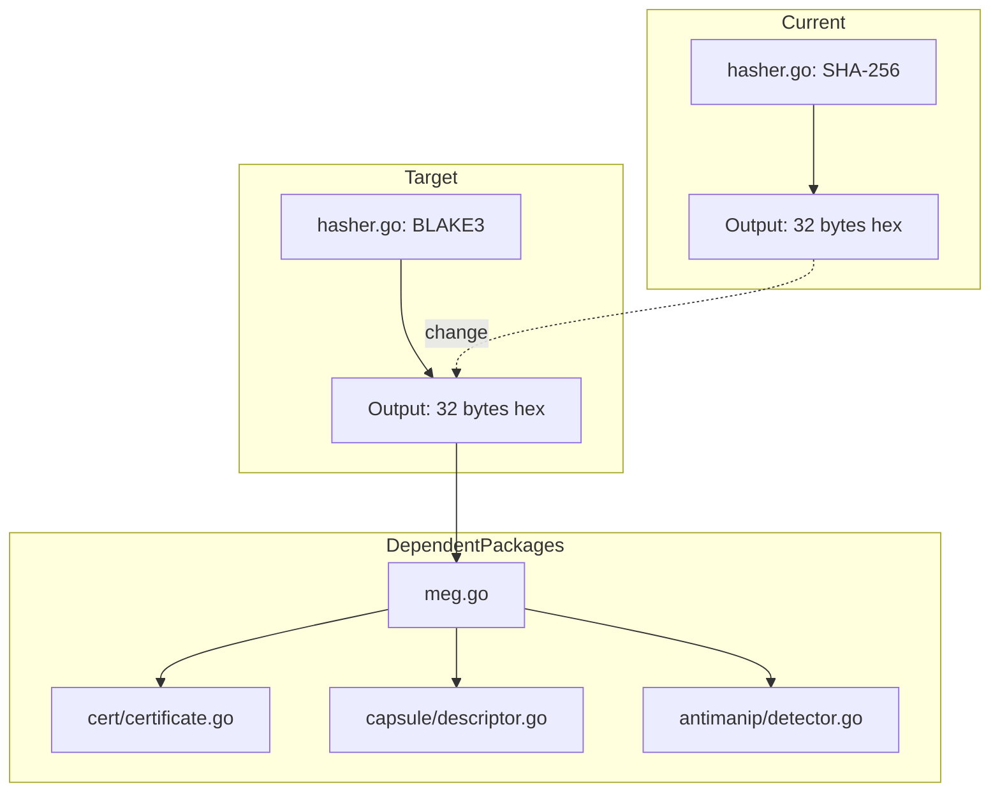

# ExecutionRootHash v1.0 Implementation Plan

## Overview

The project already has a comprehensive implementation of the ExecutionRootHash protocol in [`internal/dre/crypto/`](/workspace/6d484fe1-a872-4e5c-80a3-ea3409ee7834/sessions/agent_77a68686-93aa-4233-bc65-caa2b9a8ab40/internal/dre/crypto/). The task is to switch the default hash algorithm from SHA-256 to **BLAKE3** as specified in the protocol.

## Current State

The existing implementation includes:
- **Domain separation tags** - `hasher.go` defines FX_INPUT, FX_ENV, FX_DEPS, etc.
- **JSON canonicalization** - `canonicalize.go` implements RFC-8785
- **Merkle Execution Graph** - `meg.go` implements BuildMEG with 7 component hashes
- **MerkleRoot function** - `hasher.go` with Bitcoin-style duplicate-last-leaf
- **Certificate generation** - `cert/certificate.go` for FXCert
- **Anti-manipulation** - `antimanip/detector.go` for drift detection
- **Capsule descriptor** - `capsule/descriptor.go`

The only change needed: **Switch hash algorithm from SHA-256 to BLAKE3**

## Implementation Steps

### Step 1: Add BLAKE3 dependency
- Add `lukechampine.com/blake3` to go.mod

### Step 2: Update hasher.go
- Import blake3 package
- Update Hash() function to use BLAKE3
- Update HashString() function to use BLAKE3
- Update MerkleRoot() to work with BLAKE3 32-byte output
- Update comments to reflect BLAKE3 as default

### Step 3: Verify compatibility
- Ensure MEGResult hex encoding works correctly
- Verify all dependent packages (cert, capsule, antimanip) work with BLAKE3 output

### Step 4: Add tests
- Test canonicalization
- Test hashing with domain separation
- Test Merkle root computation
- Test MEG build with sample data

## Mermaid Diagram

## Key Files to Modify

1. **go.mod** - Add BLAKE3 dependency
2. **internal/dre/crypto/hasher.go** - Switch to BLAKE3
3. **internal/dre/crypto/canonicalize.go** - No changes needed (algorithm agnostic)
4. **internal/dre/crypto/meg.go** - No changes needed (uses Hash/HashString)

## Protocol Alignment

The implementation will now match the user's specification:
- ✅ BLAKE3 as default hash algorithm
- ✅ Domain separation with fixed tags
- ✅ RFC-8785 JSON canonicalization
- ✅ Merkle Execution Graph with 7 component hashes
- ✅ Deterministic, composable, partially verifiable
- ✅ Resistant to replay forgery
- ✅ Efficient to compute
- ✅ Blockchain-anchor friendly
