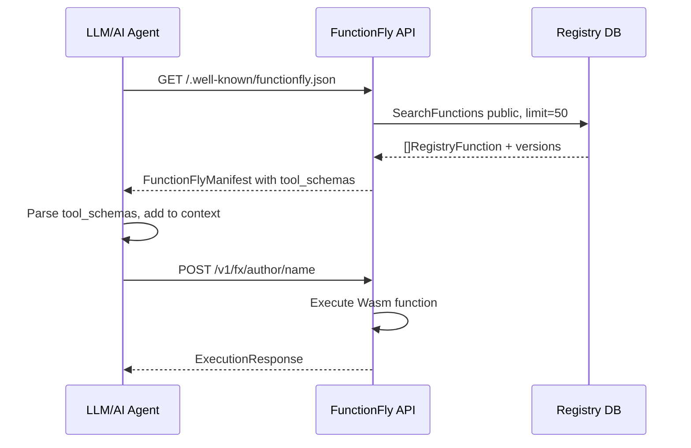

# Feature 4 — AI-Callable Functions

## Goal

Expose the FunctionFly registry to AI agents via a standard discovery endpoint:

```
GET /.well-known/functionfly.json
```

LLMs (OpenAI, Anthropic, Gemini, open-source agents) can fetch this document, discover all public functions, and immediately call them using their native tool-calling APIs — without any custom integration code.

---

## Why This Matters

| Before | After |
|--------|-------|
| FunctionFly is a developer tool | FunctionFly is AI infrastructure |
| Humans discover functions via docs | LLMs discover functions autonomously |
| Agents need custom wrappers | Agents call functions natively |
| Registry is passive storage | Registry is an active AI capability layer |

---

## Architecture

### Endpoint

```
GET /.well-known/functionfly.json
```

- **Public** — no authentication required
- **Root-level** — registered on `s.router` (not under `/v1/`)
- **Cacheable** — `Cache-Control: public, max-age=300` (5 minutes)
- **Content-Type** — `application/json`

### Query Parameters (all optional)

| Param | Type | Description |
|-------|------|-------------|
| `category` | string | Filter by function category |
| `tags` | string | Comma-separated tag filter |
| `author` | string | Filter by author |
| `limit` | int | Max functions to return (default 50, max 200) |
| `offset` | int | Pagination offset |

### Response Schema

```json
{
  "schema_version": "1.0",
  "provider": "functionfly",
  "provider_url": "https://functionfly.com",
  "api_base": "https://api.functionfly.com/v1",
  "execution_endpoint": "POST /v1/fx/{author}/{name}",
  "agent_endpoint": "POST /v1/agent/execute/{author}/{name}",
  "discovery_endpoint": "GET /v1/agent/discover",
  "generated_at": "2026-02-27T21:00:00Z",
  "total_functions": 42,
  "functions": [
    {
      "uri": "fx://author/name",
      "name": "author_name",
      "title": "Human-readable title",
      "description": "What this function does",
      "version": "1.0.0",
      "category": "text",
      "tags": ["string", "utility"],
      "execution_url": "https://api.functionfly.com/v1/fx/author/name",
      "agent_execution_url": "https://api.functionfly.com/v1/agent/execute/author/name",
      "pricing_per_call": 0.0,
      "deterministic": true,
      "side_effects": "none",
      "trust_score": 0.95,
      "success_rate": 0.98,
      "tool_schema": {
        "type": "function",
        "function": {
          "name": "author_name",
          "description": "What this function does",
          "parameters": { /* JSON Schema */ }
        }
      }
    }
  ]
}
```

The `tool_schema` field is directly compatible with:
- **OpenAI** `tools` array in chat completions
- **Anthropic** `tools` array in Messages API
- **LangChain** tool definitions
- **LlamaIndex** tool specs

---

## Implementation Plan

### 1. New Package: `internal/api/handlers/wellknown/`

**File: `handler.go`**

```go
package wellknown

type Handler struct {
    registryRepo *registry.RegistryRepository
}

func NewHandler(registryRepo *registry.RegistryRepository) *Handler

func (h *Handler) HandleWellKnown(w http.ResponseWriter, r *http.Request)
```

**Response types:**

```go
type FunctionFlyManifest struct {
    SchemaVersion     string           `json:"schema_version"`
    Provider          string           `json:"provider"`
    ProviderURL       string           `json:"provider_url"`
    APIBase           string           `json:"api_base"`
    ExecutionEndpoint string           `json:"execution_endpoint"`
    AgentEndpoint     string           `json:"agent_endpoint"`
    DiscoveryEndpoint string           `json:"discovery_endpoint"`
    GeneratedAt       time.Time        `json:"generated_at"`
    TotalFunctions    int              `json:"total_functions"`
    Functions         []AICallableFunc `json:"functions"`
}

type AICallableFunc struct {
    URI                string          `json:"uri"`
    Name               string          `json:"name"`
    Title              string          `json:"title,omitempty"`
    Description        string          `json:"description,omitempty"`
    Version            string          `json:"version,omitempty"`
    Category           string          `json:"category,omitempty"`
    Tags               []string        `json:"tags,omitempty"`
    ExecutionURL       string          `json:"execution_url"`
    AgentExecutionURL  string          `json:"agent_execution_url"`
    PricingPerCall     float64         `json:"pricing_per_call"`
    Deterministic      bool            `json:"deterministic"`
    SideEffects        string          `json:"side_effects"`
    TrustScore         float64         `json:"trust_score"`
    SuccessRate        float64         `json:"success_rate"`
    ToolSchema         json.RawMessage `json:"tool_schema,omitempty"`
}
```

**Handler logic:**

1. Parse query params: `category`, `tags`, `author`, `limit` (default 50, max 200), `offset`
2. Call `registryRepo.SearchFunctions(query, category, runtime, minRating, limit, offset)` with `visibility=public`
3. For each function, fetch latest version to get manifest/schema
4. Build `AICallableFunc` with `tool_schema` in OpenAI format
5. Set `Cache-Control: public, max-age=300`
6. Return JSON

### 2. Route Registration in `internal/api/routes.go`

Add at the **root router level** (not under `/v1/`):

```go
wellknownHandler := wellknown.NewHandler(registryRepo)
s.router.HandleFunc("/.well-known/functionfly.json", wellknownHandler.HandleWellKnown).Methods("GET", "OPTIONS")
```

This must be registered **before** the SPA catch-all matchers.

### 3. Unit Tests: `internal/api/handlers/wellknown/handler_test.go`

- Test with empty registry → returns valid manifest with 0 functions
- Test with populated registry → returns correct function count and schema
- Test query param filtering (category, author, tags, limit)
- Test `Cache-Control` header is set
- Test `tool_schema` is valid OpenAI format

---

## Data Flow



---

## Key Design Decisions

### Why `/.well-known/`?

The `.well-known` URI prefix (RFC 5785) is the standard location for service metadata. It signals to crawlers, agents, and tooling that this is a machine-readable capability document — not an API endpoint. Examples: `/.well-known/openid-configuration`, `/.well-known/apple-app-site-association`.

### Why include `tool_schema` inline?

LLMs need zero additional requests to start calling functions. The manifest is a complete, self-contained capability document. An LLM can fetch one URL and immediately have everything needed to call any function.

### Why OpenAI tool format?

OpenAI's tool-calling format has become the de-facto standard. Anthropic, Mistral, Groq, and most open-source frameworks (LangChain, LlamaIndex, AutoGen) support it natively or have adapters for it.

### Caching Strategy

- `Cache-Control: public, max-age=300` — 5 minute browser/CDN cache
- The handler itself uses the existing `registryRepo` which has Redis caching for `SearchFunctions`
- For high-traffic deployments, the CDN layer (Caddy/Cloudflare) will cache this at the edge

### Performance

- Default limit of 50 functions keeps response size manageable (~50KB)
- Manifest generation is O(n) over functions; version fetches are batched
- Redis cache on `SearchFunctions` means DB is only hit on cache miss

---

## Files to Create/Modify

| File | Action | Description |
|------|--------|-------------|
| `internal/api/handlers/wellknown/handler.go` | **Create** | New handler package |
| `internal/api/handlers/wellknown/handler_test.go` | **Create** | Unit tests |
| `internal/api/routes.go` | **Modify** | Register route + import |

---

## Example LLM Integration

```python
import openai, requests

# Discover all FunctionFly functions
manifest = requests.get("https://api.functionfly.com/.well-known/functionfly.json").json()

# Extract tool schemas for OpenAI
tools = [fn["tool_schema"] for fn in manifest["functions"]]

# Use in chat completion
response = openai.chat.completions.create(
    model="gpt-4o",
    messages=[{"role": "user", "content": "Slugify this: Hello World"}],
    tools=tools,
    tool_choice="auto"
)
```

```typescript
// Anthropic example
const manifest = await fetch("https://api.functionfly.com/.well-known/functionfly.json").then(r => r.json());
const tools = manifest.functions.map(fn => fn.tool_schema.function);

const response = await anthropic.messages.create({
  model: "claude-opus-4-5",
  tools: tools,
  messages: [{ role: "user", content: "Convert 'hello world' to a slug" }]
});
```
