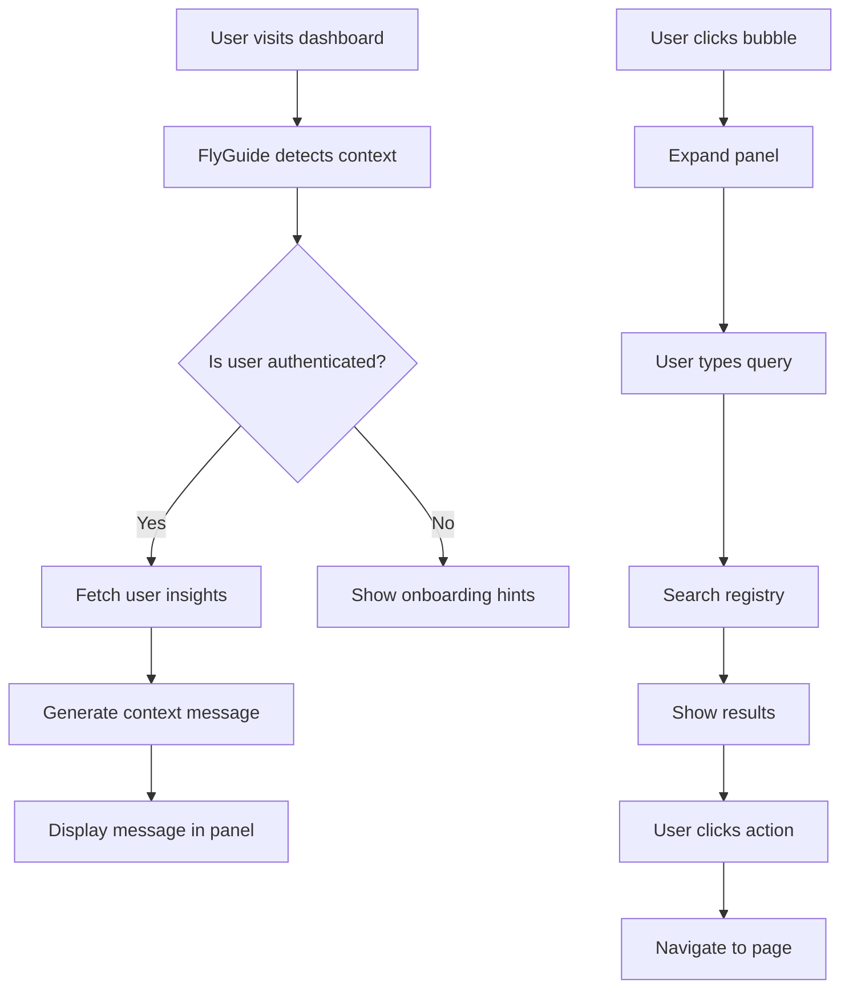

# FlyGuide Implementation Plan

## Executive Summary

FlyGuide is a lightweight, context-aware floating assistant for FunctionFly's registered members. It appears as a bottom-right floating bubble that expands into a smart panel providing:
- Context-aware insights based on current page
- Function discovery and search
- Trust Score growth recommendations
- Smart onboarding prompts
- Revenue optimization tips

---

## Architecture Overview

### Component Hierarchy
```
DashboardLayout
├── Sidebar
├── Navbar
├── Outlet (page content)
├── Footer
└── FlyGuide (new)
    ├── FlyGuideBubble (floating trigger)
    └── FlyGuidePanel (expandable chat panel)
        ├── FlyGuideHeader
        ├── FlyGuideMessages
        ├── FlyGuideQuickActions
        └── FlyGuideInput
```

### Data Flow
```
┌─────────────────┐     ┌──────────────────┐     ┌─────────────────┐
│  Route Context  │────▶│  FlyGuide Store  │────▶│  Message Engine │
│  (useLocation)  │     │  (Zustand)       │     │  (context msgs) │
└─────────────────┘     └──────────────────┘     └─────────────────┘
                               │                         │
                               ▼                         ▼
┌─────────────────┐     ┌──────────────────┐     ┌─────────────────┐
│  Auth Store     │────▶│  API Services    │────▶│  UI Components │
│  (user, plan)   │     │  (functions,      │     │  (render)       │
│  Onboarding     │     │   registry)       │     │                 │
└─────────────────┘     └──────────────────┘     └─────────────────┘
```

---

## Implementation Steps

### Phase 1: Core Infrastructure

#### Step 1.1: Create FlyGuide Store (`flyGuideStore.ts`)
**File**: `web/dashboard/src/stores/flyGuideStore.ts`

```typescript
interface FlyGuideState {
  isOpen: boolean;
  isMinimized: boolean;
  currentContext: FlyGuideContext;
  messages: FlyGuideMessage[];
  userInsights: UserInsights | null;
  
  // Actions
  toggleOpen: () => void;
  minimize: () => void;
  setContext: (context: FlyGuideContext) => void;
  addMessage: (message: FlyGuideMessage) => void;
  clearMessages: () => void;
  fetchUserInsights: () => Promise<void>;
}

type FlyGuideContext = 
  | 'dashboard'
  | 'functions'
  | 'function-detail'
  | 'marketplace'
  | 'docs'
  | 'onboarding'
  | 'profile'
  | 'unknown';
```

#### Step 1.2: Create API for FlyGuide Intelligence (`flyguide.ts`)
**File**: `web/dashboard/src/api/flyguide.ts`

```typescript
// User insights fetched by FlyGuide
interface UserInsights {
  trustScore: number;
  trustTier: 'bronze' | 'silver' | 'gold' | 'platinum';
  pointsToNextTier: number;
  publishedFunctions: number;
  totalExecutions: number;
  revenue?: number;
  developerLevel: 'new' | 'intermediate' | 'advanced' | 'expert';
  onboardingProgress: number;
}

// Function insights for current function context
interface FunctionInsights {
  name: string;
  trustScore: number;
  latencyPercentile?: number; // vs top 10%
  reliabilityScore: number;
  isMonetized: boolean;
  executionCount: number;
  suggestions: string[];
}

export const flyguideApi = {
  getUserInsights: () => apiClient.get<UserInsights>('/v1/flyguide/user-insights'),
  getFunctionInsights: (functionId: string) => 
    apiClient.get<FunctionInsights>(`/v1/flyguide/function-insights/${functionId}`),
  searchFunctions: (query: string) => 
    registryApi.searchFunctions(query, undefined, 3),
};
```

**Note**: For MVP, we'll use existing API data to populate insights:
- Trust score from `registryApi.getFunctionStats()`
- Developer level derived from `completedSteps` in onboardingStore
- Function metrics from `functionsApi.getMetrics()`

---

### Phase 2: UI Components

#### Step 2.1: Create FlyGuide Bubble Component
**File**: `web/dashboard/src/components/flyguide/FlyGuideBubble.tsx`

- Small animated floating icon (⚡)
- Pulse animation for new messages/notifications
- Position: fixed bottom-right (24px from edges)
- Size: 56px diameter
- Hover: scale up slightly, glow effect
- Click: expands FlyGuidePanel

#### Step 2.2: Create FlyGuide Panel Component
**File**: `web/dashboard/src/components/flyguide/FlyGuidePanel.tsx`

- Fixed position: bottom-right (24px from edges)
- Dimensions: 380px width, 520px height (max)
- Collapsible to smaller size (280px height when minimized)
- Sections:
  - Header: title, minimize button, close button
  - Messages area: scrollable, shows context messages
  - Quick actions: context-specific buttons
  - Input area: for search queries

#### Step 2.3: Create FlyGuide Message Components
**File**: `web/dashboard/src/components/flyguide/FlyGuideMessages.tsx`

- Message types: `assistant` (bot), `user`, `system`
- Assistant messages support:
  - Plain text
  - Action buttons (links to pages)
  - Insights cards (trust score, metrics)
  - Function suggestions (with function cards)

---

### Phase 3: Context-Aware Intelligence

#### Step 3.1: Create Context Detection Hook
**File**: `web/dashboard/src/hooks/useFlyGuideContext.ts`

```typescript
export function useFlyGuideContext(): FlyGuideContext {
  const location = useLocation();
  const path = location.pathname;
  
  // Route-based context detection
  if (path.startsWith('/dashboard')) return 'dashboard';
  if (path.startsWith('/functions')) return 'functions';
  if (path.includes('/functions/') && !path.includes('/edit')) return 'function-detail';
  if (path.startsWith('/marketplace')) return 'marketplace';
  if (path.startsWith('/docs')) return 'docs';
  if (path.startsWith('/profile')) return 'profile';
  if (path.startsWith('/onboarding')) return 'onboarding';
  
  return 'unknown';
}
```

#### Step 3.2: Create Message Engine
**File**: `web/dashboard/src/components/flyguide/FlyGuideMessageEngine.ts`

Generates context-aware messages based on:
- Current route context
- User's trust score and tier
- Onboarding progress
- Function metrics (if viewing function)
- Marketplace data (if searching)

**Message Templates by Context**:

**Dashboard Context**:
```
• "Welcome back! Your Trust Score is {score}. You're {points} points away from {nextTier}."
• "Tip: Adding deterministic tests can boost your trust score by up to 5%."
• "Your functions executed {count} times this week. View detailed analytics →"
```

**Function Detail Context**:
```
• "Your function latency is {percentile}% higher than top 10% in this category. Want optimization tips?"
• "This function has {executionCount} executions. Consider adding a paid tier to monetize."
• "Deterministic reliability: {score}%. Add more test cases to improve."
```

**Marketplace Context**:
```
• "Top functions in '{category}': {top3} (sorted by Trust Score)"
• "Similar functions charge ${price}/call. Enable pricing to compete →"
• "Your function '{name}' has high usage but no pricing. Monetize now →"
```

**Onboarding Context**:
```
• "Ready to publish your first function? Let's get started →"
• "Step 1: Upload your function code. Need help with the format?"
• "Great progress! {completed}/{total} steps done."
```

---

### Phase 4: Feature Implementation

#### Step 4.1: Trust Score Growth Advisor
- Display current trust score and tier
- Show points to next tier
- Provide actionable suggestions:
  - "Add deterministic test cases (+2-5%)"
  - "Improve reliability score (+3-8%)"
  - "Get more ratings (+1-2%)"

#### Step 4.2: Function Discovery Assistant
- Search input in FlyGuide panel
- Queries `registryApi.searchFunctions()`
- Displays top 3 results with:
  - Function name and author
  - Trust Score badge
  - Reliability/latency scores
  - Quick "View" button

#### Step 4.3: Smart Onboarding Prompts
- Checks `onboardingStore.completedSteps`
- Provides contextual nudges:
  - "Connect a provider to deploy"
  - "Deploy your first function"
  - "Run a deterministic test"

#### Step 4.4: "Explain This Page" Feature
- Button in header: "Explain This"
- Context-specific explanations:
  - Dashboard: explains metrics, trust score calculation
  - Function detail: explains latency, reliability, deterministic replay
  - Marketplace: explains trust score, ratings, pricing

#### Step 4.5: Revenue Optimization Prompts
- For monetized functions: shows earnings stats
- For non-monetized: suggests pricing based on:
  - Similar functions' pricing
  - Execution count
  - Trust Score tier

---

### Phase 5: Integration

#### Step 5.1: Integrate into DashboardLayout
**File**: `web/dashboard/src/components/layout/DashboardLayout.tsx`

```tsx
import { FlyGuide } from '@/components/flyguide/FlyGuide';

export function DashboardLayout() {
  // ... existing code
  
  return (
    <div className="...">
      {/* existing components */}
      <FlyGuide />
    </div>
  );
}
```

#### Step 5.2: Add to Auth Page (optional - for new users)
- Public-facing version on landing pages
- Shows onboarding hints for unregistered users

---

## File Structure

```
web/dashboard/src/
├── api/
│   └── flyguide.ts              # NEW: FlyGuide API client
├── components/
│   └── flyguide/
│       ├── index.ts             # NEW: Export all components
│       ├── FlyGuide.tsx         # NEW: Main container
│       ├── FlyGuideBubble.tsx   # NEW: Floating trigger
│       ├── FlyGuidePanel.tsx    # NEW: Expandable panel
│       ├── FlyGuideHeader.tsx   # NEW: Panel header
│       ├── FlyGuideMessages.tsx # NEW: Message display
│       ├── FlyGuideInput.tsx    # NEW: Search input
│       ├── FlyGuideQuickActions.tsx # NEW: Context actions
│       └── FlyGuideMessageEngine.ts # NEW: Message generation
├── hooks/
│   └── useFlyGuideContext.ts   # NEW: Context detection
├── stores/
│   └── flyGuideStore.ts        # NEW: FlyGuide state
└── pages/
    └── [existing pages]         # No changes needed
```

---

## API Endpoints Required

### For MVP (can use existing endpoints):
1. `GET /v1/functions` - List user's functions
2. `GET /v1/functions/:id/metrics` - Function metrics
3. `GET /v1/registry/search` - Function discovery
4. `GET /v1/registry/functions/:author/:name/stats` - Trust scores
5. `GET /v1/users/me` - User profile data

### New Backend Endpoints (Phase 2):
1. `GET /v1/flyguide/user-insights` - Aggregated user insights
2. `GET /v1/flyguide/function-insights/:id` - Function-specific insights

---

## UI/UX Specifications

### Color Scheme
- Primary: Brand blue (#3b82f6)
- Background: Dark (#0f172a) / Light (#f8fafc)
- Accent: Purple (#8b5cf6)
- Success: Green (#22c55e)
- Warning: Amber (#f59e0b)

### Animations
- Bubble: Subtle pulse (2s infinite)
- Panel: Slide up + fade in (200ms ease-out)
- Messages: Staggered fade in (50ms delay each)
- Close: Fade out (150ms)

### Accessibility
- Keyboard navigation (Escape to close)
- ARIA labels on all interactive elements
- Focus trap in expanded panel
- Screen reader announcements for new messages

---

## Mermaid: Component Flow



---

## Testing Strategy

1. **Unit Tests**: Message engine, context detection
2. **Component Tests**: Panel open/close, message rendering
3. **Integration Tests**: API mocking, navigation
4. **E2E Tests**: Full user flows

---

## Success Metrics

- **Adoption**: % of users who interact with FlyGuide
- **Conversion**: % of users who publish after onboarding prompts
- **Engagement**: Avg messages per session
- **Trust Score**: Increase in average user trust scores
- **Revenue**: Increase in monetized functions

---

## Future Enhancements (Phase 2)

1. **AI-Powered Responses**: LLM integration for natural language
2. **Watch Mode**: Alert on error spikes, trust score drops
3. **Hybrid Registry Search**: Combine generic Q&A with function discovery
4. **Multi-language Support**: i18n integration
5. **Slack/Discord Integration**: Notifications outside platform
