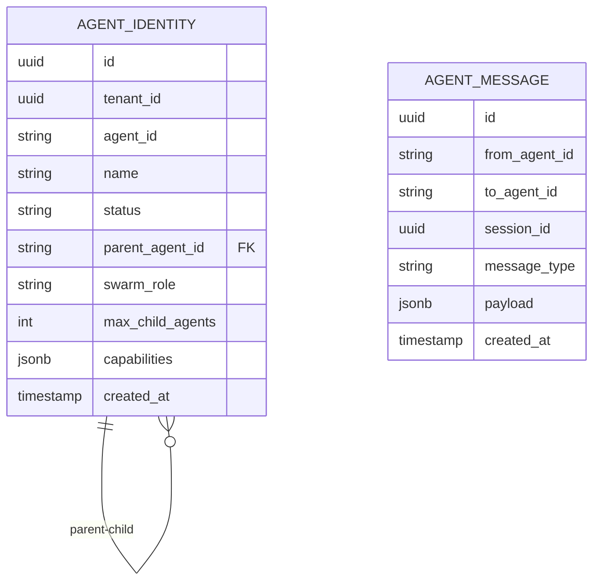
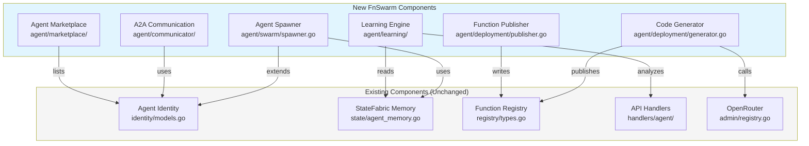

# FnSwarm Implementation Plan

## Executive Summary

This document provides a detailed implementation plan for **FnSwarm: The Self-Evolving Agent Network**. The plan leverages existing infrastructure and identifies specific new components needed to transform FunctionFly from a serverless platform into a self-evolving agent ecosystem.

---

## Current Architecture Assessment

### Existing Components (Reuse)

| Component | Location | Purpose | FnSwarm Usage |
|-----------|----------|---------|---------------|
| AgentIdentity | [`internal/agent/identity/models.go`](internal/agent/identity/models.go:10) | Agent registration & identity | Extend with swarm fields |
| AgentQuotaConfig | [`internal/agent/identity/models.go`](internal/agent/identity/models.go:29) | Per-agent quota limits | Extend with spawn limits |
| AgentMemory | [`internal/storage/state/models.go`](internal/storage/state/models.go:305) | Vector-backed agent memory | Core persistence layer |
| StateRepository | [`internal/storage/state/agent_memory.go`](internal/storage/state/agent_memory.go:17) | Memory CRUD with embeddings | Search & storage |
| RegistryFunction | [`internal/storage/registry/types.go`](internal/storage/registry/types.go:22) | Function metadata | Agent self-deployment |
| RegistryFunctionVersion | [`internal/storage/registry/types.go`](internal/storage/registry/types.go:49) | Function versions | Agent-published functions |
| Agent Handlers | [`internal/api/handlers/agent/handler.go`](internal/api/handlers/agent/handler.go:1) | Agent API endpoints | Extend for swarm |
| Attribution | [`internal/agent/attribution/record.go`](internal/agent/attribution/record.go:1) | Execution tracking | Learning engine data |
| OpenRouter | [`internal/api/handlers/admin/registry.go`](internal/api/handlers/admin/registry.go:538) | LLM integration | Code generation |

### Existing Database Tables

- `agent_identities` (migration 000055) - Agent registration
- `agent_quota_configs` (migration 000055) - Quota management
- `agent_execution_records` (migration 000056) - Execution tracking
- `agent_sessions` (migration 000056) - Session management
- `agent_behavioral_policies` (migration 000056) - Behavioral policies
- `agent_billing_controls` (migration 000057) - Billing
- `agent_memories` (migration 000047) - Vector memory with pgvector
- `agent_memory_indexes` (migration 000047) - Memory indexing

---

## Implementation Phases

### Phase 1: Foundation - Agent Spawning & Swarm Hierarchy

**Objective:** Enable agents to spawn child agents and establish hierarchical relationships.

#### 1.1 Database Schema Extensions



**New Tables:**

| Table | Purpose | Migration |
|-------|---------|-----------|
| `agent_relationships` | Parent-child agent links | 000058 |
| `agent_messages` | Agent-to-agent messages | 000058 |
| `agent_capabilities` | Agent skill registry | 000058 |

**Implementation:**

- Create migration: `migrations/000058_fnswarm_swarm_tables.up.sql`
- Add fields to [`internal/agent/identity/models.go`](internal/agent/identity/models.go):
  - `ParentAgentID` - Reference to parent agent
  - `SwarmRole` - "parent", "worker", "independent"
  - `MaxChildAgents` - Spawn limit
  - `Capabilities` - JSON array of agent skills
- Add repository methods: [`internal/agent/identity/repository.go`](internal/agent/identity/repository.go:1)

#### 1.2 API Endpoint Extensions

**New Endpoints:**

| Endpoint | Method | Handler |
|----------|--------|---------|
| `/v1/agent/{agent_id}/spawn` | POST | HandleSpawnAgent |
| `/v1/agent/{agent_id}/children` | GET | HandleListChildAgents |
| `/v1/agent/{agent_id}/terminate/{child_id}` | DELETE | HandleTerminateChild |
| `/v1/agent/{agent_id}/message` | POST | HandleAgentMessage |
| `/v1/agent/{agent_id}/inbox` | GET | HandleGetMessages |

**Implementation:**

- Add handlers in [`internal/api/handlers/agent/handler.go`](internal/api/handlers/agent/handler.go:500+)
- Add request/response types:
  - `SpawnAgentRequest` - Child agent config
  - `SpawnAgentResponse` - Child agent details + API key
  - `AgentMessage` - A2A message structure

#### 1.3 Agent Spawning Service

**New File:** `internal/agent/swarm/spawner.go`

```go
type SpawnerService struct {
    identityRepo *identity.Repository
    stateRepo    *state.StateRepository
    quotaEnforcer *quota.Enforcer
}

// SpawnChildAgent creates a new agent under parent supervision
func (s *SpawnerService) SpawnChildAgent(ctx context.Context, parentID string, req *SpawnRequest) (*AgentIdentity, string, error)
```

**Responsibilities:**
- Validate parent has spawn capacity
- Create child agent with parent context
- Set up child agent memory namespace
- Register in agent hierarchy
- Apply inheritance policies from parent

---

### Phase 2: Agent-to-Agent Communication

**Objective:** Enable agents to communicate, collaborate, and delegate tasks.

#### 2.1 Message Protocol

**Message Types:**

| Type | Description | Payload |
|------|-------------|---------|
| `task_delegation` | Assign work to another agent | Task spec |
| `task_result` | Return task output | Result data |
| `query` | Ask another agent | Query request |
| `response` | Answer to query | Response data |
| `capability_discovery` | Find agents with skills | Filter criteria |
| `heartbeat` | Liveness check | Status |

#### 2.2 Message Storage

**Implementation:**

- Add repository: [`internal/agent/attribution/repository.go`](internal/agent/attribution/repository.go:1) extension
- Message storage with expiration (TTL-based cleanup)
- Session-scoped message threading

#### 2.3 Agent Discovery

**New Endpoints:**

| Endpoint | Method | Handler |
|----------|--------|---------|
| `/v1/agent/discover` | GET | HandleDiscoverAgents |
| `/v1/agent/{agent_id}/capabilities` | GET | HandleGetCapabilities |

**Implementation:**

- Query agents by capability tags
- Filter by availability (recent heartbeat)
- Rank by trust score from [`internal/storage/registry/types.go`](internal/storage/registry/types.go:152)

#### 2.4 Communication Handlers

**New File:** `internal/api/handlers/agent/communicator.go`

```go
type CommunicatorHandler struct {
    identityRepo *identity.Repository
    messageStore *MessageStore
    discoverSvc  *DiscoveryService
}

// HandleAgentMessage processes incoming agent message
func (h *CommunicatorHandler) HandleAgentMessage(w http.ResponseWriter, r *http.Request)

// HandleGetMessages retrieves agent's inbox
func (h *CommunicatorHandler) HandleGetMessages(w http.ResponseWriter, r *http.Request)
```

---

### Phase 3: Self-Deployment (Code Generation)

**Objective:** Enable agents to generate and publish functions autonomously.

#### 3.1 Code Generation Service

**New File:** `internal/agent/deployment/generator.go`

```go
type CodeGenerator struct {
    openRouterClient *OpenRouterClient
    templateRegistry *TemplateRegistry
}

// GenerateFunction creates function code from natural language
func (g *CodeGenerator) GenerateFunction(ctx context.Context, spec *FunctionSpec) (*GeneratedCode, error)

// ValidateFunction ensures generated code is safe and functional
func (g *CodeGenerator) ValidateFunction(ctx context.Context, code *GeneratedCode) (*ValidationResult, error)
```

**Integration Points:**

- Use existing OpenRouter client from [`internal/api/handlers/admin/registry.go`](internal/api/handlers/admin/registry.go:538)
- Leverage function templates from [`internal/storage/registry/types.go`](internal/storage/registry/types.go:22)
- Sandboxed code generation with resource limits

#### 3.2 Function Publishing

**New File:** `internal/agent/deployment/publisher.go`

```go
type FunctionPublisher struct {
    registryRepo *registry.RegistryRepository
    bundler      *bundler.Bundler
    malwareScanner *security.MalwareScanner
}

// PublishFunction publishes agent-generated function to registry
func (p *FunctionPublisher) PublishFunction(ctx context.Context, agentID string, code *GeneratedCode) (*registry.RegistryFunction, error)

// RegisterAsOwner associates agent with published function
func (p *FunctionPublisher) RegisterAsOwner(ctx context.Context, functionID uuid.UUID, agentID string) error
```

#### 3.3 Agent Function Registry

**Database Extensions:**

- Add `owner_agent_id` to [`RegistryFunction`](internal/storage/registry/types.go:22)
- Track `agent_generated` flag
- Store generation metadata (prompt, model used)

**Implementation:**

- Migration: `migrations/000059_fnswarm_agent_functions.up.sql`
- Update [`internal/storage/registry/function_crud.go`](internal/storage/registry/function_crud.go:1)

#### 3.4 API Endpoints

| Endpoint | Method | Handler |
|----------|--------|---------|
| `/v1/agent/{agent_id}/functions` | GET | HandleListAgentFunctions |
| `/v1/agent/{agent_id}/generate` | POST | HandleGenerateFunction |
| `/v1/agent/{agent_id}/publish` | POST | HandlePublishFunction |

---

### Phase 4: Learning & Self-Optimization

**Objective:** Enable agents to learn from execution history and optimize behavior.

#### 4.1 Execution Analysis Service

**New File:** `internal/agent/learning/analyzer.go`

```go
type ExecutionAnalyzer struct {
    attributionRepo *attribution.Repository
    stateRepo       *state.StateRepository
}

// AnalyzeExecutionPatterns identifies success/failure patterns
func (a *ExecutionAnalyzer) AnalyzeExecutionPatterns(ctx context.Context, agentID string, timeWindow time.Duration) (*ExecutionAnalysis, error)

// GetOptimizationRecommendations suggests improvements
func (a *ExecutionAnalyzer) GetOptimizationRecommendations(ctx context.Context, agentID string) ([]Recommendation, error)
```

**Analysis Dimensions:**

- Success rate by function
- Latency patterns
- Error type frequency
- Input/output patterns
- Retry effectiveness

#### 4.2 Memory Enhancement

**Integration with existing [`AgentMemory`](internal/storage/state/models.go:305):**

- Auto-store execution outcomes as memories
- Generate embeddings for pattern search
- Importance scoring based on outcome impact

**New Methods:**

```go
// StoreExecutionAsMemory records execution for learning
func (r *StateRepository) StoreExecutionAsMemory(ctx context.Context, execution *ExecutionRecord) error

// GetRelevantMemories retrieves memories relevant to current task
func (r *StateRepository) GetRelevantMemories(ctx context.Context, agentID string, task *Task) ([]*AgentMemory, error)
```

#### 4.3 Self-Optimization Engine

**New File:** `internal/agent/learning/optimizer.go`

```go
type SelfOptimizer struct {
    analyzer     *ExecutionAnalyzer
    spawner      *SpawnerService
    policyEngine *policy.Engine
}

// OptimizeBehavior adjusts agent based on learning
func (o *SelfOptimizer) OptimizeBehavior(ctx context.Context, agentID string) (*OptimizationResult, error)

// SuggestFunctionImprovements recommends code changes
func (o *SelfOptimizer) SuggestFunctionImprovements(ctx context.Context, functionID uuid.UUID) ([]CodeChange, error)
```

**Optimization Actions:**

- Adjust retry policies
- Modify execution timeouts
- Recommend function delegation
- Suggest new child agent spawns
- Update behavioral policies

#### 4.4 API Endpoints

| Endpoint | Method | Handler |
|----------|--------|---------|
| `/v1/agent/{agent_id}/analyze` | GET | HandleAnalyzeExecutions |
| `/v1/agent/{agent_id}/optimize` | POST | HandleOptimizeAgent |
| `/v1/agent/{agent_id}/insights` | GET | HandleGetInsights |

---

### Phase 5: Agent Marketplace & Autonomy

**Objective:** Enable agent discovery, hiring, and autonomous operation.

#### 5.1 Agent Marketplace

**Database Tables:**

```sql
CREATE TABLE agent_listings (
    id UUID PRIMARY KEY DEFAULT gen_random_uuid(),
    agent_id TEXT NOT NULL REFERENCES agent_identities(agent_id),
    listing_type TEXT NOT NULL,  -- "hire" | "collaborate" | "marketplace"
    title TEXT NOT NULL,
    description TEXT,
    pricing_model TEXT,  -- "free" | "per_call" | "subscription"
    price_per_call DECIMAL(10,6),
    subscription_monthly_usd DECIMAL(10,2),
    capabilities JSONB NOT NULL,
    rating_score DECIMAL(3,2),
    total_calls INTEGER DEFAULT 0,
    is_active BOOLEAN DEFAULT true,
    created_at TIMESTAMPTZ NOT NULL DEFAULT NOW()
);
```

#### 5.2 Autonomous Mode

**Implementation:**

- Add `autonomous_enabled` flag to [`AgentIdentity`](internal/agent/identity/models.go:10)
- Implement scheduled task runner
- Add trigger-based agent reactions

#### 5.3 API Endpoints

| Endpoint | Method | Handler |
|----------|--------|---------|
| `/v1/agents/marketplace` | GET | HandleListMarketplace |
| `/v1/agents/{agent_id}/hire` | POST | HandleHireAgent |
| `/v1/agent/{agent_id}/schedule` | POST | HandleScheduleTask |
| `/v1/agent/{agent_id}/triggers` | POST | HandleCreateTrigger |

---

## Integration Architecture



---

## Milestone Checklist

### Milestone 1: Swarm Foundation ✅
- [ ] Database migration for agent relationships
- [ ] Model extensions for swarm fields
- [ ] Spawn endpoint implementation
- [ ] Child agent listing
- [ ] Unit tests for spawner

### Milestone 2: Agent Communication ✅
- [ ] Message storage and retrieval
- [ ] A2A protocol implementation
- [ ] Agent discovery by capabilities
- [ ] Message inbox/outbox endpoints
- [ ] Integration tests

### Milestone 3: Self-Deployment ✅
- [ ] OpenRouter integration for code gen
- [ ] Function generation from spec
- [ ] Automated publishing pipeline
- [ ] Agent function ownership tracking
- [ ] End-to-end generation test

### Milestone 4: Learning Engine ✅
- [ ] Execution pattern analysis
- [ ] Memory auto-enrichment
- [ ] Optimization recommendations
- [ ] Self-policy adjustment
- [ ] Analytics dashboard endpoint

### Milestone 5: Marketplace & Autonomy ✅
- [ ] Agent listing creation
- [ ] Marketplace discovery
- [ ] Agent hiring flow
- [ ] Scheduled task execution
- [ ] Trigger-based reactions

---

## Risk Mitigation

| Risk | Mitigation |
|------|------------|
| Agent spawn spam | Quota limits per parent, approval workflow |
| Malicious code generation | Sandboxed execution, malware scanning, rate limits |
| Infinite loops in A2A | Max delegation depth, cycle detection |
| Resource exhaustion | Per-agent limits, auto-scaling policies |
| Vector DB bloat | TTL-based cleanup, importance pruning |

---

## Testing Strategy

1. **Unit Tests** - Each new service component
2. **Integration Tests** - API endpoint flows
3. **E2E Tests** - Full spawn → communicate → generate → publish flow
4. **Load Tests** - Agent spawning at scale
5. **Security Tests** - Prompt injection, infinite loops, resource limits

---

## Success Metrics

| Metric | Target |
|--------|--------|
| Agent spawn latency | <500ms |
| A2A message delivery | <100ms |
| Code generation time | <30s |
| Learning analysis | <5s |
| Marketplace search | <200ms |

---

## Dependencies

- **Required:** pgvector extension (already in use for AgentMemory)
- **Required:** OpenRouter API key configuration
- **Optional:** Redis for real-time message delivery
- **Optional:** Additional vector dimensions for pattern embeddings
