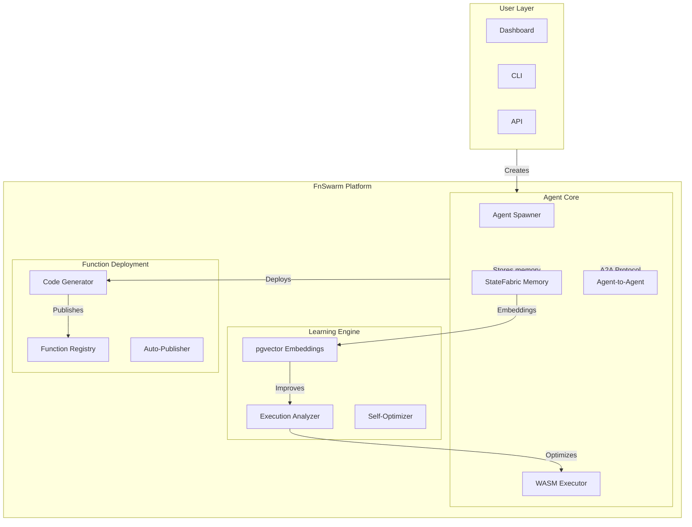

# FnSwarm: The Self-Evolving Agent Network

## Executive Summary

**FnSwarm** transforms FunctionFly from a serverless function platform into a **self-evolving agent ecosystem**. By combining StateFabric's durable memory, WASM-based function execution, and AI capabilities, we create a network of autonomous agents that can:

- **Spawn** new agents for specialized tasks
- **Learn** from execution history via vector embeddings
- **Deploy** their own functions to the registry
- **Communicate** with other agents (agent-to-agent)
- **Persist** across sessions with full context

This is the ultimate differentiation: no other platform offers stateful, self-improving agents that can extend themselves by deploying functions.

---

## Why This Is The Ultimate Idea

| Current Platforms | FnSwarm |
|-------------------|---------|
| Stateless functions | Stateful agents with memory |
| Fixed command sets | Self-evolving capabilities |
| Single-purpose bots | Multi-agent swarms |
| No code generation | Agents deploy their own functions |
| Ephemeral sessions | Persistent agent identity |
| Human-driven only | Autonomous + human-collaborative |

---

## Core Architecture

---

## Key Capabilities

### 1. Agent Spawning (The Swarm)
- Create child agents for specialized tasks
- Parent agents can delegate and supervise
- Hierarchical agent structure
- Agent can create other agents (swarm behavior)

### 2. Persistent Memory (StateFabric)
- Full conversation history
- Learned patterns from executions
- User preferences and context
- Cross-session continuity
- Vector embeddings for semantic search

### 3. Self-Deployment
- Agents can generate and deploy functions
- Natural language → code → deployed function
- Functions are versioned and trackable
- Agents improve their function repertoire

### 4. Agent-to-Agent Communication
- Agents can message each other
- Collaborative problem solving
- Specialization and task sharing
- emergent swarm intelligence

### 5. Execution & Learning
- Track all executions with metadata
- Analyze success/failure patterns
- Self-optimize based on outcomes
- Continuous improvement loop

---

## Integration with Existing Systems

| Existing Component | Integration Point |
|--------------------|-------------------|
| `internal/storage/state/agent_memory.go` | Agent memory & embeddings |
| `internal/agent/identity/models.go` | Agent registration & identity |
| `internal/agent/execution/` | Function execution |
| `internal/api/handlers/agent/` | Agent API endpoints |
| `StateFabric` | Durable state storage |
| `internal/api/handlers/registry/` | Function registry |
| OpenRouter | LLM for code generation |

---

## Implementation Phases

### Phase 1: Foundation
- [ ] Extend AgentIdentity with swarm capabilities
- [ ] Add agent spawning API endpoints
- [ ] Implement parent-child agent relationships
- [ ] Set up agent-to-agent message protocol

### Phase 2: Memory & Learning
- [ ] Integrate StateFabric for agent memory
- [ ] Add vector embedding for execution history
- [ ] Build execution analyzer service
- [ ] Implement self-optimization engine

### Phase 3: Self-Deployment
- [ ] Add code generation from natural language
- [ ] Implement auto-publish to function registry
- [ ] Add function versioning per agent
- [ ] Build function marketplace for agent-created functions

### Phase 4: Autonomy
- [ ] Implement agent autonomous mode
- [ ] Add scheduled task execution
- [ ] Build trigger-based agent reactions
- [ ] Add agent marketplace (hire other agents)

---

## Differentiation from ClawDBot

| ClawDBot | FnSwarm |
|----------|---------|
| Fixed commands | Unlimited capabilities via functions |
| Single bot | Swarm of agents |
| Ephemeral | Persistent across sessions |
| No code generation | Auto-deploys functions |
| No learning | Learns from every execution |
| No agent-to-agent | Full A2A communication |
| Stateless | Full StateFabric integration |

---

## Monetization Opportunities

1. **Agent Hosting** - Monthly fee per agent
2. **Execution Minutes** - Pay per agent task
3. **Function Marketplace** - Revenue share on agent-created functions
4. **Agent-to-Agent Services** - Pay for specialized agent skills
5. **Enterprise Agents** - Custom swarm configurations

---

## Success Metrics

| Metric | Target (12 months) |
|--------|-------------------|
| Active Agents | 100,000 |
| Agent-Created Functions | 500,000 |
| Daily Executions | 10M |
| Revenue (MRR) | $500K |
| Agent Marketplace Listings | 10,000 |

---

## Why This Wins

1. **Network Effect** - More agents = more useful = more users
2. **Lock-in** - Agent memory and learned context are irreplaceable
3. **Unlimited Extensibility** - Agents can create any function
4. **First-Mover** - No competitor has stateful, self-improving agents
5. **Platform Evolution** - From compute → intelligence → autonomous network

---

## Conclusion

FnSwarm is not just a bot or a feature - it's a **new category of platform**. By combining the unique strengths of FunctionFly (WASM execution), StateFabric (durable memory), and AI (LLM), we create an ecosystem that evolves itself. Agents that learn, improve, and extend their capabilities autonomously.

This is the ultimate differentiation: **a platform where the software improves itself**.
