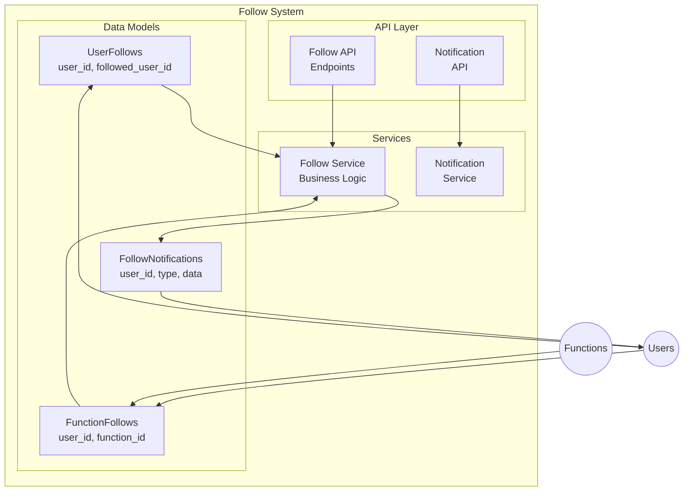

# Follow System Implementation Plan

## Executive Summary

This document outlines the implementation of a comprehensive **Follow System** for the FunctionFly platform. The system enables users to follow other users (authors) and specific functions, creating a social engagement layer that drives discovery and community interaction.

## System Overview

The follow system consists of two primary relationship types:

1. **User-to-User Follows** - Users can follow other users/authors to receive notifications when they publish new functions
2. **User-to-Function Follows** - Users can follow specific functions to receive updates about new versions, ratings changes, or other important events



---

## Phase 1: Database Schema Design

### 1.1 Follow Tables

Create new migration file: `migrations/XXXXXX_add_follow_system.up.sql`

#### User Follows Table (`user_follows`)

```sql
CREATE TABLE user_follows (
    id UUID PRIMARY KEY DEFAULT gen_random_uuid(),
    follower_id UUID NOT NULL REFERENCES users(id) ON DELETE CASCADE,
    followed_user_id UUID NOT NULL REFERENCES users(id) ON DELETE CASCADE,
    
    -- Optional: reason for following (e.g., "likes their functions", "colleague")
    follow_reason VARCHAR(255),
    
    -- Notifications preferences for this specific follow
    notify_on_new_function BOOLEAN DEFAULT true,
    notify_on_function_update BOOLEAN DEFAULT true,
    notify_on_new_version BOOLEAN DEFAULT true,
    
    created_at TIMESTAMPTZ NOT NULL DEFAULT NOW(),
    updated_at TIMESTAMPTZ NOT NULL DEFAULT NOW(),
    
    -- Unique constraint: a user can only follow another user once
    CONSTRAINT uq_user_follow UNIQUE (follower_id, followed_user_id),
    
    -- Prevent self-follows
    CONSTRAINT ck_no_self_follow CHECK (follower_id != followed_user_id)
);

-- Indexes for efficient queries
CREATE INDEX idx_user_follows_follower ON user_follows(follower_id);
CREATE INDEX idx_user_follows_followed ON user_follows(followed_user_id);
CREATE INDEX idx_user_follows_created ON user_follows(created_at DESC);

-- Composite index for checking if user follows
CREATE INDEX idx_user_follows_lookup ON user_follows(follower_id, followed_user_id);
```

#### Function Follows Table (`function_follows`)

```sql
CREATE TABLE function_follows (
    id UUID PRIMARY KEY DEFAULT gen_random_uuid(),
    user_id UUID NOT NULL REFERENCES users(id) ON DELETE CASCADE,
    function_id UUID NOT NULL REFERENCES registry_functions(id) ON DELETE CASCADE,
    
    -- Optional: reason for following
    follow_reason VARCHAR(255),
    
    -- Notifications preferences
    notify_on_new_version BOOLEAN DEFAULT true,
    notify_on_rating_change BOOLEAN DEFAULT false,
    notify_on_trust_change BOOLEAN DEFAULT true,
    notify_on_verification BOOLEAN DEFAULT true,
    
    created_at TIMESTAMPTZ NOT NULL DEFAULT NOW(),
    updated_at TIMESTAMPTZ NOT NULL DEFAULT NOW(),
    
    -- Unique constraint: a user can only follow a function once
    CONSTRAINT uq_function_follow UNIQUE (user_id, function_id)
);

-- Indexes for efficient queries
CREATE INDEX idx_function_follows_user ON function_follows(user_id);
CREATE INDEX idx_function_follows_function ON function_follows(function_id);
CREATE INDEX idx_function_follows_created ON function_follows(created_at DESC);
```

#### Follower Count Cache Tables

To optimize read performance, maintain cached follower/following counts:

```sql
-- Cache for user follower/following counts
CREATE TABLE user_follow_stats (
    user_id UUID PRIMARY KEY REFERENCES users(id) ON DELETE CASCADE,
    followers_count INTEGER DEFAULT 0,
    following_count INTEGER DEFAULT 0,
    updated_at TIMESTAMPTZ NOT NULL DEFAULT NOW()
);

-- Cache for function follower counts
CREATE TABLE function_follow_stats (
    function_id UUID PRIMARY KEY REFERENCES registry_functions(id) ON DELETE CASCADE,
    followers_count INTEGER DEFAULT 0,
    updated_at TIMESTAMPTZ NOT NULL DEFAULT NOW()
);
```

---

## Phase 2: Storage/Repository Layer

### 2.1 New Storage Files

Create: `internal/storage/follow_repository.go`

```go
package storage

import (
    "context"
    "time"
    
    "github.com/google/uuid"
)

// FollowRepository defines the interface for follow operations
type FollowRepository interface {
    // User Follows
    FollowUser(ctx context.Context, followerID, followedUserID uuid.UUID, reason *string) error
    UnfollowUser(ctx context.Context, followerID, followedUserID uuid.UUID) error
    IsFollowingUser(ctx context.Context, followerID, followedUserID uuid.UUID) (bool, error)
    GetUserFollowers(ctx context.Context, userID uuid.UUID, limit, offset int) ([]UserFollow, int, error)
    GetUserFollowing(ctx context.Context, userID uuid.UUID, limit, offset int) ([]UserFollow, int, error)
    GetUserFollowerCount(ctx context.Context, userID uuid.UUID) (int, error)
    GetUserFollowingCount(ctx context.Context, userID uuid.UUID) (int, error)
    
    // Function Follows
    FollowFunction(ctx context.Context, userID, functionID uuid.UUID, reason *string) error
    UnfollowFunction(ctx context.Context, userID, functionID uuid.UUID) error
    IsFollowingFunction(ctx context.Context, userID, functionID uuid.UUID) (bool, error)
    GetFunctionFollowers(ctx context.Context, functionID uuid.UUID, limit, offset int) ([]FunctionFollow, int, error)
    GetUserFunctionFollows(ctx context.Context, userID uuid.UUID, limit, offset int) ([]FunctionFollow, int, error)
    GetFunctionFollowerCount(ctx context.Context, functionID uuid.UUID) (int, error)
    
    // Batch operations
    GetFollowedFunctionsByUsers(ctx context.Context, userIDs []uuid.UUID) (map[uuid.UUID][]FunctionFollow, error)
    GetFollowersByUsers(ctx context.Context, userIDs []uuid.UUID) (map[uuid.UUID][]UserFollow, error)
}

// UserFollow represents a user-to-user follow relationship
type UserFollow struct {
    ID              uuid.UUID  `json:"id"`
    FollowerID      uuid.UUID  `json:"follower_id"`
    FollowedUserID  uuid.UUID  `json:"followed_user_id"`
    FollowReason    *string    `json:"follow_reason,omitempty"`
    NotifyOnNewFunction   bool      `json:"notify_on_new_function"`
    NotifyOnFunctionUpdate bool    `json:"notify_on_function_update"`
    NotifyOnNewVersion    bool      `json:"notify_on_new_version"`
    CreatedAt       time.Time  `json:"created_at"`
    UpdatedAt       time.Time  `json:"updated_at"`
    
    // Populated relationships
    Follower        *User      `json:"follower,omitempty"`
    FollowedUser    *User      `json:"followed_user,omitempty"`
}

// FunctionFollow represents a user-to-function follow relationship
type FunctionFollow struct {
    ID                  uuid.UUID  `json:"id"`
    UserID              uuid.UUID  `json:"user_id"`
    FunctionID          uuid.UUID  `json:"function_id"`
    FollowReason        *string    `json:"follow_reason,omitempty"`
    NotifyOnNewVersion  bool       `json:"notify_on_new_version"`
    NotifyOnRatingChange bool      `json:"notify_on_rating_change"`
    NotifyOnTrustChange bool       `json:"notify_on_trust_change"`
    NotifyOnVerification bool      `json:"notify_on_verification"`
    CreatedAt           time.Time  `json:"created_at"`
    UpdatedAt           time.Time  `json:"updated_at"`
    
    // Populated relationships
    User     *User              `json:"user,omitempty"`
    Function *RegistryFunction  `json:"function,omitempty"`
}
```

### 2.2 Follow Statistics Service

Create: `internal/services/follow_stats.go`

```go
package services

import (
    "context"
    "sync"
    
    "github.com/functionfly/functionfly/internal/storage"
)

// FollowStatsService manages follower/following counts
type FollowStatsService struct {
    repo storage.FollowRepository
    mu   sync.Mutex
}

// NewFollowStatsService creates a new follow stats service
func NewFollowStatsService(repo storage.FollowRepository) *FollowStatsService {
    return &FollowStatsService{repo: repo}
}

// IncrementUserFollowerCount increments follower count for a user
func (s *FollowStatsService) IncrementUserFollowerCount(ctx context.Context, userID uuid.UUID) error {
    s.mu.Lock()
    defer s.mu.Unlock()
    // Implementation: Update cached count in user_follow_stats table
}

// DecrementUserFollowerCount decrements follower count for a user
func (s *FollowStatsService) DecrementUserFollowerCount(ctx context.Context, userID uuid.UUID) error {
    // Implementation
}

// IncrementFunctionFollowerCount increments follower count for a function
func (s *FollowStatsService) IncrementFunctionFollowerCount(ctx context.Context, functionID uuid.UUID) error {
    // Implementation
}
```

---

## Phase 3: Business Logic Service

### 3.1 Follow Service

Create: `internal/services/follow.go`

```go
package services

import (
    "context"
    "errors"
    
    "github.com/functionfly/functionfly/internal/storage"
    "github.com/google/uuid"
)

var (
    ErrAlreadyFollowingUser     = errors.New("already following this user")
    ErrNotFollowingUser         = errors.New("not following this user")
    ErrAlreadyFollowingFunction = errors.New("already following this function")
    ErrNotFollowingFunction     = errors.New("not following this function")
    ErrCannotFollowSelf         = errors.New("cannot follow yourself")
)

// FollowService handles follow business logic
type FollowService struct {
    followRepo    storage.FollowRepository
    userRepo     storage.UserRepository
    functionRepo storage.FunctionRepository
    notifService *NotificationService
}

// NewFollowService creates a new follow service
func NewFollowService(
    followRepo storage.FollowRepository,
    userRepo storage.UserRepository,
    functionRepo storage.FunctionRepository,
    notifService *NotificationService,
) *FollowService {
    return &FollowService{
        followRepo:    followRepo,
        userRepo:      userRepo,
        functionRepo:  functionRepo,
        notifService:  notifService,
    }
}

// FollowUserRequest represents a request to follow a user
type FollowUserRequest struct {
    FollowerID       uuid.UUID
    FollowedUserID   uuid.UUID
    Reason          *string
    NotifyOnNewFunction   *bool
    NotifyOnFunctionUpdate *bool
    NotifyOnNewVersion   *bool
}

// FollowUser allows a user to follow another user
func (s *FollowService) FollowUser(ctx context.Context, req FollowUserRequest) error {
    // Validation
    if req.FollowerID == req.FollowedUserID {
        return ErrCannotFollowSelf
    }
    
    // Check if already following
    exists, err := s.followRepo.IsFollowingUser(ctx, req.FollowerID, req.FollowedUserID)
    if err != nil {
        return err
    }
    if exists {
        return ErrAlreadyFollowingUser
    }
    
    // Check if both users exist
    if _, err := s.userRepo.GetUserByID(ctx, req.FollowedUserID); err != nil {
        return err
    }
    
    // Create follow relationship
    if err := s.followRepo.FollowUser(ctx, req.FollowerID, req.FollowedUserID, req.Reason); err != nil {
        return err
    }
    
    // Update follower count cache
    // (Implementation via FollowStatsService)
    
    // Send notification to followed user
    if s.notifService != nil {
        s.notifService.NotifyNewFollower(ctx, req.FollowedUserID, req.FollowerID)
    }
    
    return nil
}

// UnfollowUser allows a user to unfollow another user
func (s *FollowService) UnfollowUser(ctx context.Context, followerID, followedUserID uuid.UUID) error {
    exists, err := s.followRepo.IsFollowingUser(ctx, followerID, followedUserID)
    if err != nil {
        return err
    }
    if !exists {
        return ErrNotFollowingUser
    }
    
    return s.followRepo.UnfollowUser(ctx, followerID, followedUserID)
}

// FollowFunctionRequest represents a request to follow a function
type FollowFunctionRequest struct {
    UserID                uuid.UUID
    FunctionID            uuid.UUID
    Reason                *string
    NotifyOnNewVersion    *bool
    NotifyOnRatingChange *bool
    NotifyOnTrustChange  *bool
    NotifyOnVerification *bool
}

// FollowFunction allows a user to follow a function
func (s *FollowService) FollowFunction(ctx context.Context, req FollowFunctionRequest) error {
    exists, err := s.followRepo.IsFollowingFunction(ctx, req.UserID, req.FunctionID)
    if err != nil {
        return err
    }
    if exists {
        return ErrAlreadyFollowingFunction
    }
    
    // Check if function exists
    if _, err := s.functionRepo.GetFunction(ctx, req.FunctionID); err != nil {
        return err
    }
    
    return s.followRepo.FollowFunction(ctx, req.UserID, req.FunctionID, req.Reason)
}

// UnfollowFunction allows a user to unfollow a function
func (s *FollowService) UnfollowFunction(ctx context.Context, userID, functionID uuid.UUID) error {
    exists, err := s.followRepo.IsFollowingFunction(ctx, userID, functionID)
    if err != nil {
        return err
    }
    if !exists {
        return ErrNotFollowingFunction
    }
    
    return s.followRepo.UnfollowFunction(ctx, userID, functionID)
}

// GetUserFollowers returns followers of a user
func (s *FollowService) GetUserFollowers(ctx context.Context, userID uuid.UUID, page, pageSize int) ([]storage.UserFollow, int, error) {
    return s.followRepo.GetUserFollowers(ctx, userID, pageSize, (page-1)*pageSize)
}

// GetUserFollowing returns users that a user is following
func (s *FollowService) GetUserFollowing(ctx context.Context, userID uuid.UUID, page, pageSize int) ([]storage.UserFollow, int, error) {
    return s.followRepo.GetUserFollowing(ctx, userID, pageSize, (page-1)*pageSize)
}

// GetFunctionFollowers returns followers of a function
func (s *FollowService) GetFunctionFollowers(ctx context.Context, functionID uuid.UUID, page, pageSize int) ([]storage.FunctionFollow, int, error) {
    return s.followRepo.GetFunctionFollowers(ctx, functionID, pageSize, (page-1)*pageSize)
}

// GetUserFunctionFollows returns functions that a user follows
func (s *FollowService) GetUserFunctionFollows(ctx context.Context, userID uuid.UUID, page, pageSize int) ([]storage.FunctionFollow, int, error) {
    return s.followRepo.GetUserFunctionFollows(ctx, userID, pageSize, (page-1)*pageSize)
}
```

---

## Phase 4: API Endpoints

### 4.1 Follow API Routes

Add to `internal/api/routes.go`:

```go
// Follow handlers
type FollowHandler struct {
    followService *services.FollowService
}

func NewFollowHandler(followService *services.FollowService) *FollowHandler {
    return &FollowHandler{followService: followService}
}

func (h *FollowHandler) RegisterRoutes(router *Router, middleware ...Middleware) {
    // Protected routes (require authentication)
    protected := router.Group("/v1/follow", middleware...)
    
    // User follows
    protected.Post("/users/:userID/follow", h.FollowUser)
    protected.Delete("/users/:userID/follow", h.UnfollowUser)
    protected.Get("/users/:userID/followers", h.GetUserFollowers)
    protected.Get("/users/:userID/following", h.GetUserFollowing)
    
    // Function follows
    protected.Post("/functions/:functionID/follow", h.FollowFunction)
    protected.Delete("/functions/:functionID/follow", h.UnfollowFunction)
    protected.Get("/functions/:functionID/followers", h.GetFunctionFollowers)
    
    // User's function follows
    protected.Get("/me/following/functions", h.GetMyFollowedFunctions)
}
```

### 4.2 API Request/Response Types

Create: `internal/api/handlers/follow/types.go`

```go
package follow

// FollowUserRequest represents a request to follow a user
type FollowUserRequest struct {
    Reason              *string `json:"reason,omitempty"`
    NotifyOnNewFunction *bool   `json:"notify_on_new_function,omitempty"`
}

// FollowUserResponse represents the response from following a user
type FollowUserResponse struct {
    OK       bool   `json:"ok"`
    FollowID string `json:"follow_id"`
}

// UserFollowResponse represents a user follow relationship
type UserFollowResponse struct {
    ID            string     `json:"id"`
    Follower      UserSummary `json:"follower"`
    FollowedUser  UserSummary `json:"followed_user"`
    Reason        *string    `json:"reason,omitempty"`
    CreatedAt     time.Time  `json:"created_at"`
}

// FollowFunctionRequest represents a request to follow a function
type FollowFunctionRequest struct {
    Reason             *string `json:"reason,omitempty"`
    NotifyOnNewVersion *bool   `json:"notify_on_new_version,omitempty"`
}

// FunctionFollowResponse represents a function follow relationship
type FunctionFollowResponse struct {
    ID         string              `json:"id"`
    User       UserSummary         `json:"user"`
    Function   FunctionSummary     `json:"function"`
    Reason     *string             `json:"reason,omitempty"`
    CreatedAt  time.Time           `json:"created_at"`
}

// PaginatedFollowersResponse represents a paginated list of followers
type PaginatedFollowersResponse struct {
    Data       []UserSummary    `json:"data"`
    Pagination PaginationParams `json:"pagination"`
}

// PaginatedFunctionFollowersResponse represents a paginated list of function followers
type PaginatedFunctionFollowersResponse struct {
    Data       []UserSummary    `json:"data"`
    Pagination PaginationParams `json:"pagination"`
}
```

### 4.3 Handler Implementation

Create: `internal/api/handlers/follow/handler.go`

```go
package follow

import (
    "net/http"
    "strconv"
    
    "github.com/functionfly/functionfly/internal/api"
    "github.com/functionfly/functionfly/internal/services"
    "github.com/google/uuid"
)

// Handler handles follow-related HTTP requests
type Handler struct {
    followService *services.FollowService
}

// NewHandler creates a new follow handler
func NewHandler(followService *services.FollowService) *Handler {
    return &Handler{followService: followService}
}

// FollowUser handles POST /v1/follow/users/:userID/follow
func (h *Handler) FollowUser(w http.ResponseWriter, r *http.Request) {
    ctx := r.Context()
    
    // Get authenticated user
    currentUser := api.GetCurrentUser(ctx)
    if currentUser == nil {
        api.Error(w, http.StatusUnauthorized, "authentication required")
        return
    }
    
    // Parse target user ID
    targetUserID, err := uuid.Parse(r.PathValue("userID"))
    if err != nil {
        api.Error(w, http.StatusBadRequest, "invalid user ID")
        return
    }
    
    // Parse request body
    var req FollowUserRequest
    if err := api.ParseJSON(r, &req); err != nil {
        api.Error(w, http.StatusBadRequest, err.Error())
        return
    }
    
    // Execute follow
    followReq := services.FollowUserRequest{
        FollowerID:     currentUser.ID,
        FollowedUserID: targetUserID,
        Reason:         req.Reason,
    }
    
    if err := h.followService.FollowUser(ctx, followReq); err != nil {
        switch err {
        case services.ErrAlreadyFollowingUser:
            api.Error(w, http.StatusConflict, "already following this user")
        case services.ErrCannotFollowSelf:
            api.Error(w, http.StatusBadRequest, "cannot follow yourself")
        default:
            api.Error(w, http.StatusInternalServerError, err.Error())
        }
        return
    }
    
    api.Success(w, FollowUserResponse{OK: true})
}

// UnfollowUser handles DELETE /v1/follow/users/:userID/follow
func (h *Handler) UnfollowUser(w http.ResponseWriter, r *http.Request) {
    ctx := r.Context()
    
    currentUser := api.GetCurrentUser(ctx)
    if currentUser == nil {
        api.Error(w, http.StatusUnauthorized, "authentication required")
        return
    }
    
    targetUserID, err := uuid.Parse(r.PathValue("userID"))
    if err != nil {
        api.Error(w, http.StatusBadRequest, "invalid user ID")
        return
    }
    
    if err := h.followService.UnfollowUser(ctx, currentUser.ID, targetUserID); err != nil {
        api.Error(w, http.StatusInternalServerError, err.Error())
        return
    }
    
    api.Success(w, map[string]bool{"ok": true})
}

// GetUserFollowers handles GET /v1/follow/users/:userID/followers
func (h *Handler) GetUserFollowers(w http.ResponseWriter, r *http.Request) {
    ctx := r.Context()
    
    userID, err := uuid.Parse(r.PathValue("userID"))
    if err != nil {
        api.Error(w, http.StatusBadRequest, "invalid user ID")
        return
    }
    
    page, _ := strconv.Atoi(r.URL.Query().Get("page"))
    if page < 1 {
        page = 1
    }
    pageSize, _ := strconv.Atoi(r.URL.Query().Get("page_size"))
    if pageSize < 1 || pageSize > 100 {
        pageSize = 20
    }
    
    follows, total, err := h.followService.GetUserFollowers(ctx, userID, page, pageSize)
    if err != nil {
        api.Error(w, http.StatusInternalServerError, err.Error())
        return
    }
    
    // Transform to response format
    followers := make([]UserSummary, len(follows))
    for i, f := range follows {
        followers[i] = transformUserToSummary(f.Follower)
    }
    
    api.Success(w, PaginatedFollowersResponse{
        Data: followers,
        Pagination: PaginationParams{
            Page:    page,
            PerPage: pageSize,
            Total:   total,
        },
    })
}

// GetUserFollowing handles GET /v1/follow/users/:userID/following
func (h *Handler) GetUserFollowing(w http.ResponseWriter, r *http.Request) {
    // Similar implementation
}

// FollowFunction handles POST /v1/follow/functions/:functionID/follow
func (h *Handler) FollowFunction(w http.ResponseWriter, r *http.Request) {
    ctx := r.Context()
    
    currentUser := api.GetCurrentUser(ctx)
    if currentUser == nil {
        api.Error(w, http.StatusUnauthorized, "authentication required")
        return
    }
    
    functionID, err := uuid.Parse(r.PathValue("functionID"))
    if err != nil {
        api.Error(w, http.StatusBadRequest, "invalid function ID")
        return
    }
    
    var req FollowFunctionRequest
    if err := api.ParseJSON(r, &req); err != nil {
        api.Error(w, http.StatusBadRequest, err.Error())
        return
    }
    
    followReq := services.FollowFunctionRequest{
        UserID:     currentUser.ID,
        FunctionID: functionID,
        Reason:     req.Reason,
    }
    
    if err := h.followService.FollowFunction(ctx, followReq); err != nil {
        switch err {
        case services.ErrAlreadyFollowingFunction:
            api.Error(w, http.StatusConflict, "already following this function")
        default:
            api.Error(w, http.StatusInternalServerError, err.Error())
        }
        return
    }
    
    api.Success(w, FollowUserResponse{OK: true})
}

// UnfollowFunction handles DELETE /v1/follow/functions/:functionID/follow
func (h *Handler) UnfollowFunction(w http.ResponseWriter, r *http.Request) {
    // Similar implementation
}

// GetFunctionFollowers handles GET /v1/follow/functions/:functionID/followers
func (h *Handler) GetFunctionFollowers(w http.ResponseWriter, r *http.Request) {
    // Similar implementation
}

// GetMyFollowedFunctions handles GET /v1/follow/me/following/functions
func (h *Handler) GetMyFollowedFunctions(w http.ResponseWriter, r *http.Request) {
    // Similar implementation
}
```

---

## Phase 5: Notification Integration

### 5.1 Notification Types

Extend the notification system to handle follow-related events:

```go
// Notification types for follows
const (
    NotificationTypeNewFollower      = "new_follower"
    NotificationTypeNewFunction     = "new_function"
    NotificationTypeFunctionUpdate  = "function_update"
    NotificationTypeNewVersion      = "new_version"
    NotificationTypeTrustScoreChange = "trust_score_change"
)
```

### 5.2 Notification Triggering

When events occur, trigger notifications to followers:

```go
// In function publish service
func (s *FunctionPublishService) PublishNewVersion(ctx context.Context, functionID uuid.UUID, version string) error {
    // ... existing logic ...
    
    // Notify function followers about new version
    if s.notificationService != nil {
        followers, err := s.followRepo.GetFunctionFollowers(ctx, functionID, 0, 0)
        if err != nil {
            return err
        }
        
        for _, follower := range followers {
            if follower.NotifyOnNewVersion {
                s.notificationService.NotifyFunctionNewVersion(ctx, follower.UserID, functionID, version)
            }
        }
    }
    
    return nil
}
```

---

## Phase 6: Additional Features

### 6.1 Follow Recommendations

```go
// Suggest users to follow based on:
// - Users who publish similar functions
// - Users with high follower counts in same category
// - Suggested by followed users
type FollowRecommendationService struct {
    followRepo storage.FollowRepository
    funcRepo   storage.FunctionRepository
}

func (s *FollowRecommendationService) GetRecommendations(ctx context.Context, userID uuid.UUID, limit int) ([]UserSummary, error) {
    // Implementation:
    // 1. Get user's current follows
    // 2. Find users who publish similar functions
    // 3. Rank by relevance score
    // 4. Return top N recommendations
}
```

### 6.2 Activity Feed

```go
// Generate activity feed for followed users
type ActivityFeedService struct {
    followRepo storage.FollowRepository
}

func (s *ActivityFeedService) GetUserFeed(ctx context.Context, userID uuid.UUID, page, pageSize int) ([]Activity, error) {
    // Get users that current user follows
    following, _, _ := s.followRepo.GetUserFollowing(ctx, userID, 0, 0)
    
    // Get recent activities from those users:
    // - New functions published
    // - New versions released
    // - Function updates
}
```

### 6.3 Privacy Settings

```go
// User privacy settings for followers
type FollowPrivacySettings struct {
    AllowFollowers    bool `json:"allow_followers"`     // Allow others to follow
    ShowFollowerCount bool `json:"show_follower_count"` // Show follower count publicly
    ShowFollowingList bool `json:"show_following_list"` // Show following list publicly
}
```

---

## Implementation Order

1. **Database Migration** - Create follow tables and indexes
2. **Repository Layer** - Implement `FollowRepository` interface
3. **Service Layer** - Implement `FollowService` with business logic
4. **API Handlers** - Create HTTP handlers for all endpoints
5. **Route Registration** - Add routes to main router
6. **Notification Integration** - Trigger notifications on relevant events
7. **Statistics Updates** - Maintain follower count caches
8. **Testing** - Unit and integration tests

---

## API Summary

| Method | Endpoint | Description |
|--------|----------|-------------|
| POST | `/v1/follow/users/:userID/follow` | Follow a user |
| DELETE | `/v1/follow/users/:userID/follow` | Unfollow a user |
| GET | `/v1/follow/users/:userID/followers` | Get user's followers |
| GET | `/v1/follow/users/:userID/following` | Get users that user follows |
| POST | `/v1/follow/functions/:functionID/follow` | Follow a function |
| DELETE | `/v1/follow/functions/:functionID/follow` | Unfollow a function |
| GET | `/v1/follow/functions/:functionID/followers` | Get function's followers |
| GET | `/v1/follow/me/following/functions` | Get functions user follows |

---

## Migration Files to Create

1. `migrations/XXXXXX_add_follow_system.up.sql` - Create all follow tables
2. `migrations/XXXXXX_add_follow_system.down.sql` - Drop all follow tables

---

## Files to Create

| File | Purpose |
|------|---------|
| `internal/storage/follow_repository.go` | Database operations for follows |
| `internal/services/follow.go` | Business logic for follow operations |
| `internal/services/follow_stats.go` | Follower count management |
| `internal/api/handlers/follow/types.go` | API request/response types |
| `internal/api/handlers/follow/handler.go` | HTTP handlers |
| `migrations/XXXXXX_add_follow_system.up.sql` | Database migration |
| `migrations/XXXXXX_add_follow_system.down.sql` | Rollback migration |
