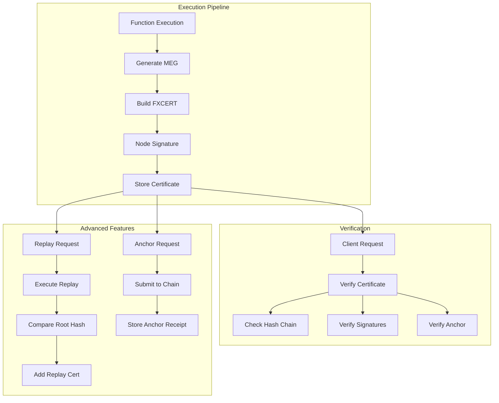

# FXCERT Implementation Plan

## Executive Summary

The FXCERT (FunctionFly Execution Certificate) is a legal-grade cryptographic artifact that provides verifiable proof of deterministic function execution. This document outlines the implementation plan to complete the FXCERT system.

## Current State Analysis

### Already Implemented ✓

| Component | Location | Status |
|-----------|----------|--------|
| Certificate Structure | `internal/dre/cert/certificate.go` | Core types, Generate(), Verify() |
| Canonical JSON | `internal/dre/crypto/canonicalize.go` | RFC-8785 compliant |
| Hash Functions | `internal/dre/crypto/hasher.go` | SHA-256 with domain separation |
| Merkle Execution Graph | `internal/dre/crypto/meg.go` | MEG building and verification |
| Capsule Descriptor | `internal/dre/capsule/descriptor.go` | DCC protocol |
| Drift Detection | `internal/dre/capsule/drift.go` | Drift classification |
| Anti-Manipulation | `internal/dre/antimanip/detector.go` | Trust penalties |
| Trust Scoring | `internal/functionregistry/trust_score.go` | Trust metrics |

### Gaps Identified

1. **File Format (.fxcert)** - No serialization to .fxcert files
2. **CBOR Encoding** - Missing compact binary format
3. **Storage Layer** - No database persistence for certificates
4. **API Endpoints** - No REST API for certificate operations
5. **Blockchain Anchoring** - No blockchain integration
6. **Replay Certification** - Incomplete replay workflow
7. **Platform Signatures** - Enterprise tier signatures not implemented
8. **Execution Integration** - Not integrated into function execution flow

---

## Detailed Implementation Plan

### 1. File Format Serialization (.fxcert)

**File:** `internal/dre/cert/serializer.go`

```go
// SerializeToFile writes FXCERT to .fxcert file
// Supports JSON and CBOR encoding
type Serializer struct {
    encoding Encoding // json | cbor
}

// Encoding constants
type Encoding string
const (
    EncodingJSON Encoding = "json"
    EncodingCBOR Encoding = "cbor"
)

// WriteToFile writes certificate to .fxcert file
func (s *Serializer) WriteToFile(cert *FXCert, path string) error

// ReadFromFile reads certificate from .fxcert file
func (s *Serializer) ReadFromFile(path string) (*FXCert, error)

// ToBytes serializes certificate to bytes
func (s *Serializer) ToBytes(cert *FXCert) ([]byte, error)

// FromBytes deserializes certificate from bytes
func (s *Serializer) FromBytes(data []byte) (*FXCert, error)
```

**CBOR Implementation:**
- Use `github.com/fxamacker/cbor/v2` library
- Encode/decode all FXCert fields
- Support both canonical CBOR and regular CBOR

### 2. Storage/Repository Layer

**File:** `internal/dre/cert/repository.go`

```go
// CertificateRepository handles FXCERT persistence
type CertificateRepository interface {
    // Store saves a certificate
    Store(cert *FXCert) error
    
    // Get retrieves a certificate by ID
    Get(id string) (*FXCert, error)
    
    // GetByExecutionID retrieves certificate by execution ID
    GetByExecutionID(execID string) (*FXCert, error)
    
    // List returns certificates with filters
    List(filter CertificateFilter) ([]*FXCert, error)
    
    // GetByRootHash retrieves certificate by execution root hash
    GetByRootHash(rootHash string) (*FXCert, error)
}

// CertificateFilter for querying certificates
type CertificateFilter struct {
    FunctionID   string
    OwnerID      string
    NodeID       string
    Region       string
    FromTime     time.Time
    ToTime       time.Time
    CertLevel    CertLevel
    AnchoredOnly bool
}
```

**Database Schema (PostgreSQL):**

```sql
CREATE TABLE fxcertificates (
    id              UUID PRIMARY KEY DEFAULT gen_random_uuid(),
    certificate_id  VARCHAR(64) UNIQUE NOT NULL,
    execution_id    VARCHAR(64) NOT NULL,
    function_id     VARCHAR(255) NOT NULL,
    owner_id        UUID NOT NULL,
    caller_id       UUID,
    node_id         VARCHAR(64) NOT NULL,
    region          VARCHAR(32) NOT NULL,
    
    -- Certificate data (JSONB for flexibility)
    certificate_json JSONB NOT NULL,
    
    -- Integrity hashes
    execution_root_hash VARCHAR(64) NOT NULL,
    certificate_hash    VARCHAR(64) NOT NULL,
    
    -- Trust snapshot (frozen at execution time)
    trust_score           DECIMAL(5,4),
    determinism_score    DECIMAL(5,4),
    replay_consistency   DECIMAL(5,4),
    drift_incidents      INTEGER DEFAULT 0,
    verified_executions  BIGINT DEFAULT 0,
    
    -- Certification level
    cert_level VARCHAR(32) NOT NULL DEFAULT 'standard',
    
    -- Anchoring
    anchored         BOOLEAN DEFAULT FALSE,
    anchor_chain     VARCHAR(32),
    anchor_block     BIGINT,
    anchor_tx_hash   VARCHAR(66),
    
    -- Replay certification
    replay_certified     BOOLEAN DEFAULT FALSE,
    replay_root_hash     VARCHAR(64),
    replay_node_id       VARCHAR(64),
    replay_timestamp     TIMESTAMPTZ,
    
    -- Timestamps
    created_at  TIMESTAMPTZ NOT NULL DEFAULT NOW(),
    updated_at TIMESTAMPTZ NOT NULL DEFAULT NOW(),
    
    -- Indexes
    INDEX idx_exec_root_hash (execution_root_hash),
    INDEX idx_function_id (function_id),
    INDEX idx_owner_id (owner_id),
    INDEX idx_created_at (created_at)
);

CREATE TABLE fxcert_anchors (
    id              UUID PRIMARY KEY DEFAULT gen_random_uuid(),
    certificate_id  UUID NOT NULL REFERENCES fxcertificates(id),
    anchor_chain    VARCHAR(32) NOT NULL,
    block_number    BIGINT NOT NULL,
    tx_hash         VARCHAR(66) NOT NULL,
    merkle_root     VARCHAR(64) NOT NULL,
    anchor_timestamp TIMESTAMPTZ NOT NULL,
    created_at      TIMESTAMPTZ NOT NULL DEFAULT NOW()
);
```

### 3. API Endpoints

**File:** `internal/api/routes_fxcert.go`

| Endpoint | Method | Description |
|----------|--------|-------------|
| `/v1/certificates/:id` | GET | Get certificate by ID |
| `/v1/certificates/execution/:execId` | GET | Get certificate by execution ID |
| `/v1/certificates/verify` | POST | Verify a certificate |
| `/v1/certificates` | GET | List certificates with filters |
| `/v1/certificates/export/:id` | GET | Export certificate as .fxcert file |
| `/v1/certificates/import` | POST | Import certificate from .fxcert file |
| `/v1/certificates/:id/anchor` | POST | Anchor certificate to blockchain |
| `/v1/certificates/:id/replay` | POST | Request replay certification |

### 4. Blockchain Anchoring Integration

**File:** `internal/dre/cert/anchoring.go`

```go
// AnchoringService handles blockchain timestamping
type AnchoringService interface {
    // Anchor submits execution root hash to blockchain
    Anchor(chain string, rootHash string) (*AnchorReceipt, error)
    
    // VerifyAnchor verifies an existing anchor
    VerifyAnchor(receipt *AnchorReceipt) (bool, error)
    
    // GetMerkleProof returns Merkle proof for the anchored hash
    GetMerkleProof(chain string, txHash string) (*MerkleProof, error)
}

// AnchorReceipt contains anchoring confirmation
type AnchorReceipt struct {
    Chain       string `json:"chain"`
    BlockNumber int64  `json:"block_number"`
    TxHash      string `json:"tx_hash"`
    MerkleRoot  string `json:"anchor_merkle_root"`
    AnchoredAt  string `json:"anchored_at"`
}

// Supported chains
const (
    ChainEthereum  = "ethereum"
    ChainPolygon  = "polygon"
    ChainArbitrum = "arbitrum"
)
```

**Ethereum Integration:**
- Smart contract: Store execution root hash with timestamp
- Use IPFS for Merkle tree storage (optional)
- Event log for verification

### 5. Replay Certification Workflow

**File:** `internal/dre/cert/replay.go`

```go
// ReplayService handles replay certification
type ReplayService interface {
    // RequestReplay requests a replay verification
    RequestReplay(certID string) (*ReplayRequest, error)
    
    // ExecuteReplay performs the replay
    ExecuteReplay(req *ReplayRequest) (*ReplayResult, error)
    
    // CertifyReplay adds replay certification to certificate
    CertifyReplay(certID string, result *ReplayResult) (*FXCert, error)
}

// ReplayResult contains replay verification results
type ReplayResult struct {
    ReplayRootHash   string    `json:"replay_root_hash"`
    RootsMatch       bool      `json:"roots_match"`
    ReplayNodeID     string    `json:"replay_node_id"`
    ReplayTimestamp  time.Time `json:"replay_timestamp"`
    ReplaySignature  string    `json:"replay_signature"` // Ed25519
    DriftReport      *capsule.DriftReport
}
```

**Workflow:**
1. Original execution generates FXCERT with ExecutionRootHash
2. Request replay on same or different node
3. Replay executes with identical inputs/capsule
4. Compare ReplayRootHash with original ExecutionRootHash
5. If match: add ReplayCertSection to certificate
6. Both original and replay nodes sign

### 6. Platform Signature Support

**File:** `internal/dre/cert/platform.go`

```go
// PlatformSigner handles enterprise platform signatures
type PlatformSigner interface {
    // Sign signs certificate with platform key
    Sign(cert *FXCert) (*Signature, error)
    
    // Verify verifies platform signature
    Verify(cert *FXCert, sig *Signature) (bool, error)
    
    // GetPlatformKey returns current platform public key
    GetPlatformKey() (ed25519.PublicKey, error)
}
```

**Platform Key Management:**
- HSM (Hardware Security Module) integration for production
- Key rotation support
- Audit logging of all signing operations

### 7. Execution Flow Integration

**Integration Points:**

```go
// In the function execution pipeline (api/middleware/execution_coordinator.go)

// After successful execution:
func (e *ExecutionCoordinator) generateCertificate(ctx context.Context, result *ExecutionResult) *FXCert {
    // 1. Build MEG from execution components
    meg := crypto.BuildMEG(crypto.MEGComponents{
        InputPayload:    result.Input,
        EnvironmentData: result.Capsule,
        Dependencies:    result.Dependencies,
        TraceChunks:     result.Trace,
        ResourceUsage:   result.Resources,
        OutputPayload:   result.Output,
        Metadata:        result.Metadata,
    })
    
    // 2. Create execution section
    exec := cert.ExecutionSection{
        ExecutionID:      result.ExecutionID,
        FunctionID:       result.FunctionID,
        OwnerID:          result.OwnerID,
        CallerID:         result.CallerID,
        NodeID:           result.NodeID,
        Region:           result.Region,
        TimestampVirtual: result.VirtualTimestamp,
        TimestampRealUTC: result.RealTimestamp,
        ProtocolVersion:  "dre/1.0",
    }
    
    // 3. Create capsule section
    capsule := cert.CapsuleSection{
        CapsuleDescriptorHash: result.CapsuleHash,
        DeterminismTier:      result.DeterminismTier,
        ProtocolVersion:       "dcc/1.0",
    }
    
    // 4. Get trust snapshot
    trust := cert.TrustSection{
        TrustScore:             result.TrustScore,
        DeterminismScore:       result.DeterminismScore,
        ReplayConsistencyScore: result.ReplayConsistencyScore,
        DriftIncidentsTotal:    result.DriftIncidents,
        VerifiedExecutionsTotal: result.TotalVerified,
    }
    
    // 5. Generate certificate
    fxcert, err := cert.Generate(meg, exec, capsule, trust, result.CertLevel, e.nodeKey)
    if err != nil {
        // Log error but don't fail execution
        return nil
    }
    
    // 6. Store certificate
    e.certRepo.Store(fxcert)
    
    return fxcert
}
```

### 8. Trust Score Integration with DRE

The trust section in FXCERT should capture DRE-specific metrics:

```go
// TrustSection should include (updated from existing):
type TrustSection struct {
    TrustScore              float64 `json:"trust_score"`
    DeterminismScore        float64 `json:"determinism_score"`       // verified/total
    ReplayConsistencyScore float64 `json:"replay_consistency_score"` // 1 - drift/total
    DriftIncidentsTotal    int     `json:"drift_incidents_total"`
    VerifiedExecutionsTotal int64   `json:"verified_executions_total"`
    
    // DRE 2.0 additions:
    DREScore               float64 `json:"dre_score"` // Combined DRE trust
    CapsuleVersion         string  `json:"capsule_version"`
}
```

---

## Implementation Order

```
Phase 1: Core Infrastructure
├── 1.1 Add CBOR encoding support
├── 1.2 Implement .fxcert file serializer
└── 1.3 Create database schema migrations

Phase 2: Storage & API
├── 2.1 Implement CertificateRepository
├── 2.2 Add API routes for certificate operations
└── 2.3 Create certificate listing with filters

Phase 3: Advanced Features
├── 3.1 Implement blockchain anchoring service
├── 3.2 Build replay certification workflow
└── 3.3 Add platform signature support

Phase 4: Integration
├── 4.1 Integrate FXCERT generation into execution flow
├── 4.2 Add certificate to execution response
└── 4.3 Implement certificate verification in API

Phase 5: Testing & Documentation
├── 5.1 Unit tests for all components
├── 5.2 Integration tests
└── 5.3 API documentation
```

---

## Architecture Diagram



---

## Success Criteria

1. **Deterministic** - Same execution always produces identical certificate
2. **Self-contained** - Certificate contains all verification data
3. **Tamper-evident** - Any modification invalidates signatures
4. **Node-attributed** - Certificate tied to executing node
5. **Chain-verifiable** - Blockchain anchoring optional but supported
6. **Backward compatible** - Lite/Standard/Legal grades supported
7. **Audit-ready** - Can survive regulatory scrutiny
8. **Performant** - Certificate generation < 10ms overhead

---

## Files to Create/Modify

### New Files

| File | Purpose |
|------|---------|
| `internal/dre/cert/serializer.go` | .fxcert file format |
| `internal/dre/cert/repository.go` | Storage layer |
| `internal/dre/cert/anchoring.go` | Blockchain integration |
| `internal/dre/cert/replay.go` | Replay certification |
| `internal/dre/cert/platform.go` | Platform signatures |
| `internal/dre/cert/verification.go` | Enhanced verification |
| `migrations/XXXXXX_add_fxcert_tables.sql` | Database schema |

### Modified Files

| File | Changes |
|------|---------|
| `internal/dre/cert/certificate.go` | Add CBOR tags, replay fields |
| `internal/api/routes.go` | Add certificate endpoints |
| `internal/api/middleware/execution_coordinator.go` | Integrate FXCERT generation |
| `internal/storage/models_core.go` | Add FXCert model |
