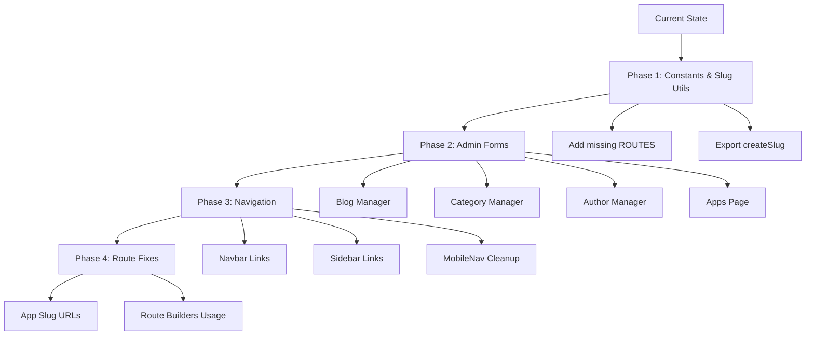

# Navbar, URL, and Slugify Analysis Report

## Executive Summary

After a comprehensive review of the codebase, I've identified several gaps, inconsistencies, and bugs related to navbars, URL handling, and slugify usage. Below is a detailed breakdown of findings organized by category.

---

## 1. NAVBAR ISSUES

### 1.1 Inconsistent Route Usage Between Components

**Problem:** The codebase uses hardcoded string paths in some places while using `ROUTES` constants in others, leading to potential routing inconsistencies.

**Evidence:**
- [`Navbar.tsx`](web/dashboard/src/components/common/Navbar.tsx) hardcodes paths like `/functions`, `/providers`, `/analytics` (lines 40-51)
- [`Sidebar.tsx`](web/dashboard/src/components/layout/Sidebar.tsx) uses `ROUTES` constants properly
- [`MobileNav.tsx`](web/dashboard/src/components/layout/MobileNav.tsx) also uses `ROUTES` constants (lines 30-36)

**Recommendation:** Consolidate all navigation to use `ROUTES` constants from [`constants.ts`](web/dashboard/src/lib/constants.ts) for consistency and easier maintenance.

### 1.2 Missing Routes in Navbar

**Problem:** Several routes defined in the router ([`App.tsx`](web/dashboard/src/App.tsx)) are not accessible from the Navbar or Sidebar:

| Route | Defined in Router | In Navbar | In Sidebar |
|-------|-------------------|-----------|------------|
| `/api-gateway` | ✅ | ✅ (Mobile only) | ❌ |
| `/monitoring` | ✅ | ✅ (Mobile only) | ❌ |
| `/products/state-fabric` | ✅ | ❌ | ❌ |
| `/changelog` | ✅ Public | ❌ | ❌ |
| `/feedback` | ✅ Public | ❌ | ❌ |
| `/faq` | ✅ Public | ❌ | ❌ |
| `/contact` | ✅ Public | ❌ | ❌ |

**Files Affected:**
- [`Navbar.tsx`](web/dashboard/src/components/common/Navbar.tsx) - Missing in desktop nav
- [`Sidebar.tsx`](web/dashboard/src/components/layout/Sidebar.tsx) - Limited navigation
- [`ProductsDropdown.tsx`](web/dashboard/src/components/common/ProductsDropdown.tsx) - Missing State Fabric link

### 1.3 Navbar State Synchronization Issue

**Problem:** The Navbar has its own mobile menu state (`isMobileMenuOpen`) but doesn't synchronize with the Sidebar's state in DashboardLayout.

**Evidence:** In [`DashboardLayout.tsx`](web/dashboard/src/components/layout/DashboardLayout.tsx), the Sidebar has `isOpen` state, but the Navbar is used independently without sharing this state.

### 1.4 Hardcoded Theme Colors in Navbar

**Problem:** Navbar components have hardcoded color values for light theme that create inconsistency:

```typescript
// Navbar.tsx lines 71-73, 95-97, etc.
style={theme === 'light' ? {
  color: '#1a1a2e',
} : {}}
```

**Recommendation:** Use CSS variables or design tokens instead of hardcoded colors.

---

## 2. URL AND SLUGIFY ISSUES

### 2.1 Inconsistent Slug Generation

**Problem:** Different components use different approaches to generate slugs:

| Component | Method Used | Location |
|-----------|-------------|----------|
| `url-utils.ts` | `slugify` library with options | [`createSlug()`](web/dashboard/src/lib/url-utils.ts:55) |
| `AppsPage/index.tsx` | Manual regex replacement | [`handleNameChange()`](web/dashboard/src/pages/AppsPage/index.tsx:34) |
| `blog-api.ts` | Manual string replacement | Line 158 |
| Admin forms | Manual input | Various |

**Issues:**
1. The `AppsPage` uses manual regex: `value.toLowerCase().replace(/\s+/g, "-").replace(/[^a-z0-9-]/g, "")`
2. The `slugify` library in `url-utils.ts` is properly configured with `strict: true`
3. Blog management doesn't auto-generate slugs from titles

**Recommendation:** Create a unified `createSlug()` utility and use it consistently across all components.

### 2.2 Missing Auto-Slug Generation in Admin Forms

**Problem:** The Blog Manager, Category Manager, and Author Manager don't automatically generate slugs from titles.

**Evidence:**
- [`BlogManager.tsx`](web/dashboard/src/pages/AdminContentPage/components/BlogManager.tsx) - Manual slug input only (lines 267-275)
- [`CategoryManager.tsx`](web/dashboard/src/pages/AdminContentPage/components/CategoryManager.tsx) - Manual slug input
- No `onChange` handler to auto-generate slug from title

**Recommendation:** Add auto-slug generation similar to `AppsPage`:
```typescript
const handleTitleChange = (value: string) => {
  setFormData(prev => ({ 
    ...prev, 
    title: value,
    slug: prev.slug ? prev.slug : createSlug(value)
  }));
};
```

### 2.3 Route Builder Not Used Consistently

**Problem:** `ROUTE_BUILDERS` in [`constants.ts`](web/dashboard/src/lib/constants.ts) provides helper functions but they're not used consistently.

**Evidence:**
- Many places construct URLs manually: `/fx/${author}/${name}`
- Route builders exist but underutilized

**Recommendation:** Use `ROUTE_BUILDERS.function()`, `ROUTE_BUILDERS.blogPost()`, etc. throughout the codebase.

### 2.4 Username vs Slug Ambiguity

**Problem:** User profile pages use `username` in the URL path (`/u/:username`) but don't validate or slugify the username consistently.

**Evidence:**
- [`UserProfilePage/index.tsx`](web/dashboard/src/pages/UserProfilePage/index.tsx) - Uses `username` param directly
- No validation that username matches slug pattern

**Recommendation:** Add validation and consider slugifying usernames for URL consistency.

---

## 3. BUGS AND INCONSISTENCIES

### 3.1 Duplicate Navigation Components

**Problem:** Multiple similar navigation components exist that may not be synchronized:

1. `Navbar.tsx` - Main navigation with mobile menu
2. `Sidebar.tsx` - Dashboard sidebar
3. `MobileNav.tsx` - Standalone mobile navigation (appears unused)
4. `TopBar.tsx` - Dashboard top bar

**Issue:** `MobileNav.tsx` appears to be a standalone component but isn't imported/used in `DashboardLayout.tsx`.

### 3.2 Admin Routes Not Using Constants

**Problem:** Admin dashboard page uses hardcoded paths instead of `ROUTES` constants:

**Evidence:** [`AdminDashboardPage/index.tsx`](web/dashboard/src/pages/AdminDashboardPage/index.tsx) lines 70-180:
```typescript
path: "/admin/tenants",
path: "/admin/users",
path: "/admin/billing",
// etc.
```

**Should be:**
```typescript
path: ROUTES.ADMIN_TENANTS,
path: ROUTES.ADMIN_USERS,
path: ROUTES.ADMIN_BILLING,
```

### 3.3 Missing Route Constants

**Problem:** Several routes are used but not defined in `ROUTES`:

| Route | Used In | Should Be Added to ROUTES |
|-------|---------|-------------------------|
| `/api-gateway` | Navbar, ProductsDropdown | ✅ Missing |
| `/monitoring` | Navbar, ProductsDropdown | ✅ Missing |
| `/changelog` | App.tsx | ✅ Missing |
| `/feedback` | App.tsx | ✅ Missing |
| `/faq` | App.tsx | ✅ Missing |
| `/contact` | App.tsx | ✅ Missing |

### 3.4 App Detail Page URL Bug

**Problem:** Apps use UUID-based URLs (`/apps/:appId`) instead of slug-based URLs, which is inconsistent with other resources.

**Evidence:**
- [`AppsPage/index.tsx`](web/dashboard/src/pages/AppsPage/index.tsx) line 160: `${ROUTES.APPS}/${app.id}`
- Should be: `${ROUTES.APPS}/${app.slug}` for consistency

### 3.5 Route Parameter Inconsistency

**Problem:** Different parameter naming across similar routes:

| Route | Parameter |
|-------|-----------|
| `/functions/:id` | UUID (`id`) |
| `/functions/:author/:name` | Slug (`author`, `name`) |
| `/apps/:appId` | UUID (`appId`) |
| `/u/:username` | Username |

**Recommendation:** Standardize to use slugs where possible for better URLs.

---

## 4. RECOMMENDATIONS

### Priority 1: Critical Fixes

1. **Create unified slug generation:**
   - Export `createSlug` from `url-utils.ts` 
   - Use in all admin forms (Blog, Category, Author, App)
   - Add to form `onChange` handlers

2. **Fix route constants:**
   - Add missing routes to `ROUTES` constant object
   - Update all hardcoded routes to use constants

3. **Fix App Detail URL:**
   - Change from UUID to slug: `/apps/:slug`

### Priority 2: Important Improvements

4. **Consolidate navigation components:**
   - Determine single source of truth for navigation state
   - Share state between Navbar and Sidebar in dashboard

5. **Add missing Navbar links:**
   - State Fabric, Changelog, Feedback, FAQ, Contact to landing Navbar

6. **Use ROUTE_BUILDERS:**
   - Replace manual URL construction with builder functions

### Priority 3: Nice to Have

7. **Add keyboard shortcuts hint to navigation**
8. **Improve mobile navigation animations**
9. **Add breadcrumbs to more pages**
10. **Implement global search in dashboard**

---

## 5. FILES TO MODIFY

| File | Changes Needed |
|------|---------------|
| `lib/constants.ts` | Add missing route constants |
| `lib/url-utils.ts` | Export `createSlug` for external use |
| `components/common/Navbar.tsx` | Use ROUTES, add missing links |
| `components/common/ProductsDropdown.tsx` | Add State Fabric link |
| `components/layout/Sidebar.tsx` | Add missing product links |
| `components/layout/MobileNav.tsx` | Integrate or deprecate |
| `pages/AdminContentPage/components/BlogManager.tsx` | Auto-generate slug |
| `pages/AdminContentPage/components/CategoryManager.tsx` | Auto-generate slug |
| `pages/AdminContentPage/components/AuthorManager.tsx` | Auto-generate slug |
| `pages/AppsPage/index.tsx` | Use createSlug, fix URL |
| `pages/AdminDashboardPage/index.tsx` | Use ROUTES constants |
| `pages/AppDetailPage/index.tsx` | Support slug-based routing |

---

## 6. MIGRATION DIAGRAM


