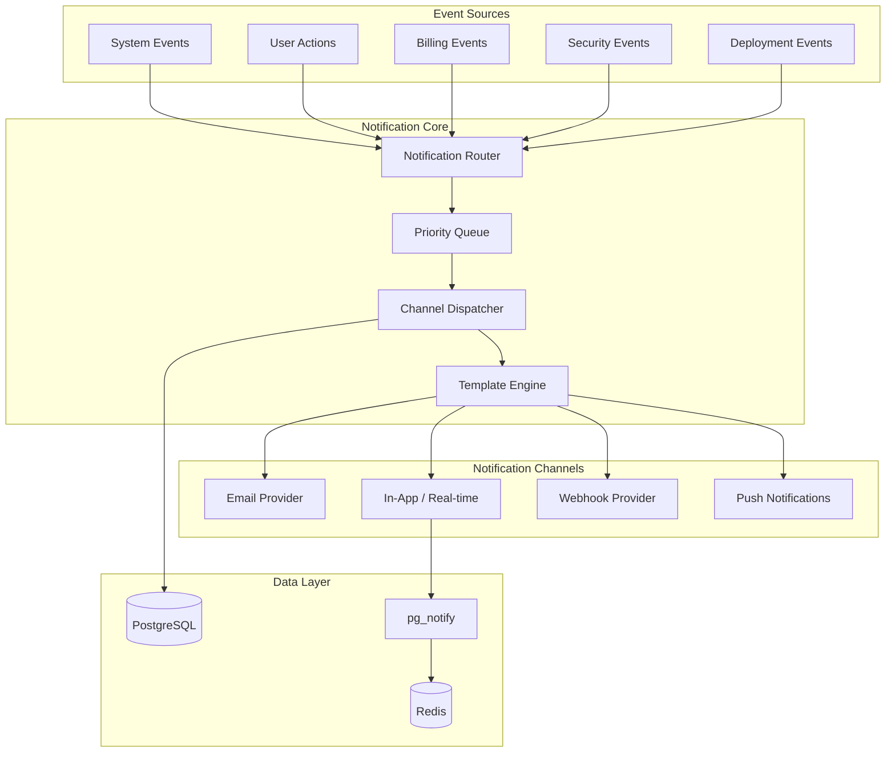

# Notification System Architecture

## Overview

A comprehensive multi-channel notification system for the FunctionFly platform supporting email, in-app, webhook, and push notifications with user preferences, templates, and real-time delivery.

## System Architecture



## Components

### 1. Database Schema

#### Notification Model
```go
type Notification struct {
    ID              uuid.UUID
    UserID          uuid.UUID
    Type            string           // notification type identifier
    Category        string           // billing, security, system, etc.
    Title           string
    Body            string
    Data            JSONMap          // structured data for templates
    Channels        []string         // channels to deliver on
    Priority        string           // low, normal, high, urgent
    Status          string           // pending, processing, sent, failed, read
    ReadAt          *time.Time
    SentAt          *time.Time
    ExpiresAt       *time.Time
    CreatedAt       time.Time
    UpdatedAt       time.Time
}
```

#### Notification Preference Model
```go
type NotificationPreference struct {
    ID              uuid.UUID
    UserID          uuid.UUID
    Channel         string           // email, in_app, webhook, push
    Category        string           // billing, security, deployments, etc.
    Enabled         bool
    Frequency       string           // immediate, digest_daily, digest_weekly
    QuietHoursStart *time.Time
    QuietHoursEnd   *time.Time
    WebhookURL      *string
    CreatedAt       time.Time
    UpdatedAt       time.Time
}
```

#### Notification Template Model
```go
type NotificationTemplate struct {
    ID          uuid.UUID
    Type        string      // e.g., "deployment.success"
    Channel     string      // email, in_app, webhook
    Subject     string      // for email
    BodyHTML    string
    BodyText    string
    Variables   []string    // template variables
    IsActive    bool
    CreatedAt   time.Time
    UpdatedAt   time.Time
}
```

### 2. Notification Types

| Category | Types | Channels |
|----------|-------|----------|
| **System** | welcome, maintenance, feature_announcement | email, in_app |
| **Security** | login_new_device, password_changed, mfa_enabled, breach_alert | email, in_app, push |
| **Billing** | invoice_generated, payment_success, payment_failed, subscription_expiring | email, in_app |
| **Deployments** | deployment_success, deployment_failed, deployment_rolled_back | email, in_app, webhook |
| **Functions** | function_error_rate_high, execution_limit_warning | email, in_app, webhook |
| **Team** | invite_received, member_added, permissions_changed | email, in_app |
| **Registry** | function_published, rating_received, verification_complete | email, in_app |

### 3. API Endpoints

#### REST Endpoints
```
GET    /v1/notifications                    # List user notifications
GET    /v1/notifications/unread-count       # Get unread count
PATCH  /v1/notifications/{id}/read          # Mark as read
POST   /v1/notifications/{id}/read          # Mark as read (alternative)
POST   /v1/notifications/read-all           # Mark all as read
DELETE /v1/notifications/{id}               # Delete notification

GET    /v1/users/me/notification-preferences          # Get preferences
PATCH  /v1/users/me/notification-preferences          # Update preferences
PATCH  /v1/users/me/notification-preferences/{category} # Update category prefs

GET    /v1/admin/notification-templates       # List templates (admin)
POST   /v1/admin/notification-templates       # Create template (admin)
PUT    /v1/admin/notification-templates/{id}  # Update template (admin)
DELETE /v1/admin/notification-templates/{id}  # Delete template (admin)

POST   /v1/admin/notifications/send           # Send notification (admin)
POST   /v1/admin/notifications/broadcast      # Broadcast to all (admin)
```

#### WebSocket Endpoints
```
WS     /v1/ws/notifications                   # Real-time notification stream
```

### 4. Directory Structure

```
internal/
├── notification/
│   ├── service.go              # Core notification service
│   ├── router.go               # Routes notifications to channels
│   ├── queue.go                # Priority queue processing
│   ├── dispatcher.go           # Channel dispatcher
│   ├── types.go                # Core types and interfaces
│   ├── models.go               # Database models
│   ├── repository.go           # Data access layer
│   ├── preferences.go          # Preference management
│   ├── templates.go            # Template engine
│   ├── analytics.go            # Notification analytics
│   ├── channels/
│   │   ├── channel.go          # Channel interface
│   │   ├── email.go            # Email channel
│   │   ├── inapp.go            # In-app channel
│   │   ├── webhook.go          # Webhook channel
│   │   └── push.go             # Push notification channel
│   └── triggers/
│       ├── trigger.go          # Trigger interface
│       ├── deployment.go       # Deployment triggers
│       ├── billing.go          # Billing triggers
│       ├── security.go         # Security triggers
│       └── system.go           # System triggers
└── api/handlers/notifications/
    ├── handler.go              # HTTP handlers
    ├── websocket.go            # WebSocket handler
    └── middleware.go           # Notification middleware
```

### 5. Implementation Phases

#### Phase 1: Core Infrastructure
- Database models and migrations
- Repository layer
- Core service with routing logic
- Queue processing

#### Phase 2: Channels
- Email channel (reuse existing email service)
- In-app channel with real-time delivery
- Webhook channel

#### Phase 3: API & Preferences
- REST API endpoints
- WebSocket endpoint
- Preference management

#### Phase 4: Triggers & Templates
- Template engine
- Event triggers for platform events
- Integration with existing services

#### Phase 5: UI & Analytics
- Notification UI components
- Analytics tracking
- Admin dashboard

## Key Features

1. **Multi-Channel Delivery**: Email, in-app, webhooks, push
2. **User Preferences**: Granular control per channel and category
3. **Priority Queue**: Urgent notifications processed first
4. **Template System**: HTML/text templates with variable substitution
5. **Real-time**: WebSocket + pg_notify for instant delivery
6. **Digest Mode**: Daily/weekly summary emails
7. **Quiet Hours**: Respect user timezone preferences
8. **Rate Limiting**: Prevent notification spam
9. **Analytics**: Track delivery, open, and click rates
10. **Retry Logic**: Failed deliveries automatically retried

## Integration Points

1. **Existing Email Service**: Leverage `internal/email/email.go`
2. **PostgreSQL**: Use existing storage layer
3. **pg_notify**: Real-time database change notifications
4. **Audit Logging**: Log all notification events
5. **GDPR Compliance**: Respect user preferences, data retention
