# Complex Function Playground Page — Architecture Plan

## Overview

Transform the existing basic [`PlaygroundPage`](web/dashboard/src/pages/PlaygroundPage/index.tsx) into a world-class, IDE-like interactive function testing environment. The new playground will rival tools like Postman, Hoppscotch, and the Stripe API Explorer — but purpose-built for FunctionFly's serverless function registry.

---

## Current State Analysis

### Existing Files
| File | Role |
|------|------|
| [`web/dashboard/src/pages/PlaygroundPage/index.tsx`](web/dashboard/src/pages/PlaygroundPage/index.tsx) | Simple 2-column input/output layout |
| [`web/dashboard/src/pages/Playground.tsx`](web/dashboard/src/pages/Playground.tsx) | More advanced version with history sidebar |
| [`web/dashboard/src/api/playground.ts`](web/dashboard/src/api/playground.ts) | API client + localStorage history |
| [`web/dashboard/src/components/common/ManifestInputForm.tsx`](web/dashboard/src/components/common/ManifestInputForm.tsx) | Schema-driven form renderer |
| [`web/dashboard/src/components/common/CodeBlock.tsx`](web/dashboard/src/components/common/CodeBlock.tsx) | Syntax-highlighted code display |

### Available Libraries (already in package.json)
- **`@monaco-editor/react`** — Full VS Code editor in the browser
- **`framer-motion`** — Animations and transitions
- **`react-syntax-highlighter`** — Code highlighting
- **`recharts`** — Charts for latency visualization
- **`@codesandbox/sandpack-react`** — Live code sandbox
- **`zustand`** — State management
- **`react-use`** — Utility hooks
- **`use-local-storage-state`** — Persistent state

---

## Target Architecture

### Page Layout (IDE-style)

```
┌─────────────────────────────────────────────────────────────────┐
│  PlaygroundHeader: breadcrumb | function title | status | badges │
├──────────────────────────────────────────────────────────────────┤
│  PlaygroundToolbar: Run | Format | Reset | Share | Settings      │
├────────────────────┬─────────────────────┬───────────────────────┤
│                    │                     │                       │
│  INPUT PANEL       │  OUTPUT PANEL       │  SIDEBAR              │
│                    │                     │                       │
│  [Tabs]            │  [Tabs]             │  [History]            │
│  • Form View       │  • Response         │  • Schema Explorer    │
│  • JSON Editor     │  • Headers          │  • Code Snippets      │
│  • Examples        │  • Timeline         │  • Share              │
│                    │  • Diff View        │  • Function Info      │
│  Monaco Editor     │                     │                       │
│  or Form Fields    │  JSON Viewer        │                       │
│                    │  + Latency Chart    │                       │
│                    │                     │                       │
├────────────────────┴─────────────────────┴───────────────────────┤
│  Status Bar: last run time | cache status | version | shortcuts  │
└──────────────────────────────────────────────────────────────────┘
```

---

## Component Breakdown

### 1. `PlaygroundPage/index.tsx` (Refactored Orchestrator)
- Fetches function info via React Query
- Manages global playground state via Zustand store
- Composes all sub-components
- Handles keyboard shortcuts via `useEffect` + `useCallback`
- Supports URL-based state (input pre-fill, execution replay)

### 2. `PlaygroundPage/components/PlaygroundHeader.tsx`
**Features:**
- Animated breadcrumb: `registry → author/name → Playground`
- Function title with version badge
- Runtime badge (python3.11, node20, etc.)
- Deterministic / cached indicators
- Status indicator (deployed, degraded, offline)
- "Back to function docs" link
- Animated entrance with `framer-motion`

### 3. `PlaygroundPage/components/PlaygroundToolbar.tsx`
**Features:**
- **Run** button with `Cmd+Enter` shortcut indicator
- **Format JSON** button (auto-prettify input)
- **Reset** button (clear input/output)
- **Copy Link** (shareable URL with encoded input)
- **Settings** dropdown:
  - Toggle: Show request headers
  - Toggle: Auto-run on input change (debounced)
  - Toggle: Show execution timeline
  - Select: Input mode (Form / JSON Editor)
- Keyboard shortcut hints displayed inline

### 4. `PlaygroundPage/components/PlaygroundInputPanel.tsx`
**Features:**
- **Tab: Form View** — Uses enhanced `ManifestInputForm` with:
  - Field-level validation with inline error messages
  - Animated field transitions
  - Nested object/array editors
  - Enum dropdowns with search
  - File upload support (base64 encoded)
- **Tab: JSON Editor** — Monaco Editor with:
  - JSON schema validation (from manifest)
  - Auto-complete based on schema
  - Error squiggles for invalid JSON
  - Format on save
  - Dark/light theme sync
- **Tab: Examples** — Pre-built example inputs:
  - Loaded from `manifest.input.example`
  - Multiple named examples if available
  - One-click "Load Example" buttons
  - Animated card grid

**State:**
- Input value synced between Form and JSON Editor views
- Validation errors shown in both views

### 5. `PlaygroundPage/components/PlaygroundOutputPanel.tsx`
**Features:**
- **Tab: Response** — Enhanced JSON viewer:
  - Collapsible tree view for nested objects
  - Copy individual values on click
  - Type annotations (string, number, boolean, null)
  - Search/filter within response
  - "Copy All" button
- **Tab: Headers** — Response metadata:
  - Status code with color coding
  - Execution duration
  - Cache hit/miss indicator
  - Execution ID
  - Function version used
- **Tab: Timeline** — Execution visualization:
  - Animated bar showing request → execution → response phases
  - Latency breakdown if available
  - Historical latency sparkline (last 10 runs)
- **Tab: Diff** — Compare two executions:
  - Side-by-side JSON diff
  - Highlighted additions/removals
  - Select from history to compare

**States:**
- Empty state: animated "Run the function to see results" with play icon
- Loading state: skeleton + animated progress bar
- Error state: red-tinted error card with error code + message
- Success state: green status + full response

### 6. `PlaygroundPage/components/PlaygroundSidebar.tsx`
**Features:**
- **Panel: Execution History**
  - Virtualized list (up to 50 items)
  - Each item shows: success/error icon, input preview, timestamp, latency
  - Click to restore input + output
  - Delete individual items
  - Clear all button
  - Export history as JSON
  - Filter by success/error
- **Panel: Schema Explorer**
  - Interactive tree view of input schema
  - Click field to jump to it in Form View
  - Type badges, required indicators, descriptions
  - Output schema preview
- **Panel: Code Snippets**
  - Auto-generated from current input value
  - Languages: cURL, JavaScript (fetch), TypeScript, Python, Go, PHP
  - Syntax highlighted with `CodeBlock`
  - Copy button per snippet
  - "Open in CodeSandbox" button
- **Panel: Share**
  - Shareable URL with current input encoded
  - QR code (using `qrcode.react`)
  - Copy link button
  - Share via Web Share API (mobile)
  - Embed snippet (iframe)
- **Panel: Function Info**
  - Author, version, runtime
  - Price per call
  - Reliability score
  - Cache TTL
  - Tags and category
  - Link to full docs

### 7. `PlaygroundPage/components/ExecutionTimeline.tsx`
**Features:**
- Animated horizontal timeline showing execution phases
- Phases: DNS → Connect → TLS → Request → Queue → Execute → Response
- Color-coded by phase
- Hover tooltips with timing details
- Powered by `framer-motion` for smooth animations

### 8. `PlaygroundPage/components/SchemaExplorer.tsx`
**Features:**
- Recursive tree renderer for JSON Schema
- Collapsible nodes
- Type color coding (string=blue, number=green, boolean=yellow, object=purple, array=orange)
- Required field indicators (red asterisk)
- Description tooltips
- Example value display
- Click-to-copy field path (e.g., `input.user.email`)

### 9. `PlaygroundPage/components/CodeSnippetGenerator.tsx`
**Features:**
- Generates code from current input state
- Supported languages:
  - **cURL** — with headers, body
  - **JavaScript** — fetch API
  - **TypeScript** — typed fetch with interface
  - **Python** — requests library
  - **Go** — net/http
  - **PHP** — curl
- Language selector tabs
- Monaco editor for display (read-only, syntax highlighted)
- Copy button
- "Open in CodeSandbox" integration

### 10. `PlaygroundPage/store/playgroundStore.ts`
**Zustand store managing:**
```typescript
interface PlaygroundStore {
  // Input state
  inputMode: 'form' | 'json';
  inputValue: unknown;
  inputJson: string;
  
  // Output state
  executionResult: ExecutionResult | null;
  isExecuting: boolean;
  executionHistory: ExecutionHistoryItem[];
  
  // UI state
  activeInputTab: string;
  activeOutputTab: string;
  activeSidebarPanel: string;
  sidebarOpen: boolean;
  
  // Settings
  autoRun: boolean;
  showTimeline: boolean;
  showHeaders: boolean;
  
  // Actions
  setInput: (value: unknown) => void;
  execute: () => Promise<void>;
  loadFromHistory: (item: ExecutionHistoryItem) => void;
  clearHistory: () => void;
  resetPlayground: () => void;
  formatJson: () => void;
}
```

### 11. `PlaygroundPage/hooks/usePlaygroundKeyboard.ts`
**Keyboard shortcuts:**
| Shortcut | Action |
|----------|--------|
| `Cmd+Enter` | Run function |
| `Cmd+Shift+F` | Format JSON |
| `Cmd+Shift+R` | Reset playground |
| `Cmd+Shift+C` | Copy shareable link |
| `Cmd+[` | Previous history item |
| `Cmd+]` | Next history item |
| `Cmd+1/2/3` | Switch input tabs |
| `Cmd+Shift+1/2/3` | Switch output tabs |

### 12. `PlaygroundPage/hooks/useResizablePanels.ts`
**Features:**
- Drag-to-resize input/output panels
- Persist panel sizes in localStorage
- Min/max constraints
- Snap to 50/50 on double-click

---

## Visual Design Principles

### Color System
- **Input panel**: Slightly warmer background tint
- **Output panel**: Slightly cooler background tint
- **Success responses**: Green accent border + icon
- **Error responses**: Red accent border + icon
- **Cached responses**: Yellow/amber accent
- **Running state**: Animated indigo pulse

### Animations
- Panel entrance: `framer-motion` slide-in from sides
- Execution: Loading shimmer on output panel
- Success: Brief green flash on output panel border
- Error: Brief red shake animation
- History items: Staggered list entrance
- Tab switches: Smooth crossfade

### Typography
- Input/output code: `font-mono` (JetBrains Mono or system mono)
- Labels: `text-sm font-medium`
- Metadata: `text-xs text-muted-foreground`

---

## File Structure

```
web/dashboard/src/pages/PlaygroundPage/
├── index.tsx                          # Main orchestrator (refactored)
├── store/
│   └── playgroundStore.ts             # Zustand store
├── hooks/
│   ├── usePlaygroundKeyboard.ts       # Keyboard shortcuts
│   ├── useResizablePanels.ts          # Panel resize logic
│   └── usePlaygroundState.ts         # Derived state helpers
├── components/
│   ├── PlaygroundHeader.tsx           # Top header with function info
│   ├── PlaygroundToolbar.tsx          # Action bar (Run, Format, etc.)
│   ├── PlaygroundInputPanel.tsx       # Left panel: Form/JSON/Examples
│   ├── PlaygroundOutputPanel.tsx      # Right panel: Response/Headers/Timeline/Diff
│   ├── PlaygroundSidebar.tsx          # Right sidebar: History/Schema/Snippets/Share
│   ├── PlaygroundStatusBar.tsx        # Bottom status bar
│   ├── ExecutionTimeline.tsx          # Animated execution phases
│   ├── SchemaExplorer.tsx             # Interactive schema tree
│   ├── CodeSnippetGenerator.tsx       # Multi-language code generation
│   ├── JsonTreeViewer.tsx             # Collapsible JSON tree
│   ├── LatencyChart.tsx               # Sparkline latency history
│   ├── DiffViewer.tsx                 # Side-by-side JSON diff
│   └── ExampleSelector.tsx            # Pre-built example inputs
└── utils/
    ├── codeGenerators.ts              # Code snippet generation logic
    ├── jsonDiff.ts                    # JSON diff algorithm
    └── schemaHelpers.ts               # Schema traversal utilities
```

---

## Implementation Steps

### Phase 1: Foundation
1. Create `PlaygroundPage/store/playgroundStore.ts` with Zustand
2. Create `PlaygroundPage/hooks/usePlaygroundKeyboard.ts`
3. Create `PlaygroundPage/hooks/useResizablePanels.ts`
4. Create `PlaygroundPage/utils/codeGenerators.ts`

### Phase 2: Core Components
5. Build `PlaygroundHeader.tsx`
6. Build `PlaygroundToolbar.tsx`
7. Build `PlaygroundStatusBar.tsx`
8. Build `JsonTreeViewer.tsx` (reusable JSON tree)
9. Build `SchemaExplorer.tsx`

### Phase 3: Main Panels
10. Build `PlaygroundInputPanel.tsx` (with Monaco + Form + Examples tabs)
11. Build `PlaygroundOutputPanel.tsx` (with Response + Headers + Timeline + Diff tabs)
12. Build `ExecutionTimeline.tsx`
13. Build `LatencyChart.tsx`
14. Build `DiffViewer.tsx`

### Phase 4: Sidebar
15. Build `CodeSnippetGenerator.tsx`
16. Build `ExampleSelector.tsx`
17. Build `PlaygroundSidebar.tsx` (composing all sidebar panels)

### Phase 5: Integration
18. Refactor `PlaygroundPage/index.tsx` to use all new components
19. Wire up keyboard shortcuts
20. Wire up resizable panels
21. Test with real registry functions

---

## API Enhancements Needed

The existing [`/v1/fx/:author/:name`](internal/api/handlers/registry/execution.go) endpoint is sufficient for execution. However, the playground could benefit from:

1. **Schema validation endpoint**: `POST /v1/fx/:author/:name/validate` — validate input without executing
2. **Examples endpoint**: `GET /v1/registry/functions/:author/:name/examples` — return named examples
3. **Execution metadata**: Ensure `execution_id`, `duration_ms`, `cached` are always returned

These are optional enhancements; the playground can work with the existing API.

---

## Key UX Improvements Over Current Version

| Feature | Current | New |
|---------|---------|-----|
| Input editor | Basic textarea | Monaco editor with schema validation |
| Output display | Textarea (read-only) | Collapsible JSON tree with copy |
| History | Simple list | Filterable, exportable, with diff |
| Code examples | On function page only | Live-generated from current input |
| Schema | Static JSON display | Interactive explorer with click-to-fill |
| Layout | Fixed 2-column | Resizable panels, collapsible sidebar |
| Keyboard | None | Full shortcut system |
| Sharing | URL with encoded input | URL + QR code + embed snippet |
| Execution feedback | Badge + textarea | Animated timeline + latency chart |
| Mobile | Not optimized | Responsive with bottom sheet panels |

---

## Mermaid Architecture Diagram

```mermaid
graph TD
    A[PlaygroundPage/index.tsx] --> B[PlaygroundStore - Zustand]
    A --> C[PlaygroundHeader]
    A --> D[PlaygroundToolbar]
    A --> E[PlaygroundInputPanel]
    A --> F[PlaygroundOutputPanel]
    A --> G[PlaygroundSidebar]
    A --> H[PlaygroundStatusBar]

    E --> E1[Tab: Form View - ManifestInputForm]
    E --> E2[Tab: JSON Editor - Monaco]
    E --> E3[Tab: Examples - ExampleSelector]

    F --> F1[Tab: Response - JsonTreeViewer]
    F --> F2[Tab: Headers - Metadata]
    F --> F3[Tab: Timeline - ExecutionTimeline]
    F --> F4[Tab: Diff - DiffViewer]

    G --> G1[Panel: History]
    G --> G2[Panel: Schema - SchemaExplorer]
    G --> G3[Panel: Snippets - CodeSnippetGenerator]
    G --> G4[Panel: Share - QR + URL]
    G --> G5[Panel: Function Info]

    B --> I[usePlaygroundKeyboard]
    B --> J[useResizablePanels]
    B --> K[localStorage persistence]
```


