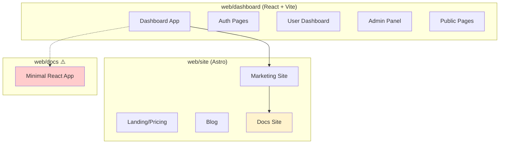

# UI Codebase Gap Analysis & Missing Pages/Components

## Project Overview

The FunctionFly project has **three frontend applications**:

1. **`web/dashboard`** - React + Vite + React Router (main application)
2. **`web/site`** - Astro (marketing website)
3. **`web/docs`** - React + Vite (documentation - appears minimal)

---

## Identified Gaps & Missing Components

### 1. Fragmented Documentation Systems ⚠️ HIGH PRIORITY

**Issue:** Three separate documentation systems exist:
- `web/dashboard/src/pages/DocsPage` - React-based docs in dashboard
- `web/site/src/pages/docs` - Astro-based docs in marketing site  
- `web/docs` - Separate React app (only has `Index.tsx` and `Function.tsx`)

**Recommendation:** Consolidate to a single source of truth, likely the Astro-based site.

---

### 2. Missing Routes (Defined in Code but Not Implemented)

These routes are defined in [`ROUTE_BUILDERS`](web/dashboard/src/lib/constants.ts:44) but don't have corresponding route handlers in [`App.tsx`](web/dashboard/src/App.tsx):

| Route Pattern | Purpose | Status |
|---------------|---------|--------|
| `/docs/api/:endpoint` | API documentation | ❌ Missing |
| `/functions/:author/:name` | Function detail page | ⚠️ Using different route |
| `/functions/:author/:name/settings` | Function settings | ❌ Missing |
| `/functions/:author/:name/logs` | Function logs | ❌ Missing |
| `/dashboard/:username/functions` | User's functions | ❌ Missing |
| `/dashboard/:username/settings` | User settings | ❌ Missing |
| `/admin/tenants/:tenantId` | Tenant detail view | ❌ Missing |
| `/admin/users/:userId` | User detail view | ❌ Missing |
| `/admin/functions/:functionId` | Admin function view | ❌ Missing |

---

### 3. Missing UI Components

The component library at [`web/dashboard/src/components/ui`](web/dashboard/src/components/ui) has basic components but lacks:

| Component | Purpose | Priority |
|-----------|---------|----------|
| Charts/Graphs | Analytics dashboard visualizations | HIGH |
| Rich Text Editor | Blog/content management | HIGH |
| File Upload | Function deployment, assets | MEDIUM |
| Multi-select | Filters, selectors | MEDIUM |
| Date Range Picker | Analytics, logs filtering | MEDIUM |
| Data Table | Advanced data display with sorting/filtering | HIGH |
| Code Editor | Function code editing (uses Monaco?) | MEDIUM |
| Timeline | Execution history, deployment timeline | LOW |
| Kanban Board | Content calendar, task management | LOW |

---

### 4. Potential Missing Feature Pages

#### User-Facing
| Page | Description | Status |
|------|-------------|--------|
| Domain Management | Custom domains & SSL | ❌ Not found |
| Webhooks | Webhook configuration | ❌ Not found |
| Team Members | Team invitation/management | ⚠️ Partial (TeamPage exists) |
| Invoice History | Billing invoices | ❌ Not found |
| Notification Settings | Alert preferences | ❌ Not found |
| API Keys | API key management | ❌ Not found |
| Function Logs Viewer | Dedicated logs page | ❌ Missing route |

#### Admin-Facing
| Page | Description | Status |
|------|-------------|--------|
| Tenant Detail | View/edit tenant | ❌ Missing route |
| User Detail | View/edit user | ❌ Missing route |
| Function Detail (Admin) | Admin function management | ❌ Missing route |
| API Usage Analytics | Platform-wide API usage | ❌ Not found |

---

### 5. Routes Defined in Sidebar But Need Verification

The [`Sidebar.tsx`](web/dashboard/src/components/layout/Sidebar.tsx:53) defines these navigation sections:

```typescript
// Overview
- Dashboard ✓

// Management  
- Functions ✓
- Apps ✓
- Registry ✓
- Providers ✓
- State Fabric ✓

// Insights
- Analytics ✓

// Account
- Settings ✓
```

All main navigation items have corresponding pages. However, **no "Sessions" or "Profile" link** in the sidebar despite having `SessionsPage` and `MyProfilePage`.

---

### 6. web/docs Application Status

The [`web/docs`](web/docs) directory contains a minimal React app with only:
- `Index.tsx` - Main docs page
- `Function.tsx` - Function documentation

**This appears incomplete** - likely needs expansion or consolidation with other doc systems.

---

## Summary: Recommended Actions

### High Priority
1. **Consolidate documentation systems** - Choose one (recommend Astro-based)
2. **Implement missing routes** - Function settings, logs, API docs
3. **Add chart components** - For Analytics dashboard
4. **Add data table component** - For functions/analytics display

### Medium Priority
5. **Implement domain management page** - Custom domains & SSL
6. **Add file upload component** - For function deployment
7. **Implement team management** - Invitations, roles
8. **Add date range picker** - For analytics/logs filtering

### Lower Priority
9. **Add rich text editor** - For blog/content
10. **Implement notification settings**
11. **Add API keys management**
12. **Expand web/docs** or consolidate

---

## Architecture Diagram



---

*Generated: 2026-03-01*
