# UI Gaps & Production Readiness Audit

## Executive Summary

The FunctionFly dashboard is a **React 19 + Vite + TypeScript** SPA using **Radix UI primitives**, **Tailwind CSS v4**, **TanStack Query**, **Zustand**, **Framer Motion**, and **Recharts**. The codebase is architecturally sound with a well-organized page/component structure, comprehensive routing, auth flows, admin panels, and a rich feature set. However, several gaps exist that prevent full production readiness.

---

## Architecture Overview

```mermaid
graph TD
    App[App.tsx] --> PublicRoutes[Public Routes]
    App --> ProtectedRoutes[Protected Dashboard Routes]
    App --> AdminRoutes[Admin Routes]
    PublicRoutes --> Landing[LandingPage]
    PublicRoutes --> Auth[AuthPage Login/Signup]
    PublicRoutes --> Registry[BrowseFunctionsPage]
    PublicRoutes --> Blog[BlogPage/BlogPostPage]
    PublicRoutes --> Docs[DocsPage]
    PublicRoutes --> Marketing[StateFabricMarketingPage]
    ProtectedRoutes --> Dashboard[DashboardPage]
    ProtectedRoutes --> Functions[FunctionsPage]
    ProtectedRoutes --> Providers[ProvidersPage]
    ProtectedRoutes --> Analytics[AnalyticsPage]
    ProtectedRoutes --> StateFabric[StateFabricPage]
    ProtectedRoutes --> Settings[SettingsPage]
    AdminRoutes --> AdminDashboard[AdminDashboardPage]
    AdminRoutes --> AdminUsers[AdminUsersPage]
    AdminRoutes --> AdminBilling[AdminBillingPage]
    AdminRoutes --> AdminContent[AdminContentPage]
```

---

## UI Component Inventory

### Existing UI Components (`/components/ui/`)
- `alert.tsx` ✅
- `badge.tsx` ✅
- `button.tsx` ✅
- `card.tsx` ✅
- `checkbox.tsx` ✅
- `dialog.tsx` ✅
- `dropdown-menu.tsx` ✅
- `form-error.tsx` ✅
- `form-field.tsx` ✅
- `help-tooltip.tsx` ✅
- `input.tsx` ✅
- `label.tsx` ✅
- `loading-spinner.tsx` ✅
- `progress.tsx` ✅
- `scroll-area.tsx` ✅
- `select.tsx` ✅
- `separator.tsx` ✅
- `skeleton.tsx` ✅
- `switch.tsx` ✅
- `table.tsx` ✅
- `tabs.tsx` ✅
- `textarea.tsx` ✅
- `tooltip.tsx` ✅

### Missing UI Components (Radix UI packages already installed)
The following Radix UI packages are in `package.json` but **no corresponding UI component wrappers exist**:
- `@radix-ui/react-accordion` → missing `accordion.tsx`
- `@radix-ui/react-alert-dialog` → missing `alert-dialog.tsx`
- `@radix-ui/react-avatar` → missing `avatar.tsx`
- `@radix-ui/react-popover` → missing `popover.tsx`
- `react-day-picker` → missing `calendar.tsx` / `date-picker.tsx`
- No `command.tsx` / `combobox.tsx` (search-driven select)
- No `sheet.tsx` / `drawer.tsx` (slide-over panels)
- No `pagination.tsx`
- No `radio-group.tsx`
- No `slider.tsx`
- No `collapsible.tsx`
- No `navigation-menu.tsx`
- No `context-menu.tsx`
- No `resizable.tsx`
- No `toggle.tsx` / `toggle-group.tsx`

---

## Identified Gaps by Severity

### 🔴 Critical (Blocks Production)

#### 1. Missing Terms of Service Page
- **Location**: [`SignupForm.tsx`](web/dashboard/src/pages/AuthPage/SignupForm.tsx:356) links to `/terms`
- **Issue**: Route `/terms` does not exist in [`App.tsx`](web/dashboard/src/App.tsx) — clicking the link results in a 404
- **Fix**: Create `TermsPage` component and add route `/terms`

#### 2. Social Login Error Uses `alert()`
- **Location**: [`AuthPage/index.tsx`](web/dashboard/src/pages/AuthPage/index.tsx:19)
- **Issue**: `alert()` is used for OAuth errors — blocks UI, poor UX, inconsistent with rest of app
- **Fix**: Replace with `toast.error()` from `sonner`

#### 3. Missing App-Level Error Boundary
- **Location**: [`App.tsx`](web/dashboard/src/App.tsx)
- **Issue**: No top-level `<ErrorBoundary>` wrapping the app — unhandled React errors crash the entire UI
- **Fix**: Add a root-level error boundary component

#### 4. Native `confirm()` Dialogs for Destructive Actions
- **Locations**: 
  - [`FunctionsPage/index.tsx`](web/dashboard/src/pages/FunctionsPage/index.tsx:48) — delete function
  - [`StateFabricPage/index.tsx`](web/dashboard/src/pages/StateFabricPage/index.tsx:120) — delete fabric
- **Issue**: `window.confirm()` is synchronous, blocks the thread, and is not styleable
- **Fix**: Replace with `Dialog` confirmation modals (pattern already used in `FunctionDetailPage`)

#### 5. AdminRoute Loading State
- **Location**: [`App.tsx`](web/dashboard/src/App.tsx:138)
- **Issue**: Shows raw `
Loading...
` text while auth initializes — jarring UX
- **Fix**: Replace with a proper `<LoadingSpinner>` or skeleton layout

---

### 🟡 High Priority (Significant UX Impact)

#### 6. AnalyticsPage — No Real Data
- **Location**: [`AnalyticsPage/index.tsx`](web/dashboard/src/pages/AnalyticsPage/index.tsx)
- **Issue**: All 4 stat cards show `"—"` with `"no data yet"` labels. Chart placeholders show text instead of actual charts. The `timeRange` state is set but never used in API calls.
- **Fix**: 
  - Connect to real analytics API endpoints
  - Implement actual chart components using Recharts (already used in `FunctionDetailPage`)
  - Pass `timeRange` to API queries

#### 7. FunctionDetailPage — Hardcoded Mock Chart Data
- **Location**: [`FunctionDetailPage.tsx`](web/dashboard/src/pages/FunctionsPage/FunctionDetailPage.tsx:85-103)
- **Issue**: `requestData`, `latencyData`, `errorData` are hardcoded static arrays — not fetched from API
- **Fix**: Fetch real metrics from `/v1/functions/:id/metrics` endpoint

#### 8. DashboardPage — Hardcoded Metric Values
- **Location**: [`DashboardPage/index.tsx`](web/dashboard/src/pages/DashboardPage/index.tsx:253-261)
- **Issue**: `MemoryUsageGauge` uses hardcoded `percent={62}`, `TrustScoreBadge` uses hardcoded `trustScore={85}`
- **Fix**: Fetch real system metrics from dashboard API

#### 9. AdminDashboardPage — Hardcoded Chart Data
- **Location**: [`AdminDashboardPage/index.tsx`](web/dashboard/src/pages/AdminDashboardPage/index.tsx:53-71)
- **Issue**: `activityData` and `revenueData` are hardcoded mock arrays
- **Fix**: Fetch from admin analytics API

#### 10. AdminBillingPage — Hardcoded Revenue Summary
- **Location**: [`AdminBillingPage/index.tsx`](web/dashboard/src/pages/AdminBillingPage/index.tsx:335-339)
- **Issue**: Revenue summary values (`$3,400`, `$3,100`, `$19,000`, `$40,800`) are hardcoded
- **Fix**: Calculate from real invoice/subscription data already fetched

#### 11. SettingsPage — Notifications Not Persisted
- **Location**: [`SettingsPage/index.tsx`](web/dashboard/src/pages/SettingsPage/index.tsx:33-38)
- **Issue**: Notification preferences are local state only — not saved to backend, reset on page reload
- **Fix**: Fetch notification preferences from API on mount, save on toggle

#### 12. SettingsPage — Billing Tab Incomplete
- **Location**: [`SettingsPage/index.tsx`](web/dashboard/src/pages/SettingsPage/index.tsx:229-255)
- **Issue**: Billing tab only shows current plan with an "Upgrade Plan" button — no payment method management, invoice history, or usage details
- **Fix**: Add payment method display, invoice list, and usage summary

#### 13. MFA/2FA Not Integrated
- **Location**: [`components/auth/MFASetup.tsx`](web/dashboard/src/components/auth/MFASetup.tsx) exists but is not used anywhere
- **Issue**: MFA setup component is built but never rendered in Settings or auth flows
- **Fix**: Add MFA section to `SettingsPage` under Account tab

---

### 🟠 Medium Priority (Polish & Consistency)

#### 14. FunctionsPage — Non-Functional Filter Button
- **Location**: [`FunctionsPage/index.tsx`](web/dashboard/src/pages/FunctionsPage/index.tsx:94)
- **Issue**: "Filter" button renders but has no `onClick` handler and no filter panel
- **Fix**: Implement filter panel with status, runtime, and provider filters

#### 15. StateFabricPage — Native HTML `<select>` Elements
- **Location**: [`StateFabricPage/index.tsx`](web/dashboard/src/pages/StateFabricPage/index.tsx:218-243)
- **Issue**: Uses raw `<select>` elements for status/type filters instead of the `Select` UI component — inconsistent styling
- **Fix**: Replace with `<Select>` from `@/components/ui/select`

#### 16. FunctionEditorPage — Native HTML Checkbox
- **Location**: [`FunctionEditorPage.tsx`](web/dashboard/src/pages/FunctionsPage/FunctionEditorPage.tsx:481-488)
- **Issue**: "Mark as secret" uses `<input type="checkbox">` instead of `<Checkbox>` UI component
- **Fix**: Replace with `<Checkbox>` from `@/components/ui/checkbox`

#### 17. Team Member Images — Placeholder URLs
- **Locations**: 
  - [`TeamPage/index.tsx`](web/dashboard/src/pages/TeamPage/index.tsx:13)
  - [`LandingPage/components/TeamSection.tsx`](web/dashboard/src/pages/LandingPage/components/TeamSection.tsx:11)
- **Issue**: `image: "/api/placeholder/200/200"` — these images are never rendered (initials are shown instead), but the data is misleading
- **Fix**: Either add real images or remove the `image` field from the data

#### 18. AdminContentCalendarPage — Missing Error Toast
- **Location**: [`AdminContentCalendarPage/index.tsx`](web/dashboard/src/pages/AdminContentCalendarPage/index.tsx:273)
- **Issue**: `// TODO: Show error toast/notification` comment — errors silently fail
- **Fix**: Add `toast.error()` call in the catch block

#### 19. Missing Careers/Jobs Page
- **Location**: [`TeamPage/index.tsx`](web/dashboard/src/pages/TeamPage/index.tsx:271) links to `mailto:careers@functionfly.com`
- **Issue**: No dedicated careers page — the CTA button says "View Open Positions" but just opens an email
- **Fix**: Either create a `/careers` page or update the CTA text to "Email Us About Positions"

#### 20. UserProfilePage — Missing Bio Field
- **Location**: [`UserProfilePage/index.tsx`](web/dashboard/src/pages/UserProfilePage/index.tsx:156) renders `profile.bio`
- **Issue**: `bio` is referenced in the public profile display but `UpdateProfileRequest` in `usersApi` doesn't include a `bio` field — users can't set their bio
- **Fix**: Add `bio` field to `UpdateProfileRequest` and `MyProfilePage` form

---

### 🟢 Low Priority (Nice to Have)

#### 21. Missing UI Component Wrappers
The following Radix UI packages are installed but lack wrapper components. These would improve consistency and enable richer UIs:
- `accordion.tsx` — useful for FAQ sections, collapsible content
- `alert-dialog.tsx` — better than `Dialog` for destructive confirmations
- `avatar.tsx` — for user avatars throughout the app
- `popover.tsx` — for contextual overlays
- `calendar.tsx` / `date-picker.tsx` — for date filtering in analytics/audit
- `command.tsx` — for command palette / search
- `sheet.tsx` — for slide-over panels (mobile-friendly)
- `pagination.tsx` — for paginated tables
- `radio-group.tsx` — for exclusive option selection
- `slider.tsx` — for range inputs

#### 22. RegistryPage (Internal) — Orphaned Page
- **Location**: [`RegistryPage/index.tsx`](web/dashboard/src/pages/RegistryPage/index.tsx)
- **Issue**: This page exists but is not used in routing — `BrowseFunctionsPage` is used for `/registry` instead. The internal `RegistryPage` has different styling (uses `muted-foreground` instead of design system tokens).
- **Fix**: Either remove `RegistryPage` or integrate it as the authenticated registry view

#### 23. FAQPage — Web Vitals Logging to Console
- **Location**: [`FAQPage/index.tsx`](web/dashboard/src/pages/FAQPage/index.tsx:101)
- **Issue**: `console.log('Web Vitals:', metrics)` — should send to analytics service in production
- **Fix**: Connect to analytics service or remove the console.log

#### 24. PlaygroundPage — Missing Route Pattern
- **Location**: [`App.tsx`](web/dashboard/src/App.tsx:200)
- **Issue**: Route `/run/:appSlug/:functionName` exists but the `PlaygroundPage` component may not handle the `appSlug` parameter correctly (it expects `author`/`name` from registry)
- **Fix**: Verify and fix parameter handling in `PlaygroundPage`

---

## Production Readiness Checklist

| Category | Status | Notes |
|----------|--------|-------|
| Authentication (Login/Signup/OAuth) | ✅ Ready | reCAPTCHA, password strength, email verification |
| Authorization (Role-based routes) | ✅ Ready | Admin/user/onboarding route guards |
| Onboarding Flow | ✅ Ready | Multi-step with confetti celebration |
| Dashboard (Core) | ⚠️ Partial | Hardcoded memory/trust score values |
| Functions CRUD | ✅ Ready | Create, edit, deploy, delete all work |
| Providers Management | ✅ Ready | Connect/disconnect with API key |
| Analytics | ❌ Not Ready | All placeholder data, no real charts |
| State Fabric | ✅ Ready | Minor: native selects instead of UI components |
| Registry (Public) | ✅ Ready | BrowseFunctionsPage is polished |
| Playground | ✅ Ready | Both standalone and registry playground |
| Blog | ✅ Ready | Full CRUD via admin, public display |
| Changelog | ✅ Ready | With compare/what's new tabs |
| Admin Dashboard | ⚠️ Partial | Hardcoded chart data |
| Admin Users | ✅ Ready | Full CRUD with sorting/filtering |
| Admin Billing | ⚠️ Partial | Hardcoded revenue summary |
| Admin Content | ✅ Ready | Blog, authors, categories, changelog |
| Settings | ⚠️ Partial | Notifications not persisted, billing incomplete |
| Error Handling | ⚠️ Partial | No app-level error boundary, `alert()` in auth |
| SEO | ✅ Ready | MetaTags, StructuredData, sitemap |
| Cookie Consent | ✅ Ready | Full GDPR-compliant implementation |
| Privacy/Security Pages | ✅ Ready | Comprehensive content |
| Terms of Service | ❌ Missing | Route referenced but doesn't exist |
| MFA/2FA | ❌ Not Integrated | Component built but not wired up |
| Responsive Design | ✅ Ready | Mobile nav, swipe gestures |
| Dark/Light Theme | ✅ Ready | Full theme system |
| Real-time Features | ✅ Ready | WebSocket subscriptions |

---

## Recommended Implementation Priority

### Phase 1 — Critical Fixes (Before Launch)
1. Add Terms of Service page and route
2. Replace `alert()` with `toast.error()` in OAuth handler
3. Add app-level error boundary
4. Replace `confirm()` dialogs with `Dialog` components
5. Fix AdminRoute loading state

### Phase 2 — High Priority (Week 1 Post-Launch)
6. Connect AnalyticsPage to real API data with Recharts charts
7. Replace hardcoded chart data in FunctionDetailPage
8. Replace hardcoded values in DashboardPage
9. Persist notification preferences to backend
10. Integrate MFA setup into SettingsPage

### Phase 3 — Medium Priority (Week 2-3)
11. Fix FunctionsPage filter button
12. Replace native selects in StateFabricPage
13. Replace native checkbox in FunctionEditorPage
14. Add error toast in AdminContentCalendarPage
15. Add bio field to user profile

### Phase 4 — Polish (Ongoing)
16. Create missing UI component wrappers (accordion, avatar, alert-dialog, etc.)
17. Replace placeholder team member images
18. Fix orphaned RegistryPage
19. Connect Web Vitals to analytics service
20. Expand SettingsPage billing tab
